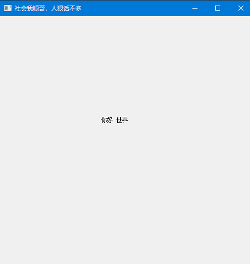
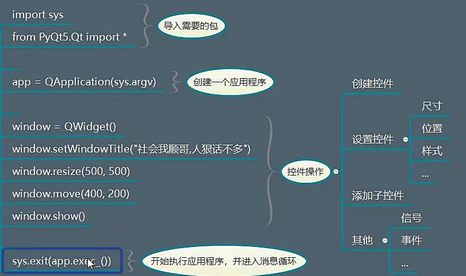
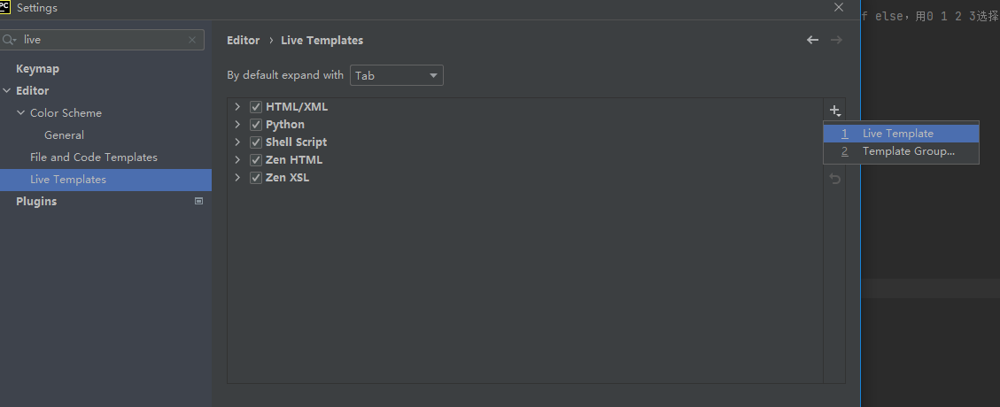
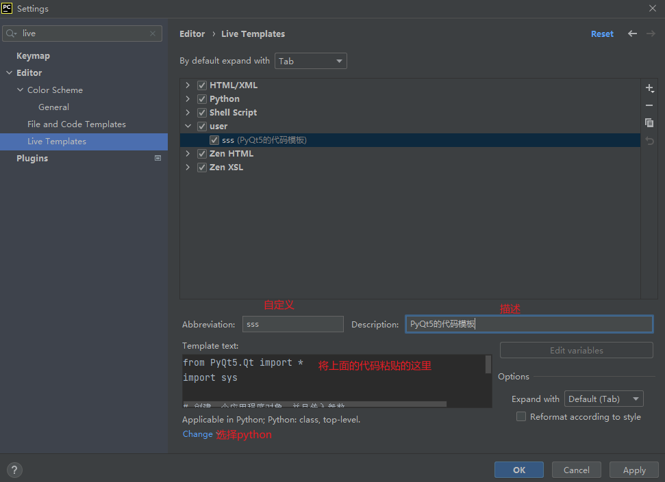
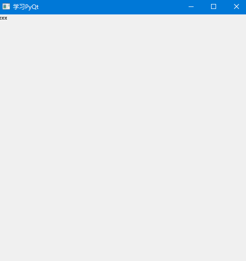

# PyQt5学习笔记-程序结构分析

## 一、简单介绍一些控件
官方文档：'''https://doc.qt.io/qtforpython/modules.html'''

* QtWidgets:包含一整套UI元素控件，用于建立符合系统风格的界面
* QtGui：涵盖了多种基本图形功能的类，比如：字体，图形，图标，颜色
* QtCore:涵盖了包的核心的非GUI功能，比如：时间，文件，目录，数据类型，链接，线程进程
* QtWebKit:浏览器引擎
* QtTest:测试
* QtSql:数据库
* QtMultimedia和QtMultimediaWidgets:多媒体
* Qt: 将基本全部模块中的类综合到一个单一的模块中，好处是不用关心哪一个模块包含哪些类，坏处是占用内存

## 二、程序简单分析

```python
from PyQt5.QtWidgets import QLabel,QPushButton
from PyQt5.QtGui import QIcon

```

```python
from PyQt5.Qt import *
import sys

# 创建一个应用程序对象，并且传入参数
app = QApplication(sys.argv)

# 创建控件
# 当我们创建一个控件之后，如果说，这个控件没有父控件，则把他当作顶层控件（窗口）
# 系统会自动的给窗口添加一些修饰（标题栏），窗口控件具备一些特性（设置标题，图标）

window = QWidget()

# 设置控件（大小，位置，样式...）
window.setWindowTitle("社会我顺哥，人狠话不多") # 设置的是父控件的标题栏  必须是顶层控件

# 设置大小
window.resize(500,500)
window.move(400,200)


# 创建QLabel控件，作为子控件，父控件可以作为子控件的容器
# 这里的Label是子控件  就不可以设置标题 setWindowTitle()
label = QLabel(window)  # 添加父控件
label.setText("你好 世界")

# 移动标签
label.move(200,200)

# 展示控件，刚创建好一个控件之后，（这个控件没有什么父控件），默认情况下不会被展示，只有手动的调用show()才可以
# 如果说这个控件，有父控件的，那么一般情况下，父控件展示之后，子控件会自动展示
window.show()

# 应用程序的执行，进入到消息循环
# 让整个程序开始执行，并且进入到消息循环
# 监测整个程序所接受到的用户的交互信息
sys.exit(app.exec_())

```

效果图：

  

程序的结构图：
  


总结：

* 一个PyQt程序都需要一个应用程序对象，它包含主事件循环，在其中来自窗口系统和其它资源的所有时间被处理和调度。
* 他也处理应用程序的初始化和结束，并且提供对话管理
* 他也处理绝大多数系统范围的设置
* app.exec()意思是让程序进入主循环，不要停止
* 一个没有父对象控件默认不显示，必须要调用show()才可以
* 一个应用程序中可以显示多个顶级控件：
  * 如果一个Widget没有父控件，则认定是顶级控件（顶级窗口）
  * 如果想要一个控件展示在另外一个控件内部，必须要有父子关系
  * 如果两个对象为父子关系，那么父对象显示之后，一般子对象会自动显示


如果一个控件他没有父控件，那么就可以单独设置标题：

```python
label = QLabel()
label.setText("XXX")  # 为标签设置文本内容
label.setWindowTitle("xxxxxxxx") # 设置标题
label.show()

```

## 三、活动模板设置

打开设置，输入live 选择Live Templates 然后点击右边的加号 选择 Live Templates
  

  

## 四、面向对象版本

如果将所有的控件操作包装成一个类，那么，代码如下定义：

```python
# 创建一个窗口类，继承QWidget(本身就是一个顶级类)
class Window(QWidget):
    # 初始化方法
    def __init__(self):

        # 查看QWidget的定义，可以看到他的初始化有许多的参数
        # 这里需要在Window子类初始化之前 先初始化QWidget  调用super方法
        super().__init__()

        print("xxx")

```


```python 
# Qt中包含一些基本的模块
from PyQt5.Qt import *
import sys

# 执行的方式：右击运行    命令行：python  代码名称
# 当别人通过命令行启动这个程序的时候，可以设定一种功能（接受命令行传递的参数，来执行不同的逻辑，也就是代码中有好几个if else，用0 1 2 3选择执行哪一个代码块）
# 参数0 表示当前项目的路径

class Window(QWidget):
    def __init__(self):
        super().__init__()
        self.setWindowTitle("学习PyQt")
        self.resize(500,500)

        label = QLabel(self)
        label.setText("xxx")


app = QApplication(sys.argv)
window = Window()

# window.setWindowTitle("社会我顺哥，人狠话不多")
# window.resize(500,500)


# label = QLabel(window)
# label.setText("你好 世界")
# label.move(200,200)

window.show()
sys.exit(app.exec_())
```

  


但是，现实中的开发工作会有许多子控件，不可能将所有的子控件全部添加到init()方法中，所以可以做出如下更改，是的代码结构更加清晰，每一个子控件单独作为一个方法，而init()方法中只保留顶级控件QWidget(),所以需要在init()方法中调用其他控件。


```python
class Window(QWidget):
    def __init__(self):


        # 调用父类QWidget的初始化方法
        super().__init()


        # 设置总体的窗口控件，顶级控件
        self.setWindowTitle("PyQt5学习笔记")
        self.resize(500,500)

        # 然后你再去调用一些 子控件的函数
        self.setup_ui()

    def setup_ui(self):
        label = QLabel(self)
        label.setText("xxx")
    

```

可以将上面的封装的类作为一个单独的类，然后将该文件作为导入模块，可维护性非常好，同时 可以在这个模块下面添加如下代码，方便测试

```python
if __name__ == '__main__':
    import sys  # 导入系统模块
     app = QApplication(sys.argv)
     window = Window()
     window.show()
     sys.exit(app.exec_())

```
