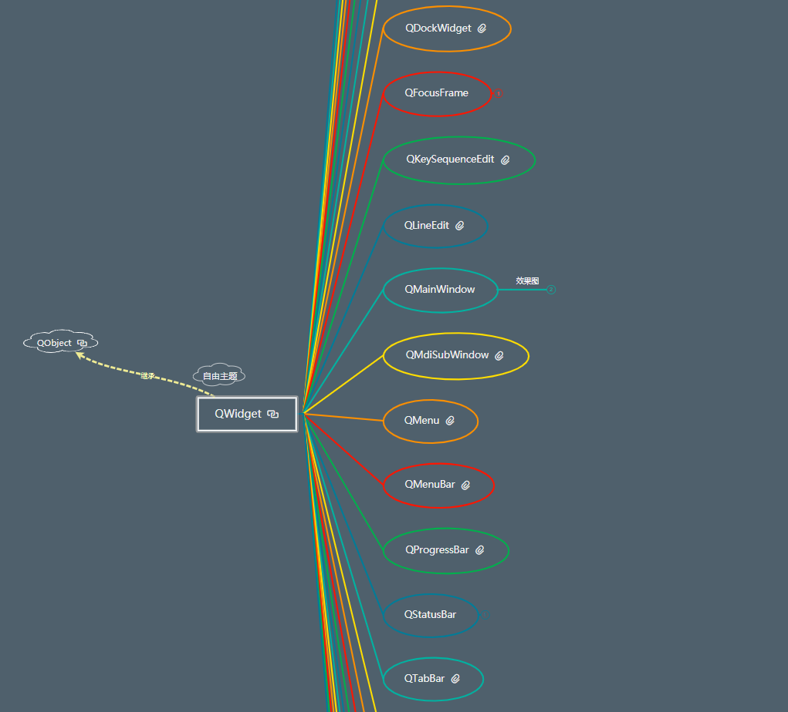

# PyQt5控件介绍

## 一、控件的概念

* 一个程序界面上的各个独立的元素（一块矩形区域）
* 具备不同的功能：用户点击、接受用户输入、展示内容、存放其他控件
* 初始常用控件：按钮、输入控件、展示控件、容器控件、结构控件、结构控件、滚动控件辅助控件、其他
* 不同的控件有

（1）按钮控件：
* QPushButton  单击 右击  双击
* QCommandLinkButton 
* QRadioButton  单选框
* QCheckBox   复选框

（2）输入控件

* 键盘输入控件
  * QLineEdit: 单行输入
  * QTextEdit:多行输入
  * QPlainTextEdit: 多行输入文本
  * QKeySequenceEdit:采集快捷输入方式

* 步长调节（QAbstractSpinBox）(键盘+鼠标)
  * QDateTimeEdit: 使用鼠标调节日期
  * QSpinBox:整形数字步长调节
  * QDoubleSpinBox: 浮点类型数据步长调节

* 组合框（下拉输入选择）
  * QComboBox：下拉框
  * QFontComboBox:字体下拉框选择

* 滑块（QAbstractSlider）(鼠标):QDial，QSlider,QScrollBar

* 橡皮筋选中：QRubberBand:使用鼠标直接选中

* 对话框（QDialog）:
  * QColorDialog: 颜色对话框
  * QFileDialog: 文件对话框
  * QFontDialog: 字体对话框
  * QInputDialog: 输入对话框

* 日期对话框：QCalendarWidget

（3）展示控件

* QLabel: 普通文本、数字、富文本、图片、QLabel动画

* QLCDNumber: 计数器
* QProgressBar:进度条
* QDialog(对话框)：
  * QMessageBox:展示错误或者异常消息
  * QErrorMessage:错误对话框
  * QProgressDialog:进度对话框

（4）容器控件
* QToolBox： 承载其他按钮
* QDialogButtonBox: 对话框按钮：OK Cancel
* QGroupBox:将若干的容器控件进行分组
* QMdiSubWindow:QMidiArea和QMdiSubWindow

（5）结构控件

* QMainWindow:主窗口,集成多个控件，
  * QMenuBar: 菜单栏，QMenu
  * QToolBar: 工具栏，QToolButton 
  * QStatusBar:状态栏，提示一些东西

* QTabwidget: 标签控件  显示多个分类标签 QTabBar
* QStackedWidget： 点击标签切换多个界面 
* QSplitter: 分隔控件
* QDockWidget: 悬浮控件
  
（6）滚动控件:QAbstractScrollArea
* QTextBrowser:文本浏览控件
* QScrollArea：滚动一个区域
* QAbstractltermView
* QMdiarea
* QGraphicsView：画图控件

（7）辅助控件
* QFocusFrame
* QSizeGrip
* QDesktopWidget

## 二、控件结构继承图

所有的控件都是你继承自OWidget,而QWidget又是继承自QObject,还有很多没有展示出来。

  

不同的控件通过相同的属性进行继承：名字，矩形区域，位置，大小，可以设置样式，子控件拥有父控件的所有特性，同时拥有父控件没有的特性：展示内容，接受输入，用户交互，容器，框架

