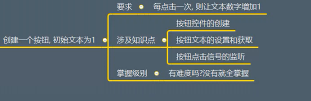
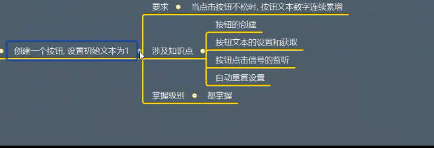
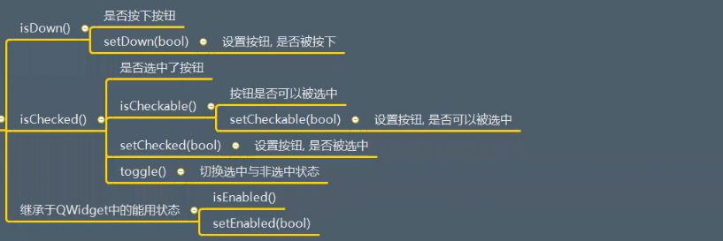
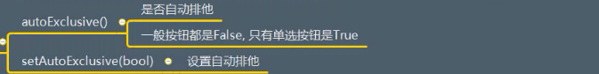
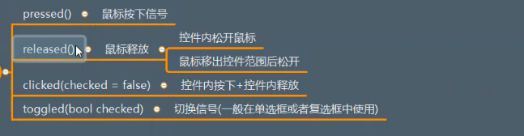

# QAbstractButton详解

## 一、描述
* 所有按钮控件的基类
* 提供按钮的通用功能

继承抽象类，实现相关方法，才可以使用这个类
```python
import sys
from PyQt5.Qt import *

# 抽象类  使用需要进程 实现  必须实现抽象类所有的方法 重写！
class Btn(QAbstractButton):
    def  paintEvent(self,evt):
        print("绘制按钮")
        # 必须自行绘制按钮控件

        # 创建一个画家
        # 下面所画的一切图案都是在这张纸上面——按钮上面作图
        painter = QPainter(self)  # 这里的self相当于一张纸

        # 给画家一个笔
        # 创建一个笔  参数是传入颜色
        pen = QPen(QColor(111,200,20),10)

        # 设置这个笔
        painter.setPen(pen)

        # 画家画画  文本  前两个参数是位置参数
        painter.drawText(20,20,"五个亿")

        # 椭圆
        painter.drawEllipse(0,0,100,100)


if __name__ == '__main__':
    app =QApplication(sys.argv)

    window = QWidget()
    window.setWindowTitle("QAbstractButton")
    window.resize(500,500)

    btn = Btn(window)
    btn.setText("xxx")

    btn.resize(100,100)
    btn.pressed.connect(lambda :print("点击了这个函数"))

    window.show()

    sys.exit(app.exec_())
```


## 二、继承
QWidget


## 三、功能作用

### 3.1 提示文本

#### 3.1.1 API
* setText(str)  设置按钮提示文本
* text() 获取按钮提示文本


#### 3.1.2 应用场景
用户点击按钮前，给用户的文本提示：确定or取消


#### 3.1.3 案例
  

测试代码：
```python
import sys
from PyQt5.Qt import *


if __name__ == '__main__':
    app = QApplication(sys.argv)

    window = QWidget()
    window.setWindowTitle("按钮的功能测试——抽象类")
    window.resize(500,500)

    btn = QPushButton(window)
    btn.setText("1")


    # 实现需求：每点击一次按钮，按钮中的文本数字加一
    def plus_one():
        print("加一")
        num = int(btn.text()) + 1
        btn.setText(str(num))

    btn.pressed.connect(plus_one)

    window.show()
    sys.exit(app.exec_())
```


### 3.2 图标相关

#### 3.2.1 API

* setIcon(QIcon("resource/h1.jpg")) 设置图标  相对路径 图标对象
* setIconSize(QSize(w,h))  设置图标大小
* icon()  获取图标
* iconSize()  获取图标大小

#### 3.2.2 应用场景
用户点击按钮前，给用户的图标提示

#### 3.2.3 案例
实现上述API

```python
import sys
from PyQt5.Qt import *


if __name__ == '__main__':
    app = QApplication(sys.argv)

    window = QWidget()
    window.setWindowTitle("图标操作")
    window.resize(500,500)

    btn = QPushButton(window)
    btn.setText("1")


    # 实现需求：每点击一次按钮，按钮中的文本数字加一
    def plus_one():
        print("加一")
        num = int(btn.text()) + 1
        btn.setText(str(num))


    btn.pressed.connect(plus_one)


    # 创建一个图标对象
    icon = QIcon("img.png")   # 传入相对路径
    btn.setIcon(icon)
  
    # 设置图标大小  传入QSize对象  宽  高
    size = QSize(50,50)
    btn.setIconSize(size)

    window.show()
    sys.exit(app.exec_())
```


### 3.3 设置快捷键

#### 3.3.1 作用
通过指定的快捷键，触发按钮的点击


#### 3.3.2 方式1
有提示文本的：如果提示文本包含&符号的，则QAbstractButton会自动创建快捷键


#### 3.3.3 方式2
没有提示文本的：setShortcut("Alt + G")

测试代码：

```python
import sys
from PyQt5.Qt import *


if __name__ == '__main__':
    app = QApplication(sys.argv)

    window = QWidget()
    window.setWindowTitle("图标操作")
    window.resize(500,500)

    btn = QPushButton(window)
    btn.setText("1")


    # 实现需求：每点击一次按钮，按钮中的文本数字加一
    def plus_one():
        print("加一")
        num = int(btn.text()) + 1
        btn.setText(str(num))


    # btn.pressed.connect(plus_one)


    # 创建一个图标对象
    icon = QIcon("img.png")   # 传入相对路径
    btn.setIcon(icon)

    # 设置图标大小  传入QSize对象  宽  高
    size = QSize(50,50)
    btn.setIconSize(size)

    # 快捷键的设定

    btn.pressed.connect(lambda:print("按钮被点击了"))  # 重新连接一个槽函数
    # btn.setText("&abc")  # 有提示文本  在文本前面加上& 即可创建快捷键：ALT + A


    # 如果没有设置提示文本
    btn.setShortcut("Alt + a") # 里面传入快捷键字符串


    window.show()
    sys.exit(app.exec_())
```


### 3.4 自动重复

#### 3.4.1 API
* setAutoRepeat(bool)  设置自动重复
* setAutoRepeatInterval(毫秒) 设置自动重复检测间隔
* setAutoRepeatDelay(毫秒)  设置初次检测延迟


获取方法
* autoRepeat()  获取是否自动重复
* autoRepeatInterval() 获取自动重复检测间隔
* autoRepeatDelay()  获取初次检测延迟

#### 3.4.2 应用场景
当用户点击按钮时，想快速重复性响应时设置(发射子弹，一直触发事件)


#### 3.4.3 案例
创建一个按钮，设置初始文本为1
  

测试代码：

```python
import sys
from PyQt5.Qt import *


if __name__ == '__main__':
    app = QApplication(sys.argv)

    window = QWidget()
    window.setWindowTitle("图标操作")
    window.resize(500,500)

    btn = QPushButton(window)
    btn.setText("1")


    # 实现需求：每点击一次按钮，按钮中的文本数字加一
    def plus_one():
        print("加一")
        num = int(btn.text()) + 1
        btn.setText(str(num))


    btn.pressed.connect(plus_one)
    # 创建一个图标对象
    icon = QIcon("img.png")   # 传入相对路径
    btn.setIcon(icon)

    # 设置图标大小  传入QSize对象  宽  高
    size = QSize(50,50)
    btn.setIconSize(size)

    # 快捷键的设定
    # btn.pressed.connect(lambda:print("按钮被点击了"))  # 重新连接一个槽函数
    # btn.setText("&abc")  # 有提示文本  在文本前面加上& 即可创建快捷键：ALT + A

    # 如果没有设置提示文本
    btn.setShortcut("Alt + a") # 里面传入快捷键字符串

    # 自动重复设置
    print(btn.autoRepeat())  # 查看是否可以自动重复

    btn.setAutoRepeat(True)  # 点击按钮  重复执行相应的事件
    btn.setAutoRepeatDelay(2000)  # 设置延迟 2000ms
    btn.setAutoRepeatInterval(1000)  # 设置自动重复检测间隔 每隔一秒加一
    window.show()
    sys.exit(app.exec_())
```

### 3.5 状态

#### 3.5.1 API
  


#### 3.5.2 应用场景
判断按钮的状态


#### 3.5.3 案例
测试以上API


测试代码1：
```python
import sys

from PyQt5.Qt import *

if __name__ == '__main__':
    app = QApplication(sys.argv)

    window = QWidget()
    window.setWindowTitle("按钮状态")
    window.resize(500,500)


    push_button = QPushButton(window)
    push_button.setText("这是QPushButton")
    push_button.move(100,100)

    radio_button = QRadioButton(window)
    radio_button.setText("这是一个radio")
    radio_button.move(100,150)

    checkbox = QCheckBox(window)
    checkbox.setText("这是一个checkbox")
    checkbox.move(100,200)

    # 按钮还可以设置按下之后的背景状态  红色
    push_button.setStyleSheet("QPushButton:pressed {background-color:red;}")


    # 将三个按钮都设置为按下状态
    push_button.setDown(True)
    radio_button.setDown(True)
    checkbox.setDown(True)


    window.show()
    sys.exit(app.exec_())


```

测试代码2：
```python
import sys

from PyQt5.Qt import *

if __name__ == '__main__':
    app = QApplication(sys.argv)

    window = QWidget()
    window.setWindowTitle("按钮状态")
    window.resize(500,500)


    push_button = QPushButton(window)
    push_button.setText("这是QPushButton")
    push_button.move(100,100)

    radio_button = QRadioButton(window)
    radio_button.setText("这是一个radio")
    radio_button.move(100,150)

    checkbox = QCheckBox(window)
    checkbox.setText("这是一个checkbox")
    checkbox.move(100,200)

    # 按钮还可以设置按下之后的背景状态  红色
    push_button.setStyleSheet("QPushButton:pressed {background-color:red;}")

    # # 将三个按钮都设置为按下状态
    # push_button.setDown(True)
    # radio_button.setDown(True)
    # checkbox.setDown(True)

    # 打印这三个按钮是否可以被选中   第一种QPushButton不可以被选中
    print(push_button.isCheckable())
    print(radio_button.isCheckable())
    print(checkbox.isCheckable())

    # 将按钮设置为可以被选中
    push_button.setCheckable(True)
    print(push_button.isCheckable())


    # 将三种按钮全部设置为选中状态d
    push_button.setChecked(True)
    radio_button.setChecked(True)
    checkbox.setChecked(True)

    # 查看这三种按钮是否为被选中的状态
    print(push_button.isChecked())
    print(radio_button.isChecked())
    print(checkbox.isChecked())

    # toggle 函数是切换状态： 选中或者被选中
    def cao():
        push_button.toggle()
        radio_button.toggle()
        checkbox.toggle()


    btn = QPushButton(window)
    btn.setText("点击")
    # 点击这个按钮   切换其他三个按钮的状态
    btn.pressed.connect(cao)

    window.show()
    sys.exit(app.exec_())


```


### 3.6 排他性
#### 3.6.1 概念
如果同时存在多个按钮，而此时所有的按钮又设置了排他性，
则在同一时刻只可以选中一个按钮


#### 3.6.2 API
  


#### 3.6.3 应用场景
设定按钮组中的按钮，单选特性


#### 3.6.4 案例
测试以上API

测试代码：
```python
import sys
from PyQt5.Qt import *


if __name__ == '__main__':
    app =QApplication(sys.argv)

    window = QWidget()
    window.setWindowTitle("排他性测试")
    window.resize(500,500)

    for i in range(0,3):
        btn = QPushButton(window)
        btn.setText("btn" + str(i))
        btn.move(50 * i, 50 * i)

        # 将所有的按钮都设置为可选类型
        btn.setCheckable(True)

        # 将按钮设置为排他性
        btn.setAutoExclusive(True)


    window.show()
    sys.exit(app.exec_())

```


### 3.7 点击

#### 3.7.1 API

* click() 普通点击
* animateClick(ms) 动画点击


#### 3.7.2 应用场景
* 使用代码触发按钮点击
* 会发射相关信号


#### 3.7.3 案例
测试以上API

```python
import sys
from PyQt5.Qt import *


if __name__ == '__main__':
    app =QApplication(sys.argv)

    window = QWidget()
    window.setWindowTitle("按钮点击")
    window.resize(500,500)

    # 模拟按钮点击
    btn = QPushButton(window)
    btn.setText("这个是按钮")
    btn.move(200,200)
    btn.pressed.connect(lambda:print("点击了这个按钮"))


    # 模拟用户的点击
    btn.click()  # 可以自动点击按钮  并且触发槽函数

    # 模拟动画点击
    btn.animateClick(2000)


    window.show()
    sys.exit(app.exec_())

```


### 3.8 设置有效区域


#### 3.8.1 API 

重写hitButton(QPoint)：有效返回True,无效返回False

#### 3.8.2 应用场景
指定用户点击某个区域有效，而不是单一的矩形


#### 3.8.3 案例  
设置只点击按钮中心的圆形区域才会有效

```python
import sys
from PyQt5.Qt import *
import math

if __name__ == '__main__':
    app =QApplication(sys.argv)

    window = QWidget()
    window.setWindowTitle("按钮点击")
    window.resize(500,500)

    # 模拟按钮点击
    # btn = QPushButton(window)
    # btn.setText("这个是按钮")
    # btn.move(200,200)
    # btn.pressed.connect(lambda:print("点击了这个按钮"))


    # 模拟用户的点击
    # btn.click()  # 可以自动点击按钮  并且触发槽函数
    #
    # # 模拟动画点击
    # btn.animateClick(2000)


    class Btn(QPushButton):

        # 点击按钮
        def hitButton(self, point):
            # print(point)
            #
            # if point.x() > self.width() / 2:
            #     return True
            #
            # return False


            # 点击在一个圆中  触发槽函数
            # 通过给定一个点的坐标，计算与圆心的距离
            yuanxin_x = self.width() / 2
            yuanxin_y = self.height() / 2

            hit_x = point.x()
            hit_y = point.y()

            distance = math.sqrt(math.pow(hit_x - yuanxin_x,2) + math.pow(hit_y - yuanxin_y,2))

            if distance < self.width() / 2:
                return True

            return False

        # 画一个内切圆
        def paintEvent(self,QPaintEvent):
            super().paintEvent(QPaintEvent)


            painter = QPainter(self)
            painter.setPen(QPen(QColor(100,150,200),6))
            painter.drawEllipse(self.rect())


    btn = Btn(window)
    btn.setText("点击")
    btn.move(100,100)
    btn.resize(200,200)

    # 只有按钮点击在指定的区域 才会触发槽函数
    btn.pressed.connect(lambda: print("按钮被点击了"))  # 判定有效才会触发槽函数


    window.show()
    sys.exit(app.exec_())

```


## 四、信号
  

测试代码 上面已经写过