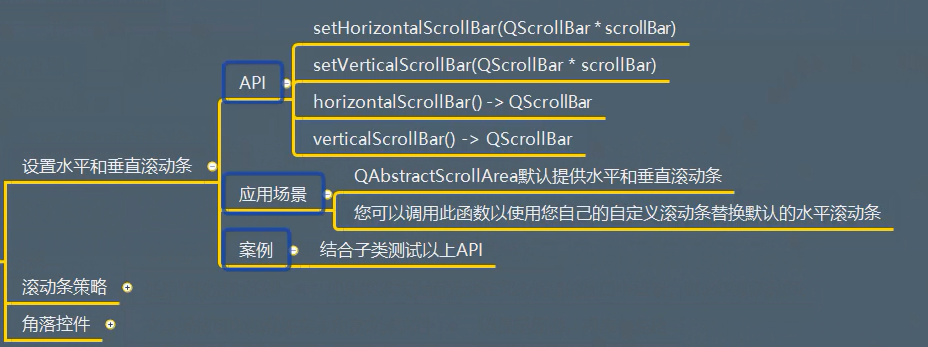
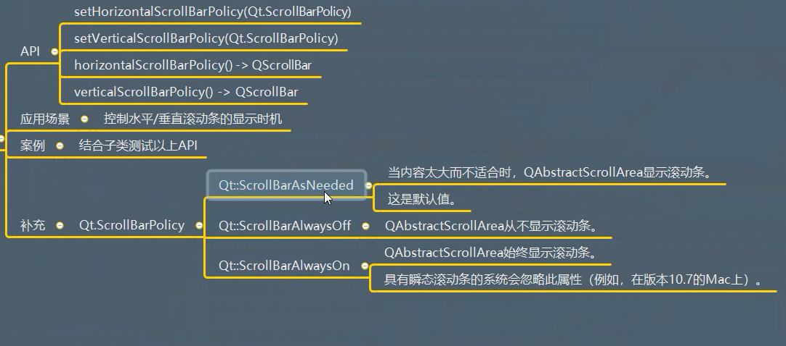
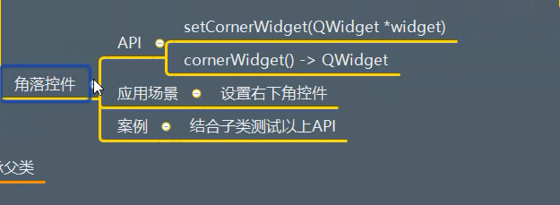

# QAbstractScrollArea

## 一、描述
是一个滚动区域的低级抽象

## 二、继承
QFrame


## 三、功能作用

### 3.1 设置水平和垂直滚动条
  


### 3.2 滚动条策略
  


### 3.3 角落控件
  


## 四、信号
继承父类


测试代码：
```python
from PyQt5.Qt import *
import sys

if __name__ == '__main__':

    app =QApplication(sys.argv)

    window = QWidget()
    window.setWindowTitle("QTextEdit的父类测试")
    window.resize(500,500)

    l1 = QTextEdit("社会我顺哥",window)
    l1.setVerticalScrollBarPolicy(Qt.ScrollBarAlwaysOn)  # 始终显示垂直滚动条
    l1.setHorizontalScrollBarPolicy(Qt.ScrollBarAlwaysOn)  # 始终显示水平滚动条


    window.show()
    sys.exit(app.exec_())
```


