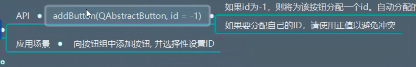
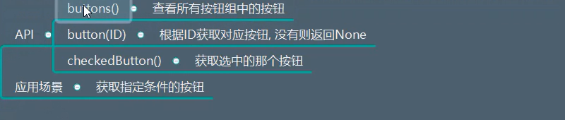
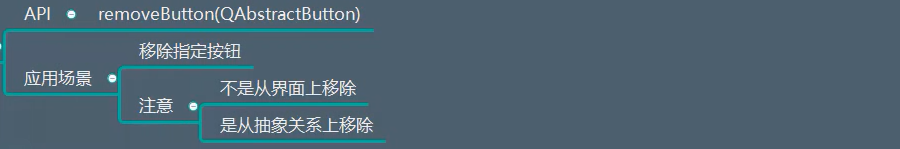
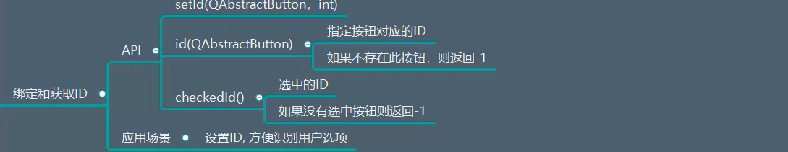
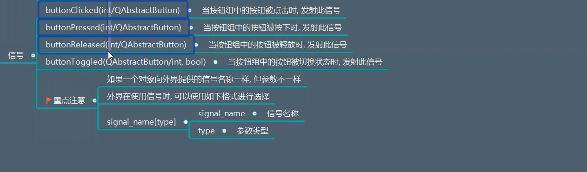

# QButtonGroup详解笔记

## 一、描述
提供一个抽象的按钮容器，可以将多个按钮划分为一组，不具备可视化的效果，一般放的是可以被检查的按钮

## 二、继承
QObject

## 三、功能

### 3.1 创建按钮组
```python 
group = QButtonGroup(window)
```

### 3.2 添加按钮
  


```python
import sys
from PyQt5.Qt import *


if __name__ == '__main__':

    app =QApplication(sys.argv)

    window =  QWidget()
    window.setWindowTitle("按钮组的使用")
    window.resize(500,500)

    # 创建四个单选按钮

    # 可以看到  这四个按钮是互斥的  只能选择一个：因为他们的父对象都是window 也就是在一个父控件一个
    # 解决这个问题 可以单独再使用两个父控件
    r_male = QRadioButton("男",window)
    r_female = QRadioButton("女",window)
    r_male.move(100,100)
    r_female.move(100,150)

    # 创建一个按钮组
    sex_group = QButtonGroup(window)
    sex_group.addButton(r_male)
    sex_group.addButton(r_female)

    # 是否
    r_yes = QRadioButton("是",window)
    r_no = QRadioButton("否",window)
    r_yes.move(300,100)
    r_no.move(300,150)

    # 创建一个按钮组
    answer_group = QButtonGroup(window)
    answer_group.addButton(r_yes)
    answer_group.addButton(r_no)


    window.show()
    sys.exit(app.exec_())
```


### 3.3 查看按钮

  

```python
import sys
from PyQt5.Qt import *


if __name__ == '__main__':

    app =QApplication(sys.argv)

    window =  QWidget()
    window.setWindowTitle("按钮组的使用")
    window.resize(500,500)

    # 创建四个单选按钮

    # 可以看到  这四个按钮是互斥的  只能选择一个：因为他们的父对象都是window 也就是在一个父控件一个
    # 解决这个问题 可以单独再使用两个父控件
    r_male = QRadioButton("男",window)
    r_female = QRadioButton("女",window)
    r_male.move(100,100)
    r_female.move(100,150)
    r_male.setChecked(True)  # 设置成默认选中  不是setCheckable

    # 创建一个按钮组
    sex_group = QButtonGroup(window)
    sex_group.addButton(r_male,1)
    sex_group.addButton(r_female,2)

    # 是否
    r_yes = QRadioButton("是",window)
    r_no = QRadioButton("否",window)
    r_yes.move(300,100)
    r_no.move(300,150)

    # 创建一个按钮组
    answer_group = QButtonGroup(window)
    answer_group.addButton(r_yes)
    answer_group.addButton(r_no)


    # 查看按钮
    print(sex_group.buttons())


    # ID 对一个按钮组所有按钮进行标识
    # 指定ID 获取按钮
    print(sex_group.button(1))   # 获取按钮组中ID为1的按钮

    # 打印已经选中的按钮
    print(sex_group.checkedButton())  # 这里已经将男按钮设置成默认选中

    window.show()
    sys.exit(app.exec_())
```


### 3.4 移除按钮

  

```python
import sys
from PyQt5.Qt import *


if __name__ == '__main__':

    app =QApplication(sys.argv)

    window =  QWidget()
    window.setWindowTitle("按钮组的使用")
    window.resize(500,500)

    # 创建四个单选按钮

    # 可以看到  这四个按钮是互斥的  只能选择一个：因为他们的父对象都是window 也就是在一个父控件一个
    # 解决这个问题 可以单独再使用两个父控件
    r_male = QRadioButton("男",window)
    r_female = QRadioButton("女",window)
    r_male.move(100,100)
    r_female.move(100,150)
    r_male.setChecked(True)  # 设置成默认选中  不是setCheckable

    # 创建一个按钮组
    sex_group = QButtonGroup(window)
    sex_group.addButton(r_male,1)
    sex_group.addButton(r_female,2)

    # 是否
    r_yes = QRadioButton("是",window)
    r_no = QRadioButton("否",window)
    r_yes.move(300,100)
    r_no.move(300,150)

    # 创建一个按钮组
    answer_group = QButtonGroup(window)
    answer_group.addButton(r_yes)
    answer_group.addButton(r_no)


    # 查看按钮
    print(sex_group.buttons())


    # ID 对一个按钮组所有按钮进行标识
    # 指定ID 获取按钮
    print(sex_group.button(1))   # 获取按钮组中ID为1的按钮

    # 打印已经选中的按钮
    print(sex_group.checkedButton())  # 这里已经将男按钮设置成默认选中


    # 删除指定按钮
    sex_group.removeButton(r_male)

    print(sex_group.buttons)   # 只有一个
    print(sex_group.button(1))  # 打印为空


    window.show()
    sys.exit(app.exec_())
```


### 3.5 绑定和获取ID

  

```python
import sys
from PyQt5.Qt import *


if __name__ == '__main__':

    app =QApplication(sys.argv)

    window =  QWidget()
    window.setWindowTitle("按钮组的使用")
    window.resize(500,500)

    # 创建四个单选按钮

    # 可以看到  这四个按钮是互斥的  只能选择一个：因为他们的父对象都是window 也就是在一个父控件一个
    # 解决这个问题 可以单独再使用两个父控件
    r_male = QRadioButton("男",window)
    r_female = QRadioButton("女",window)
    r_male.move(100,100)
    r_female.move(100,150)
    r_male.setChecked(True)  # 设置成默认选中  不是setCheckable

    # 创建一个按钮组
    sex_group = QButtonGroup(window)
    sex_group.addButton(r_male,1)
    sex_group.addButton(r_female,2)

    # 是否
    r_yes = QRadioButton("是",window)
    r_no = QRadioButton("否",window)
    r_yes.move(300,100)
    r_no.move(300,150)

    # 创建一个按钮组
    answer_group = QButtonGroup(window)
    answer_group.addButton(r_yes)
    answer_group.addButton(r_no)


    # 查看按钮
    print(sex_group.buttons())


    # ID 对一个按钮组所有按钮进行标识
    # 指定ID 获取按钮
    print(sex_group.button(1))   # 获取按钮组中ID为1的按钮

    # 打印已经选中的按钮
    print(sex_group.checkedButton())  # 这里已经将男按钮设置成默认选中


    # # 删除指定按钮
    # sex_group.removeButton(r_male)
    #
    # print(sex_group.buttons)   # 只有一个
    # print(sex_group.button(1))  # 打印为空

    # 给一个按钮组中的所有按钮设置ID
    answer_group.setId(r_yes,1)
    answer_group.setId(r_no,2)

    print(answer_group.id(r_yes))
    print(answer_group.id(r_no))


    window.show()
    sys.exit(app.exec_())
```


### 3.6 独占设置

API:
```
setExclusive(bool)
```
统一设置按钮组中的按钮是否是独占按钮


## 四、信号
  


```python
import sys
from PyQt5.Qt import *


if __name__ == '__main__':

    app =QApplication(sys.argv)

    window =  QWidget()
    window.setWindowTitle("按钮组的使用")
    window.resize(500,500)

    # 创建四个单选按钮

    # 可以看到  这四个按钮是互斥的  只能选择一个：因为他们的父对象都是window 也就是在一个父控件一个
    # 解决这个问题 可以单独再使用两个父控件
    r_male = QRadioButton("男",window)
    r_female = QRadioButton("女",window)
    r_male.move(100,100)
    r_female.move(100,150)
    r_male.setChecked(True)  # 设置成默认选中  不是setCheckable

    # 创建一个按钮组
    sex_group = QButtonGroup(window)
    sex_group.addButton(r_male,1)
    sex_group.addButton(r_female,2)

    # 是否
    r_yes = QRadioButton("是",window)
    r_no = QRadioButton("否",window)
    r_yes.move(300,100)
    r_no.move(300,150)

    # 创建一个按钮组
    answer_group = QButtonGroup(window)
    answer_group.addButton(r_yes)
    answer_group.addButton(r_no)


    # 查看按钮
    print(sex_group.buttons())


    # ID 对一个按钮组所有按钮进行标识
    # 指定ID 获取按钮
    print(sex_group.button(1))   # 获取按钮组中ID为1的按钮

    # 打印已经选中的按钮
    print(sex_group.checkedButton())  # 这里已经将男按钮设置成默认选中


    # # 删除指定按钮
    # sex_group.removeButton(r_male)
    # print(sex_group.buttons)   # 只有一个
    # print(sex_group.button(1))  # 打印为空

    # 给一个按钮组中的所有按钮设置ID
    answer_group.setId(r_yes,1)
    answer_group.setId(r_no,2)

    print(answer_group.id(r_yes))
    print(answer_group.id(r_no))

    def test(val):
        print(val)

    # 打印出按钮的ID 
    sex_group.buttonToggled.connect(test)  # 监听按钮组中的按钮被切换状态时  发射信号


    window.show()
    sys.exit(app.exec_())
```


