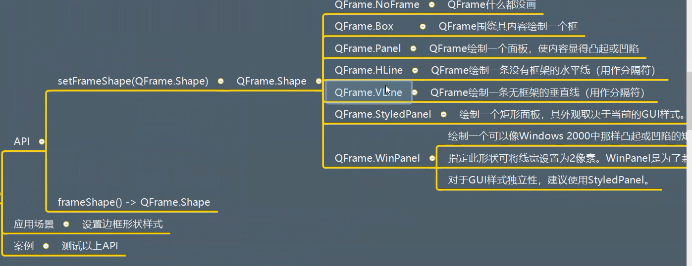
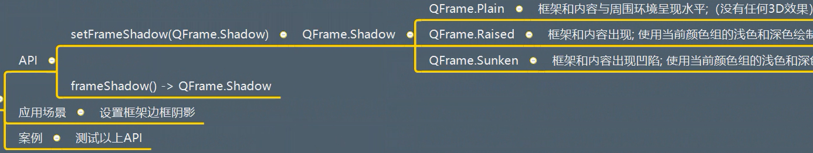
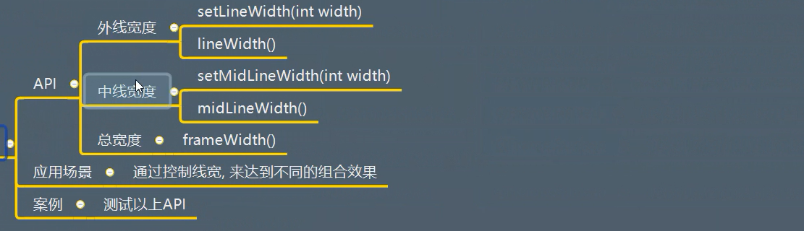
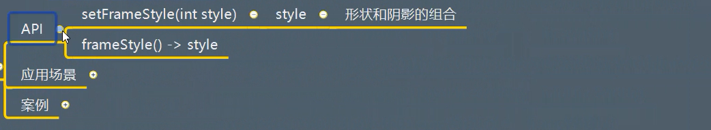
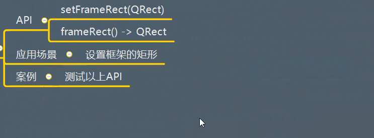

# QFrame详解

## 一、描述

是一个基类，可以选择直接使用，主要用来控制一些边框样式：凸起，凹下，阴影，线宽

## 二、继承
QWidget


## 三、功能作用
### 3.1 创建QFrame对象


### 3.2 框架形状
  


### 3.3 框架阴影
  


### 3.4 框架的几个线宽
  


### 3.5 框架样式
  


### 3.6 框架矩形
  


## 四、信号

继承自父类


测试代码：

```python
from PyQt5.Qt import *
import sys


if __name__ == '__main__':

    app = QApplication(sys.argv)

    window = QWidget()
    window.setWindowTitle("QFrame功能测试")
    window.resize(500,500)


    frame = QFrame(window)
    frame.move(100,100)
    frame.resize(100,100)
    frame.setStyleSheet("background-color:red;")

    frame.setFrameShape(QFrame.Box)   # 围绕其内容绘制一个框
    frame.setFrameShadow(QFrame.Raised)  # 设置阴影效果

    # 设置凸起效果
    frame.setLineWidth(6)  # 外线
    frame.setMidLineWidth(12)  # 中线

    print(frame.frameWidth())  # 打印框架的宽度


    window.show()

    sys.exit(app.exec_())
```


