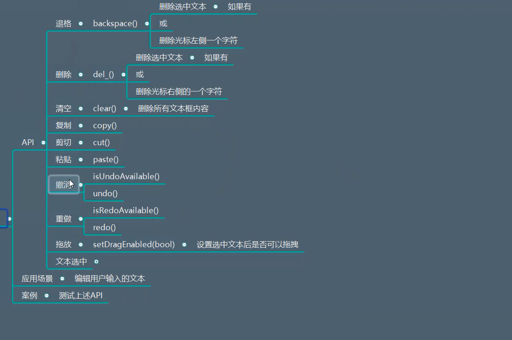

# QLineEdit详解

## 一、描述
是一个单行文本编辑器，允许用户输入和编辑单行纯文本，自带一组编辑功能：撤销，重做，剪切，粘贴，拖放


## 二、继承
继承自QWidget


## 三、功能作用

（1）控件的创建
  

（2）文本的设置和获取
  

```python
import sys
from PyQt5.Qt import *


if __name__ == '__main__':

    app =QApplication(sys.argv)

    window =  QWidget()
    window.setWindowTitle("QCommandLinkButton使用")
    window.resize(500,500)


    l1 = QLineEdit(window)
    l1.move(100,200)
    l2 = QLineEdit(window)
    l2.move(100,300)

    copy_btn = QPushButton(window)
    copy_btn.setText("复制")
    copy_btn.move(100,400)

    def copy_cao():

        # 首先获取文本框内容
        content = l1.text()

        # 设置到第二个文本框
        l2.setText(content)


    copy_btn.clicked.connect(copy_cao)


    window.show()
    sys.exit(app.exec_())
```


（3）输出模式
  

测试代码1：
```python
import sys
from PyQt5.Qt import *


if __name__ == '__main__':

    app =QApplication(sys.argv)

    window =  QWidget()
    window.setWindowTitle("QCommandLinkButton使用")
    window.resize(500,500)


    l1 = QLineEdit(window)
    l1.move(100,200)

    l2 = QLineEdit(window)
    l2.move(100,300)

    # 不输出   第二个文字框不展示任何文字  但是他仍然获取到文字
    l2.setEchoMode(QLineEdit.Password)

    copy_btn = QPushButton(window)
    copy_btn.setText("复制")
    copy_btn.move(100, 400)


    def copy_cao():
        # 首先获取文本框内容
        content = l1.text()

        # 设置到第二个文本框
        l2.setText(content)


    copy_btn.clicked.connect(copy_cao)


    window.show()
    sys.exit(app.exec_())
```

测试代码2：
```python
import sys
from PyQt5.Qt import *


class AccountTool:
    ACCOUNT_ERROR = 1
    PWD_ERROR = 2
    SUCCESS = 3
    
    # 封装成静态方法
    @staticmethod
    def check_login(account,pwd):
        # 将账号和密码发送给服务器，等待服务器返回结果
        if account != "sz":
            return AccountTool.ACCOUNT_ERROR  # 账号错误
        if pwd != "itlike":
            return AccountTool.PWD_ERROR

        return AccountTool.SUCCESS


class Window(QWidget):
    def __init__(self):
        super().__init__()
        self.setWindowTitle("模拟用户登录案例")
        self.resize(500,500)

        # 将三个控件直接放到init初始化方法中
        self.account = QLineEdit(self)
        self.pwd = QLineEdit(self)
        self.login = QPushButton(self)

        self.setMinimumSize(400,400)  # 设置最小尺寸
        self.setup_ui()

    def setup_ui(self):

        # 将账号控件设置成明文

        # 将密码控件设置成密文
        self.pwd.setEchoMode(QLineEdit.Password)

        # 点击按钮  连接槽函数
        # 槽函数 直接打印账号和密码信息
        self.login.clicked.connect(self.login_cao)

        self.login.setText("登录")

    def login_cao(self):
        # print("xxx",self)  # 打印窗口对象   并非是信号传递的参数

        # 获取账号和密码信息
        account = self.account.text()
        pwd = self.pwd.text()
        # print(account,pwd)

        # 返回一个状态
        status = AccountTool.check_login(account,pwd)
        if status == AccountTool.ACCOUNT_ERROR:
            print("账号错误！")
            self.account.setText("")  # 如果账号错误 直接清空
            self.pwd.setText("")
            self.account.setFocus()  # 清空之后还要对准焦点
            return None

        # 走到这里说明账号一定是正确的
        if status == AccountTool.PWD_ERROR:
            print("密码错误！")
            self.pwd.setText("")
            self.setFocus()   # 清空密码  重新对准焦点
            return None

        # 走到这里 说明账号和密码一定正确
        if status == AccountTool.SUCCESS:
            print("登录成功")


        # if account == "sz":
        #     if pwd == "itlike":
        #         print("登录成功")
        #
        #     else:
        #         print("密码错误")
        #         self.pwd.setText("")
        #
        #
        #         self.pwd.setFocus()  # 有问题的话  再次获取焦点
        # else:
        #     print("账号错误")
        #     # 如果密码错误 直接清空
        #     self.account.setText("")
        #     self.pwd.setText("")


    # 当改变窗口大小，仍然是几个控件居中显示  resizeEvent事件
    def resizeEvent(self,evt):
        widget_w = 150
        widget_h = 40
        margin = 60

        # 将三个控件设置在窗口的中间
        self.account.resize(widget_w,widget_h)
        self.pwd.resize(widget_w,widget_h)
        self.login.resize(widget_w,widget_h)

        x = (self.width() - widget_w) / 2  # 窗口的宽度 减去控件的宽度

        self.account.move(x,self.height() / 5)
        self.pwd.move(x,self.account.y() + widget_h + margin)
        self.login.move(x,self.pwd.y() + widget_h + margin)


if __name__ == '__main__':

    app =QApplication(sys.argv)

    window = Window()

    window.show()
    sys.exit(app.exec_())
```


（4）占位符提示字符串
  

```python
import sys
from PyQt5.Qt import *


class AccountTool:
    ACCOUNT_ERROR = 1
    PWD_ERROR = 2
    SUCCESS = 3

    # 封装成静态方法
    @staticmethod
    def check_login(account,pwd):
        # 将账号和密码发送给服务器，等待服务器返回结果
        if account != "sz":
            return AccountTool.ACCOUNT_ERROR  # 账号错误
        if pwd != "itlike":
            return AccountTool.PWD_ERROR

        return AccountTool.SUCCESS


class Window(QWidget):
    def __init__(self):
        super().__init__()
        self.setWindowTitle("模拟用户登录案例")
        self.resize(500,500)

        # 将三个控件直接放到init初始化方法中
        self.account = QLineEdit(self)
        self.pwd = QLineEdit(self)
        self.login = QPushButton(self)

        self.setMinimumSize(400,400)  # 设置最小尺寸
        self.setup_ui()

    def setup_ui(self):

        # 将账号控件设置成明文

        # 将密码控件设置成密文
        self.pwd.setEchoMode(QLineEdit.Password)


        # 占位文本的提示
        self.account.setPlaceholderText("请输入账号")


        # 点击按钮  连接槽函数
        # 槽函数 直接打印账号和密码信息
        self.login.clicked.connect(self.login_cao)

        self.login.setText("登录")

    def login_cao(self):
        # print("xxx",self)  # 打印窗口对象   并非是信号传递的参数

        # 获取账号和密码信息
        account = self.account.text()
        pwd = self.pwd.text()
        # print(account,pwd)

        # 返回一个状态
        status = AccountTool.check_login(account,pwd)
        if status == AccountTool.ACCOUNT_ERROR:
            print("账号错误！")
            self.account.setText("")  # 如果账号错误 直接清空
            self.pwd.setText("")
            self.account.setFocus()  # 清空之后还要对准焦点
            return None

        # 走到这里说明账号一定是正确的
        if status == AccountTool.PWD_ERROR:
            print("密码错误！")
            self.pwd.setText("")
            self.setFocus()   # 清空密码  重新对准焦点
            return None

        # 走到这里 说明账号和密码一定正确
        if status == AccountTool.SUCCESS:
            print("登录成功")


        # if account == "sz":
        #     if pwd == "itlike":
        #         print("登录成功")
        #
        #     else:
        #         print("密码错误")
        #         self.pwd.setText("")
        #
        #
        #         self.pwd.setFocus()  # 有问题的话  再次获取焦点
        # else:
        #     print("账号错误")
        #     # 如果密码错误 直接清空
        #     self.account.setText("")
        #     self.pwd.setText("")


    # 当改变窗口大小，仍然是几个控件居中显示  resizeEvent事件
    def resizeEvent(self,evt):
        widget_w = 150
        widget_h = 40
        margin = 60

        # 将三个控件设置在窗口的中间
        self.account.resize(widget_w,widget_h)
        self.pwd.resize(widget_w,widget_h)
        self.login.resize(widget_w,widget_h)

        x = (self.width() - widget_w) / 2  # 窗口的宽度 减去控件的宽度

        self.account.move(x,self.height() / 5)
        self.pwd.move(x,self.account.y() + widget_h + margin)
        self.login.move(x,self.pwd.y() + widget_h + margin)


if __name__ == '__main__':

    app =QApplication(sys.argv)

    window = Window()

    window.show()
    sys.exit(app.exec_())
```


（5）清空按钮显示
  

测试代码：
```python
import sys
from PyQt5.Qt import *


class AccountTool:
    ACCOUNT_ERROR = 1
    PWD_ERROR = 2
    SUCCESS = 3

    # 封装成静态方法
    @staticmethod
    def check_login(account,pwd):
        # 将账号和密码发送给服务器，等待服务器返回结果
        if account != "sz":
            return AccountTool.ACCOUNT_ERROR  # 账号错误
        if pwd != "itlike":
            return AccountTool.PWD_ERROR

        return AccountTool.SUCCESS


class Window(QWidget):
    def __init__(self):
        super().__init__()
        self.setWindowTitle("模拟用户登录案例")
        self.resize(500,500)

        # 将三个控件直接放到init初始化方法中
        self.account = QLineEdit(self)
        self.pwd = QLineEdit(self)
        self.login = QPushButton(self)

        self.setMinimumSize(400,400)  # 设置最小尺寸
        self.setup_ui()

    def setup_ui(self):

        # 将账号控件设置成明文

        # 将密码控件设置成密文
        self.pwd.setEchoMode(QLineEdit.Password)

        # 占位文本的提示
        self.account.setPlaceholderText("请输入账号")
        self.pwd.setPlaceholderText("请输入密码")

        # 设置密码清空按钮  密码框右边有一个x 清空
        self.pwd.setClearButtonEnabled(True)


        # 点击按钮  连接槽函数
        # 槽函数 直接打印账号和密码信息
        self.login.clicked.connect(self.login_cao)

        self.login.setText("登录")

    def login_cao(self):
        # print("xxx",self)  # 打印窗口对象   并非是信号传递的参数

        # 获取账号和密码信息
        account = self.account.text()
        pwd = self.pwd.text()
        # print(account,pwd)

        # 返回一个状态
        status = AccountTool.check_login(account,pwd)
        if status == AccountTool.ACCOUNT_ERROR:
            print("账号错误！")
            self.account.setText("")  # 如果账号错误 直接清空
            self.pwd.setText("")
            self.account.setFocus()  # 清空之后还要对准焦点
            return None

        # 走到这里说明账号一定是正确的
        if status == AccountTool.PWD_ERROR:
            print("密码错误！")
            self.pwd.setText("")
            self.setFocus()   # 清空密码  重新对准焦点
            return None

        # 走到这里 说明账号和密码一定正确
        if status == AccountTool.SUCCESS:
            print("登录成功")


        # if account == "sz":
        #     if pwd == "itlike":
        #         print("登录成功")
        #
        #     else:
        #         print("密码错误")
        #         self.pwd.setText("")
        #
        #
        #         self.pwd.setFocus()  # 有问题的话  再次获取焦点
        # else:
        #     print("账号错误")
        #     # 如果密码错误 直接清空
        #     self.account.setText("")
        #     self.pwd.setText("")


    # 当改变窗口大小，仍然是几个控件居中显示  resizeEvent事件
    def resizeEvent(self,evt):
        widget_w = 150
        widget_h = 40
        margin = 60

        # 将三个控件设置在窗口的中间
        self.account.resize(widget_w,widget_h)
        self.pwd.resize(widget_w,widget_h)
        self.login.resize(widget_w,widget_h)

        x = (self.width() - widget_w) / 2  # 窗口的宽度 减去控件的宽度

        self.account.move(x,self.height() / 5)
        self.pwd.move(x,self.account.y() + widget_h + margin)
        self.login.move(x,self.pwd.y() + widget_h + margin)


if __name__ == '__main__':

    app =QApplication(sys.argv)

    window = Window()

    window.show()
    sys.exit(app.exec_())
```


（6）添加操作行为

  

```python
import sys
from PyQt5.Qt import *


class AccountTool:
    ACCOUNT_ERROR = 1
    PWD_ERROR = 2
    SUCCESS = 3

    # 封装成静态方法
    @staticmethod
    def check_login(account,pwd):
        # 将账号和密码发送给服务器，等待服务器返回结果
        if account != "sz":
            return AccountTool.ACCOUNT_ERROR  # 账号错误
        if pwd != "itlike":
            return AccountTool.PWD_ERROR

        return AccountTool.SUCCESS


class Window(QWidget):
    def __init__(self):
        super().__init__()
        self.setWindowTitle("模拟用户登录案例")
        self.resize(500,500)

        # 将三个控件直接放到init初始化方法中
        self.account = QLineEdit(self)
        self.pwd = QLineEdit(self)
        self.login = QPushButton(self)

        self.setMinimumSize(400,400)  # 设置最小尺寸
        self.setup_ui()

    def setup_ui(self):

        # 将账号控件设置成明文

        # 将密码控件设置成密文
        self.pwd.setEchoMode(QLineEdit.Password)

        # 占位文本的提示
        self.account.setPlaceholderText("请输入账号")
        self.pwd.setPlaceholderText("请输入密码")

        # 设置密码清空按钮  密码框右边有一个x 清空
        self.pwd.setClearButtonEnabled(True)


        # 添加自定义行为操作（明文与密文的切换）
        action = QAction(self.pwd)
        action.setIcon(QIcon("img.png"))


        def change():
            # print("改变明文和密文")

            # 默认情况下是密文  但是点击图标之后  变成明文  点击图标 改成密文
            if self.pwd.echoMode() == QLineEdit.Normal:
                self.pwd.setEchoMode(QLineEdit.Password)
                action.setIcon(QIcon("close.png"))

            else:
                self.pwd.setEchoMode(QLineEdit.Normal)
                action.setIcon(QIcon("img_1.png"))


        action.triggered.connect(change)

        self.pwd.addAction(action,QLineEdit.TrailingPosition)   # 放在后面


        # 点击按钮  连接槽函数
        # 槽函数 直接打印账号和密码信息
        self.login.clicked.connect(self.login_cao)

        self.login.setText("登录")

    def login_cao(self):
        # print("xxx",self)  # 打印窗口对象   并非是信号传递的参数

        # 获取账号和密码信息
        account = self.account.text()
        pwd = self.pwd.text()
        # print(account,pwd)

        # 返回一个状态
        status = AccountTool.check_login(account,pwd)
        if status == AccountTool.ACCOUNT_ERROR:
            print("账号错误！")
            self.account.setText("")  # 如果账号错误 直接清空
            self.pwd.setText("")
            self.account.setFocus()  # 清空之后还要对准焦点
            return None

        # 走到这里说明账号一定是正确的
        if status == AccountTool.PWD_ERROR:
            print("密码错误！")
            self.pwd.setText("")
            self.setFocus()   # 清空密码  重新对准焦点
            return None

        # 走到这里 说明账号和密码一定正确
        if status == AccountTool.SUCCESS:
            print("登录成功")


        # if account == "sz":
        #     if pwd == "itlike":
        #         print("登录成功")
        #
        #     else:
        #         print("密码错误")
        #         self.pwd.setText("")
        #
        #
        #         self.pwd.setFocus()  # 有问题的话  再次获取焦点
        # else:
        #     print("账号错误")
        #     # 如果密码错误 直接清空
        #     self.account.setText("")
        #     self.pwd.setText("")


    # 当改变窗口大小，仍然是几个控件居中显示  resizeEvent事件
    def resizeEvent(self,evt):
        widget_w = 150
        widget_h = 40
        margin = 60

        # 将三个控件设置在窗口的中间
        self.account.resize(widget_w,widget_h)
        self.pwd.resize(widget_w,widget_h)
        self.login.resize(widget_w,widget_h)

        x = (self.width() - widget_w) / 2  # 窗口的宽度 减去控件的宽度

        self.account.move(x,self.height() / 5)
        self.pwd.move(x,self.account.y() + widget_h + margin)
        self.login.move(x,self.pwd.y() + widget_h + margin)


if __name__ == '__main__':

    app =QApplication(sys.argv)

    window = Window()

    window.show()
    sys.exit(app.exec_())
```


（7）自动补全
  


测试代码：
```python
import sys
from PyQt5.Qt import *


class AccountTool:
    ACCOUNT_ERROR = 1
    PWD_ERROR = 2
    SUCCESS = 3

    # 封装成静态方法
    @staticmethod
    def check_login(account,pwd):
        # 将账号和密码发送给服务器，等待服务器返回结果
        if account != "sz":
            return AccountTool.ACCOUNT_ERROR  # 账号错误
        if pwd != "itlike":
            return AccountTool.PWD_ERROR

        return AccountTool.SUCCESS


class Window(QWidget):
    def __init__(self):
        super().__init__()
        self.setWindowTitle("模拟用户登录案例")
        self.resize(500,500)

        # 将三个控件直接放到init初始化方法中
        self.account = QLineEdit(self)
        self.pwd = QLineEdit(self)
        self.login = QPushButton(self)

        self.setMinimumSize(400,400)  # 设置最小尺寸
        self.setup_ui()

    def setup_ui(self):

        # 将账号控件设置成明文

        # 将密码控件设置成密文
        self.pwd.setEchoMode(QLineEdit.Password)

        # 占位文本的提示
        self.account.setPlaceholderText("请输入账号")
        self.pwd.setPlaceholderText("请输入密码")

        # 设置密码清空按钮  密码框右边有一个x 清空
        self.pwd.setClearButtonEnabled(True)


        # 添加自定义行为操作（明文与密文的切换）
        action = QAction(self.pwd)
        action.setIcon(QIcon("img.png"))


        def change():
            # print("改变明文和密文")

            # 默认情况下是密文  但是点击图标之后  变成明文  点击图标 改成密文
            if self.pwd.echoMode() == QLineEdit.Normal:
                self.pwd.setEchoMode(QLineEdit.Password)
                action.setIcon(QIcon("close.png"))

            else:
                self.pwd.setEchoMode(QLineEdit.Normal)
                action.setIcon(QIcon("img_1.png"))


        action.triggered.connect(change)
        self.pwd.addAction(action,QLineEdit.TrailingPosition)   # 放在后面

        # 点击按钮  连接槽函数
        # 槽函数 直接打印账号和密码信息
        self.login.clicked.connect(self.login_cao)

        self.login.setText("登录")

        # 设置自动补全的功能  输入相关文本之后 他会自动提示
        completer = QCompleter(["Sz","shunzi","wangzha"],self.account)
        self.account.setCompleter(completer)  # 设置完成器

        


    def login_cao(self):
        # print("xxx",self)  # 打印窗口对象   并非是信号传递的参数

        # 获取账号和密码信息
        account = self.account.text()
        pwd = self.pwd.text()
        # print(account,pwd)

        # 返回一个状态
        status = AccountTool.check_login(account,pwd)
        if status == AccountTool.ACCOUNT_ERROR:
            print("账号错误！")
            self.account.setText("")  # 如果账号错误 直接清空
            self.pwd.setText("")
            self.account.setFocus()  # 清空之后还要对准焦点
            return None

        # 走到这里说明账号一定是正确的
        if status == AccountTool.PWD_ERROR:
            print("密码错误！")
            self.pwd.setText("")
            self.setFocus()   # 清空密码  重新对准焦点
            return None

        # 走到这里 说明账号和密码一定正确
        if status == AccountTool.SUCCESS:
            print("登录成功")


        # if account == "sz":
        #     if pwd == "itlike":
        #         print("登录成功")
        #
        #     else:
        #         print("密码错误")
        #         self.pwd.setText("")
        #
        #
        #         self.pwd.setFocus()  # 有问题的话  再次获取焦点
        # else:
        #     print("账号错误")
        #     # 如果密码错误 直接清空
        #     self.account.setText("")
        #     self.pwd.setText("")


    # 当改变窗口大小，仍然是几个控件居中显示  resizeEvent事件
    def resizeEvent(self,evt):
        widget_w = 150
        widget_h = 40
        margin = 60

        # 将三个控件设置在窗口的中间
        self.account.resize(widget_w,widget_h)
        self.pwd.resize(widget_w,widget_h)
        self.login.resize(widget_w,widget_h)

        x = (self.width() - widget_w) / 2  # 窗口的宽度 减去控件的宽度

        self.account.move(x,self.height() / 5)
        self.pwd.move(x,self.account.y() + widget_h + margin)
        self.login.move(x,self.pwd.y() + widget_h + margin)


if __name__ == '__main__':

    app =QApplication(sys.argv)

    window = Window()

    window.show()
    sys.exit(app.exec_())
```


（8）输入限制
  

关于验证器的补充说明：
  

```python
from PyQt5.Qt import *
import sys

class AgeValidator(QValidator):

    # 传入两个参数： 输入字符串  光标位置
    def validate(self,input_str,pos_int):
        # print(input_str,pos_int)

        # 判断输入的文本是否在范围之内
        if 18 <= int(input_str) <= 180:
            # 第一个参数是验证通过
            return (QValidator.Acceptable, input_str, pos_int)

        elif 1 <= int(input_str) <= 17:
            # 第一个参数是中间值 没有判定对错
            return (QValidator.Intermediate, input_str, pos_int)
        else:
            # 判定输入错误
            return (QValidator.Invalid, input_str, pos_int)

    def  fixup(self,p_str):
        print("xxx",p_str)

        if int(p_str) < 18:
            return "18"

        return "180"


class Window(QWidget):
    def __init__(self):
        super().__init__()

        self.setWindowTitle("QLineEdit验证器的学习")
        self.resize(500,500)
        self.setup_ui()

    def setup_ui(self):
        l1 = QLineEdit(self)
        l1.move(100,100)

        # 创建一个验证器
        validator = AgeValidator()  # 抽象类
        # 输入年龄:18 - 180
        l1.setValidator(validator)

        l2 = QLineEdit(self)
        l2.move(200,200)


if __name__ == '__main__':
    app = QApplication(sys.argv)

    window = Window()

    window.show()
    sys.exit(app.exec_())


```


（9）是否被编辑
  

```python
import sys
from PyQt5.Qt import *


if __name__ == '__main__':

    app =QApplication(sys.argv)

    window =  QWidget()
    window.setWindowTitle("QCommandLinkButton使用")
    window.resize(500,500)

    l1 = QLineEdit(window)
    l1.move(100,200)

    l2 = QLineEdit(window)
    l2.move(100,300)

    # 不输出   第二个文字框不展示任何文字  但是他仍然获取到文字
    l2.setEchoMode(QLineEdit.Password)

    copy_btn = QPushButton(window)
    copy_btn.setText("复制")
    copy_btn.move(100, 400)

    def copy_cao():
        # # 首先获取文本框内容
        # content = l1.text()
        # # 设置到第二个文本框
        # l2.setText(content)

        print(l2.isModified())  # 文本框是否被编辑
        l2.setModified(False)  # 将文本状态设置成未修改


    copy_btn.clicked.connect(copy_cao)

    # 设置限制输入的长度  3
    l1.setMaxLength(3)
    print(l1.maxLength())

    # 设置成只读模式
    # l1.setReadOnly(True)
    # l1.setValidator()


    window.show()
    sys.exit(app.exec_())
```


（10）光标控制
  

```python
import sys
from PyQt5.Qt import *


if __name__ == '__main__':


    app = QApplication(sys.argv)

    window = QWidget()
    window.setWindowTitle("光标功能测试")
    window.resize(500,500)

    l1 = QLineEdit(window)
    l1.move(100,100)


    btn = QPushButton(window)
    btn.setText("按钮")
    btn.move(100,200)

    def cursor_move():
        # l1.cursorBackward(True,2)  # 不带选中效果 向后移动两个字符
        # l1.cursorForward(True,3)  # 向前移动选中三个字符
        # l1.cursorWordBackward(True)  # 选中一个单词  按照空格进行区分

        # l1.home(True)  # 快速移动到行首
        # 移动之后 重新获取焦点

        l1.setCursorPosition(len(l1.text()) / 2)  # 设置光标位置

        print(l1.cursorPositionAt(QPoint(15, 5)))  # 打印指定位置的字符

        l1.setFocus()


    btn.clicked.connect(cursor_move)


    window.show()
    sys.exit(app.exec_())
```


（11）文本边距设置
  

```python
import sys
from PyQt5.Qt import *


if __name__ == '__main__':


    app = QApplication(sys.argv)

    window = QWidget()
    window.setWindowTitle("光标功能测试")
    window.resize(500,500)

    l1 = QLineEdit(window)
    l1.move(100,100)
    l1.resize(300,300)
    l1.setTextMargins(100,0,0,0)   # 设置文本边距
    l1.setStyleSheet("background-color:cyan;")

    btn = QPushButton(window)
    btn.setText("按钮")
    btn.move(50,50)

    def cursor_move():
        # l1.cursorBackward(True,2)  # 不带选中效果 向后移动两个字符
        # l1.cursorForward(True,3)  # 向前移动选中三个字符
        # l1.cursorWordBackward(True)  # 选中一个单词  按照空格进行区分

        # l1.home(True)  # 快速移动到行首
        # 移动之后 重新获取焦点

        l1.setCursorPosition(len(l1.text()) / 2)  # 设置光标位置

        print(l1.cursorPositionAt(QPoint(15, 5)))  # 打印指定位置的字符

        l1.setFocus()

    btn.clicked.connect(cursor_move)
    window.show()
    sys.exit(app.exec_())
```


（12）常用编辑功能
  

测试代码1：
```python
import sys
from PyQt5.Qt import *


if __name__ == '__main__':


    app = QApplication(sys.argv)

    window = QWidget()
    window.setWindowTitle("光标功能测试")
    window.resize(500,500)

    l1 = QLineEdit(window)
    l1.move(100,100)
    l1.resize(300,300)
    l1.setTextMargins(100,0,0,0)   # 设置文本边距
    l1.setStyleSheet("background-color:cyan;")

    # 将光标设置到右下角
    l1.setAlignment(Qt.AlignRight | Qt.AlignBottom)

    btn = QPushButton(window)
    btn.setText("按钮")
    btn.move(50,50)

    def cursor_move():
        # l1.cursorBackward(True,2)  # 不带选中效果 向后移动两个字符
        # l1.cursorForward(True,3)  # 向前移动选中三个字符
        # l1.cursorWordBackward(True)  # 选中一个单词  按照空格进行区分

        # l1.home(True)  # 快速移动到行首
        # 移动之后 重新获取焦点

        # l1.setCursorPosition(len(l1.text()) / 2)  # 设置光标位置
        # print(l1.cursorPositionAt(QPoint(15, 5)))  # 打印指定位置的字符
        # l1.setFocus()
        l1.cursorBackward(True,2)   # 选中两个字符   再去删除两个字符
        # l1.backspace()  # 删除光标左侧的一个字符
        # l1.del_() # 删除右侧字符
        # l1.clear()  # 清空效果
        
        l1.setFocus()  # 重新对准
        # 光标

    btn.clicked.connect(cursor_move)
    window.show()
    sys.exit(app.exec_())
```


测试代码2：
```python
import sys
from PyQt5.Qt import *


if __name__ == '__main__':


    app = QApplication(sys.argv)

    window = QWidget()
    window.setWindowTitle("光标功能测试")
    window.resize(500,500)

    l1 = QLineEdit(window)
    l1.move(100,100)
    l1.resize(300,300)
    l1.setTextMargins(100,0,0,0)   # 设置文本边距
    l1.setStyleSheet("background-color:cyan;")

    # 将光标设置到右下角
    l1.setAlignment(Qt.AlignRight | Qt.AlignBottom)

    btn = QPushButton(window)
    btn.setText("按钮")
    btn.move(50,50)

    def cursor_move():
        # l1.cursorBackward(True,2)  # 不带选中效果 向后移动两个字符
        # l1.cursorForward(True,3)  # 向前移动选中三个字符
        # l1.cursorWordBackward(True)  # 选中一个单词  按照空格进行区分

        # l1.home(True)  # 快速移动到行首
        # 移动之后 重新获取焦点

        # l1.setCursorPosition(len(l1.text()) / 2)  # 设置光标位置
        # print(l1.cursorPositionAt(QPoint(15, 5)))  # 打印指定位置的字符
        # l1.setFocus()
        l1.cursorBackward(True,3)   # 选中两个字符   再去删除两个字符
        # l1.backspace()  # 删除光标左侧的一个字符
        # l1.del_() # 删除右侧字符
        # l1.clear()  # 清空效果
        # l1.copy()  # 复制

        l1.cut()
        # 再把光标移动到行首
        l1.setCursorPosition(0)

        l1.paste() # 粘贴


        l1.setFocus()  # 重新对准
        # 光标


    btn.clicked.connect(cursor_move)


    window.show()
    sys.exit(app.exec_())
```

测试代码3：
```python
import sys
from PyQt5.Qt import *


if __name__ == '__main__':


    app = QApplication(sys.argv)

    window = QWidget()
    window.setWindowTitle("光标功能测试")
    window.resize(500,500)

    l1 = QLineEdit(window)
    l1.move(100,100)
    l1.resize(300,300)
    l1.setTextMargins(100,0,0,0)   # 设置文本边距
    l1.setStyleSheet("background-color:cyan;")

    # 将光标设置到右下角
    l1.setAlignment(Qt.AlignRight | Qt.AlignBottom)
    l1.setDragEnabled(True)  # 将文本设置成可以拖拽


    l2 = QLineEdit(window)
    l2.resize(50, 50)
    l2.move(200, 0)


    btn = QPushButton(window)
    btn.setText("按钮")
    btn.move(50,50)

    def cursor_move():
        # l1.cursorBackward(True,2)  # 不带选中效果 向后移动两个字符
        # l1.cursorForward(True,3)  # 向前移动选中三个字符
        # l1.cursorWordBackward(True)  # 选中一个单词  按照空格进行区分

        # l1.home(True)  # 快速移动到行首
        # 移动之后 重新获取焦点

        # l1.setCursorPosition(len(l1.text()) / 2)  # 设置光标位置
        # print(l1.cursorPositionAt(QPoint(15, 5)))  # 打印指定位置的字符
        # l1.setFocus()
        l1.cursorBackward(True,3)   # 选中两个字符   再去删除两个字符
        # l1.backspace()  # 删除光标左侧的一个字符
        # l1.del_() # 删除右侧字符
        # l1.clear()  # 清空效果
        # l1.copy()  # 复制

        l1.cut()
        # 再把光标移动到行首
        l1.setCursorPosition(0)

        l1.paste() # 粘贴


        l1.setFocus()  # 重新对准
        # 光标


    btn.clicked.connect(cursor_move)


    window.show()
    sys.exit(app.exec_())
```


（13）对齐方式
  

测试代码：
```python
import sys
from PyQt5.Qt import *


if __name__ == '__main__':


    app = QApplication(sys.argv)

    window = QWidget()
    window.setWindowTitle("光标功能测试")
    window.resize(500,500)

    l1 = QLineEdit(window)
    l1.move(100,100)
    l1.resize(300,300)
    l1.setTextMargins(100,0,0,0)   # 设置文本边距
    l1.setStyleSheet("background-color:cyan;")

    # 将光标设置到右下角
    l1.setAlignment(Qt.AlignRight | Qt.AlignBottom)

    btn = QPushButton(window)
    btn.setText("按钮")
    btn.move(50,50)

    def cursor_move():
        # l1.cursorBackward(True,2)  # 不带选中效果 向后移动两个字符
        # l1.cursorForward(True,3)  # 向前移动选中三个字符
        # l1.cursorWordBackward(True)  # 选中一个单词  按照空格进行区分

        # l1.home(True)  # 快速移动到行首
        # 移动之后 重新获取焦点

        l1.setCursorPosition(len(l1.text()) / 2)  # 设置光标位置

        print(l1.cursorPositionAt(QPoint(15, 5)))  # 打印指定位置的字符

        l1.setFocus()


    btn.clicked.connect(cursor_move)


    window.show()
    sys.exit(app.exec_())
```


## 四、信号
  

测试代码：
```python
import sys
from PyQt5.Qt import *


if __name__ == '__main__':


    app = QApplication(sys.argv)

    window = QWidget()
    window.setWindowTitle("光标功能测试")
    window.resize(500,500)

    l1 = QLineEdit(window)
    l1.move(100,100)
    l1.resize(300,300)
    l1.setTextMargins(100,0,0,0)   # 设置文本边距
    l1.setStyleSheet("background-color:cyan;")

    # 将光标设置到右下角
    l1.setAlignment(Qt.AlignRight | Qt.AlignBottom)
    l1.setDragEnabled(True)  # 将文本设置成可以拖拽

    # 两个槽函数 都将文本框内容打印出来
    l1.textEdited.connect(lambda val:print("文本框编辑的时候",val))
    l1.textChanged.connect(lambda val:print("文本框内容改变的时候",val))

    l2 = QLineEdit(window)
    l2.resize(50, 50)
    l2.move(200, 0)

    # 应用场景 ：输入回车  光标直接对到下一个文本框
    l1.returnPressed.connect(lambda :l2.setFocus())

    # 光标位置改变时触发信号
    l1.cursorPositionChanged.connect(lambda old_pos,new_pos:print(old_pos,new_pos))


    btn = QPushButton(window)
    btn.setText("按钮")
    btn.move(50,50)

    def cursor_move():
        # l1.cursorBackward(True,2)  # 不带选中效果 向后移动两个字符
        # l1.cursorForward(True,3)  # 向前移动选中三个字符
        # l1.cursorWordBackward(True)  # 选中一个单词  按照空格进行区分

        # l1.home(True)  # 快速移动到行首
        # 移动之后 重新获取焦点

        # l1.setCursorPosition(len(l1.text()) / 2)  # 设置光标位置
        # print(l1.cursorPositionAt(QPoint(15, 5)))  # 打印指定位置的字符
        # l1.setFocus()
        l1.cursorBackward(True,3)   # 选中两个字符   再去删除两个字符
        # l1.backspace()  # 删除光标左侧的一个字符
        # l1.del_() # 删除右侧字符
        # l1.clear()  # 清空效果
        # l1.copy()  # 复制

        l1.cut()
        # 再把光标移动到行首
        l1.setCursorPosition(0)

        l1.paste() # 粘贴


        l1.setFocus()  # 重新对准
        # 光标


    btn.clicked.connect(cursor_move)


    window.show()
    sys.exit(app.exec_())
```


## 五、补充


