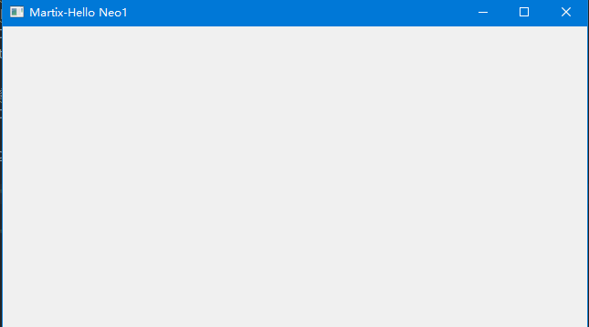

# QObject详解笔记1

## 一、简介
QObject是所有Qt对象的基类


## 二、功能作用

### 2.1 对象名称、属性

#### 2.1.1 API
* setObjectName("唯一名称") 
  给QT对象设置一个名称，一般这个名称是唯一的，当作对象的ID来使用

* objectName() 
  获取一个Qt对象的属性值

* setProperty("属性名称",值)
  给一个Qt对象动态的添加一个属性与值

* Property("属性名称")
  获取一个对象的属性值

* dynamicPropertyNames()
  获取一个对象中所有通过setProperty()设置的属性名称

测试代码如下：

```python
from PyQt5.Qt import  *

class Window(QWidget):
    def __init__(self):
        super().__init__() # 初始化父类
        self.setWindowTitle("QObject的学习笔记")
        self.resize(500,500)


        self.setup_ui()

    def setup_ui(self):
        # 启动测试函数
        self.QObject2()


    def QObject1(self):
        # 取出所有的父类进行打印  继承object
        mros = QObject.mro()

        for mro in mros:
            print(mro)


    def  QObject2(self):
        obj = QObject()
        obj.setObjectName("notice")
        print(obj.objectName())

        obj.setProperty("notice_level","error")
        obj.setProperty("notice_level1","warning")

        # 根据属性名称 获取属性值
        print(obj.property("notice_level"))

        # 获取该对象的所有属性名称
        print(obj.dynamicPropertyNames())


if __name__ == '__main__':
     import sys
     app = QApplication(sys.argv)

     window = Window()
     window.show()

     sys.exit(app.exec_())

```

#### 2.1.2 应用场景
* 应用于qss的ID选择器，属性选择器——方便统一设置样式
使用qss文件将窗口中所有的QLabel设置样式，代码如下：

```python
from PyQt5.Qt import *

class Window(QWidget):
    def __init__(self):
        super().__init__() # 初始化父类
        self.setWindowTitle("QObject的学习笔记")
        self.resize(500,500)


        self.setup_ui()

    def setup_ui(self):
        # 启动测试函数
        self.QObject3()


    def QObject1(self):
        # 取出所有的父类进行打印  继承object
        mros = QObject.mro()

        for mro in mros:
            print(mro)


    def  QObject2(self):
        obj = QObject()
        obj.setObjectName("notice")
        print(obj.objectName())

        obj.setProperty("notice_level","error")
        obj.setProperty("notice_level1","warning")

        # 根据属性名称 获取属性值
        print(obj.property("notice_level"))

        # 获取该对象的所有属性名称
        print(obj.dynamicPropertyNames())

    def QObject3(self):

        # 将qss文件中的内容进行读取
        with open("QObject1.qss","r") as f:
            qApp.setStyleSheet(f.read())


        # 标签控件放在窗口中
        label = QLabel(self)
        label.setText("社会我顺哥")

        label2 = QLabel(self)
        label2.move(100,100)
        label2.setText("人狠话不多")

        # 设置样式
        # label.setStyleSheet("font-size:25px; color:red")


if __name__ == '__main__':
     import sys
     app = QApplication(sys.argv)

     window = Window()
     window.show()

     sys.exit(app.exec_())

```

```qss
QLabel{
    font-size:20px;
    color:red;
}

```


ID选择器：应用场景：并不是所有的label标签都需要设置样式，那么对于需要设置样式的标签添加一个属性ID，这样就只能为具有特定的Label标签进行设置样式。

设置样式如下：

```
QLabel #notice{
    font-size:20px;
    color:red;
}

```

```python
from PyQt5.Qt import  *

class Window(QWidget):
    def __init__(self):
        super().__init__() # 初始化父类
        self.setWindowTitle("QObject的学习笔记")
        self.resize(500,500)


        self.setup_ui()

    def setup_ui(self):
        # 启动测试函数
        self.QObject3()


    def QObject1(self):
        # 取出所有的父类进行打印  继承object
        mros = QObject.mro()

        for mro in mros:
            print(mro)


    def  QObject2(self):
        obj = QObject()
        obj.setObjectName("notice")
        print(obj.objectName())

        obj.setProperty("notice_level","error")
        obj.setProperty("notice_level1","warning")

        # 根据属性名称 获取属性值
        print(obj.property("notice_level"))

        # 获取该对象的所有属性名称
        print(obj.dynamicPropertyNames())

    def QObject3(self):

        # 将qss文件中的内容进行读取
        with open("QObject1.qss","r") as f:
            qApp.setStyleSheet(f.read())


        # 标签控件放在窗口中
        label = QLabel(self)
        label.setObjectName("notice")
        label.setText("社会我顺哥")

        label2 = QLabel(self)
        label2.move(100,100)
        label2.setText("人狠话不多")

        # 设置样式
        # label.setStyleSheet("font-size:25px; color:red")


if __name__ == '__main__':
     import sys
     app = QApplication(sys.argv)

     window = Window()
     window.show()

     sys.exit(app.exec_())

```

这里我只为第一个label设置了ID，效果图如下：
  


属性选择器：此时我有多个label的ID都是一样的，但是我又想让他们的样式不同，这时候就需要根据属性设置样式：比如：

```qss
QLabel#notice{
    font-size:20px;
    color:gray;
    border:1px solid gray;
    border-radius:8px;
}


QLabel#notice[notice_level="normal"]{
    color:green;
    border-color:green;
}
```

qss文件中第二个是将ID为notice并且属性值为normal的标签进行设置.

```python
from PyQt5.Qt import  *

class Window(QWidget):
    def __init__(self):
        super().__init__() # 初始化父类
        self.setWindowTitle("QObject的学习笔记")
        self.resize(500,500)


        self.setup_ui()

    def setup_ui(self):
        # 启动测试函数
        self.QObject3()


    def QObject1(self):
        # 取出所有的父类进行打印  继承object
        mros = QObject.mro()

        for mro in mros:
            print(mro)


    def  QObject2(self):
        obj = QObject()
        obj.setObjectName("notice")
        print(obj.objectName())

        obj.setProperty("notice_level","error")
        obj.setProperty("notice_level1","warning")

        # 根据属性名称 获取属性值
        print(obj.property("notice_level"))

        # 获取该对象的所有属性名称
        print(obj.dynamicPropertyNames())

    def QObject3(self):

        # 将qss文件中的内容进行读取
        with open("QObject1.qss","r") as f:
            qApp.setStyleSheet(f.read())


        # 标签控件放在窗口中
        label = QLabel(self)
        label.setObjectName("notice")
        label.setProperty("notice_level","normal")
        label.setText("社会我顺哥")

        label2 = QLabel(self)
        label2.move(100,100)
        label2.setObjectName("notice")
        label2.setProperty("notice_level","warning")
        label2.setText("人狠话不多")

        # 设置样式
        # label.setStyleSheet("font-size:25px; color:red")


if __name__ == '__main__':
     import sys
     app = QApplication(sys.argv)

     window = Window()
     window.show()

     sys.exit(app.exec_())

```

效果图如下：

  


* 用于装饰器的信号与槽

#### 2.1.3 案例
（1）创建多个用于信息提示的QLabel

要求：
    1. 字体大小为25px
    2. 字体颜色灰色
    3. 边框圆角为8px
    4. 信息提示分为多个级别：正常（normal）绿色边框，绿色字体
    5. 警告（warning）黄色边框 黄色字体
    6. 错误（error）红色边框、红色字体

案例实现效果见上面

### 2.2 父子对象的操作

#### 2.2.1 API 
* setParent(parent)
  设置父对象，父对象只能设置一个，尝试构造如下父子关系图
    

  注意：这里的控件，比如QLabel要设置父对象，不可以将QObject将设置成他的父对象，对于控件，只有将具体的控件设置成他的父对象。

* parent()
  获取父对象
* children()
  获取所有的子对象,并且这个字对象，必须是直接子对象，没有间接子对象

* findChild(参数1，参数2，参数3)
  * 获取某一个指定名称和类型的子对象，**找到一个就结束了，并且是第一个子对象**
  * 参数1
    

  * 参数2
    
  * 参数3
    


总结一下：这里的参数1就是设置子对象的类型，第二个参数就是用来进一步筛选：因为同一类子对象有许多个，这是就要通过ID选择器进行筛选，第三个用来设置查找方式。


* findChildren(参数1，参数2，参数3)


测试代码1：

```python
from PyQt5.Qt import  *

class Window(QWidget):
    def __init__(self):
        super().__init__() # 初始化父类
        self.setWindowTitle("QObject的学习笔记")
        self.resize(500,500)


        self.setup_ui()

    def setup_ui(self):
        # 启动测试函数
        self.QObject4()


    def QObject1(self):
        # 取出所有的父类进行打印  继承object
        mros = QObject.mro()

        for mro in mros:
            print(mro)


    def  QObject2(self):
        obj = QObject()
        obj.setObjectName("notice")
        print(obj.objectName())

        obj.setProperty("notice_level","error")
        obj.setProperty("notice_level1","warning")

        # 根据属性名称 获取属性值
        print(obj.property("notice_level"))

        # 获取该对象的所有属性名称
        print(obj.dynamicPropertyNames())

    def QObject3(self):

        # 将qss文件中的内容进行读取
        with open("QObject1.qss","r") as f:
            qApp.setStyleSheet(f.read())


        # 标签控件放在窗口中
        label = QLabel(self)
        label.setObjectName("notice")
        label.setProperty("notice_level","normal")
        label.setText("社会我顺哥")

        label2 = QLabel(self)
        label2.move(100,100)
        label2.setObjectName("notice")
        label2.setProperty("notice_level","warning")
        label2.setText("人狠话不多")

        # 设置样式
        # label.setStyleSheet("font-size:25px; color:red")


    def QObject4(self):

        # 将obj2设置成obj1的父对象
        obj1 = QObject()
        obj2 = QObject()
        obj3 = QObject()
        obj4 = QObject()
        obj5 = QObject()
        obj0 = QObject()

        obj1.setParent(obj0)
        obj2.setParent(obj0)
        obj3.setParent(obj1)
        obj4.setParent(obj2)
        obj5.setParent(obj5)

        # 内存地址相同 说明obj2是obj1的父对象
        print("obj0",obj0)
        print("obj1",obj1)
        print("obj2",obj2)
        print("obj3",obj3)
        print("obj4",obj4)
        print("obj5",obj5)

        print(obj1.parent())
        print(obj2.parent())
        print(obj3.parent())
        print(obj4.parent())
        print(obj5.parent())

if __name__ == '__main__':
     import sys
     app = QApplication(sys.argv)

     window = Window()
     window.show()

     sys.exit(app.exec_())

```

  


测试代码2：

```python
from PyQt5.Qt import  *

class Window(QWidget):
    def __init__(self):
        super().__init__() # 初始化父类
        self.setWindowTitle("QObject的学习笔记")
        self.resize(500,500)
        self.setup_ui()

    def setup_ui(self):
        # 启动测试函数
        self.QObject4()


    def QObject1(self):
        # 取出所有的父类进行打印  继承object
        mros = QObject.mro()

        for mro in mros:
            print(mro)

    def  QObject2(self):
        obj = QObject()
        obj.setObjectName("notice")
        print(obj.objectName())

        obj.setProperty("notice_level","error")
        obj.setProperty("notice_level1","warning")

        # 根据属性名称 获取属性值
        print(obj.property("notice_level"))

        # 获取该对象的所有属性名称
        print(obj.dynamicPropertyNames())

    def QObject3(self):

        # 将qss文件中的内容进行读取
        with open("QObject1.qss","r") as f:
            qApp.setStyleSheet(f.read())


        # 标签控件放在窗口中
        label = QLabel(self)
        label.setObjectName("notice")
        label.setProperty("notice_level","normal")
        label.setText("社会我顺哥")

        label2 = QLabel(self)
        label2.move(100,100)
        label2.setObjectName("notice")
        label2.setProperty("notice_level","warning")
        label2.setText("人狠话不多")

        # 设置样式
        # label.setStyleSheet("font-size:25px; color:red")

    def QObject4(self):

        # 将obj2设置成obj1的父对象
        obj1 = QObject()
        obj2 = QObject()
        # 设置ID
        obj2.setObjectName("notice")
        obj3 = QObject()
        obj4 = QObject()
        obj5 = QObject()
        obj0 = QObject()

        obj1.setParent(obj0)
        obj2.setParent(obj0)
        obj3.setParent(obj1)
        obj4.setParent(obj2)
        obj5.setParent(obj5)
        # label = QLabel()
        # label.setParent(obj0)

        # 内存地址相同 说明obj2是obj1的父对象
        print("obj0",obj0)
        print("obj1",obj1)
        print("obj2",obj2)
        print("obj3",obj3)
        print("obj4",obj4)
        print("obj5",obj5)

        print(obj1.parent())
        print(obj2.parent())
        print(obj3.parent())
        print(obj4.parent())
        print(obj5.parent())


        # 获取obj0的所有子对象 只包括直接子对象 不包括间接子对象
        print(obj0.children())

        # obj0有两个子对象 但是这里只打印一个子对象,并且是第一个子对象
        print(obj0.findChild(QObject))

        # 这里添加了筛选参数2 ID  打印第二个子对象
        print(obj0.findChild(QObject,"notice"))

        # 控件的父对象必须是一个控件 这样才可以将一个控件添加到另外一个控件中
        # print(obj0.findChild(QLabel))


if __name__ == '__main__':
     import sys
     app = QApplication(sys.argv)

     window = Window()
     window.show()

     sys.exit(app.exec_())

```

  


#### 2.2.2 应用场景

* 涉及到Qt对象内存管理机制
* 如果一个控件，没有任何父控件，那么就会被当成顶层控件（窗口），多个顶层窗口相互独立
```python
if __name__ == '__main__':
     import sys
     app = QApplication(sys.argv)

     # window = Window()
     # window.show()

     win1 = QWidget()

     # 设置一下背景颜色 红配绿 
     win1.setStyleSheet("background-color:red")
     win2 = QWidget()
     win2 = setStyleSheet("background-color:green")


     win1.show()
     win2.show()
     sys.exit(app.exec_())

```

效果图：
  


* 如果想要一个控件被包含在另外一个控件内部，就需要设置父子关系，显示位置受父控件约束，生命周期也被父对象接管

测试代码如下：
```python
     win1 = QWidget()
     win1.resize(500,500)
     win1.setStyleSheet("background-color:red")
     win2 = QWidget()

     win2.setParent(win1)
     win2.setStyleSheet("background-color:green")
     win2.resize(100, 100)

     win1.show()
     win2.show()

```

  


#### 2.2.3 案例
  


测试代码：

```python
from PyQt5.Qt import  *

class Window(QWidget):
    def __init__(self):
        super().__init__() # 初始化父类
        self.setWindowTitle("QObject的学习笔记")
        self.resize(500,500)
        self.setup_ui()

    def setup_ui(self):
        # 启动测试函数
        self.QObject5()


    def QObject1(self):
        # 取出所有的父类进行打印  继承object
        mros = QObject.mro()

        for mro in mros:
            print(mro)

    def  QObject2(self):
        obj = QObject()
        obj.setObjectName("notice")
        print(obj.objectName())

        obj.setProperty("notice_level","error")
        obj.setProperty("notice_level1","warning")

        # 根据属性名称 获取属性值
        print(obj.property("notice_level"))

        # 获取该对象的所有属性名称
        print(obj.dynamicPropertyNames())

    def QObject3(self):

        # 将qss文件中的内容进行读取
        with open("QObject1.qss","r") as f:
            qApp.setStyleSheet(f.read())


        # 标签控件放在窗口中
        label = QLabel(self)
        label.setObjectName("notice")
        label.setProperty("notice_level","normal")
        label.setText("社会我顺哥")

        label2 = QLabel(self)
        label2.move(100,100)
        label2.setObjectName("notice")
        label2.setProperty("notice_level","warning")
        label2.setText("人狠话不多")

        # 设置样式
        # label.setStyleSheet("font-size:25px; color:red")

    def QObject4(self):

        # 将obj2设置成obj1的父对象
        obj1 = QObject()
        obj2 = QObject()
        # 设置ID
        obj2.setObjectName("notice")
        obj3 = QObject()
        obj4 = QObject()
        obj5 = QObject()
        obj0 = QObject()

        obj1.setParent(obj0)
        obj2.setParent(obj0)
        obj3.setParent(obj1)
        obj4.setParent(obj2)
        obj5.setParent(obj5)
        # label = QLabel()
        # label.setParent(obj0)

        # 内存地址相同 说明obj2是obj1的父对象
        print("obj0",obj0)
        print("obj1",obj1)
        print("obj2",obj2)
        print("obj3",obj3)
        print("obj4",obj4)
        print("obj5",obj5)

        print(obj1.parent())
        print(obj2.parent())
        print(obj3.parent())
        print(obj4.parent())
        print(obj5.parent())


        # 获取obj0的所有子对象 只包括直接子对象 不包括间接子对象
        print(obj0.children())

        # obj0有两个子对象 但是这里只打印一个子对象,并且是第一个子对象
        print(obj0.findChild(QObject))

        # 这里添加了筛选参数2 ID  打印第二个子对象
        print(obj0.findChild(QObject,"notice"))

        # 控件的父对象必须是一个控件 这样才可以将一个控件添加到另外一个控件中
        # print(obj0.findChild(QLabel))

    def QObject5(self):
        obj1 = QObject()

        # 直接将obj1设置成成员
        self.obj1 = obj1

        obj2 = QObject()

        obj2.setParent(obj1)

        # 监听obj2对象被释放
        obj2.destroyed.connect(lambda :print("obj2对象被释放了"))

        del self.obj1


if __name__ == '__main__':
     import sys
     app = QApplication(sys.argv)

     # window = Window()
     # window.show()

     # win1 = QWidget()
     # win1.resize(500,500)
     # win1.setStyleSheet("background-color:red")
     # win2 = QWidget()
     #
     # win2.setParent(win1)
     # win2.setStyleSheet("background-color:green")
     # win2.resize(100, 100)
     #
     # win1.show()
     # win2.show()

     win_root = QWidget()

     label1 = QLabel()
     label1.setText("label1")
     label1.setParent(win_root)

     label2 = QLabel()
     label2.move(100,100)
     label2.setText("label2")
     label2.setParent(win_root)

     win_root.show()

    # 将winroot中的所有QLabel设置背景颜色
     for sub_widget in win_root.findChildren(QLabel):
        print(sub_widget)
        sub_widget.setStyleSheet("background-color:cyan")


     sys.exit(app.exec_())

```

  


### 2.3 信号处理

#### 2.3.1 API
QObject内置两个信号：
（1）objectNameChanged(objectName)  
  对象名称发生改变时发射此信号，我们可以看到这个槽函数是可以传递一个参数的，这个参数就是你修改之后的ObjectName


（2）destroyed(obj)
  对象被销毁时，发射此信号,我们可以看到这个槽函数是可以传递一个参数的，这个参数就是该对象


* widget.信号.connect(槽)
  连接信号与槽

* obj.disconnect()
  取消连接信号与槽
  如果obj是控件，那么取消控件的所有信号连接
  如果obj是信号，那么取消信号的所有连接（下面的案例就是一个信号）


* widget.blockSignals(bool)
  临时（取消）阻止指定控件所有的信号与槽的连接


* widget.signalBlocked()
  信号是否被阻止


* widget.receivers("信号")
  返回连接到信号的接收器数量，传入参数：信号，也就是看这个信号连接了几个槽函数。


（1）测试代码1：使用内置信号destroyed连接自定义槽函数,并且打印对象
```python
from PyQt5.Qt import  *

class Window(QWidget):
    def __init__(self):
        super().__init__() # 初始化父类
        self.setWindowTitle("QObject的学习笔记")
        self.resize(500,500)
        self.setup_ui()

    def setup_ui(self):
        # 启动测试函数
        self.QObject6()

    def QObject1(self):
        # 取出所有的父类进行打印  继承object
        mros = QObject.mro()

        for mro in mros:
            print(mro)

    def  QObject2(self):
        obj = QObject()
        obj.setObjectName("notice")
        print(obj.objectName())

        obj.setProperty("notice_level","error")
        obj.setProperty("notice_level1","warning")

        # 根据属性名称 获取属性值
        print(obj.property("notice_level"))

        # 获取该对象的所有属性名称
        print(obj.dynamicPropertyNames())

    def QObject3(self):

        # 将qss文件中的内容进行读取
        with open("QObject1.qss","r") as f:
            qApp.setStyleSheet(f.read())


        # 标签控件放在窗口中
        label = QLabel(self)
        label.setObjectName("notice")
        label.setProperty("notice_level","normal")
        label.setText("社会我顺哥")

        label2 = QLabel(self)
        label2.move(100,100)
        label2.setObjectName("notice")
        label2.setProperty("notice_level","warning")
        label2.setText("人狠话不多")

        # 设置样式
        # label.setStyleSheet("font-size:25px; color:red")

    def QObject4(self):

        # 将obj2设置成obj1的父对象
        obj1 = QObject()
        obj2 = QObject()
        # 设置ID
        obj2.setObjectName("notice")
        obj3 = QObject()
        obj4 = QObject()
        obj5 = QObject()
        obj0 = QObject()

        obj1.setParent(obj0)
        obj2.setParent(obj0)
        obj3.setParent(obj1)
        obj4.setParent(obj2)
        obj5.setParent(obj5)
        # label = QLabel()
        # label.setParent(obj0)

        # 内存地址相同 说明obj2是obj1的父对象
        print("obj0",obj0)
        print("obj1",obj1)
        print("obj2",obj2)
        print("obj3",obj3)
        print("obj4",obj4)
        print("obj5",obj5)

        print(obj1.parent())
        print(obj2.parent())
        print(obj3.parent())
        print(obj4.parent())
        print(obj5.parent())


        # 获取obj0的所有子对象 只包括直接子对象 不包括间接子对象
        print(obj0.children())

        # obj0有两个子对象 但是这里只打印一个子对象,并且是第一个子对象
        print(obj0.findChild(QObject))

        # 这里添加了筛选参数2 ID  打印第二个子对象
        print(obj0.findChild(QObject,"notice"))

        # 控件的父对象必须是一个控件 这样才可以将一个控件添加到另外一个控件中
        # print(obj0.findChild(QLabel))

    def QObject5(self):
        obj1 = QObject()

        # 直接将obj1设置成成员
        self.obj1 = obj1

        obj2 = QObject()

        obj2.setParent(obj1)

        # 监听obj2对象被释放
        obj2.destroyed.connect(lambda :print("obj2对象被释放了"))

        del self.obj1

    def QObject6(self):
        # QObjetc信号的操作
        self.obj = QObject()  # 直接将对象设置成window的成员变量

        def destroy_cao():
            print("对象被释放了")

        # 将QObject的信号与自定义的槽函数进行连接
        # 格式：对象.信号.connect(槽函数)
        self.obj.destroyed.connect(destroy_cao)

        # 删除对象 触发槽函数
        del self.obj


if __name__ == '__main__':
     import sys
     app = QApplication(sys.argv)

     window = Window()
     window.show()

     # win1 = QWidget()
     # win1.resize(500,500)
     # win1.setStyleSheet("background-color:red")
     # win2 = QWidget()

     # win2.setParent(win1)
     # win2.setStyleSheet("background-color:green")
     # win2.resize(100, 100)
     #
     # win1.show()
     # win2.show()

    #  win_root = QWidget()
    #
    #  label1 = QLabel()
    #  label1.setText("label1")
    #  label1.setParent(win_root)
    #
    #  label2 = QLabel()
    #  label2.move(100,100)
    #  label2.setText("label2")
    #  label2.setParent(win_root)
    #
    #  win_root.show()
    #
    # # 将winroot中的所有QLabel设置背景颜色
    #  for sub_widget in win_root.findChildren(QLabel):
    #     print(sub_widget)
    #     sub_widget.setStyleSheet("background-color:cyan")

     sys.exit(app.exec_())

```

（2）测试代码2：objectNameChanged() 改变对象名称
```python
from PyQt5.Qt import  *

class Window(QWidget):
    def __init__(self):
        super().__init__() # 初始化父类
        self.setWindowTitle("QObject的学习笔记")
        self.resize(500,500)
        self.setup_ui()

    def setup_ui(self):
        # 启动测试函数
        self.QObject6()

    def QObject1(self):
        # 取出所有的父类进行打印  继承object
        mros = QObject.mro()

        for mro in mros:
            print(mro)

    def  QObject2(self):
        obj = QObject()
        obj.setObjectName("notice")
        print(obj.objectName())

        obj.setProperty("notice_level","error")
        obj.setProperty("notice_level1","warning")

        # 根据属性名称 获取属性值
        print(obj.property("notice_level"))

        # 获取该对象的所有属性名称
        print(obj.dynamicPropertyNames())

    def QObject3(self):

        # 将qss文件中的内容进行读取
        with open("QObject1.qss","r") as f:
            qApp.setStyleSheet(f.read())


        # 标签控件放在窗口中
        label = QLabel(self)
        label.setObjectName("notice")
        label.setProperty("notice_level","normal")
        label.setText("社会我顺哥")

        label2 = QLabel(self)
        label2.move(100,100)
        label2.setObjectName("notice")
        label2.setProperty("notice_level","warning")
        label2.setText("人狠话不多")

        # 设置样式
        # label.setStyleSheet("font-size:25px; color:red")

    def QObject4(self):

        # 将obj2设置成obj1的父对象
        obj1 = QObject()
        obj2 = QObject()
        # 设置ID
        obj2.setObjectName("notice")
        obj3 = QObject()
        obj4 = QObject()
        obj5 = QObject()
        obj0 = QObject()

        obj1.setParent(obj0)
        obj2.setParent(obj0)
        obj3.setParent(obj1)
        obj4.setParent(obj2)
        obj5.setParent(obj5)
        # label = QLabel()
        # label.setParent(obj0)

        # 内存地址相同 说明obj2是obj1的父对象
        print("obj0",obj0)
        print("obj1",obj1)
        print("obj2",obj2)
        print("obj3",obj3)
        print("obj4",obj4)
        print("obj5",obj5)

        print(obj1.parent())
        print(obj2.parent())
        print(obj3.parent())
        print(obj4.parent())
        print(obj5.parent())


        # 获取obj0的所有子对象 只包括直接子对象 不包括间接子对象
        print(obj0.children())

        # obj0有两个子对象 但是这里只打印一个子对象,并且是第一个子对象
        print(obj0.findChild(QObject))

        # 这里添加了筛选参数2 ID  打印第二个子对象
        print(obj0.findChild(QObject,"notice"))

        # 控件的父对象必须是一个控件 这样才可以将一个控件添加到另外一个控件中
        # print(obj0.findChild(QLabel))

    def QObject5(self):
        obj1 = QObject()

        # 直接将obj1设置成成员
        self.obj1 = obj1

        obj2 = QObject()

        obj2.setParent(obj1)

        # 监听obj2对象被释放
        obj2.destroyed.connect(lambda :print("obj2对象被释放了"))

        del self.obj1

    def QObject6(self):
        # QObjetc信号的操作
        self.obj = QObject()  # 直接将对象设置成window的成员变量

        # 自定义槽函数
        # 如果想要知道哪一个对象被释放了，直接打印即可
        # def destroy_cao(obj):
        #     print("对象被释放了",obj)
        #
        # # 将QObject的信号与自定义的槽函数进行连接
        # # 格式：对象.信号.connect(槽函数)
        # self.obj.destroyed.connect(destroy_cao)
        # # 删除对象 触发槽函数
        # del self.obj

        # 自定义槽函数
        # 如果我想知道槽函数接收到的信号是什么，传入参数即可，参数名称无所谓，他总是会打印xxx（改变之后的对象名称）
        def obj_name_cao(name):
            print("对象名称发生了改变",name)

        # 对象名称改变信号连接槽函数
        self.obj.objectNameChanged.connect(obj_name_cao)

        # 重新设置对象名称
        self.obj.setObjectName("xxx")


if __name__ == '__main__':
     import sys
     app = QApplication(sys.argv)

     window = Window()
     window.show()

     # win1 = QWidget()
     # win1.resize(500,500)
     # win1.setStyleSheet("background-color:red")
     # win2 = QWidget()

     # win2.setParent(win1)
     # win2.setStyleSheet("background-color:green")
     # win2.resize(100, 100)
     #
     # win1.show()
     # win2.show()

    #  win_root = QWidget()
    #
    #  label1 = QLabel()
    #  label1.setText("label1")
    #  label1.setParent(win_root)
    #
    #  label2 = QLabel()
    #  label2.move(100,100)
    #  label2.setText("label2")
    #  label2.setParent(win_root)
    #
    #  win_root.show()
    #
    # # 将winroot中的所有QLabel设置背景颜色
    #  for sub_widget in win_root.findChildren(QLabel):
    #     print(sub_widget)
    #     sub_widget.setStyleSheet("background-color:cyan")

     sys.exit(app.exec_())

```

（3）测试代码三：objectNameChanged取消与槽函数的连接
```python
from PyQt5.Qt import  *

class Window(QWidget):
    def __init__(self):
        super().__init__() # 初始化父类
        self.setWindowTitle("QObject的学习笔记")
        self.resize(500,500)
        self.setup_ui()

    def setup_ui(self):
        # 启动测试函数
        self.QObject6()

    def QObject1(self):
        # 取出所有的父类进行打印  继承object
        mros = QObject.mro()

        for mro in mros:
            print(mro)

    def  QObject2(self):
        obj = QObject()
        obj.setObjectName("notice")
        print(obj.objectName())

        obj.setProperty("notice_level","error")
        obj.setProperty("notice_level1","warning")

        # 根据属性名称 获取属性值
        print(obj.property("notice_level"))

        # 获取该对象的所有属性名称
        print(obj.dynamicPropertyNames())

    def QObject3(self):

        # 将qss文件中的内容进行读取
        with open("QObject1.qss","r") as f:
            qApp.setStyleSheet(f.read())


        # 标签控件放在窗口中
        label = QLabel(self)
        label.setObjectName("notice")
        label.setProperty("notice_level","normal")
        label.setText("社会我顺哥")

        label2 = QLabel(self)
        label2.move(100,100)
        label2.setObjectName("notice")
        label2.setProperty("notice_level","warning")
        label2.setText("人狠话不多")

        # 设置样式
        # label.setStyleSheet("font-size:25px; color:red")

    def QObject4(self):

        # 将obj2设置成obj1的父对象
        obj1 = QObject()
        obj2 = QObject()
        # 设置ID
        obj2.setObjectName("notice")
        obj3 = QObject()
        obj4 = QObject()
        obj5 = QObject()
        obj0 = QObject()

        obj1.setParent(obj0)
        obj2.setParent(obj0)
        obj3.setParent(obj1)
        obj4.setParent(obj2)
        obj5.setParent(obj5)
        # label = QLabel()
        # label.setParent(obj0)

        # 内存地址相同 说明obj2是obj1的父对象
        print("obj0",obj0)
        print("obj1",obj1)
        print("obj2",obj2)
        print("obj3",obj3)
        print("obj4",obj4)
        print("obj5",obj5)

        print(obj1.parent())
        print(obj2.parent())
        print(obj3.parent())
        print(obj4.parent())
        print(obj5.parent())


        # 获取obj0的所有子对象 只包括直接子对象 不包括间接子对象
        print(obj0.children())

        # obj0有两个子对象 但是这里只打印一个子对象,并且是第一个子对象
        print(obj0.findChild(QObject))

        # 这里添加了筛选参数2 ID  打印第二个子对象
        print(obj0.findChild(QObject,"notice"))

        # 控件的父对象必须是一个控件 这样才可以将一个控件添加到另外一个控件中
        # print(obj0.findChild(QLabel))

    def QObject5(self):
        obj1 = QObject()

        # 直接将obj1设置成成员
        self.obj1 = obj1

        obj2 = QObject()

        obj2.setParent(obj1)

        # 监听obj2对象被释放
        obj2.destroyed.connect(lambda :print("obj2对象被释放了"))

        del self.obj1

    def QObject6(self):
        # QObjetc信号的操作
        self.obj = QObject()  # 直接将对象设置成window的成员变量

        # 自定义槽函数
        # 如果想要知道哪一个对象被释放了，直接打印即可
        # def destroy_cao(obj):
        #     print("对象被释放了",obj)
        #
        # # 将QObject的信号与自定义的槽函数进行连接
        # # 格式：对象.信号.connect(槽函数)
        # self.obj.destroyed.connect(destroy_cao)
        # # 删除对象 触发槽函数
        # del self.obj

        # 自定义槽函数
        # 如果我想知道槽函数接收到的信号是什么，传入参数即可，参数名称无所谓，他总是会打印xxx（改变之后的对象名称）
        def obj_name_cao(name):
            print("对象名称发生了改变",name)

        # 对象名称改变信号连接槽函数
        self.obj.objectNameChanged.connect(obj_name_cao)

        # 重新设置对象名称
        self.obj.setObjectName("xxx")

        # objectNameChanged取消与槽函数的连接
        self.obj.objectNameChanged.disconnect()


        self.obj.setObjectName("ooo")


if __name__ == '__main__':
     import sys
     app = QApplication(sys.argv)

     window = Window()
     window.show()

     # win1 = QWidget()
     # win1.resize(500,500)
     # win1.setStyleSheet("background-color:red")
     # win2 = QWidget()

     # win2.setParent(win1)
     # win2.setStyleSheet("background-color:green")
     # win2.resize(100, 100)
     #
     # win1.show()
     # win2.show()

    #  win_root = QWidget()
    #
    #  label1 = QLabel()
    #  label1.setText("label1")
    #  label1.setParent(win_root)
    #
    #  label2 = QLabel()
    #  label2.move(100,100)
    #  label2.setText("label2")
    #  label2.setParent(win_root)
    #
    #  win_root.show()
    #
    # # 将winroot中的所有QLabel设置背景颜色
    #  for sub_widget in win_root.findChildren(QLabel):
    #     print(sub_widget)
    #     sub_widget.setStyleSheet("background-color:cyan")

     sys.exit(app.exec_())
```


（4）测试代码四：临时阻断信号/临时恢复信号

```python
from PyQt5.Qt import  *

class Window(QWidget):
    def __init__(self):
        super().__init__() # 初始化父类
        self.setWindowTitle("QObject的学习笔记")
        self.resize(500,500)
        self.setup_ui()

    def setup_ui(self):
        # 启动测试函数
        self.QObject6()

    def QObject1(self):
        # 取出所有的父类进行打印  继承object
        mros = QObject.mro()

        for mro in mros:
            print(mro)

    def  QObject2(self):
        obj = QObject()
        obj.setObjectName("notice")
        print(obj.objectName())

        obj.setProperty("notice_level","error")
        obj.setProperty("notice_level1","warning")

        # 根据属性名称 获取属性值
        print(obj.property("notice_level"))

        # 获取该对象的所有属性名称
        print(obj.dynamicPropertyNames())

    def QObject3(self):

        # 将qss文件中的内容进行读取
        with open("QObject1.qss","r") as f:
            qApp.setStyleSheet(f.read())


        # 标签控件放在窗口中
        label = QLabel(self)
        label.setObjectName("notice")
        label.setProperty("notice_level","normal")
        label.setText("社会我顺哥")

        label2 = QLabel(self)
        label2.move(100,100)
        label2.setObjectName("notice")
        label2.setProperty("notice_level","warning")
        label2.setText("人狠话不多")

        # 设置样式
        # label.setStyleSheet("font-size:25px; color:red")

    def QObject4(self):

        # 将obj2设置成obj1的父对象
        obj1 = QObject()
        obj2 = QObject()
        # 设置ID
        obj2.setObjectName("notice")
        obj3 = QObject()
        obj4 = QObject()
        obj5 = QObject()
        obj0 = QObject()

        obj1.setParent(obj0)
        obj2.setParent(obj0)
        obj3.setParent(obj1)
        obj4.setParent(obj2)
        obj5.setParent(obj5)
        # label = QLabel()
        # label.setParent(obj0)

        # 内存地址相同 说明obj2是obj1的父对象
        print("obj0",obj0)
        print("obj1",obj1)
        print("obj2",obj2)
        print("obj3",obj3)
        print("obj4",obj4)
        print("obj5",obj5)

        print(obj1.parent())
        print(obj2.parent())
        print(obj3.parent())
        print(obj4.parent())
        print(obj5.parent())


        # 获取obj0的所有子对象 只包括直接子对象 不包括间接子对象
        print(obj0.children())

        # obj0有两个子对象 但是这里只打印一个子对象,并且是第一个子对象
        print(obj0.findChild(QObject))

        # 这里添加了筛选参数2 ID  打印第二个子对象
        print(obj0.findChild(QObject,"notice"))

        # 控件的父对象必须是一个控件 这样才可以将一个控件添加到另外一个控件中
        # print(obj0.findChild(QLabel))

    def QObject5(self):
        obj1 = QObject()

        # 直接将obj1设置成成员
        self.obj1 = obj1

        obj2 = QObject()

        obj2.setParent(obj1)

        # 监听obj2对象被释放
        obj2.destroyed.connect(lambda :print("obj2对象被释放了"))

        del self.obj1

    def QObject6(self):
        # QObjetc信号的操作
        self.obj = QObject()  # 直接将对象设置成window的成员变量

        # 自定义槽函数
        # 如果想要知道哪一个对象被释放了，直接打印即可
        # def destroy_cao(obj):
        #     print("对象被释放了",obj)
        #
        # # 将QObject的信号与自定义的槽函数进行连接
        # # 格式：对象.信号.connect(槽函数)
        # self.obj.destroyed.connect(destroy_cao)
        # # 删除对象 触发槽函数
        # del self.obj

        # 自定义槽函数
        # 如果我想知道槽函数接收到的信号是什么，传入参数即可，参数名称无所谓，他总是会打印xxx（改变之后的对象名称）
        def obj_name_cao(name):
            print("对象名称发生了改变",name)

        # 对象名称改变信号连接槽函数
        self.obj.objectNameChanged.connect(obj_name_cao)

        # 重新设置对象名称
        self.obj.setObjectName("xxx")

        # objectNameChanged取消与槽函数的连接
        # self.obj.objectNameChanged.disconnect()

        # 临时阻断该对象的所有信号连接
        self.obj.blockSignals(True)
        self.obj.setObjectName("ooo")
        # 将该对象所有的信号重新连接，所以下面的setObjectName函数会生效， 上面的不会生效
        self.obj.blockSignals(False)
        self.obj.setObjectName("ooj")


if __name__ == '__main__':
     import sys
     app = QApplication(sys.argv)

     window = Window()
     window.show()

     # win1 = QWidget()
     # win1.resize(500,500)
     # win1.setStyleSheet("background-color:red")
     # win2 = QWidget()

     # win2.setParent(win1)
     # win2.setStyleSheet("background-color:green")
     # win2.resize(100, 100)
     #
     # win1.show()
     # win2.show()

    #  win_root = QWidget()
    #
    #  label1 = QLabel()
    #  label1.setText("label1")
    #  label1.setParent(win_root)
    #
    #  label2 = QLabel()
    #  label2.move(100,100)
    #  label2.setText("label2")
    #  label2.setParent(win_root)
    #
    #  win_root.show()
    #
    # # 将winroot中的所有QLabel设置背景颜色
    #  for sub_widget in win_root.findChildren(QLabel):
    #     print(sub_widget)
    #     sub_widget.setStyleSheet("background-color:cyan")

     sys.exit(app.exec_())

```

（5）测试代码5：判断信号是否被阻断
```python
from PyQt5.Qt import  *

class Window(QWidget):
    def __init__(self):
        super().__init__() # 初始化父类
        self.setWindowTitle("QObject的学习笔记")
        self.resize(500,500)
        self.setup_ui()

    def setup_ui(self):
        # 启动测试函数
        self.QObject6()

    def QObject1(self):
        # 取出所有的父类进行打印  继承object
        mros = QObject.mro()

        for mro in mros:
            print(mro)

    def  QObject2(self):
        obj = QObject()
        obj.setObjectName("notice")
        print(obj.objectName())

        obj.setProperty("notice_level","error")
        obj.setProperty("notice_level1","warning")

        # 根据属性名称 获取属性值
        print(obj.property("notice_level"))

        # 获取该对象的所有属性名称
        print(obj.dynamicPropertyNames())

    def QObject3(self):

        # 将qss文件中的内容进行读取
        with open("QObject1.qss","r") as f:
            qApp.setStyleSheet(f.read())


        # 标签控件放在窗口中
        label = QLabel(self)
        label.setObjectName("notice")
        label.setProperty("notice_level","normal")
        label.setText("社会我顺哥")

        label2 = QLabel(self)
        label2.move(100,100)
        label2.setObjectName("notice")
        label2.setProperty("notice_level","warning")
        label2.setText("人狠话不多")

        # 设置样式
        # label.setStyleSheet("font-size:25px; color:red")

    def QObject4(self):

        # 将obj2设置成obj1的父对象
        obj1 = QObject()
        obj2 = QObject()
        # 设置ID
        obj2.setObjectName("notice")
        obj3 = QObject()
        obj4 = QObject()
        obj5 = QObject()
        obj0 = QObject()

        obj1.setParent(obj0)
        obj2.setParent(obj0)
        obj3.setParent(obj1)
        obj4.setParent(obj2)
        obj5.setParent(obj5)
        # label = QLabel()
        # label.setParent(obj0)

        # 内存地址相同 说明obj2是obj1的父对象
        print("obj0",obj0)
        print("obj1",obj1)
        print("obj2",obj2)
        print("obj3",obj3)
        print("obj4",obj4)
        print("obj5",obj5)

        print(obj1.parent())
        print(obj2.parent())
        print(obj3.parent())
        print(obj4.parent())
        print(obj5.parent())


        # 获取obj0的所有子对象 只包括直接子对象 不包括间接子对象
        print(obj0.children())

        # obj0有两个子对象 但是这里只打印一个子对象,并且是第一个子对象
        print(obj0.findChild(QObject))

        # 这里添加了筛选参数2 ID  打印第二个子对象
        print(obj0.findChild(QObject,"notice"))

        # 控件的父对象必须是一个控件 这样才可以将一个控件添加到另外一个控件中
        # print(obj0.findChild(QLabel))

    def QObject5(self):
        obj1 = QObject()

        # 直接将obj1设置成成员
        self.obj1 = obj1

        obj2 = QObject()

        obj2.setParent(obj1)

        # 监听obj2对象被释放
        obj2.destroyed.connect(lambda :print("obj2对象被释放了"))

        del self.obj1

    def QObject6(self):
        # QObjetc信号的操作
        self.obj = QObject()  # 直接将对象设置成window的成员变量

        # 自定义槽函数
        # 如果想要知道哪一个对象被释放了，直接打印即可
        # def destroy_cao(obj):
        #     print("对象被释放了",obj)
        #
        # # 将QObject的信号与自定义的槽函数进行连接
        # # 格式：对象.信号.connect(槽函数)
        # self.obj.destroyed.connect(destroy_cao)
        # # 删除对象 触发槽函数
        # del self.obj

        # 自定义槽函数
        # 如果我想知道槽函数接收到的信号是什么，传入参数即可，参数名称无所谓，他总是会打印xxx（改变之后的对象名称）
        def obj_name_cao(name):
            print("对象名称发生了改变",name)

        # 对象名称改变信号连接槽函数
        self.obj.objectNameChanged.connect(obj_name_cao)

        # 重新设置对象名称
        self.obj.setObjectName("xxx")

        # objectNameChanged取消与槽函数的连接
        # self.obj.objectNameChanged.disconnect()

        # 测试信号是否被阻断  判断是False
        print(self.obj.signalsBlocked())

        # 临时阻断该对象的所有信号连接
        self.obj.blockSignals(True)

        # 测试信号是否被阻断  判断是True
        print(self.obj.signalsBlocked())

        self.obj.setObjectName("ooo")
        # 将该对象所有的信号重新连接，所以下面的setObjectName函数会生效， 上面的不会生效
        self.obj.blockSignals(False)
        self.obj.setObjectName("ooj")


if __name__ == '__main__':
     import sys
     app = QApplication(sys.argv)

     window = Window()
     window.show()

     # win1 = QWidget()
     # win1.resize(500,500)
     # win1.setStyleSheet("background-color:red")
     # win2 = QWidget()

     # win2.setParent(win1)
     # win2.setStyleSheet("background-color:green")
     # win2.resize(100, 100)
     #
     # win1.show()
     # win2.show()

    #  win_root = QWidget()
    #
    #  label1 = QLabel()
    #  label1.setText("label1")
    #  label1.setParent(win_root)
    #
    #  label2 = QLabel()
    #  label2.move(100,100)
    #  label2.setText("label2")
    #  label2.setParent(win_root)
    #
    #  win_root.show()
    #
    # # 将winroot中的所有QLabel设置背景颜色
    #  for sub_widget in win_root.findChildren(QLabel):
    #     print(sub_widget)
    #     sub_widget.setStyleSheet("background-color:cyan")

     sys.exit(app.exec_())

```

（6）测试代码6：测试某个信号连接了几个槽函数
```python
from PyQt5.Qt import  *

class Window(QWidget):
    def __init__(self):
        super().__init__() # 初始化父类
        self.setWindowTitle("QObject的学习笔记")
        self.resize(500,500)
        self.setup_ui()

    def setup_ui(self):
        # 启动测试函数
        self.QObject6()

    def QObject1(self):
        # 取出所有的父类进行打印  继承object
        mros = QObject.mro()

        for mro in mros:
            print(mro)

    def  QObject2(self):
        obj = QObject()
        obj.setObjectName("notice")
        print(obj.objectName())

        obj.setProperty("notice_level","error")
        obj.setProperty("notice_level1","warning")

        # 根据属性名称 获取属性值
        print(obj.property("notice_level"))

        # 获取该对象的所有属性名称
        print(obj.dynamicPropertyNames())

    def QObject3(self):

        # 将qss文件中的内容进行读取
        with open("QObject1.qss","r") as f:
            qApp.setStyleSheet(f.read())


        # 标签控件放在窗口中
        label = QLabel(self)
        label.setObjectName("notice")
        label.setProperty("notice_level","normal")
        label.setText("社会我顺哥")

        label2 = QLabel(self)
        label2.move(100,100)
        label2.setObjectName("notice")
        label2.setProperty("notice_level","warning")
        label2.setText("人狠话不多")

        # 设置样式
        # label.setStyleSheet("font-size:25px; color:red")

    def QObject4(self):

        # 将obj2设置成obj1的父对象
        obj1 = QObject()
        obj2 = QObject()
        # 设置ID
        obj2.setObjectName("notice")
        obj3 = QObject()
        obj4 = QObject()
        obj5 = QObject()
        obj0 = QObject()

        obj1.setParent(obj0)
        obj2.setParent(obj0)
        obj3.setParent(obj1)
        obj4.setParent(obj2)
        obj5.setParent(obj5)
        # label = QLabel()
        # label.setParent(obj0)

        # 内存地址相同 说明obj2是obj1的父对象
        print("obj0",obj0)
        print("obj1",obj1)
        print("obj2",obj2)
        print("obj3",obj3)
        print("obj4",obj4)
        print("obj5",obj5)

        print(obj1.parent())
        print(obj2.parent())
        print(obj3.parent())
        print(obj4.parent())
        print(obj5.parent())


        # 获取obj0的所有子对象 只包括直接子对象 不包括间接子对象
        print(obj0.children())

        # obj0有两个子对象 但是这里只打印一个子对象,并且是第一个子对象
        print(obj0.findChild(QObject))

        # 这里添加了筛选参数2 ID  打印第二个子对象
        print(obj0.findChild(QObject,"notice"))

        # 控件的父对象必须是一个控件 这样才可以将一个控件添加到另外一个控件中
        # print(obj0.findChild(QLabel))

    def QObject5(self):
        obj1 = QObject()

        # 直接将obj1设置成成员
        self.obj1 = obj1

        obj2 = QObject()

        obj2.setParent(obj1)

        # 监听obj2对象被释放
        obj2.destroyed.connect(lambda :print("obj2对象被释放了"))

        del self.obj1

    def QObject6(self):
        # QObjetc信号的操作
        self.obj = QObject()  # 直接将对象设置成window的成员变量

        # 自定义槽函数
        # 如果想要知道哪一个对象被释放了，直接打印即可
        # def destroy_cao(obj):
        #     print("对象被释放了",obj)
        #
        # # 将QObject的信号与自定义的槽函数进行连接
        # # 格式：对象.信号.connect(槽函数)
        # self.obj.destroyed.connect(destroy_cao)
        # # 删除对象 触发槽函数
        # del self.obj

        # 自定义槽函数
        # 如果我想知道槽函数接收到的信号是什么，传入参数即可，参数名称无所谓，他总是会打印xxx（改变之后的对象名称）
        def obj_name_cao(name):
            print("对象名称发生了改变",name)

        # 对象名称改变信号连接槽函数
        self.obj.objectNameChanged.connect(obj_name_cao)

        # 重新设置对象名称
        self.obj.setObjectName("xxx")

        # 看这个信号连接了几个槽函数
        print(self.obj.receivers(self.obj.objectNameChanged))

        # objectNameChanged取消与槽函数的连接
        # self.obj.objectNameChanged.disconnect()

        # 测试信号是否被阻断  判断是False
        print(self.obj.signalsBlocked())

        # 临时阻断该对象的所有信号连接
        self.obj.blockSignals(True)

        # 测试信号是否被阻断  判断是True
        print(self.obj.signalsBlocked())

        self.obj.setObjectName("ooo")
        # 将该对象所有的信号重新连接，所以下面的setObjectName函数会生效， 上面的不会生效
        self.obj.blockSignals(False)
        self.obj.setObjectName("ooj")


if __name__ == '__main__':
     import sys
     app = QApplication(sys.argv)

     window = Window()
     window.show()

     # win1 = QWidget()
     # win1.resize(500,500)
     # win1.setStyleSheet("background-color:red")
     # win2 = QWidget()

     # win2.setParent(win1)
     # win2.setStyleSheet("background-color:green")
     # win2.resize(100, 100)
     #
     # win1.show()
     # win2.show()

    #  win_root = QWidget()
    #
    #  label1 = QLabel()
    #  label1.setText("label1")
    #  label1.setParent(win_root)
    #
    #  label2 = QLabel()
    #  label2.move(100,100)
    #  label2.setText("label2")
    #  label2.setParent(win_root)
    #
    #  win_root.show()
    #
    # # 将winroot中的所有QLabel设置背景颜色
    #  for sub_widget in win_root.findChildren(QLabel):
    #     print(sub_widget)
    #     sub_widget.setStyleSheet("background-color:cyan")

     sys.exit(app.exec_())
```


#### 2.3.2 应用场景
* 监听信号，响应用户行为


* 信号与槽机制
```
# 信号与槽机制

## 一、基本概念
* 信号与槽是Qt中的核心机制，主要作用在于对象之间进行通讯
* 信号：当一个控件的状态发生改变时，向外界发出的信息
* 槽：一个执行某些操作的函数/方法
* 所有继承自QWidget的控件都支持“信号与槽”的机制

## 二、机制描述

### 2.1 手动操作

信号与槽的连接

### 2.2 自动操作

当信号发出时，连接的槽函数会自动执行

## 三、基本使用介绍

(1) 信号
* 控件内置的一些信号，长按，点击信号
  * QPushButton().pressed
  * QPushButton().clicked

* 也可以自定义型号
  * pyqtSignal() 


(2) 槽
* 控件内置的槽函数
* 自定义函数/方法


(3) 连接方式
**object.信号.connect(槽函数)**

(4) 特性
* 一个信号可以连接多个槽函数
* 一个信号也可以连接另外一个信号
* 信号的参数可以是任何Python类型
* 一个槽可以监听多个信号


## 四、高级
暂时没学到 后续补充知识点

```


#### 2.3.3 案例

（1）当用户点击按钮的时候。打印“点我干啥”

```python
from PyQt5.Qt import  *

class Window(QWidget):
    def __init__(self):
        super().__init__() # 初始化父类
        self.setWindowTitle("QObject的学习笔记")
        self.resize(500,500)
        self.setup_ui()

    def setup_ui(self):
        # 启动测试函数
        self.QObject7()

    def QObject1(self):
        # 取出所有的父类进行打印  继承object
        mros = QObject.mro()

        for mro in mros:
            print(mro)

    def  QObject2(self):
        obj = QObject()
        obj.setObjectName("notice")
        print(obj.objectName())

        obj.setProperty("notice_level","error")
        obj.setProperty("notice_level1","warning")

        # 根据属性名称 获取属性值
        print(obj.property("notice_level"))

        # 获取该对象的所有属性名称
        print(obj.dynamicPropertyNames())

    def QObject3(self):

        # 将qss文件中的内容进行读取
        with open("QObject1.qss","r") as f:
            qApp.setStyleSheet(f.read())


        # 标签控件放在窗口中
        label = QLabel(self)
        label.setObjectName("notice")
        label.setProperty("notice_level","normal")
        label.setText("社会我顺哥")

        label2 = QLabel(self)
        label2.move(100,100)
        label2.setObjectName("notice")
        label2.setProperty("notice_level","warning")
        label2.setText("人狠话不多")

        # 设置样式
        # label.setStyleSheet("font-size:25px; color:red")

    def QObject4(self):

        # 将obj2设置成obj1的父对象
        obj1 = QObject()
        obj2 = QObject()
        # 设置ID
        obj2.setObjectName("notice")
        obj3 = QObject()
        obj4 = QObject()
        obj5 = QObject()
        obj0 = QObject()

        obj1.setParent(obj0)
        obj2.setParent(obj0)
        obj3.setParent(obj1)
        obj4.setParent(obj2)
        obj5.setParent(obj5)
        # label = QLabel()
        # label.setParent(obj0)

        # 内存地址相同 说明obj2是obj1的父对象
        print("obj0",obj0)
        print("obj1",obj1)
        print("obj2",obj2)
        print("obj3",obj3)
        print("obj4",obj4)
        print("obj5",obj5)

        print(obj1.parent())
        print(obj2.parent())
        print(obj3.parent())
        print(obj4.parent())
        print(obj5.parent())


        # 获取obj0的所有子对象 只包括直接子对象 不包括间接子对象
        print(obj0.children())

        # obj0有两个子对象 但是这里只打印一个子对象,并且是第一个子对象
        print(obj0.findChild(QObject))

        # 这里添加了筛选参数2 ID  打印第二个子对象
        print(obj0.findChild(QObject,"notice"))

        # 控件的父对象必须是一个控件 这样才可以将一个控件添加到另外一个控件中
        # print(obj0.findChild(QLabel))

    def QObject5(self):
        obj1 = QObject()

        # 直接将obj1设置成成员
        self.obj1 = obj1

        obj2 = QObject()

        obj2.setParent(obj1)

        # 监听obj2对象被释放
        obj2.destroyed.connect(lambda :print("obj2对象被释放了"))

        del self.obj1

    def QObject6(self):
        # QObjetc信号的操作
        self.obj = QObject()  # 直接将对象设置成window的成员变量

        # 自定义槽函数
        # 如果想要知道哪一个对象被释放了，直接打印即可
        # def destroy_cao(obj):
        #     print("对象被释放了",obj)
        #
        # # 将QObject的信号与自定义的槽函数进行连接
        # # 格式：对象.信号.connect(槽函数)
        # self.obj.destroyed.connect(destroy_cao)
        # # 删除对象 触发槽函数
        # del self.obj

        # 自定义槽函数
        # 如果我想知道槽函数接收到的信号是什么，传入参数即可，参数名称无所谓，他总是会打印xxx（改变之后的对象名称）
        def obj_name_cao(name):
            print("对象名称发生了改变",name)

        # 对象名称改变信号连接槽函数
        self.obj.objectNameChanged.connect(obj_name_cao)

        # 重新设置对象名称
        self.obj.setObjectName("xxx")

        # 看这个信号连接了几个槽函数
        print(self.obj.receivers(self.obj.objectNameChanged))

        # objectNameChanged取消与槽函数的连接
        # self.obj.objectNameChanged.disconnect()

        # 测试信号是否被阻断  判断是False
        print(self.obj.signalsBlocked())

        # 临时阻断该对象的所有信号连接
        self.obj.blockSignals(True)

        # 测试信号是否被阻断  判断是True
        print(self.obj.signalsBlocked())

        self.obj.setObjectName("ooo")
        # 将该对象所有的信号重新连接，所以下面的setObjectName函数会生效， 上面的不会生效
        self.obj.blockSignals(False)
        self.obj.setObjectName("ooj")

    def QObject7(self):
        # 将按钮添加到窗口中
        btn = QPushButton(self)

        btn.setText("点击我")

        def cao():
            print('点我干什么')

        # 按钮自带信号 clicked  连接槽函数 cao
        btn.clicked.connect(cao)


if __name__ == '__main__':
     import sys
     app = QApplication(sys.argv)

     window = Window()
     window.show()

     # win1 = QWidget()
     # win1.resize(500,500)
     # win1.setStyleSheet("background-color:red")
     # win2 = QWidget()

     # win2.setParent(win1)
     # win2.setStyleSheet("background-color:green")
     # win2.resize(100, 100)
     #
     # win1.show()
     # win2.show()

    #  win_root = QWidget()
    #
    #  label1 = QLabel()
    #  label1.setText("label1")
    #  label1.setParent(win_root)
    #
    #  label2 = QLabel()
    #  label2.move(100,100)
    #  label2.setText("label2")
    #  label2.setParent(win_root)
    #
    #  win_root.show()
    #
    # # 将winroot中的所有QLabel设置背景颜色
    #  for sub_widget in win_root.findChildren(QLabel):
    #     print(sub_widget)
    #     sub_widget.setStyleSheet("background-color:cyan")

     sys.exit(app.exec_())
```


（2）在所有修改的从窗口标题前，添加前缀"Martix"

比如：后续我们修改标题为"Hello Sz"; 最终会自动变为“MMMM-Hello Sz!”

支持多次修改

```python
from PyQt5.Qt import  *

class Window(QWidget):
    def __init__(self):
        super().__init__() # 初始化父类
        self.setWindowTitle("QObject的学习笔记")
        self.resize(500,500)
        self.setup_ui()

    def setup_ui(self):
        # 启动测试函数
        self.QObject7()

    def QObject1(self):
        # 取出所有的父类进行打印  继承object
        mros = QObject.mro()

        for mro in mros:
            print(mro)

    def  QObject2(self):
        obj = QObject()
        obj.setObjectName("notice")
        print(obj.objectName())

        obj.setProperty("notice_level","error")
        obj.setProperty("notice_level1","warning")

        # 根据属性名称 获取属性值
        print(obj.property("notice_level"))

        # 获取该对象的所有属性名称
        print(obj.dynamicPropertyNames())

    def QObject3(self):

        # 将qss文件中的内容进行读取
        with open("QObject1.qss","r") as f:
            qApp.setStyleSheet(f.read())


        # 标签控件放在窗口中
        label = QLabel(self)
        label.setObjectName("notice")
        label.setProperty("notice_level","normal")
        label.setText("社会我顺哥")

        label2 = QLabel(self)
        label2.move(100,100)
        label2.setObjectName("notice")
        label2.setProperty("notice_level","warning")
        label2.setText("人狠话不多")

        # 设置样式
        # label.setStyleSheet("font-size:25px; color:red")

    def QObject4(self):

        # 将obj2设置成obj1的父对象
        obj1 = QObject()
        obj2 = QObject()
        # 设置ID
        obj2.setObjectName("notice")
        obj3 = QObject()
        obj4 = QObject()
        obj5 = QObject()
        obj0 = QObject()

        obj1.setParent(obj0)
        obj2.setParent(obj0)
        obj3.setParent(obj1)
        obj4.setParent(obj2)
        obj5.setParent(obj5)
        # label = QLabel()
        # label.setParent(obj0)

        # 内存地址相同 说明obj2是obj1的父对象
        print("obj0",obj0)
        print("obj1",obj1)
        print("obj2",obj2)
        print("obj3",obj3)
        print("obj4",obj4)
        print("obj5",obj5)

        print(obj1.parent())
        print(obj2.parent())
        print(obj3.parent())
        print(obj4.parent())
        print(obj5.parent())


        # 获取obj0的所有子对象 只包括直接子对象 不包括间接子对象
        print(obj0.children())

        # obj0有两个子对象 但是这里只打印一个子对象,并且是第一个子对象
        print(obj0.findChild(QObject))

        # 这里添加了筛选参数2 ID  打印第二个子对象
        print(obj0.findChild(QObject,"notice"))

        # 控件的父对象必须是一个控件 这样才可以将一个控件添加到另外一个控件中
        # print(obj0.findChild(QLabel))

    def QObject5(self):
        obj1 = QObject()

        # 直接将obj1设置成成员
        self.obj1 = obj1

        obj2 = QObject()

        obj2.setParent(obj1)

        # 监听obj2对象被释放
        obj2.destroyed.connect(lambda :print("obj2对象被释放了"))

        del self.obj1

    def QObject6(self):
        # QObjetc信号的操作
        self.obj = QObject()  # 直接将对象设置成window的成员变量

        # 自定义槽函数
        # 如果想要知道哪一个对象被释放了，直接打印即可
        # def destroy_cao(obj):
        #     print("对象被释放了",obj)
        #
        # # 将QObject的信号与自定义的槽函数进行连接
        # # 格式：对象.信号.connect(槽函数)
        # self.obj.destroyed.connect(destroy_cao)
        # # 删除对象 触发槽函数
        # del self.obj

        # 自定义槽函数
        # 如果我想知道槽函数接收到的信号是什么，传入参数即可，参数名称无所谓，他总是会打印xxx（改变之后的对象名称）
        def obj_name_cao(name):
            print("对象名称发生了改变",name)

        # 对象名称改变信号连接槽函数
        self.obj.objectNameChanged.connect(obj_name_cao)

        # 重新设置对象名称
        self.obj.setObjectName("xxx")

        # 看这个信号连接了几个槽函数
        print(self.obj.receivers(self.obj.objectNameChanged))

        # objectNameChanged取消与槽函数的连接
        # self.obj.objectNameChanged.disconnect()

        # 测试信号是否被阻断  判断是False
        print(self.obj.signalsBlocked())

        # 临时阻断该对象的所有信号连接
        self.obj.blockSignals(True)

        # 测试信号是否被阻断  判断是True
        print(self.obj.signalsBlocked())

        self.obj.setObjectName("ooo")
        # 将该对象所有的信号重新连接，所以下面的setObjectName函数会生效， 上面的不会生效
        self.obj.blockSignals(False)
        self.obj.setObjectName("ooj")

    def QObject7(self):
        # 将按钮添加到窗口中
        btn = QPushButton(self)

        btn.setText("点击我")

        def cao():
            print('点我干什么')

        # 按钮自带信号 clicked  连接槽函数 cao
        btn.clicked.connect(cao)


if __name__ == '__main__':
     import sys
     app = QApplication(sys.argv)

     # window = Window()
     # window.show()

     window = QWidget()

     def cao(title):
         print("窗口标题变化了",title)

         # 不管传递的是怎样的一个字符串，前面都添加一个 “Martix”
         # 所以直接在槽函数更改即可  但是 执行前需要先断开信号 否则无限循环
         window.windowTitleChanged.disconnect()
         window.setWindowTitle("Martix-" + title)

         # 断开之后 需要再次连接起来  否则后面再次设置标题就不能生效了
         window.windowTitleChanged.connect(cao)

     window.windowTitleChanged.connect(cao)

     window.setWindowTitle("Hello Neo")

     window.setWindowTitle("Hello Neo1")

     window.show()


     # win1 = QWidget()
     # win1.resize(500,500)
     # win1.setStyleSheet("background-color:red")
     # win2 = QWidget()

     # win2.setParent(win1)
     # win2.setStyleSheet("background-color:green")
     # win2.resize(100, 100)
     #
     # win1.show()
     # win2.show()

    #  win_root = QWidget()
    #
    #  label1 = QLabel()
    #  label1.setText("label1")
    #  label1.setParent(win_root)
    #
    #  label2 = QLabel()
    #  label2.move(100,100)
    #  label2.setText("label2")
    #  label2.setParent(win_root)
    #
    #  win_root.show()
    #
    # # 将winroot中的所有QLabel设置背景颜色
    #  for sub_widget in win_root.findChildren(QLabel):
    #     print(sub_widget)
    #     sub_widget.setStyleSheet("background-color:cyan")

     sys.exit(app.exec_())
```

  


### 2.4 类型判定

#### 2.4.1 API
* isWidgetType()
是否是控件类型，继承自QWidget类的

* inherits(父类)
一个对象是否继承（直接或者间接）自某个类


（1）测试代码1
```python
from PyQt5.Qt import  *

class Window(QWidget):
    def __init__(self):
        super().__init__() # 初始化父类
        self.setWindowTitle("QObject的学习笔记")
        self.resize(500,500)
        self.setup_ui()

    def setup_ui(self):
        # 启动测试函数
        self.QObject8()

    def QObject1(self):
        # 取出所有的父类进行打印  继承object
        mros = QObject.mro()

        for mro in mros:
            print(mro)

    def  QObject2(self):
        obj = QObject()
        obj.setObjectName("notice")
        print(obj.objectName())

        obj.setProperty("notice_level","error")
        obj.setProperty("notice_level1","warning")

        # 根据属性名称 获取属性值
        print(obj.property("notice_level"))

        # 获取该对象的所有属性名称
        print(obj.dynamicPropertyNames())

    def QObject3(self):

        # 将qss文件中的内容进行读取
        with open("QObject1.qss","r") as f:
            qApp.setStyleSheet(f.read())


        # 标签控件放在窗口中
        label = QLabel(self)
        label.setObjectName("notice")
        label.setProperty("notice_level","normal")
        label.setText("社会我顺哥")

        label2 = QLabel(self)
        label2.move(100,100)
        label2.setObjectName("notice")
        label2.setProperty("notice_level","warning")
        label2.setText("人狠话不多")

        # 设置样式
        # label.setStyleSheet("font-size:25px; color:red")

    def QObject4(self):

        # 将obj2设置成obj1的父对象
        obj1 = QObject()
        obj2 = QObject()
        # 设置ID
        obj2.setObjectName("notice")
        obj3 = QObject()
        obj4 = QObject()
        obj5 = QObject()
        obj0 = QObject()

        obj1.setParent(obj0)
        obj2.setParent(obj0)
        obj3.setParent(obj1)
        obj4.setParent(obj2)
        obj5.setParent(obj5)
        # label = QLabel()
        # label.setParent(obj0)

        # 内存地址相同 说明obj2是obj1的父对象
        print("obj0",obj0)
        print("obj1",obj1)
        print("obj2",obj2)
        print("obj3",obj3)
        print("obj4",obj4)
        print("obj5",obj5)

        print(obj1.parent())
        print(obj2.parent())
        print(obj3.parent())
        print(obj4.parent())
        print(obj5.parent())


        # 获取obj0的所有子对象 只包括直接子对象 不包括间接子对象
        print(obj0.children())

        # obj0有两个子对象 但是这里只打印一个子对象,并且是第一个子对象
        print(obj0.findChild(QObject))

        # 这里添加了筛选参数2 ID  打印第二个子对象
        print(obj0.findChild(QObject,"notice"))

        # 控件的父对象必须是一个控件 这样才可以将一个控件添加到另外一个控件中
        # print(obj0.findChild(QLabel))

    def QObject5(self):
        obj1 = QObject()

        # 直接将obj1设置成成员
        self.obj1 = obj1

        obj2 = QObject()

        obj2.setParent(obj1)

        # 监听obj2对象被释放
        obj2.destroyed.connect(lambda :print("obj2对象被释放了"))

        del self.obj1

    def QObject6(self):
        # QObjetc信号的操作
        self.obj = QObject()  # 直接将对象设置成window的成员变量

        # 自定义槽函数
        # 如果想要知道哪一个对象被释放了，直接打印即可
        # def destroy_cao(obj):
        #     print("对象被释放了",obj)
        #
        # # 将QObject的信号与自定义的槽函数进行连接
        # # 格式：对象.信号.connect(槽函数)
        # self.obj.destroyed.connect(destroy_cao)
        # # 删除对象 触发槽函数
        # del self.obj

        # 自定义槽函数
        # 如果我想知道槽函数接收到的信号是什么，传入参数即可，参数名称无所谓，他总是会打印xxx（改变之后的对象名称）
        def obj_name_cao(name):
            print("对象名称发生了改变",name)

        # 对象名称改变信号连接槽函数
        self.obj.objectNameChanged.connect(obj_name_cao)

        # 重新设置对象名称
        self.obj.setObjectName("xxx")

        # 看这个信号连接了几个槽函数
        print(self.obj.receivers(self.obj.objectNameChanged))

        # objectNameChanged取消与槽函数的连接
        # self.obj.objectNameChanged.disconnect()

        # 测试信号是否被阻断  判断是False
        print(self.obj.signalsBlocked())

        # 临时阻断该对象的所有信号连接
        self.obj.blockSignals(True)

        # 测试信号是否被阻断  判断是True
        print(self.obj.signalsBlocked())

        self.obj.setObjectName("ooo")
        # 将该对象所有的信号重新连接，所以下面的setObjectName函数会生效， 上面的不会生效
        self.obj.blockSignals(False)
        self.obj.setObjectName("ooj")

    def QObject7(self):
        # 将按钮添加到窗口中
        btn = QPushButton(self)

        btn.setText("点击我")

        def cao():
            print('点我干什么')

        # 按钮自带信号 clicked  连接槽函数 cao
        btn.clicked.connect(cao)

    def QObject8(self):
        # 类型判定
        obj = QObject()
        w = QWidget()
        btn = QPushButton()
        label = QLabel()
        objs = [obj,w,btn,label]

        for o in objs:
            print(o.isWidgetType()) # 判断是否是控件类型


if __name__ == '__main__':
     import sys
     app = QApplication(sys.argv)

     # window = Window()
     # window.show()

     window = Window()

     # def cao(title):
     #     print("窗口标题变化了",title)
     #
     #     # 不管传递的是怎样的一个字符串，前面都添加一个 “Martix”
     #     # 所以直接在槽函数更改即可  但是 执行前需要先断开信号 否则无限循环
     #     window.windowTitleChanged.disconnect()
     #     window.setWindowTitle("Martix-" + title)
     #
     #     # 断开之后 需要再次连接起来  否则后面再次设置标题就不能生效了
     #     window.windowTitleChanged.connect(cao)
     #
     # window.windowTitleChanged.connect(cao)
     #
     # window.setWindowTitle("Hello Neo")
     #
     # window.setWindowTitle("Hello Neo1")

     window.show()


     # win1 = QWidget()
     # win1.resize(500,500)
     # win1.setStyleSheet("background-color:red")
     # win2 = QWidget()

     # win2.setParent(win1)
     # win2.setStyleSheet("background-color:green")
     # win2.resize(100, 100)
     #
     # win1.show()
     # win2.show()

    #  win_root = QWidget()
    #
    #  label1 = QLabel()
    #  label1.setText("label1")
    #  label1.setParent(win_root)
    #
    #  label2 = QLabel()
    #  label2.move(100,100)
    #  label2.setText("label2")
    #  label2.setParent(win_root)
    #
    #  win_root.show()
    #
    # # 将winroot中的所有QLabel设置背景颜色
    #  for sub_widget in win_root.findChildren(QLabel):
    #     print(sub_widget)
    #     sub_widget.setStyleSheet("background-color:cyan")

     sys.exit(app.exec_())
```

测试结果： False True True True


#### 2.4.2 应用场景
过滤筛选控件


#### 2.4.3 案例

  

```python
from PyQt5.Qt import  *

class Window(QWidget):
    def __init__(self):
        super().__init__() # 初始化父类
        self.setWindowTitle("QObject的学习笔记")
        self.resize(500,500)
        self.setup_ui()

    def setup_ui(self):
        # 启动测试函数
        self.QObject9()

    def QObject1(self):
        # 取出所有的父类进行打印  继承object
        mros = QObject.mro()

        for mro in mros:
            print(mro)

    def  QObject2(self):
        obj = QObject()
        obj.setObjectName("notice")
        print(obj.objectName())

        obj.setProperty("notice_level","error")
        obj.setProperty("notice_level1","warning")

        # 根据属性名称 获取属性值
        print(obj.property("notice_level"))

        # 获取该对象的所有属性名称
        print(obj.dynamicPropertyNames())

    def QObject3(self):

        # 将qss文件中的内容进行读取
        with open("QObject1.qss","r") as f:
            qApp.setStyleSheet(f.read())


        # 标签控件放在窗口中
        label = QLabel(self)
        label.setObjectName("notice")
        label.setProperty("notice_level","normal")
        label.setText("社会我顺哥")

        label2 = QLabel(self)
        label2.move(100,100)
        label2.setObjectName("notice")
        label2.setProperty("notice_level","warning")
        label2.setText("人狠话不多")

        # 设置样式
        # label.setStyleSheet("font-size:25px; color:red")

    def QObject4(self):

        # 将obj2设置成obj1的父对象
        obj1 = QObject()
        obj2 = QObject()
        # 设置ID
        obj2.setObjectName("notice")
        obj3 = QObject()
        obj4 = QObject()
        obj5 = QObject()
        obj0 = QObject()

        obj1.setParent(obj0)
        obj2.setParent(obj0)
        obj3.setParent(obj1)
        obj4.setParent(obj2)
        obj5.setParent(obj5)
        # label = QLabel()
        # label.setParent(obj0)

        # 内存地址相同 说明obj2是obj1的父对象
        print("obj0",obj0)
        print("obj1",obj1)
        print("obj2",obj2)
        print("obj3",obj3)
        print("obj4",obj4)
        print("obj5",obj5)

        print(obj1.parent())
        print(obj2.parent())
        print(obj3.parent())
        print(obj4.parent())
        print(obj5.parent())


        # 获取obj0的所有子对象 只包括直接子对象 不包括间接子对象
        print(obj0.children())

        # obj0有两个子对象 但是这里只打印一个子对象,并且是第一个子对象
        print(obj0.findChild(QObject))

        # 这里添加了筛选参数2 ID  打印第二个子对象
        print(obj0.findChild(QObject,"notice"))

        # 控件的父对象必须是一个控件 这样才可以将一个控件添加到另外一个控件中
        # print(obj0.findChild(QLabel))

    def QObject5(self):
        obj1 = QObject()

        # 直接将obj1设置成成员
        self.obj1 = obj1

        obj2 = QObject()

        obj2.setParent(obj1)

        # 监听obj2对象被释放
        obj2.destroyed.connect(lambda :print("obj2对象被释放了"))

        del self.obj1

    def QObject6(self):
        # QObjetc信号的操作
        self.obj = QObject()  # 直接将对象设置成window的成员变量

        # 自定义槽函数
        # 如果想要知道哪一个对象被释放了，直接打印即可
        # def destroy_cao(obj):
        #     print("对象被释放了",obj)
        #
        # # 将QObject的信号与自定义的槽函数进行连接
        # # 格式：对象.信号.connect(槽函数)
        # self.obj.destroyed.connect(destroy_cao)
        # # 删除对象 触发槽函数
        # del self.obj

        # 自定义槽函数
        # 如果我想知道槽函数接收到的信号是什么，传入参数即可，参数名称无所谓，他总是会打印xxx（改变之后的对象名称）
        def obj_name_cao(name):
            print("对象名称发生了改变",name)

        # 对象名称改变信号连接槽函数
        self.obj.objectNameChanged.connect(obj_name_cao)

        # 重新设置对象名称
        self.obj.setObjectName("xxx")

        # 看这个信号连接了几个槽函数
        print(self.obj.receivers(self.obj.objectNameChanged))

        # objectNameChanged取消与槽函数的连接
        # self.obj.objectNameChanged.disconnect()

        # 测试信号是否被阻断  判断是False
        print(self.obj.signalsBlocked())

        # 临时阻断该对象的所有信号连接
        self.obj.blockSignals(True)

        # 测试信号是否被阻断  判断是True
        print(self.obj.signalsBlocked())

        self.obj.setObjectName("ooo")
        # 将该对象所有的信号重新连接，所以下面的setObjectName函数会生效， 上面的不会生效
        self.obj.blockSignals(False)
        self.obj.setObjectName("ooj")

    def QObject7(self):
        # 将按钮添加到窗口中
        btn = QPushButton(self)

        btn.setText("点击我")

        def cao():
            print('点我干什么')

        # 按钮自带信号 clicked  连接槽函数 cao
        btn.clicked.connect(cao)

    def QObject8(self):
        # 类型判定
        obj = QObject()
        w = QWidget()
        btn = QPushButton()
        label = QLabel()
        objs = [obj,w,btn,label]

        for o in objs:
            print(o.isWidgetType()) # 判断是否是控件类型


    def QObject9(self):

        # 将所有的控件放在窗口之内，父子关系，也可以用setParent()方法

        label1 = QLabel(self)  # 窗口中添加一个标签
        label1.setText("社会我顺哥")
        label1.move(100,100)

        label2 = QLabel(self)
        label2.setText("人狠话不多")
        label2.move(150,150)

        btn = QPushButton(self)
        btn.setText("点我")
        btn.move(200,200)

        # findChildren 传入参数QLabel 查找所有的同类型的标签控件
        # for widget in self.findChildren(QLabel):
        # print(widget)

        # 查找所有的子对象  他们都是直接或者间接继承自QWidget类别
        for widget in self.children():
            # if widget.isWidgetType():
            #     print('是')
            
            # 为所有的标签控件设置样式
            if widget.inherits("QLabel"):
                widget.setStyleSheet("background-color: cyan;")  # 设置背景颜色


if __name__ == '__main__':
     import sys
     app = QApplication(sys.argv)

     # window = Window()
     # window.show()

     window = Window()

     # def cao(title):
     #     print("窗口标题变化了",title)
     #
     #     # 不管传递的是怎样的一个字符串，前面都添加一个 “Martix”
     #     # 所以直接在槽函数更改即可  但是 执行前需要先断开信号 否则无限循环
     #     window.windowTitleChanged.disconnect()
     #     window.setWindowTitle("Martix-" + title)
     #
     #     # 断开之后 需要再次连接起来  否则后面再次设置标题就不能生效了
     #     window.windowTitleChanged.connect(cao)
     #
     # window.windowTitleChanged.connect(cao)
     #
     # window.setWindowTitle("Hello Neo")
     #
     # window.setWindowTitle("Hello Neo1")

     window.show()


     # win1 = QWidget()
     # win1.resize(500,500)
     # win1.setStyleSheet("background-color:red")
     # win2 = QWidget()

     # win2.setParent(win1)
     # win2.setStyleSheet("background-color:green")
     # win2.resize(100, 100)
     #
     # win1.show()
     # win2.show()

    #  win_root = QWidget()
    #
    #  label1 = QLabel()
    #  label1.setText("label1")
    #  label1.setParent(win_root)
    #
    #  label2 = QLabel()
    #  label2.move(100,100)
    #  label2.setText("label2")
    #  label2.setParent(win_root)
    #
    #  win_root.show()
    #
    # # 将winroot中的所有QLabel设置背景颜色
    #  for sub_widget in win_root.findChildren(QLabel):
    #     print(sub_widget)
    #     sub_widget.setStyleSheet("background-color:cyan")

     sys.exit(app.exec_())

```

  

### 2.5 对象删除

#### 2.5.1 API
* obj.deleteLater() 
  * 删除一个对象时，也会解除它与父对象之间的关系
  * deleteLater()并没有将对象立刻销毁，而是向主消息循环发送了一个event,下一次主消息循环收到这个event之后才会销毁对象
  * 这样做的好处是可以在这些延迟删除的时间内完成一些操作，坏处是内存释放会不及时

#### 2.5.2 应用场景
想要移除某一个对象的时候使用


#### 2.5.3 案例
测试以上API

```python
 def QObject10(self):

        # 这里的obj1是临时变量 使用完之后就被销毁
        obj1 = QObject()
        self.obj1 = obj1
        obj2 = QObject()
        obj3 = QObject()


        obj3.setParent(obj2)
        obj2.setParent(obj1)

        obj1.destroyed.connect(lambda: print("obj1被释放了"))
        obj2.destroyed.connect(lambda: print("obj2被释放了"))
        obj3.destroyed.connect(lambda: print("obj3被释放了"))


        # del obj2 不可以，因为没有删除与obj1的父子关系

        obj2.deleteLater()  # 稍后删除  删除父子关系
        print(obj1.children())
```

### 2.6 事件处理

#### 2.6.1 API
* childEvent()
* customEvent()
* eventFilter()
* installEventFilter()
* removeEventFilter
* event()

#### 2.6.2 应用场景
1. 事件机制

简介事件机制：

  

* 用户的操作会产生各种事件消息
* 第一个接收到消息的是操作系统。操作系统会将消息分发到对应的应用程序的消息队列中

  


* 之后应用程序接收到消息，将事件的接收者（receiver）与事件对象(evt)传递给QApplication对象的notify(receiver,evt)方法（这一步只是说应用程序察觉到事件）

测试代码1：测试notify方法是否真的接收到receiver evt
```python
import sys
from PyQt5.Qt import *


class App(QApplication):
    def notify(self,receiver,evt):
        print(receiver,evt)
        return super().notify(receiver,evt)

if __name__ == '__main__':
    app = App(sys.argv)

    window = QWidget()
    btn = QPushButton(window)
    btn.setText("按钮")
    btn.move(100,100)

    def cao():
        print('按钮被点击了')

    btn.pressed.connect(cao)
    window.show()
    # 该应用程序开启一个消息循环
    sys.exit(app.exec_())
```

测试代码2：只打印按钮事件

```python
import sys
from PyQt5.Qt import *

class App(QApplication):
    def notify(self,receiver,evt):

        # 筛选时间的接收者与事件对象类型，只保留QPushButton 与鼠标点击事件
        if receiver.inherits("QPushButton") and evt.type() == QEvent.MouseButtonPress:
            print(receiver,evt)

        # print(receiver,evt)
        return super().notify(receiver,evt)

if __name__ == '__main__':
    app = App(sys.argv)

    window = QWidget()
    btn = QPushButton(window)
    btn.setText("按钮")
    btn.move(100,100)

    def cao():
        print('按钮被点击了')

    btn.pressed.connect(cao)
    window.show()
    # 该应用程序开启一个消息循环
    sys.exit(app.exec_())
```

* 调用notify方法之后，再次分发给receiver对象的event(evt)方法，此方法会根据evt事件类型分发给receiver具体的事件函数（这一步就是开始具体处理事件，还得由事件对象的event方法来处理）

  


比如，按钮对象，他就有下面几个方法：
  

那么上面的鼠标点击事件，最终交给QPushButton对象的mousePressEvent函数（先找event方法）。


**找到mousePressEvent方法之后，会自动发射信号，连接槽函数**
```python
import sys
from PyQt5.Qt import *


class App(QApplication):
    def notify(self,receiver,evt):

        # 筛选时间的接收者与事件对象类型，只保留QPushButton 与鼠标点击事件
        if receiver.inherits("QPushButton") and evt.type() == QEvent.MouseButtonPress:

            print(receiver,evt)

        # print(receiver,evt)
        return super().notify(receiver,evt)


class Btn(QPushButton):
    def event(self,evt):
        if evt.type == QEvent.MouseButtonPress:
            print(evt)

        return super().event(evt)  # 根据事件类型继续向下分发


if __name__ == '__main__':
    app = App(sys.argv)

    window = QWidget()
    btn = Btn(window)
    btn.setText("按钮")
    btn.move(100,100)

    def cao():
        print('按钮被点击了')

    btn.pressed.connect(cao)
    window.show()
    # 该应用程序开启一个消息循环
    sys.exit(app.exec_())
```


#### 2.6.3 案例
测试以上API

### 2.7 定时器

#### 2.7.1 API
  

  
#### 2.7.2 应用场景

#### 2.7.3 案例

```python
from PyQt5.Qt import *
import sys

class MyObject(QObject):

    # 定时器事件函数  重写该方法
    def timerEvent(self,evt):
        print(evt,"1")

class MyLabel(QLabel):

    # 封装标签控件
    def __init__(self,*args,**kwargs):
        # 初始化父类
        super().__init__(*args,**kwargs)
        self.setText("10")
        self.move(100, 100)
        self.setStyleSheet("font-size:22px;")

        self.timer_id = self.startTimer(1000)

    def setSec(self,sec):
        self.setText(str(sec))

    def timerEvent(self,*args,**kwargs):
        print("xxx")
        # 字符串转换成整形数据
        current_sec = int(self.text())
        current_sec -= 1
        self.setText(str(current_sec))

        if current_sec == 0:
            print("停止")
            self.killTimer(self.timer_id)


if __name__ == '__main__':
    app = QApplication(sys.argv)

    window = QWidget()
    window.setWindowTitle("QObject定时器的使用")
    window.resize(500,500)

    # obj = MyObject()
    # # 那么 每隔一秒就会调用QObject中的 timerREvent函数  需要重写该方法
    # timer_id = obj.startTimer(1000) # QtTimeTyper 是默认的参数 不需要进行设置

    label = MyLabel(window) # 直接封装标签控件
    label.setSec(5)  # 设置倒计时时间
    # 每隔一秒执行label对象中的 TimeEvent
    # timer_id = label.startTimer(1000)

    window.show()

    sys.exit(app.exec_())
```

  


