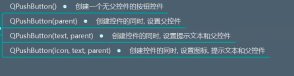
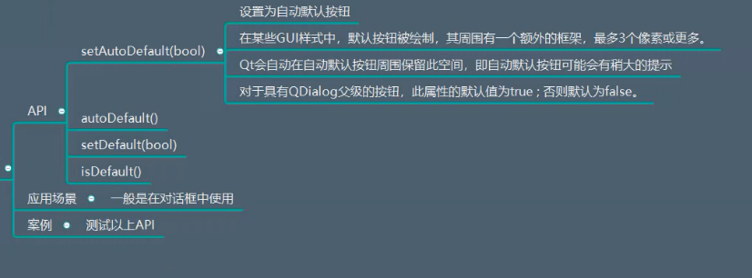
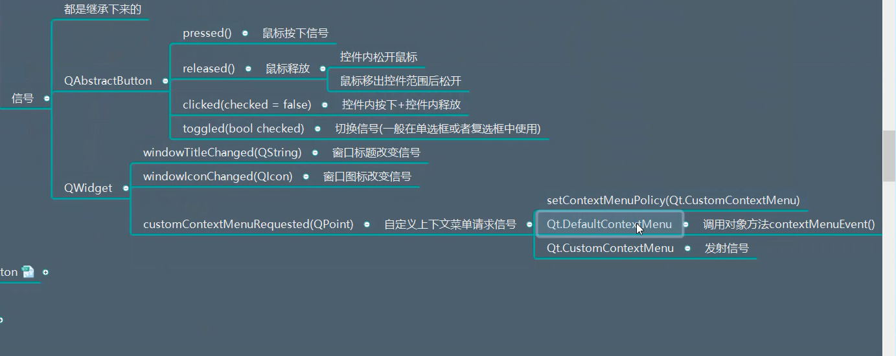

# QPushButton详解

## 一、描述
用来给用户点击，来完成某种动作的控件，一般是矩形，一般作为登录按钮，注册按钮，关闭按钮


## 二、继承
继承自QAbstractButton

## 三、功能作用
（1）创建按钮控件
  

```python
import sys
from PyQt5.Qt import *


if __name__ == '__main__':

    app = QApplication(sys.argv)

    window = QWidget()
    window.setWindowTitle("按钮的功能")
    window.resize(500,500)


    btn = QPushButton(window)
    btn.setText("xxx")
    icon = QIcon("img.png")
    btn.setIcon(icon)
    btn.show()


    window.show()
    sys.exit(app.exec_())
```


（2）菜单
点击按钮，展示下拉菜单
  

```python
import sys
from PyQt5.Qt import *


if __name__ == '__main__':

    app = QApplication(sys.argv)

    window = QWidget()
    window.setWindowTitle("按钮的功能")
    window.resize(500,500)


    btn = QPushButton(window)
    btn.setText("xxx")
    icon = QIcon("img.png")
    btn.setIcon(icon)

    # 1 首先创建一个菜单对象对象
    # 2 然后创建一个动作
    # 3 将动作添加到菜单中
    # 4 将菜单添加到按钮中
    menu = QMenu()


    # 子菜单   最近打开
    open_recent_menu = QMenu(menu) # 设置好父对象
    open_recent_menu.setTitle("最近打开")


    # 行为动作 新建  打开  分割线 退出

    # 创建一个新建动作
    # 构造函数可以传入   文本  图标  父对象等参数  他的父对象就是menu
    new_action = QAction()
    new_action.setText("新建")
    new_action.setIcon(QIcon("img.png"))
    # 光有动作还不行，还需要添加槽函数
    new_action.triggered.connect(lambda: print("新建一个文件"))


    # 创建一个打开动作
    open_action = QAction(QIcon("img.png"),"打开",menu)
    open_action.triggered.connect(lambda:print("打开文件"))


    # 创建一个退出动作
    exit_action = QAction(QIcon("img.png"),"退出",menu)
    exit_action.triggered.connect(lambda:print("退出"))

    file_action = QAction("PyQt5")


    # 将动作添加到菜单中  也就是将menu设置成他的父对象
    # 添加分割线
    menu.addAction(new_action)

    # 打开后面  添加子菜单
    menu.addAction(open_action)

    menu.addMenu(open_recent_menu)  # 添加子菜单
    open_recent_menu.addAction(file_action)   # 将最近打开行为 添加到最近打开菜单

    menu.addSeparator()  # 分割线
    menu.addAction(exit_action)

    # 按钮设置菜单
    btn.setMenu(menu)

    window.show()
    btn.showMenu()
    sys.exit(app.exec_())
```
  


（3）边框是否扁平
  


```python
import sys
from PyQt5.Qt import *


if __name__ == '__main__':

    app = QApplication(sys.argv)

    window = QWidget()
    window.setWindowTitle("按钮的功能")
    window.resize(500,500)


    btn = QPushButton(window)
    btn.setText("xxx")
    icon = QIcon("img.png")
    btn.setIcon(icon)

    # btn.setStyleSheet("background-color:red;")

    # 判断按钮是否扁平化  去除外边的框框
    # 设置扁平化   背景颜色不在设置
    print(btn.isFlat())

    btn.setFlat(True)
    print(btn.isFlat())

    # 1 首先创建一个菜单对象对象
    # 2 然后创建一个动作
    # 3 将动作添加到菜单中
    # 4 将菜单添加到按钮中
    menu = QMenu()


    # 子菜单   最近打开
    open_recent_menu = QMenu(menu) # 设置好父对象
    open_recent_menu.setTitle("最近打开")


    # 行为动作 新建  打开  分割线 退出

    # 创建一个新建动作
    # 构造函数可以传入   文本  图标  父对象等参数  他的父对象就是menu
    new_action = QAction()
    new_action.setText("新建")
    new_action.setIcon(QIcon("img.png"))
    # 光有动作还不行，还需要添加槽函数
    new_action.triggered.connect(lambda: print("新建一个文件"))


    # 创建一个打开动作
    open_action = QAction(QIcon("img.png"),"打开",menu)
    open_action.triggered.connect(lambda:print("打开文件"))


    # 创建一个退出动作
    exit_action = QAction(QIcon("img.png"),"退出",menu)
    exit_action.triggered.connect(lambda:print("退出"))

    file_action = QAction("PyQt5")


    # 将动作添加到菜单中  也就是将menu设置成他的父对象
    # 添加分割线
    menu.addAction(new_action)

    # 打开后面  添加子菜单
    menu.addAction(open_action)

    menu.addMenu(open_recent_menu)  # 添加子菜单
    open_recent_menu.addAction(file_action)   # 将最近打开行为 添加到最近打开菜单

    menu.addSeparator()  # 分割线
    menu.addAction(exit_action)

    # 按钮设置菜单
    btn.setMenu(menu)

    window.show()
    # btn.showMenu()
    sys.exit(app.exec_())
```

（4）默认处理
  

```python
import sys
from PyQt5.Qt import *


if __name__ == '__main__':

    app = QApplication(sys.argv)

    window = QWidget()
    window.setWindowTitle("按钮的功能")
    window.resize(500,500)


    btn = QPushButton(window)
    btn.setText("xxx")
    icon = QIcon("img.png")
    btn.setIcon(icon)

    # btn.setStyleSheet("background-color:red;")

    # 判断按钮是否扁平化  去除外边的框框
    # 设置扁平化   背景颜色不在设置
    print(btn.isFlat())

    btn.setFlat(True)
    print(btn.isFlat())

    # 1 首先创建一个菜单对象对象
    # 2 然后创建一个动作
    # 3 将动作添加到菜单中
    # 4 将菜单添加到按钮中
    menu = QMenu()


    # 子菜单   最近打开
    open_recent_menu = QMenu(menu) # 设置好父对象
    open_recent_menu.setTitle("最近打开")


    # 行为动作 新建  打开  分割线 退出

    # 创建一个新建动作
    # 构造函数可以传入   文本  图标  父对象等参数  他的父对象就是menu
    new_action = QAction()
    new_action.setText("新建")
    new_action.setIcon(QIcon("img.png"))
    # 光有动作还不行，还需要添加槽函数
    new_action.triggered.connect(lambda: print("新建一个文件"))


    # 创建一个打开动作
    open_action = QAction(QIcon("img.png"),"打开",menu)
    open_action.triggered.connect(lambda:print("打开文件"))


    # 创建一个退出动作
    exit_action = QAction(QIcon("img.png"),"退出",menu)
    exit_action.triggered.connect(lambda:print("退出"))

    file_action = QAction("PyQt5")


    # 将动作添加到菜单中  也就是将menu设置成他的父对象
    # 添加分割线
    menu.addAction(new_action)

    # 打开后面  添加子菜单
    menu.addAction(open_action)

    menu.addMenu(open_recent_menu)  # 添加子菜单
    open_recent_menu.addAction(file_action)   # 将最近打开行为 添加到最近打开菜单

    menu.addSeparator()  # 分割线
    menu.addAction(exit_action)

    # 按钮设置菜单
    btn.setMenu(menu)

    btn2 = QPushButton(window)
    btn2.setText("btn2")
    btn2.move(200,200)

    # 将btn2 设置为自动默认按钮
    btn2.setAutoDefault(True)

    print(btn.autoDefault()) # 判断是否是默认按钮
    print(btn2.autoDefault())


    window.show()
    # btn.showMenu()
    sys.exit(app.exec_())
```


## 四、信号 

  


```python
import sys
from PyQt5.Qt import *


class Window(QWidget):
    def contexMenuEvent(self,contexMenuEvent):
        menu = QMenu(self)  # 设置父对象

        # 子菜单   最近打开
        open_recent_menu = QMenu(menu)  # 设置好父对象
        open_recent_menu.setTitle("最近打开")

        # 行为动作 新建  打开  分割线 退出

        # 创建一个新建动作
        # 构造函数可以传入   文本  图标  父对象等参数  他的父对象就是menu
        new_action = QAction()
        new_action.setText("新建")
        new_action.setIcon(QIcon("img.png"))
        # 光有动作还不行，还需要添加槽函数
        new_action.triggered.connect(lambda: print("新建一个文件"))

        # 创建一个打开动作
        open_action = QAction(QIcon("img.png"), "打开", menu)
        open_action.triggered.connect(lambda: print("打开文件"))

        # 创建一个退出动作
        exit_action = QAction(QIcon("img.png"), "退出", menu)
        exit_action.triggered.connect(lambda: print("退出"))

        file_action = QAction("PyQt5")

        # 将动作添加到菜单中  也就是将menu设置成他的父对象
        # 添加分割线
        menu.addAction(new_action)

        # 打开后面  添加子菜单
        menu.addAction(open_action)


        menu.addMenu(open_recent_menu)  # 添加子菜单
        open_recent_menu.addAction(file_action)  # 将最近打开行为 添加到最近打开菜单

        menu.addSeparator()  # 分割线
        menu.addAction(exit_action)

        # 菜单展示
        menu.exec_(contexMenuEvent.globalPos())


if __name__ == '__main__':

    app = QApplication(sys.argv)

    window = Window()
    window.setWindowTitle("按钮的功能")
    window.resize(500,500)
    # window.setContextMenuPolicy(Qt.DefaultContextMenu)

    btn = QPushButton(window)
    btn.setText("xxx")
    icon = QIcon("img.png")
    btn.setIcon(icon)

    # btn.setStyleSheet("background-color:red;")

    # 判断按钮是否扁平化  去除外边的框框
    # 设置扁平化   背景颜色不在设置

    btn.setFlat(True)
    # print(btn.isFlat())

    # 1 首先创建一个菜单对象对象
    # 2 然后创建一个动作
    # 3 将动作添加到菜单中
    # 4 将菜单添加到按钮中
    menu = QMenu()


    # 子菜单   最近打开
    open_recent_menu = QMenu(menu) # 设置好父对象
    open_recent_menu.setTitle("最近打开")


    # 行为动作 新建  打开  分割线 退出

    # 创建一个新建动作
    # 构造函数可以传入   文本  图标  父对象等参数  他的父对象就是menu
    new_action = QAction()
    new_action.setText("新建")
    new_action.setIcon(QIcon("img.png"))
    # 光有动作还不行，还需要添加槽函数
    new_action.triggered.connect(lambda: print("新建一个文件"))


    # 创建一个打开动作
    open_action = QAction(QIcon("img.png"),"打开",menu)
    open_action.triggered.connect(lambda:print("打开文件"))


    # 创建一个退出动作
    exit_action = QAction(QIcon("img.png"),"退出",menu)
    exit_action.triggered.connect(lambda:print("退出"))

    file_action = QAction("PyQt5")


    # 将动作添加到菜单中  也就是将menu设置成他的父对象
    # 添加分割线
    menu.addAction(new_action)

    # 打开后面  添加子菜单
    menu.addAction(open_action)

    menu.addMenu(open_recent_menu)  # 添加子菜单
    open_recent_menu.addAction(file_action)   # 将最近打开行为 添加到最近打开菜单

    menu.addSeparator()  # 分割线
    menu.addAction(exit_action)

    # 按钮设置菜单
    btn.setMenu(menu)

    btn2 = QPushButton(window)
    btn2.setText("btn2")
    btn2.move(200,200)

    # 将btn2 设置为自动默认按钮
    btn2.setAutoDefault(True)

    # print(btn.autoDefault()) # 判断是否是默认按钮
    # print(btn2.autoDefault())


    # 携带参数  point  鼠标右键传输该参数  鼠标的位置
    def show_menu(point):
        menu = QMenu(window)

        # 子菜单 最近打开

        open_recent_menu = QMenu(menu)
        open_recent_menu.setTitle("最近打开")
        # open_recent_menu.setIcon()

        # 行为动作 新建  打开  分割线 退出
        # new_action = QAction()
        # new_action.setText("新建")
        # new_action.setIcon(QIcon("xxx.png"))
        new_action = QAction(QIcon("xxx.png"), "新建", menu)
        new_action.triggered.connect(lambda: print("新建文件"))

        open_action = QAction(QIcon("xxx.png"), "打开", menu)
        open_action.triggered.connect(lambda: print("打开文件"))

        exit_action = QAction("退出", menu)
        exit_action.triggered.connect(lambda: print("退出程序"))

        file_action = QAction("Python-GUI编程-PyQt5")

        menu.addAction(new_action)
        menu.addAction(open_action)
        open_recent_menu.addAction(file_action)
        menu.addMenu(open_recent_menu)
        menu.addSeparator()
        menu.addAction(exit_action)

        # point
        dest_point = window.mapToGlobal(point)
        menu.exec_(dest_point)

    # 如果你设置Qt.efaultContexMenu   没有反应  不会发射信号  触发槽函数
    window.setContextMenuPolicy(Qt.CustomContextMenu)


    # 将请求信号连接槽函数
    window.customContextMenuRequested.connect(show_menu)


    window.show()
    # btn.showMenu()
    sys.exit(app.exec_())
```

  


