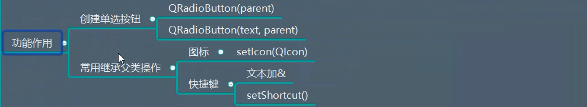
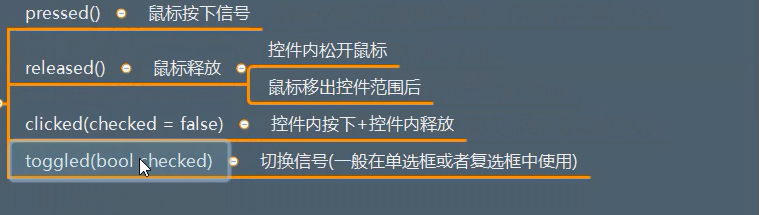

# QRadioButton 详解

## 一、描述
一般用于给用户提供若干选项中的单选操作。
  


## 二、继承
QAbstractButton


## 三、功能作用
  

```python
import sys
from PyQt5.Qt import *

if __name__ == '__main__':
      app = QApplication(sys.argv)

      window = QWidget()
      window.setWindowTitle("单选框测试")
      window.resize(500,500)

      # 两个参数  第一个文本提示
      # 有两个之后  必选其一 不可以取消
      btn1 = QRadioButton("男-&Male",window)
      btn2 = QRadioButton("女-&Female",window)
      btn1.move(100,100)
      btn2.move(100,150)

      btn2.setIcon(QIcon("img.png"))   # 设置图标
      btn2.setIconSize(QSize(60,60))  # 调整图标大小


      # 快捷键设置
      # 如果选项框  都已经设置文本了  上面的 男-&Male  那么  ALT + M 就可以选中这个单选框
      btn1.setShort("Alt+M")   # 不设置& 那就使用setShort()
      window.show()
      sys.exit(app.exec_())

```


## 四、信号

  


测试代码1：
```python
import sys
from PyQt5.Qt import *

if __name__ == '__main__':
      app = QApplication(sys.argv)

      window = QWidget()
      window.setWindowTitle("单选框测试")
      window.resize(500,500)

      # 两个参数  第一个文本提示
      # 有两个之后  必选其一 不可以取消
      btn1 = QRadioButton("男-&Male",window)
      btn2 = QRadioButton("女-&Female",window)
      btn1.move(100,100)
      btn2.move(100,150)

      btn2.setIcon(QIcon("img.png"))   # 设置图标
      btn2.setIconSize(QSize(60,60))  # 调整图标大小


      # 快捷键设置
      # 如果选项框  都已经设置文本了  上面的 男-&Male  那么  ALT + M 就可以选中这个单选框
      btn1.setShort("Alt+M")   # 不设置& 那就使用setShort()

      btn2.toggled.connect(lambda isChecked:print(isChecked))  # 状态发生改变信号  调用槽函数


      btn2.setAutoExclusive(False)  # 取消独占的效果   

      window.show()
      sys.exit(app.exec_())

```


测试代码2：
```python
import sys
from PyQt5.Qt import *

if __name__ == '__main__':
      app = QApplication(sys.argv)

      window = QWidget()
      window.setWindowTitle("单选框测试")
      window.resize(500,500)


      red = QWidget(window)
      red.resize(200,200)
      red.setStyleSheet("background-color:red;")
      red.move(50,50)

      green  = QWidget(window)
      green.resize(200,200)
      green.setStyleSheet("background-color:green;")
      green.move(red.width() + red.x(),red.height() + red.y())

      # 两个参数  第一个文本提示
      # 有两个之后  必选其一 不可以取消
      btn1 = QRadioButton("男-&Male",red)
      btn2 = QRadioButton("女-&Female",red)
      btn1.move(100,100)
      btn2.move(100,150)

      btn2.setIcon(QIcon("img.png"))   # 设置图标
      btn2.setIconSize(QSize(60,60))  # 调整图标大小

      # 快捷键设置
      # 如果选项框  都已经设置文本了  上面的 男-&Male  那么  ALT + M 就可以选中这个单选框
      btn1.setShortcut("Alt+M")   # 不设置& 那就使用setShort()
      btn2.toggled.connect(lambda isChecked:print(isChecked))  # 状态发生改变信号  调用槽函数

      btn2.setAutoExclusive(False)  # 取消独占的效果


      r1 = QRadioButton("yes",green)
      r1.move(300,100)
      r2 = QRadioButton("no",green)
      r2.move(300,150)

      window.show()
      sys.exit(app.exec_())

```


