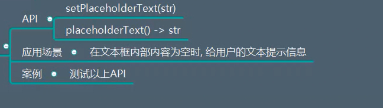
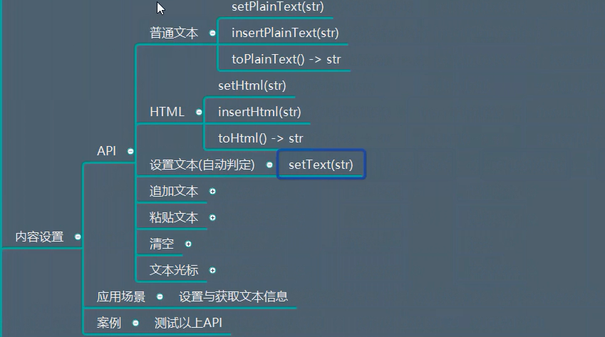
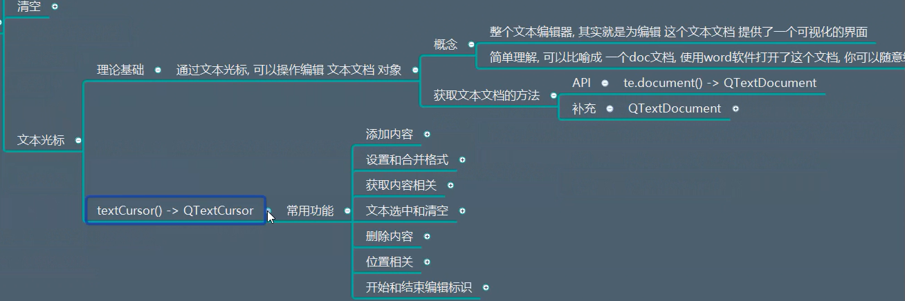
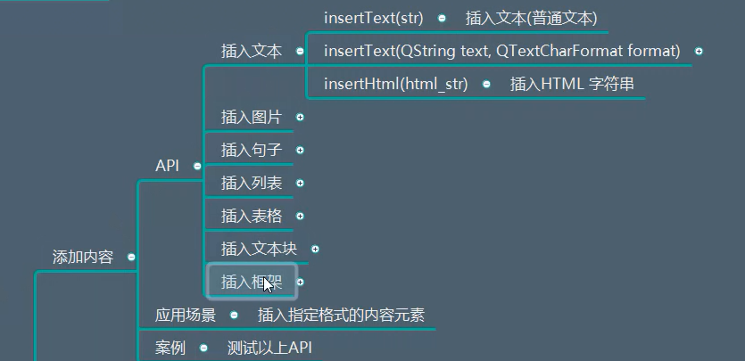
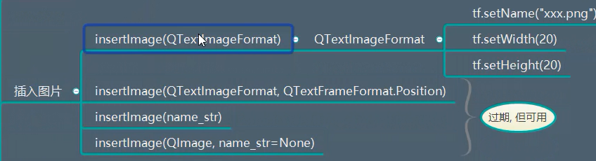
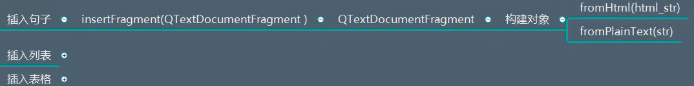
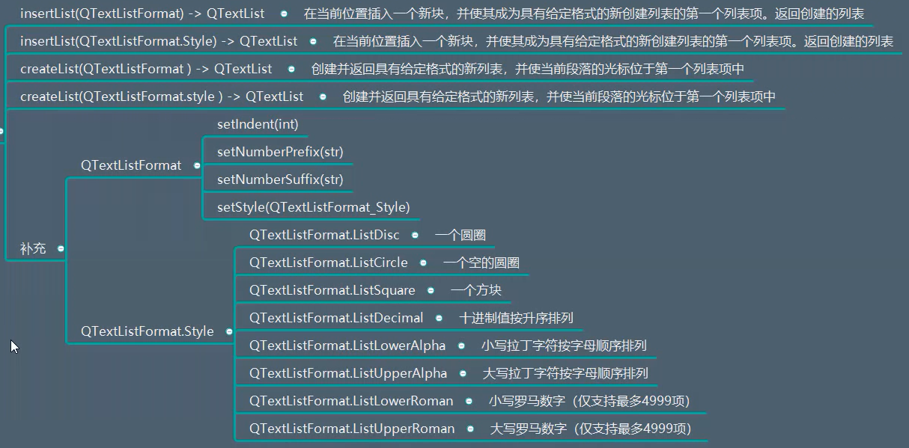
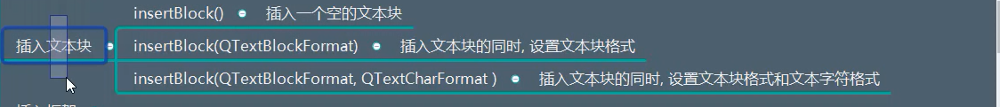
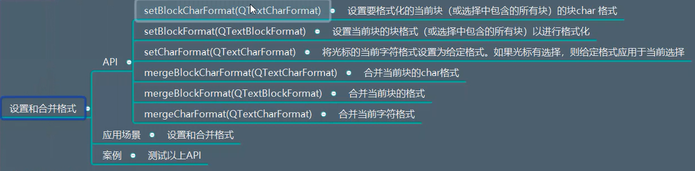
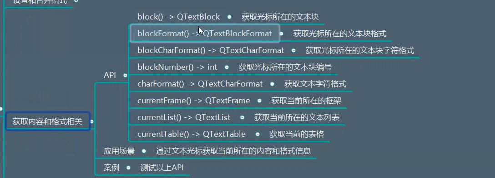

# QTextEdit详解

## 一、描述
是一个高级的WYSIWYG(What You See Is What You Get 所见即所得)查看器/编辑器，支持使用HTML样式标签的富文本格式。

他经过优化，可以处理大型文档并快速响应用户输入

适用于段落和字符，如果文本太大而无法在文本编辑的窗口查看，则会出现滚动条，文本编辑可以加载文本和富文本文件，以显示图像，列表和表格


## 二、继承
QAbstractScrollArea


## 三、功能作用

（1）占位提示文本
  

测试代码：
```python
from PyQt5.Qt import *
import sys

class Window(QWidget):
    def __init__(self):
        super().__init__()

        self.setWindowTitle("QTextEdit的学习")
        self.resize(500,500)
        self.setup_ui()


    def setup_ui(self):
        l1 = QTextEdit("xxx",self)
        self.l1 = l1  # 将l1作为成员变量
        l1.move(50,50)
        l1.resize(300,300)
        l1.setStyleSheet("background-color:cyan;")

        self.QTestEdit1()  # 调用占位函数

    def QTestEdit1(self):
        self.l1.setPlaceholderText("请输入你的个人简介")
        print(self.l1.placeholderText())   # 打印提示文字


if __name__ == '__main__':
    app = QApplication(sys.argv)

    window = Window()
    window.show()
    sys.exit(app.exec_())
```


（2）内容设置
  

```python
from PyQt5.Qt import *
import sys

class Window(QWidget):
    def __init__(self):
        super().__init__()
        self.setWindowTitle("QTextEdit的学习")
        self.resize(500,500)
        self.setup_ui()

    def setup_ui(self):
        l1 = QTextEdit("xxx",self)
        self.l1 = l1  # 将l1作为成员变量
        l1.move(50,50)
        l1.resize(300,300)
        l1.setStyleSheet("background-color:cyan;")
        self.QTestEdit3()  # 调用占位函数


    def QTestEdit1(self):
        self.l1.setPlaceholderText("请输入你的个人简介")
        print(self.l1.placeholderText())   # 打印提示文字


    def QTestEdit2(self):
        # 设置普通文本的内容
        self.l1.setPlainText("<h1>xxx</h1>")
        print(self.l1.toPlainText())  # 打印普通文本


    def QTestEdit3(self):
        # 富文本的操作
        self.l1.setHtml("<h1>ooo</h1>")  # 设置富文本
        self.l1.insertHtml("<h6>社会我顺哥</h6>") # 插入富文本
        print(self.l1.toHtml())  # 打印富文本


if __name__ == '__main__':
    app = QApplication(sys.argv)

    window = Window()
    window.show()
    sys.exit(app.exec_())
```

文本光标：
  


* 添加内容

插入文本：
  

测试代码：
```python
        tcf = QTextCharFormat() # 设置文本格式
        tcf.setToolTip("合肥工业大学")  # 设置提示信息
        tcf.setFontFamily("楷书")   # 设置字体格式
        tcf.setFontPointSize(66)   # 设置字体大小

        tc = self.l1.textCursor()  # 设置光标位置
        tc.insertText("itlike.com",tcf)   # 插入文本   同时传入文本格式
        tc.insertHtml("<a href='http://www.itlike.com'>撩课</a>")  # 插入超链接
```


插入图片：
  

测试代码：
```python
        # 设置文本光标
        tc = self.l1.textCursor()
        tif = QTextImageFormat()
        tif.setName("img.png")  # 设置图片路径
        # 设置图片尺寸
        tif.setWidth(100)
        tif.setHeight(100)
        tc.insertImage(tif)
```


插入句子：
  

测试代码：
```python
        tc = self.l1.textCursor()
        tdf = QTextDocumentFragment.fromHtml("<h1>xxx</h1>")    # 返回一个QTextDocumentFragment对象
        tc.insertFragment(tdf)   # 插入句子
```


插入列表：
  

测试代码：
```python
        tc = self.l1.textCursor()  # 获取光标对象
        t1 = tc.insertList(QTextListFormat.ListCircle)   # 光标位置插入一个列表
        print(t1)
```


插入表格：
  

测试代码：
```python
        tc = self.l1.textCursor()
        ttf = QTextTableFormat()
        ttf.setAlignment(Qt.AlignRight)  # 设置成右对齐
        ttf.setCellPadding(6) # 设置内边距
        ttf.setCellSpacing(3)  # 设置外边距

        # 设置每一列所占的百分比
        ttf.setColumnWidthConstraints((QTextLength(QTextLength.PercentageLength,50),QTextLength(QTextLength.PercentageLength,40),QTextLength(QTextLength.PercentageLength,10)))


        table = tc.insertTable(5,3,ttf)  # 创建一个表格  并设置表格的格式
        table.appendColumns(2)  # 添加两列
```


插入文本块：
  

测试代码：
```python
        tc = self.l1.textCursor()  # 获取光标对象
        tbf = QTextBlockFormat()
  
        tbf.setAlignment(Qt.AlignRight)  # 设置成右对齐
        tbf.setRightMargin(100)   # 设置右边距
        tbf.setIndent(3)   # 设置缩进


        tc.insertBlock(tbf)  # 插入一个文本框  并设置格式
        self.l1.setFocus()  # 对准焦点

```

插入框架：
  


* 设置和合并格式
  

```python
    def QTextEdit5(self):
        tc = self.l1.textCursor()
        tcf = QTextCharFormat()
        tcf.setFontPointSize(30)
        tcf.setFontOverline(True)
        tcf.setFontUnderline(True)
        tc.setBlockCharFormat(tcf)
```


* 获取内容和格式相关
  

```python
    def QTextEdit6(self):
        tc = self.l1.textCursor()
        print(tc.block().text())  # 获取文本内容
        print(tc.blockNumber())  # 获取段落号
        print(tc.currentList())  # 获取文本列表
        pass
```


（3）自动格式化

（4）软换行模式


（5）覆盖模式


（6）光标设置


（7）对齐方式

（8）字体格式

（9）颜色设置

（10）当前的字符格式

（11）常用编辑操作

（12）滚动

（13）只读设置

（14）tab控制

（15）锚点获取


## 四、信号


