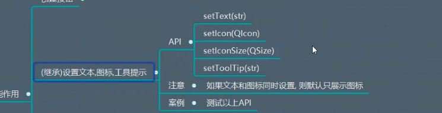
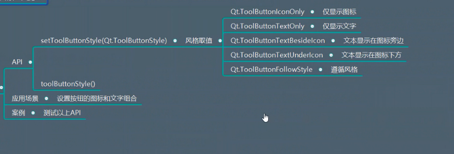
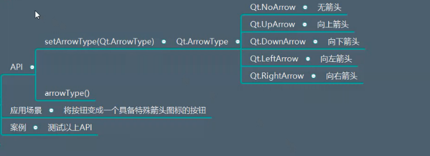
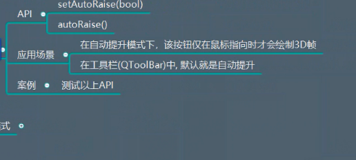
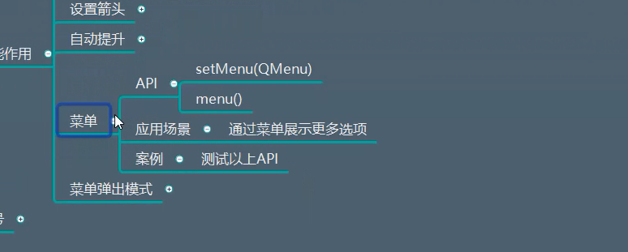
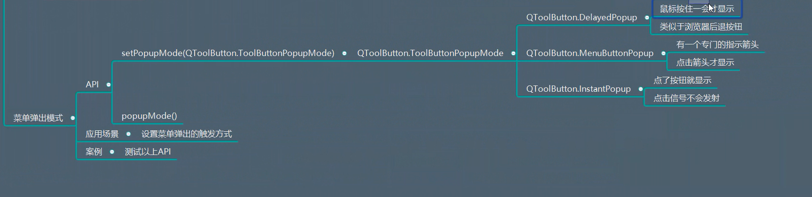
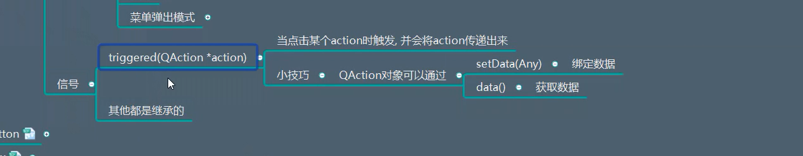

# QToolButton学习记录

## 一、描述
* 提供了一个快速访问按钮
* 通常是在工具栏内部使用
* 工具按钮通常不显示文本标签，而是显示图标
例如：  


## 二、继承
QAbstractButton


## 三、功能作用

* 继承QAbstractButton  可以设置文本，图标，工具提示
  

```python
import sys
from PyQt5.Qt import *


if __name__ == '__main__':

    app =QApplication(sys.argv)

    window =  QWidget()
    window.setWindowTitle("QToolButton使用")
    window.resize(500,500)

    # 继承自 QAbstractButton
    tb = QToolButton(window)
    tb.setText("工具")
    tb.setIcon(QIcon("img.png"))   # 设置图标    QAbstractButton 所有的方法都可以使用

    # 设置图标大小
    tb.setIconSize(QSize(60,60))


    # 只给一个图标是不够的  还需要设置工具提示按钮
    tb.setToolTip("这是一个新建的按钮")


    window.show()
    sys.exit(app.exec_())
```


* 按钮样式风格
   

```python
import sys
from PyQt5.Qt import *


if __name__ == '__main__':

    app =QApplication(sys.argv)

    window =  QWidget()
    window.setWindowTitle("QToolButton使用")
    window.resize(500,500)

    # 继承自 QAbstractButton
    tb = QToolButton(window)
    tb.setText("工具")
    tb.setIcon(QIcon("img.png"))   # 设置图标    QAbstractButton 所有的方法都可以使用

    # 设置图标大小
    tb.setIconSize(QSize(60,60))


    # 只给一个图标是不够的  还需要设置工具提示按钮
    tb.setToolTip("这是一个新建的按钮")

    # 设置图标样式  文本在图标旁边
    tb.setToolButtonStyle(Qt.ToolButtonTextBesideIcon)


    window.show()
    sys.exit(app.exec_())
```


* 设置箭头
  

```python
import sys
from PyQt5.Qt import *


if __name__ == '__main__':

    app =QApplication(sys.argv)

    window =  QWidget()
    window.setWindowTitle("QToolButton使用")
    window.resize(500,500)

    # 继承自 QAbstractButton
    tb = QToolButton(window)
    tb.setText("工具")
    tb.setIcon(QIcon("img.png"))   # 设置图标    QAbstractButton 所有的方法都可以使用
    #
    # # 设置图标大小
    # tb.setIconSize(QSize(60,60))


    # 只给一个图标是不够的  还需要设置工具提示按钮
    tb.setToolTip("这是一个新建的按钮")

    # 设置图标样式  文本在图标旁边
    tb.setToolButtonStyle(Qt.ToolButtonTextBesideIcon)


    tb.setArrowType(Qt.UpArrow)

    print(tb.arrowType())


    window.show()
    sys.exit(app.exec_())
```

* 自动提升
  

应用场景：正常绘制的按钮会有突起的感觉，但是商用的软件都没有突起的感觉，我们需要扁平化效果

测试代码：
```python
import sys
from PyQt5.Qt import *


if __name__ == '__main__':

    app =QApplication(sys.argv)

    window =  QWidget()
    window.setWindowTitle("QToolButton使用")
    window.resize(500,500)

    # 继承自 QAbstractButton
    tb = QToolButton(window)
    tb.setText("工具")
    tb.setIcon(QIcon("img.png"))   # 设置图标    QAbstractButton 所有的方法都可以使用
    #
    # # 设置图标大小
    # tb.setIconSize(QSize(60,60))


    # 只给一个图标是不够的  还需要设置工具提示按钮
    tb.setToolTip("这是一个新建的按钮")

    # 设置图标样式  文本在图标旁边
    tb.setToolButtonStyle(Qt.ToolButtonTextBesideIcon)
    tb.setArrowType(Qt.UpArrow)


    # setflat 是QPushButton 的函数


    # 这个自动提升所达到的效果：消除边框，并且点击这个按钮时 会有自动突起的效果
    tb.setAutoRaise(True)

    window.show()
    sys.exit(app.exec_())
```


* 菜单
  
  


如果仅仅按照QPushButton来设置菜单的话，直接点击的话，不可以直接显示按钮
  


```python
import sys
from PyQt5.Qt import *


if __name__ == '__main__':

    app =QApplication(sys.argv)

    window =  QWidget()
    window.setWindowTitle("QToolButton使用")
    window.resize(500,500)

    # 继承自 QAbstractButton
    tb = QToolButton(window)
    tb.setText("工具")
    tb.setIcon(QIcon("img.png"))   # 设置图标    QAbstractButton 所有的方法都可以使用
    #
    # # 设置图标大小
    # tb.setIconSize(QSize(60,60))


    # 只给一个图标是不够的  还需要设置工具提示按钮
    tb.setToolTip("这是一个新建的按钮")

    # 设置图标样式  文本在图标旁边
    tb.setToolButtonStyle(Qt.ToolButtonTextBesideIcon)
    tb.setArrowType(Qt.UpArrow)


    # setflat 是QPushButton 的函数


    # 这个自动提升所达到的效果：消除边框，并且点击这个按钮时 会有自动突起的效果
    tb.setAutoRaise(True)

    menu = QMenu(tb)

    sub_menu = QMenu(menu)  # 设置父对象  仅仅设置父对象还是不够的  还需要将子菜单添加到父菜单中
    sub_menu.setTitle("子菜单")
    sub_menu.setIcon(QIcon("img.png"))

    # 设置行为  传入三个参数：图标 描述文本   父对象
    action = QAction(QIcon("img.png"), "行为", menu)
    action.triggered.connect(lambda: print("点击了行为菜单选项"))  # 点击该菜单选项  触发槽函数

    menu.addMenu(sub_menu)  # 添加子菜单

    menu.addSeparator()  # 设置下划线
    menu.addAction(action)  # 将该菜单选项添加到菜单栏中，


    # 如果不设置菜单弹出方式  只有长按才可以弹出菜单
    tb.setMenu(menu)

    # 设置菜单弹出方式：点击箭头显示菜单
    tb.setPopupMode(QToolButton.MenuButtonPopup)

    # btn = QPushButton(window)
    # btn.setText("一般按钮")
    # btn.move(100,100)
    # btn.setFlat(True)
    #
    # # 将按钮作为菜单的父对象  点击按钮 出现菜单
    # btn.setMenu(menu)  # 添加菜单

    window.show()
    sys.exit(app.exec_())
```


## 四、信号

  

只有点击某个action时触发，并且将action传递出来。

```python
import sys
from PyQt5.Qt import *


if __name__ == '__main__':

    app =QApplication(sys.argv)

    window =  QWidget()
    window.setWindowTitle("QToolButton使用")
    window.resize(500,500)

    # 继承自 QAbstractButton
    tb = QToolButton(window)
    tb.setText("工具")
    tb.setIcon(QIcon("img.png"))   # 设置图标    QAbstractButton 所有的方法都可以使用
    #
    # # 设置图标大小
    # tb.setIconSize(QSize(60,60))


    # 只给一个图标是不够的  还需要设置工具提示按钮
    tb.setToolTip("这是一个新建的按钮")

    # 设置图标样式  文本在图标旁边
    tb.setToolButtonStyle(Qt.ToolButtonTextBesideIcon)
    tb.setArrowType(Qt.UpArrow)


    # setflat 是QPushButton 的函数


    # 这个自动提升所达到的效果：消除边框，并且点击这个按钮时 会有自动突起的效果
    tb.setAutoRaise(True)

    menu = QMenu(tb)

    sub_menu = QMenu(menu)  # 设置父对象  仅仅设置父对象还是不够的  还需要将子菜单添加到父菜单中
    sub_menu.setTitle("子菜单")
    sub_menu.setIcon(QIcon("img.png"))

    # 设置行为  传入三个参数：图标 描述文本  父对象
    action = QAction(QIcon("img.png"), "行为", menu)
    action.setData([1,2,3])  # action 还可以绑定数据

    action1 = QAction("行为", menu)
    action1.setData({"name":"sz"})

    # 这个信号时action本身触发的
    action.triggered.connect(lambda: print("点击了行为菜单选项"))  # 点击该菜单选项  触发槽函数

    menu.addMenu(sub_menu)  # 添加子菜单

    menu.addSeparator()  # 设置下划线
    menu.addAction(action)  # 将该菜单选项action添加到菜单栏中，
    menu.addAction(action1)  # 将菜单选项action1 添加到菜单栏中


    # 如果不设置菜单弹出方式  只有长按才可以弹出菜单
    tb.setMenu(menu)

    # 设置菜单弹出方式：点击箭头显示菜单
    tb.setPopupMode(QToolButton.MenuButtonPopup)


    # 传入action参数的技巧： 当这个菜单添加了许多action之后
    # 点击不同的行为  触发不同的槽函数
    # 如何区分不同的行为：为不同的行为添加数据setData
    def do_action(action):
        print("点击了行为",action.data())

    # 这里的triggered 触发信号  并不是点击按钮 他就会触发信号
    # 只有点击了菜单栏中的相应action 才会触发·
    tb.triggered.connect(do_action)


    # btn = QPushButton(window)
    # btn.setText("一般按钮")
    # btn.move(100,100)
    # btn.setFlat(True)
    #
    # # 将按钮作为菜单的父对象  点击按钮 出现菜单
    # btn.setMenu(menu)  # 添加菜单


    window.show()
    sys.exit(app.exec_())
```


