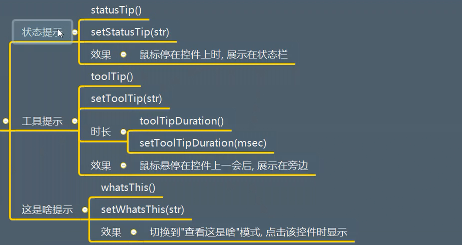

# QWidget详解


## 一、描述
1. 所有可视化控件的基类
2. 是一个最简单的空白控件
3. 控件是用户界面最小的元素
   接受各种事件，鼠标，键盘
   绘制在桌面上，展示给用户看

4. 每一个控件都是矩形的，它们按照Z轴顺序排序
5. 控件由其父控件和前面的控件剪切
6. 没有父控件的控件，称之为窗口


## 二、继承
很显然继承自QObject,拥有他的所有功能

使用如下代码进行查看
```python
print(QWidget.__bases__)

```

## 三、功能作用
### 3.1 控件的创建
  

```python
import sys
from PyQt5.Qt import *


if __name__ == '__main__':
    app = QApplication(sys.argv)
    window = QWidget()

    # print(QWidget.__bases__)   #打印他的父类  也可以安装ctrl键 鼠标点击即可查看
    # print(QWidget.mro())   # 向上查看所有的类 链条式


    window.resize(500,500)

    red = QWidget(window)  # 再次创建一个空白控件，同时将它作为一个子控件
    red.resize(100,100)

    red.setStyleSheet("background-color:red")  #将控件设置成红色
    red.move(450,0)

    window.show()

    sys.exit(app.exec_())


```


### 3.2 大小位置
（1）理论支撑:控件的坐标系统
 

（2）API

关于获取元素的API:
  

注意一下：这里的xy指的是顶层控件相当于桌面的相对位置，而weight与height是除去窗口框架的内容尺寸。


关于设置相关API:
  

注意：resize改的是用户区域的尺寸，setGeometry()函数必须等待显示成功之后再发挥作用。

测试代码1
```python
import sys
from PyQt5.Qt import *


if __name__ == '__main__':
    app = QApplication(sys.argv)
    window = QWidget()

    # print(QWidget.__bases__)   #打印他的父类  也可以安装ctrl键 鼠标点击即可查看
    # print(QWidget.mro())   # 向上查看所有的类 链条式

    window.show()

    # 设置的是用户区域（去除框架部分）  前两个坐标是用户区域的坐标，后两个坐标是用户区域的尺寸
    # 但是，必须这行代码必须设置在show()函数后面，等显示成功时再去包装它
    window.setGeometry(0,0,150,150)

    # 应用程序执行，进入到消息循环
    sys.exit(app.exec_())


```


测试代码2
```python
import sys
from PyQt5.Qt import *


if __name__ == '__main__':
    app = QApplication(sys.argv)
    window = QWidget()

    # print(QWidget.__bases__)   #打印他的父类  也可以安装ctrl键 鼠标点击即可查看
    # print(QWidget.mro())   # 向上查看所有的类 链条式

    window.move(200,100)
    window.resize(500,500)

    label = QLabel(window)
    label.setText("社会顺")
    label.move(100,100)
    label.setStyleSheet("background-color:cyan;")


    def Cao1():
        new_content = label.text() + "社会顺"
        label.setText(new_content)
        label.adjustSize()  # 自适应调整大小

    btn = QPushButton(window)
    btn.setText("增加内容")
    btn.move(100,300)

    btn.clicked.connect(Cao1)

    window.show()

    # 设置的是用户区域（去除框架部分）  前两个坐标是用户区域的坐标，后两个坐标是用户区域的尺寸
    # 但是，必须这行代码必须设置在show()函数后面，等显示成功时再去包装它
    # window.setGeometry(0,0,150,150)

    # 应用程序执行，进入到消息循环
    sys.exit(app.exec_())


```


（3）应用场景
（4）案例
  

```python
import sys
from PyQt5.Qt import *


if __name__ == '__main__':

    app = QApplication(sys.argv)

    window = QWidget()

    # 可以先展示，再设置控件大小
    window.show()

    # 设置的是用户区域的大小
    window.resize(500, 500)
    # 将整个框架移动  以左上角的点为基准
    window.move(300, 300)

    widget_count = 100   # 设置总的子控件个数
    # 一行设置多少列
    column_count = 5
    # 计算一个控件的宽度
    widget_width = window.width() / column_count
    # 计算总共有多少行
    row_count = (widget_count - 1) // column_count + 1
    # 计算单个控件的高度
    widget_height = window.height() / row_count

    for i in range(0,widget_count):
        # 整个框架显示之后 再添加子控件
        w = QWidget(window)
        w.resize(widget_width, 100)

        # 每个控件的x坐标是 列号 * 每一个控件的宽度 (列号：编号对列数取余)

        # 行号：编号对一行列数进行取余
        # 列号：编号对一行列数进行整除

        widget_x = i % column_count * widget_width
        widget_y = i // column_count * widget_height
        w.move(widget_x,widget_y)


        w.setStyleSheet("background-color:red; border:1px solid yellow;")
        w.show()


    sys.exit(app.exec_())


```


测试效果：
  

### 3.3 最大和最小尺寸

#### 3.3.1 API
  


#### 3.3.2 应用场景


#### 3.3.3 案例
  

测试代码：
```python
import sys
from PyQt5.Qt import *


if __name__ == '__main__':
    app = QApplication(sys.argv)

    window  = QWidget()

    window.setWindowTitle("最大最小尺寸")

    window.setMaximumSize(500,500)
    window.setMinimumSize(100,100)

    window.show()

    sys.exit(app.exec_())


```

### 3.4 内容外边距
#### 3.4.1 API
  

#### 3.4.2 应用场景
调整控件内容边距，使得显示更加好看


#### 3.4.3 案例
  

```python
import sys
from PyQt5.Qt import *


if __name__ == '__main__':
    app = QApplication(sys.argv)

    window  = QWidget()
    window.setWindowTitle("内容边距的设定")
    window.resize(500,500)


    label = QLabel(window)
    label.setText("社会我顺哥，人狠话不多")
    label.resize(300,300)
    label.setStyleSheet("background-color:cyan;")

    # 左 上 右 下
    label.setContentsMargins(100, 200, 0, 0)
    print(label.getContentsMargins())


    print(label.contentsRect())


    window.show()

    sys.exit(app.exec_())


```


### 3.5 鼠标相关
#### 3.5.1 API
（1）设置鼠标形状
  

```python
import sys
from PyQt5.Qt import *


if __name__ == '__main__':
    app = QApplication(sys.argv)

    window  = QWidget()
    window.setWindowTitle("内容边距的设定")
    window.resize(500,500)


    # window.setCursor(Qt.ForbiddenCursor)
    label = QLabel(window)
    label.setText("Hello Neo")
    label.resize(100,100)
    label.setStyleSheet("background-color:cyan;")

    
    label.setCursor(Qt.ForbiddenCursor)


    window.show()

    sys.exit(app.exec_())


```

（2）重置形状
unsetCursor()


（3）获取鼠标
cursor()->QCursor

（4）鼠标跟踪
  


（5）QCursor对象
* pixmap()
* pos()
* setPos(x,y)


#### 3.5.2 应用场景
后续补充

#### 3.5.3 案例
后续补充

### 3.6 事件

#### 3.6.1 API

（1）显示和关闭事件
  


（2）移动事件
```python
moveEvent(QMoveEvent)
```

（3）调整大小
```python
resizeEvent(QResizeEvent)
```
（4）鼠标事件
  

测试代码如下：
```python
import sys
from PyQt5.Qt import *

# 用户产生的某一事件最终会传递给特定对象的特定方法，重写该方法


class Window(QWidget):
    def __init__(self):
        # 初始化父类
        super().__init__()
        self.setWindowTitle("事件消息的学习")
        self.resize(500,500)
        self.setup_ui()

    def setup_ui(self):
        pass

    # QShowEvent() 是一个事件对象
    def showEvent(self,QShowEvent):
        print("窗口被展示出来了")

    def closeEvent(self,QCloseEvent):
        print("窗口被关闭了")

    def moveEvent(self,QCloseEvent):
        print("鼠标移动了")


    def resizeEvent(self,QResizeEvent):
        print("窗口尺寸改变")

    def enterEvent(self,QEnterEvent):
        print("鼠标进来了")
        self.setStyleSheet("background-color:red;")

    def leaveEvent(self,QLeaveEvent):
        print("鼠标离开了")
        self.setStyleSheet("background-color:green;")

    def mousePressEvent(self,QMouseEvent):
        print("鼠标被按下")

    def mouseReleaseEvent(self,QMouseEvent):
        print("鼠标被释放")

    def mouseDoubleClickedEvent(self,QMouseEvent):
        print("鼠标双击")

    def mouseMoveEvent(self,QMouseEvent):
        print("鼠标移动了")


if __name__ == '__main__':

    app = QApplication(sys.argv)

    window = Window()

    window.show()


    sys.exit(app.exec_())


```

（5）键盘事件
  


（6）焦点事件
  


（7）拖拽事件
  


（8）绘制事件
显示控件，更新控件时调用
```python
paintEvent(QPaintEvent)
```

（9）改变事件
窗体改变，字体改变时调用
```python
changeEvent(QEvent)
```

（10）右键菜单
访问右键菜单时调用
```python
contextMenuEvent(QContextMenuEvent)
```

（11）输入法
输入法调用
```python
inputMethodEvent(QInputMethodEvent)
```

  


#### 3.6.2 应用场景
当一个控件被触发了一个特定的行为时，就会调用特定的方法，将事件传递给开发人员，方便处理，重写这些事件方法，就可以监听相关的信息。


#### 3.6.3 案例
（1）创建一个窗口包含一个标签
```python
import sys
from PyQt5.Qt import *


# 重写QLabel的事件机制函数
class MyLabel(QLabel):
    def enterEvent(self,QMouseEvent):
        print("鼠标进来了")
        self.setText("欢迎光临")

    def leaveEvent(self,QMouseEvent):
        print("鼠标离开了")
        self.setText("谢谢惠顾")


if __name__ == '__main__':
    app = QApplication(sys.argv)

    window = QWidget()
    window.setWindowTitle("鼠标操作的案例1")
    window.resize(500,500)

    label = MyLabel(window)
    label.resize(200,200)
    label.move(100,100)
    label.setStyleSheet("background-color: cyan;")

    window.show()
    sys.exit(app.exec_())


```

（2）创建一个窗口，监听用户按键
要求：监听用户输入Tab键，监听用户输入Ctrl + S组合键，监听用户输入Ctrl + Shift + A 

  

```python
import sys
from PyQt5.Qt import *


# 重写QLabel的事件机制函数
class MyLabel(QLabel):
    def enterEvent(self,QMouseEvent):
        print("鼠标进来了")
        self.setText("欢迎光临")

    def leaveEvent(self,QMouseEvent):
        print("鼠标离开了")
        self.setText("谢谢惠顾")

    def keyPressEvent(self, evt):
        print("xx")

        # 判断这个键是不是普通键 Tab 键 A BC等输入键 都是普通键 但是像ctrl就是修饰键
        # if evt.key() == Qt.Key_Tab:
        #     print("用户点击了Tab键位")
        # 修饰键Ctrl 并且 普通键 s
        if evt.modifiers() == Qt.ControlModifier | Qt.ShiftModifier and evt.key() == Qt.Key_S:
            print("ctrl + shfit + s 被点击了")


if __name__ == '__main__':
    app = QApplication(sys.argv)

    window = QWidget()
    window.setWindowTitle("鼠标操作的案例1")
    window.resize(500,500)

    label = MyLabel(window)
    label.resize(200,200)
    label.move(100,100)
    label.setStyleSheet("background-color: cyan;")


    # 对于按键事件  必须分清楚是哪一个控件 接收到这个按键
    label.grabKeyboard()  # 捕获键盘

    window.show()
    sys.exit(app.exec_())


```


（3）完成窗口，用户区支持拖拽
鼠标点击了用户区拖拽也可以移动窗口。

```python
import sys
from PyQt5.Qt import *


class Window(QWidget):
    def __init__(self):
        super().__init__()
        self.flag = False
        self.setWindowTitle("窗口移动的学习")
        self.resize(500, 500)
        self.setup_ui()

    def setup_ui(self):
        pass

    def mousePressEvent(self, evt):
        self.flag = True


        # 确定两个点（鼠标第一次按下的点，窗口当前所在的原始点）
        # 这个坐标是相对于桌面的坐标
        self.mouse_x = evt.globalX()
        self.mouse_y = evt.globalY()
        print(self.mouse_x, self.mouse_y)

        # 记录窗口左上角原始点 设置成他的成员变量
        self.origin_x = self.x()
        self.origin_y = self.y()

    def mouseMoveEvent(self, evt):
        if self.flag == True:
            print("鼠标移动")
            # 每一次鼠标移动都获取最新的坐标位置
            print(evt.globalX(), evt.globalY())

            # 计算移动向量
            change_x = evt.globalX - self.mouse_x
            change_y = evt.globalY - self.mouse_y

            print(change_x, change_y)

            dest_x = self.origin_x + change_x
            dest_y = self.origin_y + change_y


        self.move(dest_x,dest_y)

    def mouseReleaseEvent(self, evt):
        print("鼠标释放")


if __name__ == '__main__':
    app = QApplication(sys.argv)

    window = Window()

    window.show()
    sys.exit(app.exec_())

```


### 3.7 父子关系
#### 3.7.1 API
  


API测试代码：
```python
import sys
from PyQt5.Qt import *

if __name__ == '__main__':

    app = QApplication(sys.argv)

    window  = QWidget()

    label1 = QLabel(window)
    label1.setText("标签1")

    label2 = QLabel(window)
    label2.setText("标签2")
    label2.move(50,50)


    label3 = QLabel(window)
    label3.setText("标签3")
    label3.move(100,100)

    print(window.childAt(55,55))  # 查看指定坐标是否有控件  QLabel

    print(label2.parentWidget())  # 查看他的父控件  QWidget

    print(window.childrenRect())

    window.show()
    sys.exit(app.exec_())

```

#### 3.7.2 应用场景

#### 3.7.3 案例
  

测试代码1：
```python
import sys
from PyQt5.Qt import *


# 需求：点击标签，标签变红


class Label(QLabel):
    def mousePressEvent(self,QMouseEvent):
        self.setStyleSheet("background-color: red;")


if __name__ == '__main__':
    app = QApplication(sys.argv)

    window  = QWidget()

    window.setWindowTitle("父子关系案例")
    window.resize(500,500)

    for i in range(1,11):
        label = Label(window)
        label.setText("标签"+ str(i))
        label.move(40 * i,40 * i)


    window.show()
    sys.exit(app.exec_())


```

测试代码2：

```python
import sys
from PyQt5.Qt import *


# 需求：点击标签，标签变红

class Window(QWidget):


    # 需要实现 点击标签就可以使标签变红，那么我们需要标签的相对坐标
    def mousePressEvent(self,evt):
        # print("鼠标被点击了")
        # QMouseEvent  查看这个类 可以看到相对坐标pos x y
        local_x = evt.x()
        local_y = evt.y()
        sub_widget = self.childAt(local_x,local_y)

        if sub_widget is not None:
            sub_widget.setStyleSheet("background-color:red;")
        print(sub_widget)
        print(local_x,local_y)

if __name__ == '__main__':
    app = QApplication(sys.argv)

    window  = Window()

    window.setWindowTitle("父子关系案例")
    window.resize(500,500)

    for i in range(1,11):
        label = QLabel(window)
        label.setText("标签"+ str(i))
        label.move(40 * i,40 * i)


    window.show()
    sys.exit(app.exec_())


```

### 3.8 层级控制
#### 3.8.1 API
  


#### 3.8.2 应用场景
需要调整控件z轴顺序


#### 3.8.3 案例
测试以上API

测试代码：
```python
import sys
from PyQt5.Qt import *

class Label(QLabel):
    def mousePressEvent(self,evt):
        self.raise_()  # 点击标签 标签控件升上来


if __name__ == '__main__':


    app = QApplication(sys.argv)

    window = QWidget()
    window.setWindowTitle("层级关系")
    window.resize(500,500)

    label1 = Label(window)
    label1.setText("标签1")
    label1.resize(200,200)
    label1.setStyleSheet("background-color:red;")

    label2 = Label(window)
    label2.setText("标签2")
    label2.resize(200,200)
    label2.setStyleSheet("background-color:green;")
    label2.move(100,100)

    # label2.lower()

    # label1.raise_()

    label2.stackUnder(label1)  # 标签2 在 标签1 下面


    window.show()
    sys.exit(app.exec_())
```


### 3.9 顶层窗口相关
#### 3.9.1 API

（1）图标设置

  


测试代码：
```python
import sys
from PyQt5.Qt import *

if __name__ == '__main__':
    app = QApplication(sys.argv)
    window = QWidget()
    window.setWindowTitle("窗口相关操作")

    window.resize(500,500)

    icon = QIcon("img.png")  # 添加图片路径  相对路径
    window.setWindowIcon(icon)

    print(window.windowIcon())  # 打印图标属性

    print(window.windowTitle()) # 打印标题属性

    window.setWindowOpacity(0.5)


    window.show()

    sys.exit(app.exec_())

```


（2）不透明度设置
```python
setWindowOpacity(透明度)
windowOpacity()
```

```python
import sys
from PyQt5.Qt import *

if __name__ == '__main__':
    app = QApplication(sys.argv)
    window = QWidget()
    window.setWindowTitle("窗口相关操作")

    window.resize(500,500)

    icon = QIcon("img.png")  # 添加图片路径  相对路径
    window.setWindowIcon(icon)

    print(window.windowIcon())  # 打印图标属性

    print(window.windowTitle()) # 打印标题属性

    window.setWindowOpacity(0.5)


    window.show()

    sys.exit(app.exec_())

```


（3）窗口状态
  

测试代码：
```python
import sys
from PyQt5.Qt import *

if __name__ == '__main__':
    app = QApplication(sys.argv)
    window = QWidget()
    window.setWindowTitle("窗口相关操作")

    window.resize(500,500)

    icon = QIcon("img.png")  # 添加图片路径  相对路径
    window.setWindowIcon(icon)

    print(window.windowIcon())  # 打印图标属性

    print(window.windowTitle()) # 打印标题属性

    window.setWindowOpacity(0.5)

    window.setWindowState(Qt.WindowMaximized)

    window.show()

    sys.exit(app.exec_())

```


（4）窗口最大化、最小化
  


#### 3.9.2 应用场景
见案例


#### 3.9.3 案例
  

```python
import sys
from PyQt5.Qt import *


# 进行封装
class Window(QWidget):
    def __init__(self,*args,**kwargs):
        super().__init__(*args,**kwargs)
        self.setWindowFlag(Qt.FramelessWindowHint)
        self.setWindowOpacity(0.9)

        self.setWindowTitle("顶层窗口操作-案例")
        self.resize(500, 500)

        self.top_margin = 10 #设置成公共数据

        self.setup_ui()


    def setup_ui(self):
        # 公共数据


        # 创建三个按钮，监听不同的点击事件
        self.close_btn = QPushButton(self)
        self.close_btn.setText("关闭")

        self.max_btn = QPushButton(self)
        self.max_btn.setText("最大化")


        self.mini_btn = QPushButton(self)
        self.mini_btn.setText("最小化")


        def max_normal():
            if self.isMaximized():
                self.showNormal()
                self.max_btn.setText("最大化")

            else:
                self.showMaximized()
                self.max_btn.setText("恢复")

        # 窗口关闭槽函数  信号机制
        def close():
            self.close()

        # 信号与槽连接
        self.close_btn.pressed.connect(close)
        self.max_btn.pressed.connect(max_normal)
        self.mini_btn.pressed.connect(self.showMinimized)


    def resizeEvent(self, QResizeEvent):
        print("窗口大小发生了变化")

        close_btn_x = self.width() - self.close_btn.width()
        close_btn_y = self.top_margin
        self.close_btn.move(close_btn_x, close_btn_y)

        max_btn_x = close_btn_x - self.max_btn.width()
        max_btn_y = self.top_margin
        self.max_btn.move(max_btn_x, max_btn_y)

        mini_btn_x = max_btn_x - self.mini_btn.width()
        mini_btn_y = self.top_margin
        self.mini_btn.move(mini_btn_x, mini_btn_y)


if __name__ == '__main__':
    app = QApplication(sys.argv)

    # 创建窗口时，传入参数 flags  去除原始标题栏
    # window = QWidget(flags = Qt.FramelessWindowHint)

    window  = Window()  # 封装这个类 自动执行初始化方法

    window.show()

    sys.exit(app.exec_())

```


### 3.10 交互状态
#### 3.10.1 API

（1）是否可用
* setEnabled(bool) 设置控件是否禁用
* isEnabled() 获取控件是否可用

```python
import sys
from PyQt5.Qt import *


if __name__ == '__main__':
    app = QApplication(sys.argv)

    window = QWidget()
    window.setWindowTitle("交互状态")
    window.resize(500,500)

    btn = QPushButton(window)
    btn.setText("按钮")
    btn.pressed.connect(lambda : print("按钮被点击"))

    print(btn.isEnabled())


    btn.setEnabled(False)

    print(btn.isEnabled())


    window.show()
    sys.exit(app.exec_())
```

（2）是否显示/是否隐藏
  

```python
import sys
from PyQt5.Qt import *

class Window(QWidget):

    # 当绘制一个控件的时候
    def paintEvent(self,evt):
        print("窗口被绘制了")

        # 由于是重写 最终这个绘制事件 还是需要调用父类的绘制方法
        return super().paintEvent(evt)

class Btn(QPushButton):

    # 绘制一个按钮
    def paintEvent(self,evt):
        print("按钮被绘制了")

        # 按钮最终还是需要调用父类的绘制方法
        return super().paintEvent(evt)

if __name__ == '__main__':
    app = QApplication(sys.argv)

    window = Window()
    window.setWindowTitle("交互状态")
    window.resize(500,500)

    btn = Btn(window)
    btn.setText("按钮")
    btn.pressed.connect(lambda : print("按钮被点击"))

    window.setHidden(False)   # 设置为False 窗口会被绘制出来

    btn.setVisible(False)  # 按钮设置为不可见，所以按钮的事件不会被触发

    sys.exit(app.exec_())
```


（3）综合案例：
创建一个窗口，包含一个文本框和一个按钮和一个标签。

  


### 3.11 信息提示

#### 3.11.1 API
  

#### 3.11.2 应用场景
不想填写


#### 3.11.3 案例
实现上面的API

测试代码：
```python
from PyQt5.Qt import *
import sys


if __name__ == '__main__':
    app =QApplication(sys.argv)

    #  QWidget 只是一个空白的控件（窗口）
    # window = QWidget()

    # 更换成组合控件 有标题栏 窗口
    window = QMainWindow()

    # 懒加载  显示的话  需要加载出来才可以

    # 激活状态栏
    window.statusBar()

    window.setWindowTitle("信息提示案例")
    window.resize(500,500)

    # 当鼠标停留在窗口控件身上之后，在状态栏提示
    window.setStatusTip("这是窗口")

    # 打印状态提示信息
    print(window.statusTip())

    label = QLabel(window)
    label.setText("社会我顺哥")
    label.setStatusTip("这是一个状态提示标签")
    label.setToolTip("这是一个信息提示标签")

    print(label.toolTip())

    label.setToolTipDuration(2000)  # 让信息提示标签 显示两秒


    window.show()

    sys.exit(app.exec_())


```


### 3.12 焦点控制

#### 3.12.1 API
  

父控件角度：
  


测试代码：
```python
import sys
from PyQt5.Qt import *

class Window(QWidget):
     def mousePressEvent(self, evt):
         print(self.focusWidget())


if __name__ == '__main__':


    app = QApplication(sys.argv)


    window = Window()
    window.setWindowTitle("焦点控制")
    window.resize(500,500)


    le1 = QLineEdit(window)
    le1.move(50,50)

    le2  = QLineEdit(window)
    le2.move(100,100)

    le3 = QLineEdit(window)
    le3.move(150,150)

    # le2.setFocus()  # 设置第二个文本框获取焦点
    # le2.setFocusPolicy(Qt.TabFocus)  # 设置获取焦点的方式：Tab键 只能
    # le2.setFocusPolicy(Qt.ClickFocus)  # 设置获取焦点的方式：鼠标点击
    # le2.setFocusPolicy(Qt.StrongFocus)  # 以上两种方式都可以获取焦点

    # print(window.focusWidget())

    window.show()
    sys.exit(app.exec_())
```


## 四、信号
  


