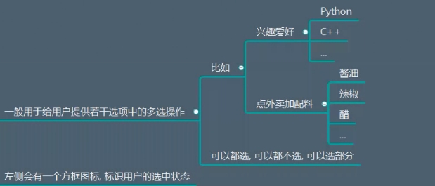
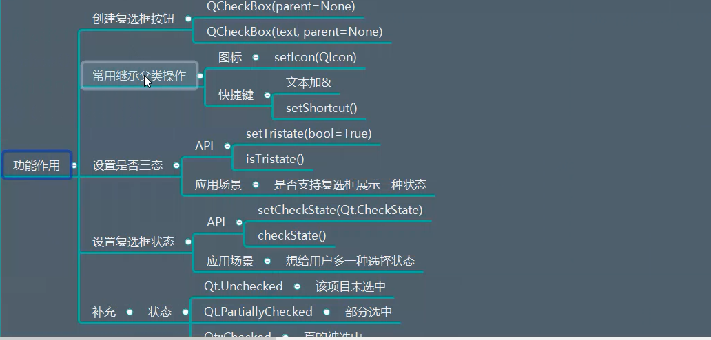
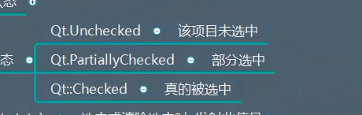

# QCheckBox详解

## 一、描述

  


## 二、继承
QAbstractButton


## 三、功能作用
  

```python
import sys
from PyQt5.Qt import *


if __name__ == '__main__':

    app =QApplication(sys.argv)

    window =  QWidget()
    window.setWindowTitle("QCommandLinkButton使用")
    window.resize(500,500)

    print(QCheckBox.__bases__)

    # 多选框 设置文本  设置父对象  设置快捷键
    cb = QCheckBox("&Python",window)
    cb.setIcon(QIcon("img.png"))
    cb.setIconSize(QSize(60,60))

    cb.setTristate(True)  # 三种状态： 空白  填实  选中


    cb.setCheckState(Qt.Checked) # 设置成选中状态


    window.show()
    sys.exit(app.exec_())
```


## 四、信号

```python
# 选中或者清除选中的时候，发射此信号
stateChanged(int state)
```

复选框的三种状态：
  

```python
import sys
from PyQt5.Qt import *


if __name__ == '__main__':

    app =QApplication(sys.argv)

    window =  QWidget()
    window.setWindowTitle("QCommandLinkButton使用")
    window.resize(500,500)

    print(QCheckBox.__bases__)

    # 多选框 设置文本  设置父对象  设置快捷键
    cb = QCheckBox("&Python",window)
    cb.setIcon(QIcon("img.png"))
    cb.setIconSize(QSize(60,60))

    cb.setTristate(True)  # 三种状态： 空白  填实  选中


    cb.setCheckState(Qt.Checked) # 设置成选中状态

    cb.stateChanged.connect(lambda state:print(state))  # 三种状态


    window.show()
    sys.exit(app.exec_())
```


