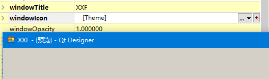

# PyQt5窗口设计基础

## 一、窗口的个性化设置

### 1.基本属性设置

窗口包含一些基本的组成要素，包括对象名称、图标、标题、位置和背景等，这些要素可以通过属性编辑器窗口进行设置。

#### 1.1 设置窗口的对象名称
窗口的对象名称，**相当于窗口的标识，是唯一的**，在编写代码时，对窗口的任何设置和使用都是通过该名称进行操作的。在Qt Designer设计器中，窗口的对象名称是通过“属性编辑器”中的objectName属性进行设置的，默认名称为Main Window 如图所示，用户可以根据实际情况进行更改，但是要保证在当前窗口中是唯一的。

  


除了可以使用Qt Designer中的属性编辑器中对其进行更改之外，还可以通过Python代码进行设置，设置时需要使用setObjectName（）函数，使用方法如下：

```python
MainWindow.setObjectName("MainWindow")

```

#### 1.2 设置窗口的标题栏名称
在窗口的属性中，通过windowTitle属性设置窗口的标题栏名称，标题栏名称就是显示在窗口标题上的文本。

  


在Python中使用setWindowTitle()函数设置标题栏，代码如下：

```python
MainWindow.setWindowTitle(_translate("MainWindow","标题栏"))

```

#### 1.3 修改窗口的大小
在窗口的属性中，通过展开geometry属性，可以设置窗口的大小，修改窗口的大小，只需要根本更改宽度和高度的值即可，在设置窗口的大小是，它的值只能是整数，不可以是小数。
  

在Python中可以使用resize()函数进行设置窗口的大小
```python
MainWindow.resize(252,100)

```


如何让窗口居中显示：

```python
from PyQt5.QtWidgets import QDesktopWidget   # 导入屏幕类
screen = QDesktopWidget.screenGeometry()     # 获取屏幕的大小
width = screen.width()                       # 获取屏幕的宽
height = screen.height()                     # 获取屏幕的高

```


### 2.更换窗口的图标

添加一个新的窗口之后，窗口的图标默认是系统默认的QT图标，如果想更换窗口的图标，可以在属性编辑器中设置窗口的windowIcon属性。


具体操作：
* 选中窗口，然后在属性编辑器中选中windowIcon属性，这时会出现下拉按钮
* 单击下拉按钮，在下拉按钮中选择“选择文件”菜单项
* 弹出“选择一个像素映射”对话框，该对话框中选择新的图标文件，单击“打开”按钮，即可将选择的图标文件作为窗口的图标。
  


上面的方式修改窗口图标后对应的Python代码：

```python
icon = QtGui.QIcon()
icon.addPixmap(QtGui.QPixmap("图标（7）.ico"),QtGui.QIcon.Normal,QtGui.QIcon.Off)

MainWindow.setWindowIcon(icon)

```

  


将上述代码添加到原来的Pycharm中，还要导入QtGui包

注意：这里的图片使用的是相对路径，目的是为了让其他用户使用你的程序不会出错。


### 3.设置窗口的背景


#### 3.1 通过setStyleSheet（）函数设置窗口背景

在使用setStyleSheet()函数设置窗口背景时，需要以background-color或者border-image的方式来进行设置，其中background-color可以设置窗口的背景颜色，而border-image可以设置窗口的背景图片。

通过setStyleSheet()函数来设置窗口背景颜色的代码如下：

```python
MainWindow.setStyleSheet("#MainWindow{background-color:red}")
```
  

在使用setStyleSheet()函数设置窗口的背景色之后，窗口中的控件会继承窗口的背景色，如果想要为控件设置背景图片或者图标，需要使用setPixmap或者setIcon()函数来实现。

在使用setStyleSheet()函数设置背景图片时，需要设置包括背景图片的文件夹，因为代码会用到图片的路径，这里将图片文件夹放到与.py文件同一目录下的image文件下。

  


之后在Pycharm项目中的代码添加：

```python
MainWindow.setStyleSheet("#MainWindow{border-image:url(image/back.jpg)}") # 设置背景图片
```

  

除了在setStyleSheet()函数中使用border-image方式设置窗口的背景图片外，还可以使用background-image方式进行设置：

```python
MainWindow.setStyleSheet("MainWindow{background-image:url(image/back.jpg)}")
```

但是这种方式显示的背景图片是平铺显示
  


#### 3.2 使用QPalette设置窗口背景

QPalette类是PyQt5中提供的一个调色板，专门用于管理控件的外观的显示，每一个窗口和控件都包含一个QPalette对象，通过QPalette对象的setColor()函数可以设置颜色，setBrush()函数可以设置图片，最后使用MainWindow对象的setPattle()函数即可为窗口设置背景图片或者背景，使用QPalette对象为窗口设置背景颜色的代码如下：

QPalette是QtGui中的一个类

```python
# 还要导入 
from PyQt5.QtCore import Qt

# 设置窗口的对象名称 唯一标识
MainWindow.setObjectName("MainWindow")
# 创建一个QPalette对象
palette = QtGui.QPalette()

# 设置背景颜色 参数QPalette.backgreound   Qt.red
palette.setColor(QtGui.QPalette.Background,Qt.red)

# 最后调用setPalette
MainWindow.setPalette(palette)
```

运用效果与使用setStyleSheet()函数设置背景和颜色效果一摸一样，

使用QPalette设置背景图片的代码如下：

```python
    # 设置背景图片
    palette = QtGui.QPalette()   # 创建一个QPaltte对象
    
    # 设置背景图片
    palette.setBrush(QtGui.QPalette.Background,QBrush(QPixmap("./image/back.jpg")))
    MainWindow.setPalette(palette)

```

上面的代码需要导入
```python 
from PyQt.QtGui import QBrush,QPixmap

```
使用QPalette对象为窗口设置背景图片的时候，默认是平铺显示的，如果要是图片适应窗口的大小，需要设置setBrush中第二个参数QBrush中的QPixmap参数，具体设置方法是：在生成QPixmap窗口背景图对象参数时，需要在设置三个值

```
* 设置窗口大小 MainWindow.size()
* QtCore.Qt.IgnoreAspectRatio
* QtCore.Qt.SmoothTransformation
```

需要导入模块```from PyQt5.QtCore import Qt```

关键代码：

```python 
    # 设置背景图片
    palette = QtGui.QPalette()   # 创建一个QPaltte对象

    # 设置背景图片
    palette.setBrush(MainWindow.backgroundRole(),QBrush(QPixmap("./image/back.jpg").scaled(MainWindow.size(),Qt.IgnoreAspectRatio,Qt.SmoothTransformation)))
    MainWindow.setPalette(palette)

```

#### 3.3 通过资源文件设置窗口背景


（1）在Qt Designer中创建并使用资源文件

在Qt Designer中设计程序界面时，可以通过资源浏览器添加图片或图标等资源

* 在Python项目中创建一个images文件夹，将需要测试的图片全部放进去，打开Qt Designer工具，在右下角的资源浏览器中点击编辑资源按钮
  


* 在弹出的编辑资源对话框，单击左下角的新建资源文件按钮
  


* 新建资源文件的对话框中，选择该资源文件保存的路径为当前Python项目的路径，然后设置文件名称为“img”,保存类型为“资源文件(*qrc)”,最后点击“保存”按钮。
  


* 点击保存按钮之后，将自动返回编辑资源对话框中，然后在该对话框中选择添加前缀按钮，设置前缀为png,再点击添加文件按钮（这里的前缀指的是自己定义的路径前缀，用来区分不同的资源文件，同一类的资源文件有相同的前缀）
  
  


  
* 在添加文件的对话框中选择需要添加的图片文件，然后点击打开按钮
  
  


* 图片添加完成之后，将自动返回至编辑资源的对话框，在该对话框中直接点击OK按钮，然后资源浏览器将显示添加的图片资源
  


* 选中设计窗口，找到styleSheet属性，点击右边的按钮
    


* 接着弹出编辑样式表的对话框，在该对话框中点击添加资源后面的向下箭头，在弹出的菜单中选择border-image


* 然后弹出选择资源对话框，该对话框中选择创建好的资源，点击Ok
  


* 返回样式编辑表对话框，在该对话框中可以看到自动生成的代码，点击OK按钮
  


（2）转换资源文件

设置好之后，将设计好的ui文件转换成.py文件，但是转换之后的py文件的代码中会显示提示信息：
  

**说明img_rc模块导入异常，所以在此处需要将已经创建好的img.qrc资源文件转换成.py文件**

qrc资源文件转换的具体步骤如下：
* 在Pycharm中点击Tools->External Tools 选项，然后点击+按钮，弹出Create Tool窗口 ，首先在Name文本框中填写qrcTOpy，然后点击Program后面的文件夹图标，选择Python安装目录下的Scripts文件夹中的pyrcc5.exe文件，接下来在Arguments中输入将qrc文件转换成py文件的命令：$FileName$ -o $FileNameWithoutExtension$_rc.py; 最后在Working directory中输入：$ FileDir$, 他表示qrc文件所在的路径，点击ok按钮。
  
  


* 转换资源文件的快捷工具完成之后，点击鼠标左键选中需要转换的qrc文件，然后在菜单栏中点击Tools->External Tools->qrcTOpy菜单，即可在qrc文件下面自动生成对应的py文件。
  
  
 1](../../images/289261bf38f7fe18e6741a0eaf6064453040c88f53230ac39faa3997c34b1a32.png)  


* 文件转换完成之后，就可以在主函数中调用show方法运行
  
  
 1](../../images/a2812f29962eb55edca36f76af3ec3ce36b170e26a4ae075d83af4d21e70bc24.png)  

### 4.控制窗口的透明度
选中窗口，在属性编辑器中设置windowOpacity属性值即可，
  

在Python代码中使用setWindowOpacity()函数设置窗口的透明度，下面的代码将窗口的透明度设置为半透明：

```python
MainWindow.setWindowOpacity(0.5)
```
  

### 5.设置窗口样式
在PyQt5中，使用setWindowFlags()设置窗口的样式

```python
from PyQt5.QtCore import Qt

setWindowFlags(Qt.WindowFlags)

```
Qt.WindowFlags参数表示要设置的窗口样式，它的取值分为两种类型：

（1）基本窗口类型
* Qt.widget  默认窗口，有最大化和最小化的按钮
* Qt.Window 普通窗口，有最大化和最小化的按钮
* Qt.Dialog  对话框窗口，有问号和关闭按钮
* Qt.Popup  无边框的弹出窗口
* Qt.ToolTip 无边框的提示窗口 没有任务栏
* Qt.SplashScreen  无边框的闪屏窗口，没有任务栏
* Qt.SubWindow 子窗口，窗口没有按钮，但是有标题

下面的代码将名称为MainWindow的窗口设置一个对话窗：

```python
from PyQt5.QtCore import Qt
# 显示一个问号和关闭按钮的对话框
MainWindow.setWindowFlags(Qt.Dialog)
```

  

（2）自定义窗口外观及其说明

* Qt.MSWindowsFixedSizeDialogHint   无法调整窗口大小
* Qt.FramelessWindowHint 无边框窗口
* Qt.CustomizeWindowHint 有边框但是没有标题栏和按钮 不可以移动和拖动窗口
* Qt.WindowTitleHint  添加标题栏和一个关闭按钮的窗口
* Qt.WindowSystemMenuHint  添加系统目录和一个关闭按钮的窗口
* Qt.WindowMaximizeButtonHint  激活最大化按钮的 窗口
* 还有很多 google 
  
下面的代码用来设置名称为MainWindow的窗口只用关闭按钮，没有最大化和最小化按钮。

```python
from PyQt5.QtCore import Qt
MainWindow.setWindowFlags(Qt.WindowCloseButtonHint)
```

  

注意：
    对窗口样式的设置，只有在初始化窗体之后才可以起作用，即需要设置窗口样式的代码放在setupUi()函数之后执行，例如：

    ```python
    from PyQt5.QtWidgets import QMainWindow
    from PyQt5.QtCore import Qt

    # 创建窗体对象
    MainWindow = QMainWindow()

    # 创建PyQt设计的窗体对象
    ui = Ui_MainWindow()

    # 调用PyQt窗体的方法对窗体对象进行初始化设置
    ui.setupUi(MainWindow)

    # 设置窗体对象只显示关闭按钮
    MainWindow.setWindowFlags(Qt.WindowCloseButtonHint)

    ```

