# pyqt5简介与环境搭建：pyqt5 + Anaconda + pycharm

## 一、概述
python 一开始只是作为一门脚本语言进行开发，并不具备GUI功能，但是由于本身具有良好的扩展性，能够源源不断地通过C++进行功能性扩展，因此现在已经有相当多的GUI控件。其中pyqt是QT为python专门提供的GUI扩展。

关于QT：QT是挪威Trolltech公司开发的一个C++GUI程序。使用QT只需要开发一次程序，便可以阔不同的桌面和嵌入式操作系统部署该应用，不需要重新编写代码。使用QT开发的应用程序能够在Windows、linux和Mac OS平台之间轻松移植


pyqt具有如下特性：
* 基于高性能的QT的GUI控件集
* 能够跨平台运行在Windows、Linux和MacOS等系统上
* 能够使用信号/槽机制进行通信
* 对Qt库的完全封装
* 可以使用Qt成熟的IDE（比如Qt Designer）进行图形界面设计，并自动生成可以执行的代码。
* 提供了一整套的种类繁多的窗口控件


## 二、Qt与Pyqt之间的关系
pyqt是QT框架的python语言实现，Pyqt提供了一个设计良好的窗口控件组合，每一个pyqt控件都有其对应的Qt控件。所以PyQt与Qt的类库和API非常详细，而且pyqt不用在使用qmake系统和Q_OBJECT宏，使得Pyqt再也没有编译链接错误，PyQT的代码也更加友好。

在开发速度上，pyqt的运行效率会低于QT，但是代码量会减少许多，降低开发成本。

QT使用信号槽机制在窗口控件之间传递事件和消息。这种机制完全不同于其他图形界面开发库所采用的回调机制（callback），使用信号槽可以使程序更加安全和简洁。


## 三、pyqt的windows环境搭建

### 3.1 软件要求

Anaconda3 + Pycharm + win10


### 3.2 安装一些必要的Python包

以下安装过程全部都使用国内镜像源,要在Anaconda prompt 中输入命令


* 首先，你需要安装PyQt5 当然Anaconda有，不需要
  
  ```
    pip install PyQt5 -i https://pypi.douban.com/simple
  ```

  如果你安装过程中出现了warning ,请在前面添加python -m,下面类似

  ```
  python -m pip install PyQt5 -i https://pypi.douban.com/simple
  ```

* 安装pyqt-tools
  ```
    pip install PyQt5-tools -i https://pypi.douban.com/simple
  ```

* 安装sip
  ```
    pip install  sip
  ```

安装完成之后，请在你的Anaconda目录下的Lib->site-packages中查看

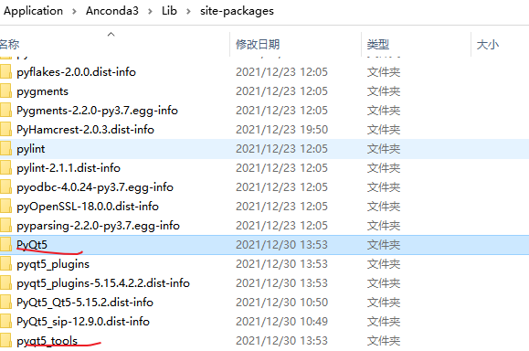  


### 3.3 Pycharm相关配置


#### 3.3.1 配置Python解释器
使用你的pycharm新建一个工程，之后点击file->settings  输入Interpreter,点击添加你的anaconda中的python路径

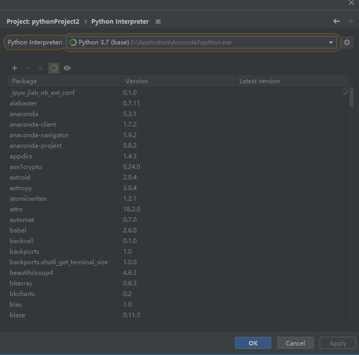  
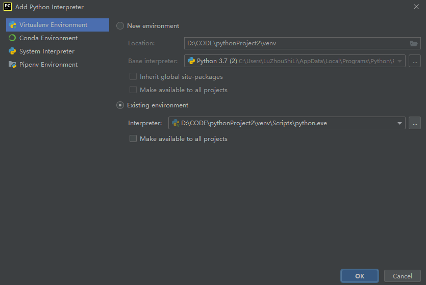  


选中之后，下面会显示一些他已有的包。


这一步，是为了你的python工程添加python解释器，这个解释器是Anaconda中的python


#### 3.3.2 配置QT-Designer

点击settings，搜索exteral tools, 点击添加

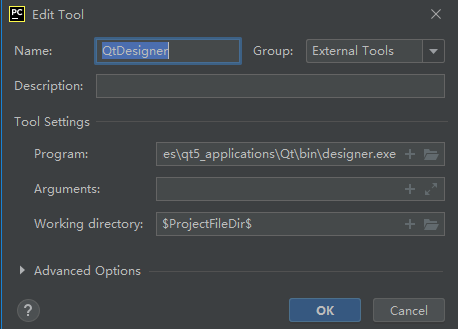  


```
    Name:QtDesigner
    Group:Qt
    Programs:你的Designer路径
    Working directory：$ProjectFileDir$

```
关于你的Designer路径，我在网上看到不同的路径，笔者的路径在：

```
D:\Application\Anconda3\Lib\site-packages\qt5_applications\Qt\bin

```
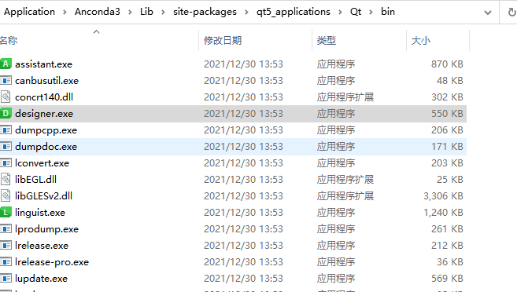  


#### 3.3.3 配置PYUIC

同样的，在上面的exteral tools 中添加

```
    Name:Pyuic
    Group:Qt
    Program: 你的Anaconda中的python路径
    Arguments：-m PyQt5.uic.pyuic $FileName$ -o $FileNameWithoutExtension$.py
    Working directory：$FileDir$

```
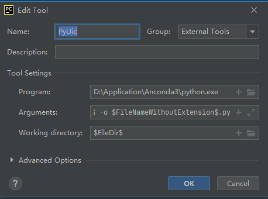  


### 3.4 测试

欧克，开始测试

1.在你的工程右键选择QtDesigner

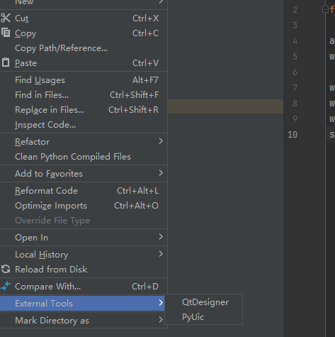  


2.创建一个简单的窗口
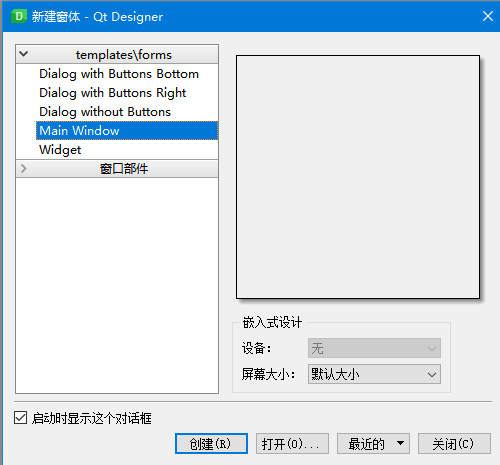  


选择Main Window 创建


点击左边的标签
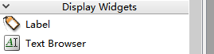  

直接选中拖到中间，输入你想要的，并且更改字体大小

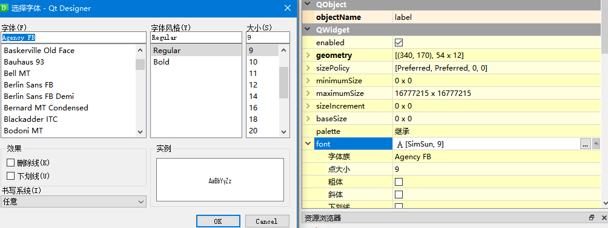  

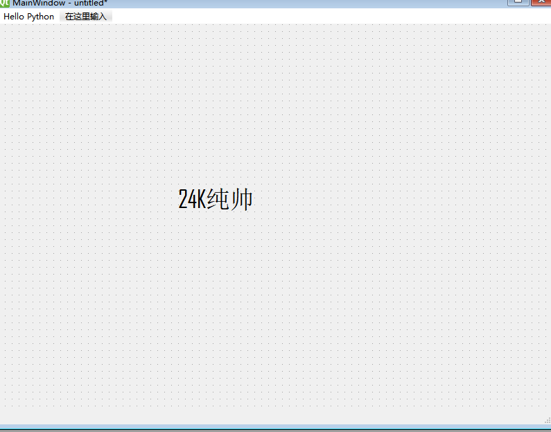  


点击保存，一定要保存到你的python工程下
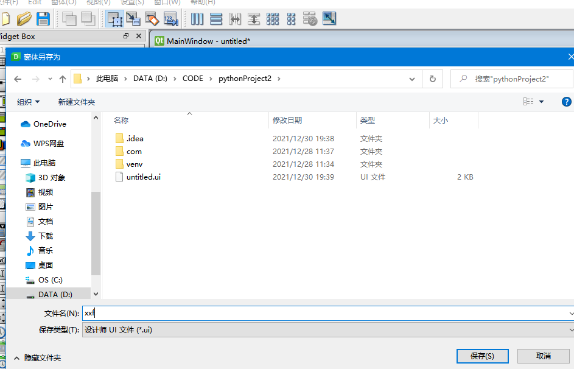  

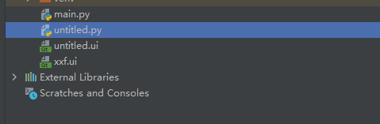  


3.回到你的Pycharm 
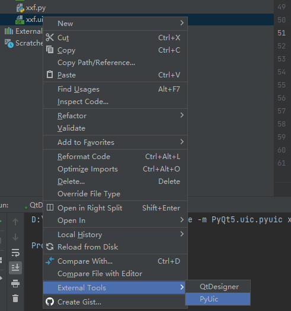  


选中，选择PyUic,生成一个py文件

这时，在工程下面新建一个主函数，main.py

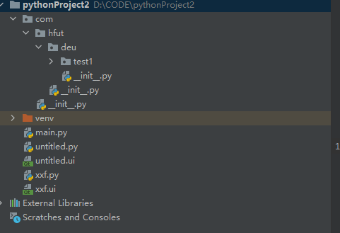  

将你刚才创建的界面文件（我命名为xxf.py）作为工具包，导入模块

在main.py中输入以下代码

```python
import sys
# 导入创建的文件模块
import xxf
from PyQt5.QtWidgets import QApplication, QMainWindow
if __name__ =='__main__':
    app = QApplication(sys.argv)
    MainWindow = QMainWindow()
    ui = xxf.Ui_MainWindow()
    ui.setupUi(MainWindow)
    MainWindow.show()
    sys.exit(app.exec_())

```

运行，成功
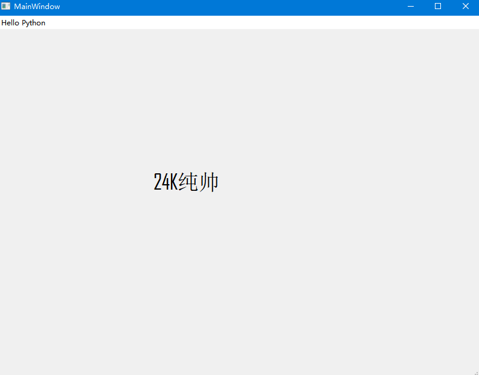  


