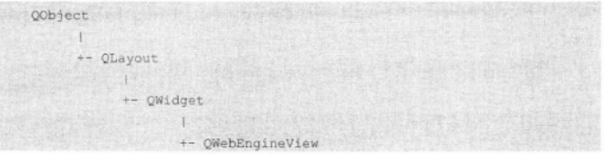
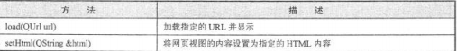

# pyqt网页交互

## 一、概述

&emsp;Pyqt5使用QWebEngineView控件来展示HTML页面，对老版本中的QWebView类不在进行维护，因为使用QWebEngineView使用Chromium内核可以给用户带来更好的体验。

&emsp;Qt慢慢淘汰了古老的WebKit，取而代之的是使用WebEngine框架。WebEngine是基于谷歌的Chromium引擎开发的，也就是内部集成了谷歌的Chromium引擎。WebEngine框架是基于Chromum上的Content API封装，投入成本比较小，可以很好地支持HTML5。

&emsp;在PyQT5中可以通过PyQt5.QtWebKitWidgets.QWebEngineView类使用网页控件，此类定义如下：

  

QWebEngineView控件使用load()函数加载一个WEB页面，实际上就是使用HTTP GET方法加载一个Web页面，这个控件既可以加载本地的Web页面，也可以加载远程的外部Web页面
  

```python
view = QWebEngineView()
view.load(QUrl('http://www.baidu.com/')) 
view.show()
```

QWebEngineView控件还可以使用setHtml()函数加载本地的Web代码。

&emsp;经过测试，使用QWebEngineView对象的setHtml()函数渲染HTML页面时，如果页面中使用的javascript代码超过2MB,程序渲染的页面就会渲染失败，页面中会出现大片的空白。


## 二、加载并显示外部的WEB页面

```python
from PyQt5.Qt import *
from PyQt5.QtWebEngineWidgets import *
import sys

class MainWindow(QMainWindow):
    def __init__(self):
        super(MainWindow, self).__init__()
        self.setWindowTitle('打开外部网页的例子')
        self.setGeometry(5,30,1355,730)
        self.browser = QWebEngineView()

        # 加载外部的WEB页面

        self.browser.load(QUrl('http://www.baidu.com'))
        self.setCentralWidget(self.browser)


if __name__ == '__main__':
    app = QApplication(sys.argv)
    win = MainWindow()

    win.show()
    app.exec_()
```

## 三、加载显示本地的WEb页面

```python
from PyQt5.QtCore import *
from PyQt5.QtGui import *
from PyQt5.QtWidgets import *
from PyQt5.QtWebEngineWidgets import *
import sys

class MainWindow(QMainWindow):

    def __init__(self):
        super(QMainWindow,self).__init__()
        self.setWindowTitle('加载并显示本地页面例子')
        self.setGeometry(5,30,555,330)
        self.browser = QWebEngineView()
        # 加载本地页面
        url = r'D:/index.html'
        self.browser.load(QUrl(url))
        self.setCentralWidget(self.browser)


if __name__ == '__main__':
    app = QApplication(sys.argv)
    win = MainWindow()
    win.show()
    sys.exit(app.exec_())
```


