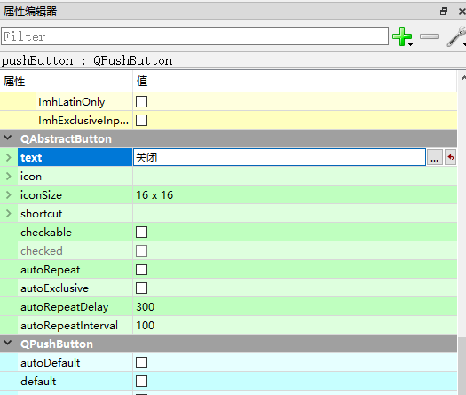
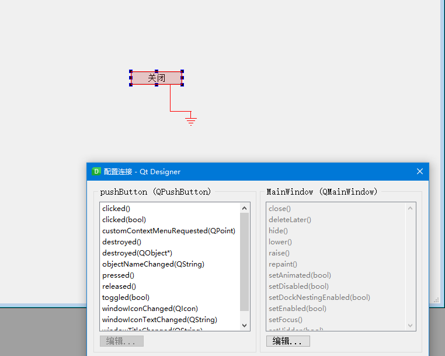
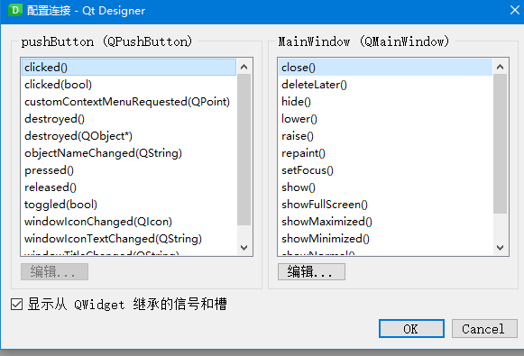
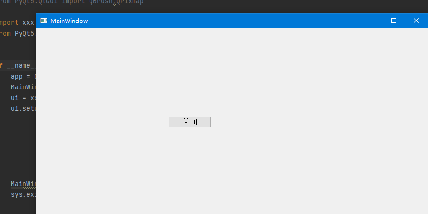
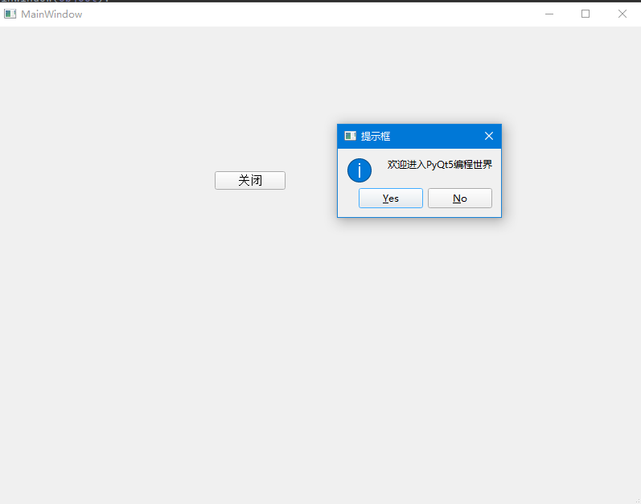
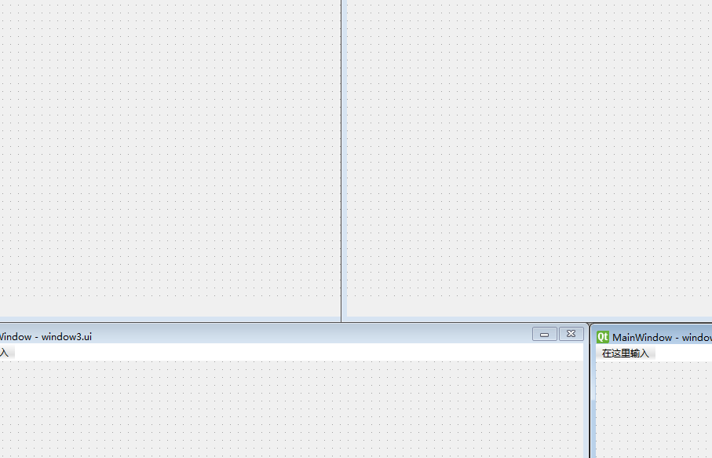
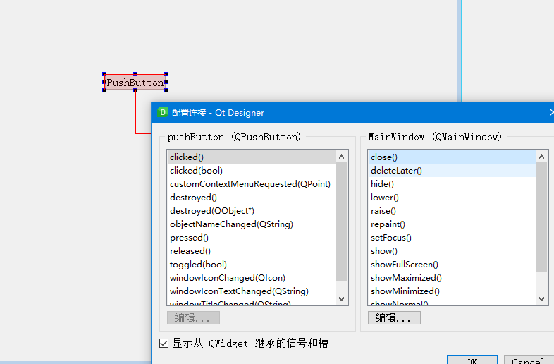
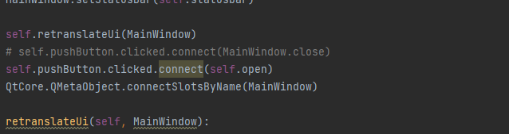
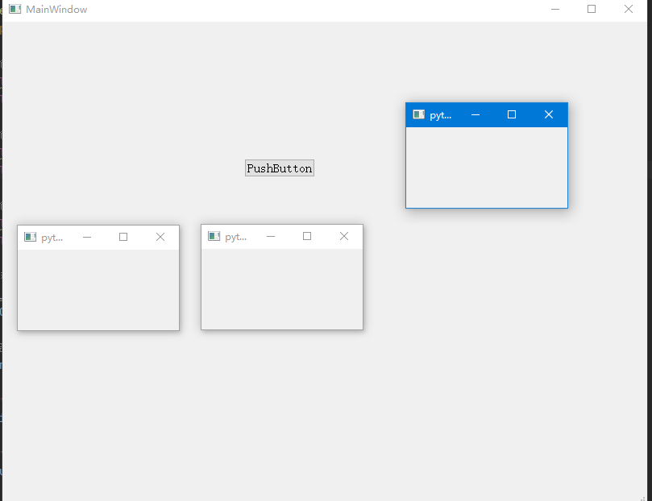

# 信号与槽

## 一、基本概念
信号与槽是Qt的核心机制，也是PyQt5编程时对象之间通信的基础，在PyQt5中每一个QObject对象（包括各种窗口和控件）都支持信号与槽机制，通过信号与槽之间的关联，就可以实现对象之间的通信，**当信号发射时，连接的槽函数就自动执行**，在PyQt5中信号与槽是通过对象的signal.connect()连接的。


PyQt5使用信号与槽的主要特点：

* 一个信号可以使用多个槽
* 一个槽可以监听多个信号
* 信号与信号之间可以互联
* 信号与槽之间的连接可以跨线程
* 信号与槽的连接方式既可以是同步也可以是异步
* 信号的参数可以是任何Python类型


## 二、编辑信号与槽

例子：通过信号与槽实现一个单击按钮关闭主窗口的运行效果。

（1）打开Qt Designer设计器，从左侧的工具箱中向窗口中添加一个PushButton按钮，并设置按钮的text属性为关闭
  


PushButton是PyQt5提供的一个控件，他是一个命令按钮控件，在单击一些操作时使用。

（2）选中添加的关闭按钮，在菜单栏中选择编辑信号/槽菜单项，然后按住鼠标左键拖至窗口的空白区域
  


（3）拖动至窗口的空白区域松开，将自动弹出“配置连接”的对话框，首先选中“显示从QWidget继承的信号与槽”复选框，然后在上方的信号与槽列表中分别选中"clicked"和“close”，如图所示：

  

如图所示，选中clicked按钮的信号，然后选中close()为槽函数，工作的逻辑是单击按钮时发射clicked信号，该信号被主窗口的槽函数close()所捕获，并触发了关闭主窗口的行为。


（4）单击OK，即可完成信号与槽之间的关联，保存.ui文件，在Pycharm中使用PyUic将Ui文件转换成py文件，转换后实现单击按钮关闭窗口的关键代码如下：

```python
self.pushButton.clicked.connect(MainWindow.close)

```

  


## 三、自定义槽

自定义槽本质上就是定义一个函数，该函数来实现相关功能。

例子：自定义一个槽函数，当点击按钮时，弹出一个“欢迎进入PyQt5编程世界”的信息提示框，代码如下：


```python
def showMessage()
    from PyQt5.QtWidgets import QMessageBox  # 导入QMessageBox类

    # 使用information()方法弹出信息框
    QMessageBox.information(MainWindow,"提示框","欢迎进入PyQt5编程世界",QMessageBox.Yes|QMessageBox.No,QMessageBox.Yes)

```


## 四、将自定义的槽函数连接到信号
在自定义槽函数之后，即可与信号进行连接，比如，这里与PushButton按钮的clicked信号相关联，即在点击PushButton按钮时，弹出信息框，将自定义槽连接到信号的代码如下：


```python
self.pushButton.clicked.connect(self.showMessage)
```
运行程序，点击窗口中的PushButton按钮，即可弹出信息提示框。

  


## 五、多窗口设计

一个完整的项目一般都是由多个窗口组成的。多窗口即向项目中添加多个窗口，在这些窗口中实现不同的功能。

在Qt Designer设计器的菜单栏中，选择文件->新建->菜单项，弹出新建窗体的对话框，选择一个模板，点击创建按钮，重复以上步骤：便可以添加多个窗口

添加多个窗口之后，保存时，需要将鼠标定位到每一个需要保存的窗口，之后在进行保存。
  


### 1. 设置启动窗口
在项目中添加了多个窗口之后，如果需要调试程序，必须设置先运行的窗口，这样就需要设置项目的启动窗口，设置方法：将要作为启动窗口的相应py文件添加程序程序入口即可，在window1.py文件中添加如下代码：

```python
# 程序入口，程序从此处启动PyQt设计的窗体
if __name__ == '__main__':
    app = QtWidgets.QApplication(sys.argv)

    # 创建窗体对象
    MainWindow = QMainWindow()

    # 创建PyQt设计的窗体对象
    ui = Ui_MainWindow()

    # 调用PyQt方法对窗体对象进行初始化设置
    ui.setupUi(MainWindow)

    MainWindow.show()

    sys.exit(app.exec_())


```

### 2. 窗口之间的关联
在多窗口创建完成之后，需要将各个窗口进行关联，然后才可以形成一整个项目，这里以在启动窗口中打开其余三个窗口为例：

首先看一下window2 window3 window4 三个py文件，在自动转换之后，默认继承object类，代码如下：

```python 
class Ui_MainWindow(object):

```
为了执行窗口操作，需要将继承的object类修改为QMainWindow类，由于QMainWindow类位于 PyQt5.QWidgets中。需要进行导入，修改之后的代码如下：

```python
from PyQt5.QWidgets import QMainWindow

class Ui_MainWindow(QMainWindow):

```

修改完毕之后，回到启动窗口的py文件，在该文件中定义一个槽函数，用来使用QMainWindow对象的show（）方法打开三个窗口，代码如下：

```python
def open(self):

    import window2,window3,window4

    # 创建第二个窗体对象
    self.second = window2.Ui_MainWindow()
    self.second.show()

    # 创建第三个窗体对象
    self.third = window3.Ui_MainWindow()
    self.third.show()

    # 创建第四个窗体对象
    self.fouth = winodow4.Ui_MainWindow()
    self.fouth.show()

```

**还要将PushButton按钮的clicked()信号与自定义的槽函数open()相关联**

所以需要在启动窗口中添加一个PushButton按钮，我的启动窗口是window1,在左侧的空间窗口中选择一个PushButton 选中拖动到启动窗口中间，之后配置信号和槽函数
  


之后修改window1中的setupUi：

  


也就是添加如下代码：

```python
# 将信号与槽进行连接
self.pushButton.clicked.connect(self.open)
```


然后运行启动窗口window1, 单击打开按钮，即可打开其他三个窗口，


  

成功 