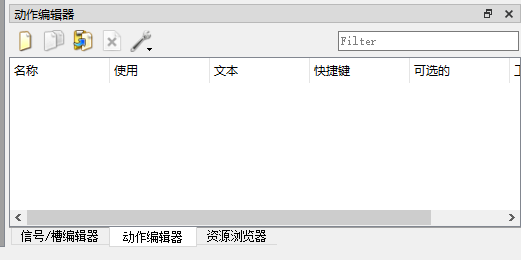

# 第一个PyQt5窗口程序

## 一、认识Qt Designer

Qt Designer是一个可视化的GUI设计工具，通过它可以提高开发效率

### 1.几种常用的窗口类型

* 在Pycharm的菜单栏中依次点击Tools->External Tools -> Qt Designer，迅速打开Qt Designer
除此之外，还可以在安装的虚拟环境中的lib\site-packages\QtDesigner中找到designer.exe可执行文件，双击该文件就可以打开Qt Designer
  


* 上面的图片是打开QtDesigner之后弹出的界面，可以看到新建窗体的窗口，该窗口中以列表的形式列出来Qt支持的几种窗口类型，分别如下：

    * Dialog with Buttons Bottom: 按钮在底部的对话窗口
        
  

    * Dialog with Buttons Right: 按钮在右上角的对话窗口
          


    * Dialog without Buttons: 没有按钮的对话窗口
         
 

    * Main Window：一个带有菜单、停靠窗口和状态栏的主窗口
      

    * Widget: 通用窗口
      

注意：

* Main Window是使用PyQt5设计GUI程序时最常用的窗口。
* Main Window窗口和Widget窗口看起来是一样的，但是他们其实是有区别的，区别就是：Main Window窗口会自带菜单栏和状态栏，但是Widget窗口没有

### 2.熟悉Qt Designer的窗口区域
在Qt Designer中新建窗体的窗口中选择 Main Window，即可创建一个主题窗口。

  

* 菜单栏
  * 文件的菜单主要提供基本的新建、保存、关闭等功能菜单
  * 编辑菜单主要提供了复制、粘贴、删除操作，还提供了特定的几个菜单：编辑窗口部件、编辑信号槽、编辑伙伴、编辑Tab顺序
  * 窗体菜单提供布局以及预览菜单的效果、C++代码和Python代码的相关功能

* 工具栏
  通过工具栏可以快速访问常用的菜单项命令

* 工具箱
  通过工具箱，开发人员可以进行可视化的窗体设计，简化程序设计的工作量。

  在设计GUI时，如何需要使用某个控件，可以在工具箱中选择需要使用的控件，直接将其拖放到设计窗口的位置

* 窗口设计区域
  窗口设计区域是GUI界面的可视化显示窗口，任何对窗口的改动，都可以在该区域实时显示出来。

* 对象查看器
  对象查看器主要用来查看设计窗中放置的对象列表
    

* 属性编辑器
  该窗口是对GUI界面中的窗口、控件和布局等相关属性的修改，对于窗口的各个控件属性都可以在属性编辑器中完成。
    


* 信号槽编辑器
  主要用来编辑控件的信号和槽函数，另外也可以作为控件添加自定义的信号和槽函数
    

* 动作编辑器
  主要用来对控件的动作进行编辑，包括提示文字，图标以及图标主题、快捷键等

    

* 资源浏览器
  开发人员可以为控件添加图片（Label Button等而背景图片）图标等资源。
    


## 二、使用Qt Designer 创建窗口

### 2.1 Main Window介绍
在PyQt5中最常用的窗口有三种，即Main Window  Widget Dialog，

* Main Window 也就是主窗口，他要为用户提供一个带有菜单栏、工具栏和状态栏的窗口。
* Widget:通用窗口，没有嵌入到其他控件中的控件都成为窗口
* Dialog: 对话窗口，主要用来执行短期任务，或者与用户进行交互


### 2.2 创建主窗口
打开Qt Designer设计器，在新建窗体中选择Main Window，选择创建按钮

### 2.3 设计主窗口
创建完主窗口之后，主窗口默认只有一个菜单栏和一个状态栏，要设计主窗口，在左侧的 Widget Box工具箱中选中吧相应的控件，然后按住鼠标左键，将其拖放到主窗口的指定位置即可。
  


### 2.4 预览窗口效果
在菜单栏中选择窗体->预览于，然后选择相应的菜单项即可。有三种风格可以选择。

  


### 2.5 查看Python代码
设计完窗口之后，可以直接在Qt Designer设计器中查看对应的Python 代码，方法是选择菜单栏中的窗体->View Python Code菜单
  

出现一个显示当前窗口对应的Python代码的窗体，可以直接单击窗体工具栏中的全部复制按钮，将所有的代码复制到Python工具（Pycharm）中进行使用。


### 2.6 将.ui文件转换成py文件
使用扩展工具PyUIC将.ui文件转换成.py文件。

* 首先在Qt Designer设计器窗口中设计完GUYI窗口，按下保存按钮，保存到创建的python项目中。
* 在Pycharm的项目导航窗口中选择保存好的ui文件，然后选择菜单栏中的Tools->External Tool->PyUIC菜单。
* 即可自动将选中的.ui文件转换成同名的.py文件，双击查看代码
* 上述的代码还不可以直接运行，需要添加程序入口，并在其中通过MainWindow对象的show函数来显示，代码如下：

我在这里将上面的窗口代码hhh 作为一个模块导入。

```python
import sys
import hhh
from PyQt5.QtWidgets import QApplication, QMainWindow
if __name__ =='__main__':
    app = QApplication(sys.argv)
    MainWindow = QMainWindow()
    ui = hhh.Ui_MainWindow()
    ui.setupUi(MainWindow)
    MainWindow.show()
    sys.exit(app.exec_())

```
  


