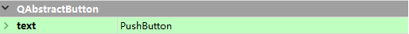

# PyQt5常用控件

## 一、控件概述

控件是用户可以用来输入或者操作数据的对象，也就是相当于汽车中的方向盘、油门、刹车、离合器等，他们都是对汽车进行操作的控件。在PyQt5中，控件的基类是QFrame类，而QFrame类继承自QWidget类，QWidget类是所有用户界面对象的基类。

## 二、文本类控件

文本类控件主要用来显示或者编辑文本信息，PyQt5中的文本控件主要有Label、LineEdit、TextEdit、SpinBox、DoubleSpinBox、LCDNumber等，下面将对他们的使用方法进行讲解。

### 2.1 Label：标签控件
Label控件，又称为标签控件，它主要用于显示用户不能编辑的文本，表示窗体上的对象（例如给文本框、列表框添加描述信息），它对应PyQt5中的QLabel类，Label控件在本质上是QLabel类的一个对象。Label控件的图标如图所示：

#### 2.1.1 设置标签文本
第一种是直接在Qt Designer中设计器的属性编辑器中设置text属性；第二种是通过代码设置。在Qt Designer设计器的属性编辑器中设置text的效果图：
  


第二种方法是直接通过Python代码进行设置，需要用到QLabel类的setText()方法。

```python
self.label = QWidgets.QLabel(self.centralwidget)
self.label.setGeometry(QtCore.QRect(30,30,81.41))
self.label.setText("用户名：")

```

例题：5.1 Label标签控件的使用
将PyQt5窗口中的Label控件的文本设置为“用户名：”,代码如下

