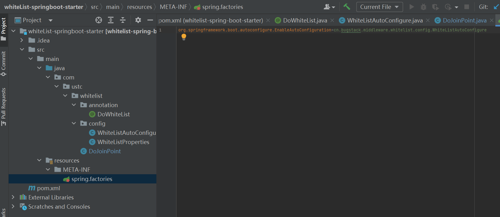

# 第 3 章 服务治理，统一白名单控制

* 通过我们使用一个公用的starter的时候，只需要将相应的依赖添加的Maven的配置文件当中 免去自己需要引用很多依赖类，并且SpringBoot会自动进行类的自动配置
* 自己开发一个starter也需要做相应的处理
* SpringBoot在启动的时候会去依赖的starter中寻找spring.factories文件，然后根据文件中配置的Jar包去扫描项目依赖的Jar包
* spring.factories配置加载AutoConfigure类
* 根据Conditional注解的条件，进行自动配置并将Bean注入Spring Context上下文中

## 需求背景

* 在互联网这种多数面向C端用户场景下的产品功能研发完成交付后，通常并不会直接发布上线。尤其是在一个原有服务功能已经沉淀了大量用户时，不断的迭代开发新增需求下，更不会贸然发布上线。
* 虽然在测试环境、预发环境都有了相应功能的验证，但在真实的用户场景下可能还会存在其他隐患问题。那么为了更好的控制系统风险，通常需要研发人员在代码的接口层，提供白名单控制。上线初期先提供可配置的白名单用户进行访问验证，控制整体的交付风险程度。
* 白名单确实可以解决接口功能或者服务入口的访问范围风险，那么这里有一个技术方案实现问题。就是如果研发人员在所有的接口上都加这样的白名单功能，那么就会非常耗费精力，同时在功能不再需要时可能还需要将代码删除。在这个大量添加和修改重复功能的代码过程中，也在一定程度上造成了研发成本和操作风险。所以站在整体的系统建设角度来说，我们需要有一个通用的白名单服务系统，减少研发在这方面的重复开发。

## 方案设计

* 白名单服务属于业务系统开发过程中可重复使用的通用功能，所以我们可以把这样的工具型功能单独提炼出来设计成技术组件，由各个需要的使用此功能的系统工程引入使用


  

* 使用自定义注解、切面技术和SpringBoot对于配置文件的处理方式，开发白名单中间件
* 在中间件中通过提取指定字段的入参与配置文件白名单用户列表做比对确认是否允许访问
* 最后把开发好的中间件引入到需要依赖的白名单服务系统，在SpringBoot启动进行加载


## 技术实现

### 工程结构

  


### 白名单中间类的关系


  

* DoWhiteList: 自定义注解，作用就是在需要使用到的白名单服务的接口上，添加此注解并且配置必要的信息。接口入参提取物字段属性名称、拦截之后的返回信息
* WhiteListAutoConfigure:配置下对SpringbOOT yml文件的使用，将yml文件的白名单信息读取到中间件中
* DoJoinPoint:是整个中间件的核心部分，负责对所有添加自定义注解的方法进行拦截和逻辑处理


### 自定义注解

* 自定义注解，用于AOP切面
* key；获取入参类属性中某个值
* returnJson；拦截返回Json内容

```java
package com.ustc.whitelist.annotation;

import java.lang.annotation.ElementType;
import java.lang.annotation.Retention;
import java.lang.annotation.RetentionPolicy;
import java.lang.annotation.Target;

/**
 * 自定义注解 用于标记方法 将方法添加为白名单功能 并在编译之后的字节码中保留相关信息
 * Retention 指定该注解在编译期间保留，将在编译之后存在于编译后的字节码文件中，但是在运行时不可以使用
 * Target 指定该方法只能用于方法上
 * key 用于白名单的键值
 * returnJson 用于指定返回的Json格式
 */
@Retention(RetentionPolicy.CLASS)
@Target(ElementType.METHOD)
public @interface DoWhiteList {

    /**
     * key 的作用是配置当前接口入参需要提取的属性
     * @return
     */
    String key() default "";

    /**
     * returnJson 的作用是在我们拦截到用户请求后需要给一个返回信息
     * @return
     */
    String returnJson() default "";
}
package com.ustc.whitelist.annotation;

import java.lang.annotation.ElementType;
import java.lang.annotation.Retention;
import java.lang.annotation.RetentionPolicy;
import java.lang.annotation.Target;

/**
 * 自定义注解 用于标记方法 将方法添加为白名单功能 并在编译之后的字节码中保留相关信息
 * Retention 指定该注解在编译期间保留，将在编译之后存在于编译后的字节码文件中，但是在运行时不可以使用
 * Target 指定该方法只能用于方法上
 * key 用于白名单的键值
 * returnJson 用于指定返回的Json格式
 */
@Retention(RetentionPolicy.CLASS)
@Target(ElementType.METHOD)
public @interface DoWhiteList {

    /**
     * key 的作用是配置当前接口入参需要提取的属性
     * @return
     */
    String key() default "";

    /**
     * returnJson 的作用是在我们拦截到用户请求后需要给一个返回信息
     * @return
     */
    String returnJson() default "";
}


```
###  白名单配置获取


```java
package com.ustc.whitelist.config;

import org.springframework.boot.context.properties.ConfigurationProperties;

/**
 * 注解旨在将应用程序配置中以ustc.whitelist为前缀的属性绑定和映射到该类的实例
 * 保存白名单属性
 */
@ConfigurationProperties("ustc.whitelist")
public class WhiteListProperties {
    private String users;// 存储用户的白名单

    // 获取白名单
    public String getUsers(){
        return users;
    }

    public void setUsers(String users){
        this.users = users;
    }
}


```


## 切面逻辑实现

* 自定义切面获取方法和属性值
* 通过属性值判断此用户ID是否属于白名单范围
* 属于白名单则放行通过jp.proceed();
* 对于拦截的用于需要通过returnJson反序列为对象返回

```java
package com.ustc.whitelist;

import com.alibaba.fastjson.JSON;
import com.ustc.whitelist.annotation.DoWhiteList;
import org.apache.commons.beanutils.BeanUtils;
import org.aspectj.lang.JoinPoint;
import org.aspectj.lang.ProceedingJoinPoint;
import org.aspectj.lang.Signature;
import org.aspectj.lang.annotation.Around;
import org.aspectj.lang.annotation.Aspect;
import org.aspectj.lang.annotation.Pointcut;
import org.aspectj.lang.reflect.MethodSignature;
import org.slf4j.Logger;
import org.slf4j.LoggerFactory;
import org.springframework.stereotype.Component;

import javax.annotation.Resource;
import java.lang.annotation.Retention;
import java.lang.reflect.Method;

/**
 * aspect 定义切面类
 * Component 注解 将该类生成为Bean对象
 */
@Aspect
@Component
public class DoJoinPoint {

    private Logger logger = LoggerFactory.getLogger(DoJoinPoint.class);


    @Resource
    private String whiteListConfig;


    @Pointcut("@annotation(com.ustc.whitelist.annotation.DoWhiteList)")
    public void aopPoint() {
    }

    /**
     * 定义切点
     * 拦截方法 获取方法的自定义注解
     * 最后就是对当前拦截方法校验效果的操作 是拦截还是放行 拦截就是返回自定义注解配置的JSON信息生成对象返回  放行就是调用jp.proceed()方法 让整个代码块继续向下执行
     * 通过getAnnotation 获取目标方法上面的DoWhiteList的注解信息
     * 根据注解中的key属性获取需要进行白名单验证的字段值
     * 根绝whiteListConfig 中配置的白名单内容进行验证，如果存在于白名单中，则放行，否则根据returnJson属性返回指定的对象
     *
     * @param jp
     * @return
     * @throws Throwable
     */
    @Around("aopPoint()")
    public Object doRouter(ProceedingJoinPoint jp) throws Throwable {
        // 获取内容
        Method method = getMethod(jp);
        DoWhiteList whiteList = method.getAnnotation(DoWhiteList.class);// 获取方法的注解

        // 获取字段值
        String keyValue = getFiledValue(whiteList.key(), jp.getArgs());// 获取目标方法参数中对应的字段值
        logger.info("middleware whitelist handler method：{} value：{}", method.getName(), keyValue);
        if (null == keyValue || "".equals(keyValue)) return jp.proceed();

        String[] split = whiteListConfig.split(",");

        // 白名单过滤
        for (String str : split) {
            if (keyValue.equals(str)) {
                return jp.proceed();
            }
        }

        // 拦截
        return returnObject(whiteList, method);
    }

    /**
     * 通过JoinPoint获取目标方法的反射对象
     * @param jp
     * @return
     * @throws NoSuchMethodException
     */
    private Method getMethod(JoinPoint jp) throws NoSuchMethodException {
        Signature sig = jp.getSignature();
        MethodSignature methodSignature = (MethodSignature) sig;
        return jp.getTarget().getClass().getMethod(methodSignature.getName(), methodSignature.getParameterTypes());
    }

    /**
     * 根据方法的返回类型和returnJson属性返回相应的对象
     * @param whiteList
     * @param method
     * @return
     * @throws IllegalAccessException
     * @throws InstantiationException
     */
    private Object returnObject(DoWhiteList whiteList, Method method) throws IllegalAccessException, InstantiationException {
        Class<?> returnType = method.getReturnType();
        String returnJson = whiteList.returnJson();
        if ("".equals(returnJson)) {
            return returnType.newInstance();
        }
        return JSON.parseObject(returnJson, returnType);
    }

    /**
     * 根据给定的字段名获取目标方法的参数中对应字段的值
     * @param filed
     * @param args
     * @return
     */
    private String getFiledValue(String filed, Object[] args) {
        String filedValue = null;
        for (Object arg : args) {
            try {
                if (null == filedValue || "".equals(filedValue)) {
                    filedValue = BeanUtils.getProperty(arg, filed);
                } else {
                    break;
                }
            } catch (Exception e) {
                if (args.length == 1) {
                    return args[0].toString();
                }
            }
        }
        return filedValue;
    }

}


```


### Spring.factories的配置

* 将自己的XxxConfigue配置到这里，用于spring启动时候扫描到

  

