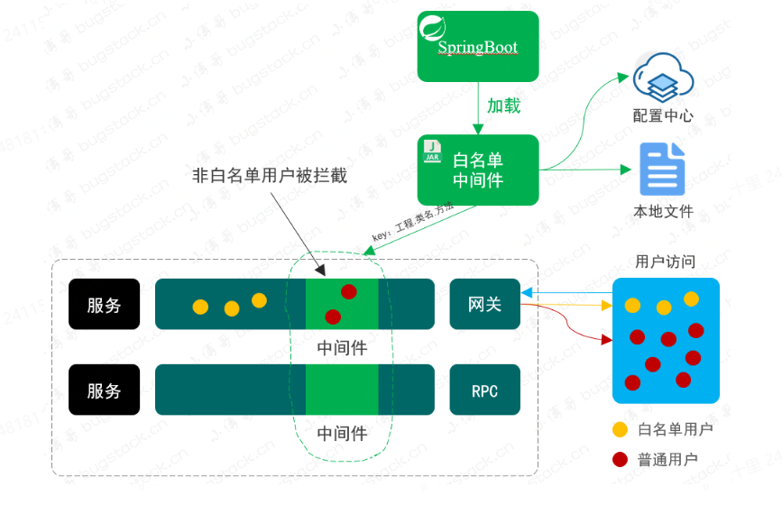
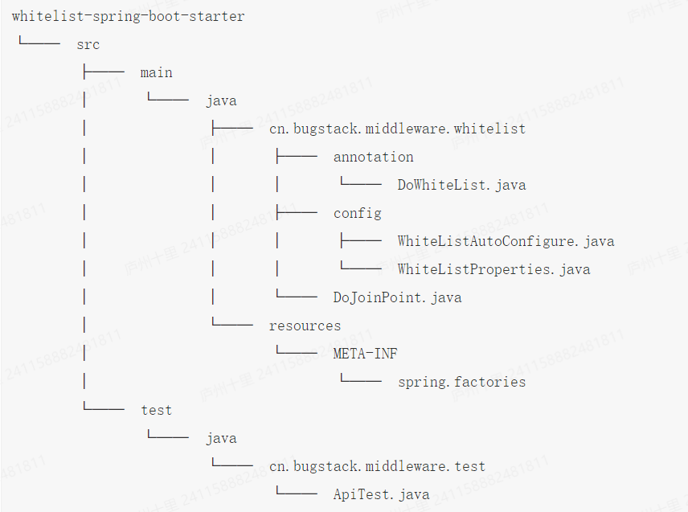
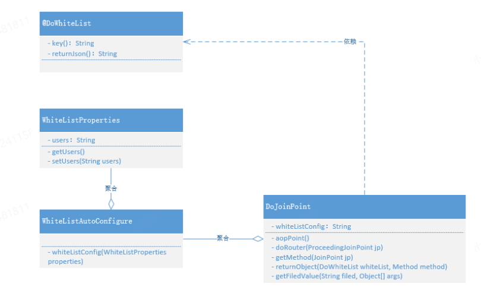

# 第 3 章 服务治理，统一白名单控制

## 需求背景

* 在互联网这种多数面向C端用户场景下的产品功能研发完成交付后，通常并不会直接发布上线。尤其是在一个原有服务功能已经沉淀了大量用户时，不断的迭代开发新增需求下，更不会贸然发布上线。
* 虽然在测试环境、预发环境都有了相应功能的验证，但在真实的用户场景下可能还会存在其他隐患问题。那么为了更好的控制系统风险，通常需要研发人员在代码的接口层，提供白名单控制。上线初期先提供可配置的白名单用户进行访问验证，控制整体的交付风险程度。
* 白名单确实可以解决接口功能或者服务入口的访问范围风险，那么这里有一个技术方案实现问题。就是如果研发人员在所有的接口上都加这样的白名单功能，那么就会非常耗费精力，同时在功能不再需要时可能还需要将代码删除。在这个大量添加和修改重复功能的代码过程中，也在一定程度上造成了研发成本和操作风险。所以站在整体的系统建设角度来说，我们需要有一个通用的白名单服务系统，减少研发在这方面的重复开发。

## 方案设计

* 白名单服务属于业务系统开发过程中可重复使用的通用功能，所以我们可以把这样的工具型功能单独提炼出来设计成技术组件，由各个需要的使用此功能的系统工程引入使用

  

* 使用自定义注解、切面技术和SpringBoot对于配置文件的处理方式，开发白名单中间件
* 在中间件中通过提取指定字段的入参与配置文件白名单用户列表做比对确认是否允许访问
* 最后把开发好的中间件引入到需要依赖的白名单服务系统，在SpringBoot启动进行加载

## 技术实现

### 工程结构

  

### 白名单中间类的关系

  

* DoWhiteList: 自定义注解，作用就是在需要使用到的白名单服务的接口上，添加此注解并且配置必要的信息。接口入参提取物字段属性名称、拦截之后的返回信息
* WhiteListAutoConfigure:配置下对SpringbOOT yml文件的使用，将yml文件的白名单信息读取到中间件中
* DoJoinPoint:是整个中间件的核心部分，负责对所有添加自定义注解的方法进行拦截和逻辑处理

