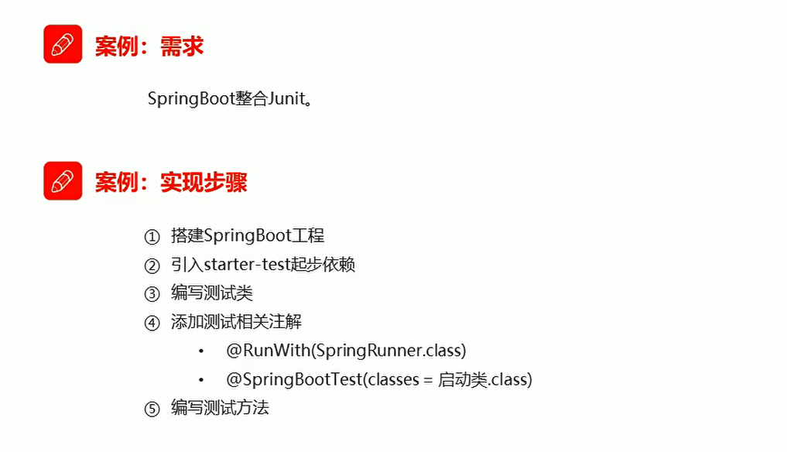
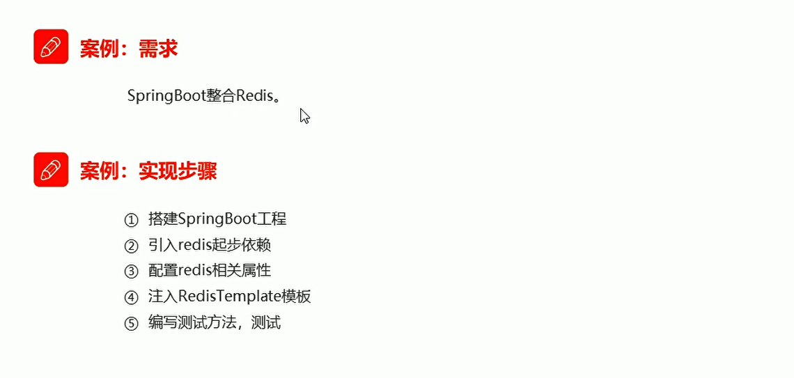
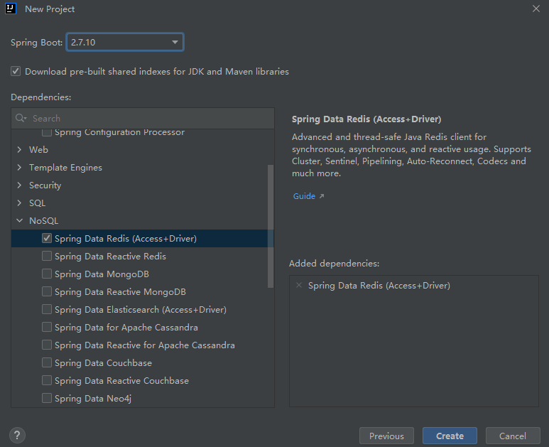
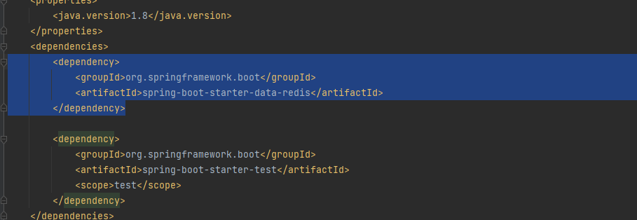
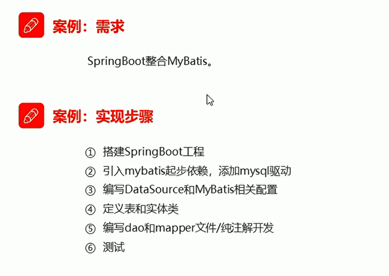
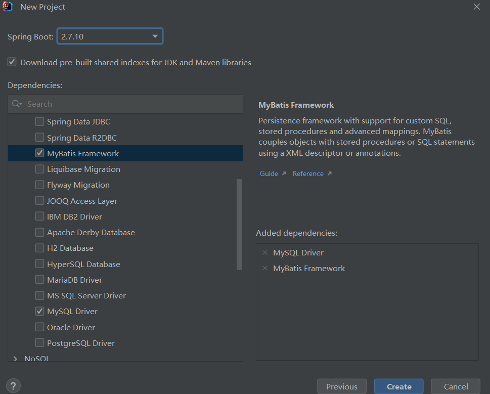

# SpringBoot整合其他框架 

## SpringBoot整合Junit

### 实现步骤

  

**用于单元测试**

* 首先编写一个业务类 UserService

```java
package com.itheima.service;


import org.springframework.stereotype.Service;

@Service
public class UserService {

    public void add(){
        System.out.println("add...");
    }

}


```

* 编写测试类

```java
package com.itheima.test;


// userService的测试类
import com.itheima.DemoSpring1Application;
import com.itheima.service.UserService;
import org.junit.Test;
import org.junit.runner.RunWith;
import org.springframework.beans.factory.annotation.Autowired;
import org.springframework.boot.test.context.SpringBootTest;
import org.springframework.test.context.junit4.SpringRunner;


// 注解 需要 添加springboot 引导类

@RunWith(SpringRunner.class)
@SpringBootTest(classes = DemoSpring1Application.class)
public class UserServiceTest {


//     注入userService  调用add方法
    @Autowired
    private UserService userService;

    @Test
    public void testAdd(){
        userService.add();// 测试add
    }

}
```

## Springboot整合redis


  

**创建新的工程 勾选redis**

  

查看依赖redis

  

```java
package com.itheima.springredis;

import org.junit.jupiter.api.Test;
import org.springframework.beans.factory.annotation.Autowired;
import org.springframework.boot.test.context.SpringBootTest;
import org.springframework.data.redis.core.BoundValueOperations;
import org.springframework.data.redis.core.RedisTemplate;

@SpringBootTest
class SpringRedisApplicationTests {

//     注入redisTemplate
    @Autowired
    private RedisTemplate redisTemplate;

    @Test
    void testSet() {
        // 存入数据
        redisTemplate.boundValueOps("name").set("zhangsan");
    }

    @Test
    void testGet() {
        // 获取数据
        Object name = redisTemplate.boundValueOps("name").get();// 通过key获取数据
    }

}

```

## Springboot整合mybatis

  


### 勾选依赖

  


**MySQL Driver  MyBatis FrameWork**

### 配置datasource数据源信息

**创建application.yml文件 填写配置信息**

```yml
spring:
  datasource:
    url: jdbc:mysql:///db111
    username: root
    password: 123456
    driver-class-name: com.mysql.jdbc.Driver

```

### 定义Mapper接口

**使用Mapper接口操作数据库**

```java
package com.itheima.springbootmybatis.mapper;
import com.itheima.springbootmybatis.domain.User;
import org.apache.ibatis.annotations.Mapper;
import org.apache.ibatis.annotations.Select;
import org.springframework.boot.autoconfigure.security.SecurityProperties;

import java.util.List;

@Mapper
public interface UserMapper {

//     查询所有用户
    @Select("select * from user")
    public List<User> findAll();

}


```


### 测试


**在引导类注入Mapper接口  进行测试**

```java
package com.itheima.springbootmybatis;

import com.itheima.springbootmybatis.domain.User;
import com.itheima.springbootmybatis.mapper.UserMapper;
import org.apache.ibatis.annotations.Mapper;
import org.junit.jupiter.api.Test;
import org.springframework.beans.factory.annotation.Autowired;
import org.springframework.boot.test.context.SpringBootTest;

import java.util.List;

@SpringBootTest
class SpringbootMybatisApplicationTests {
    @Autowired
    private UserMapper userMapper;// 注入Mapper接口资源

    @Test
    public void testFindAll(){
        // 调用接口方法
        List<User> all = userMapper.findAll();
        System.out.println(all);
    }

    @Test
    void contextLoads() {
    }

}

```

### UserXmlMapper配置

* UserXmlMapper

```java
package com.itheima.springbootmybatis.mapper;


import com.itheima.springbootmybatis.domain.User;
import org.apache.ibatis.annotations.Mapper;
import org.springframework.stereotype.Repository;

import java.util.List;

@Mapper
@Repository
public interface UserXmlMapper {
    public List<User> findAll();
}


```

**映射配置文件**


