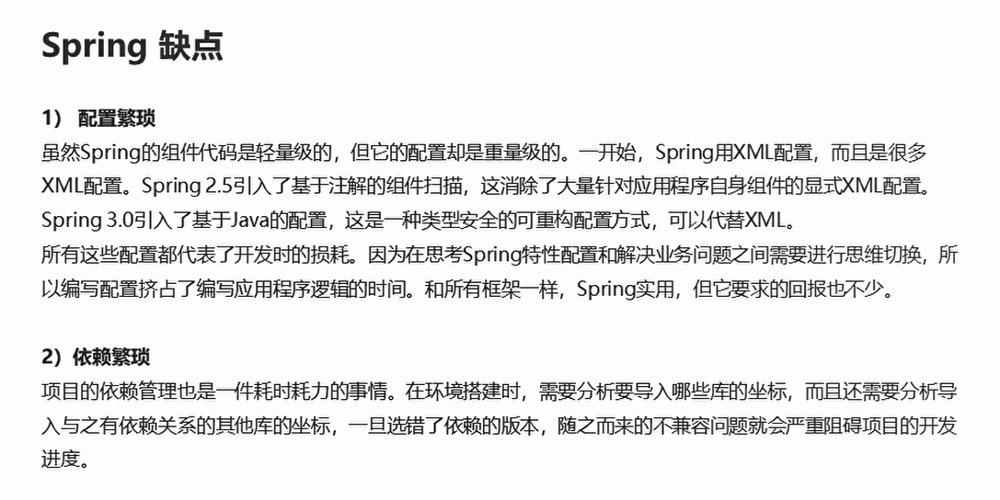
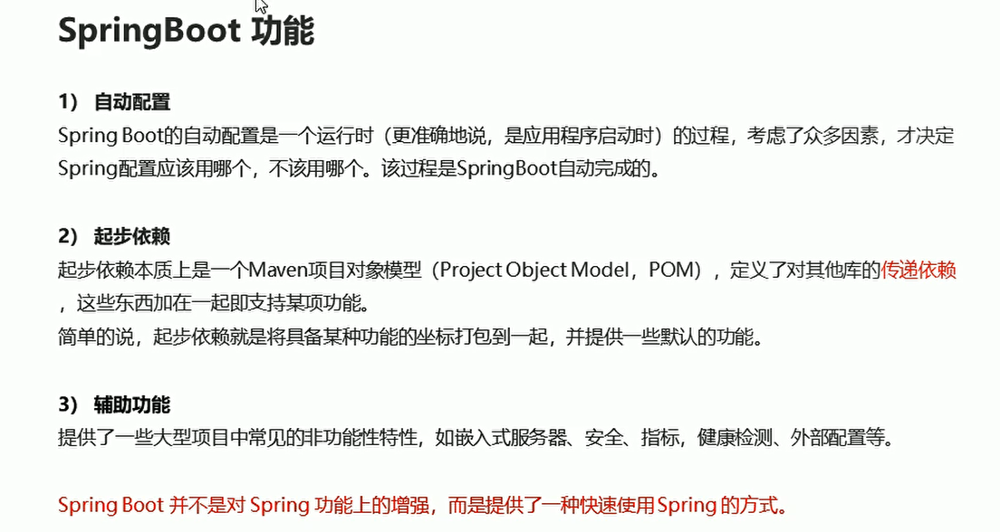
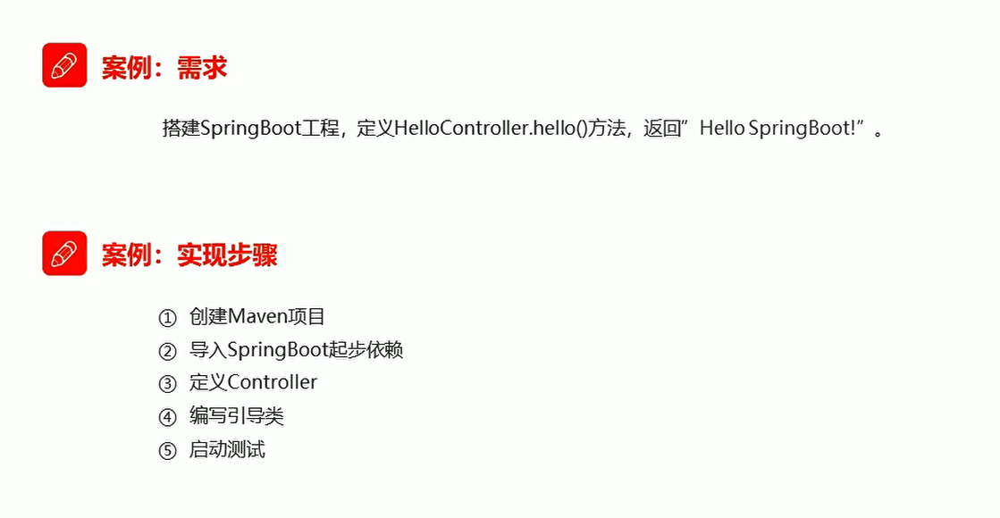
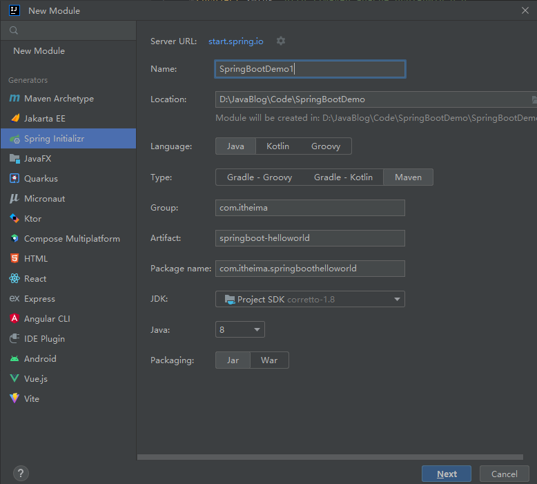
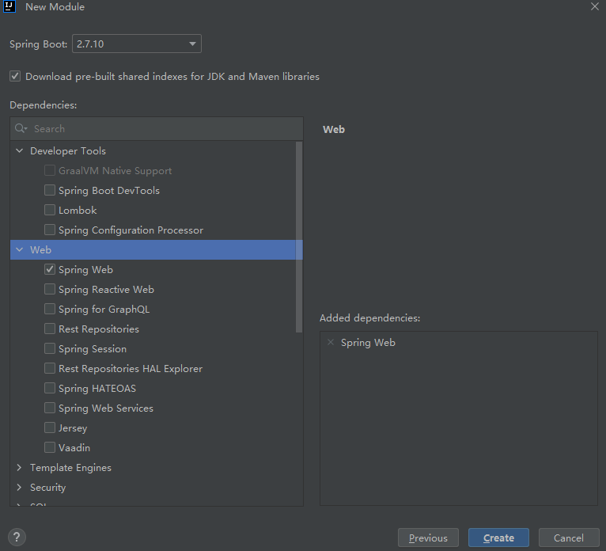
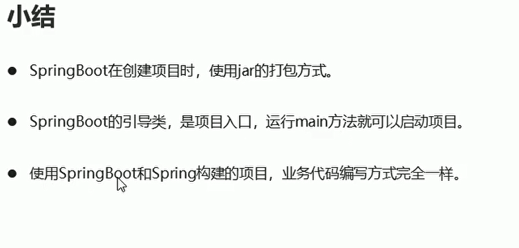
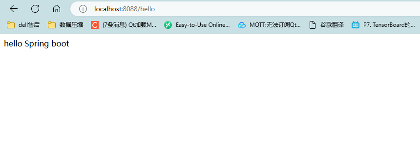

# SpringBoot概述以及快速入门

## Spring缺点

  

## SpringBoot功能概述

  

## 快速入门

  

### 创建springboot工程-MAVEN

  

  

### 导入springboot起步依赖

```xml
<!--    springboot工程需要继承的父工程-->
    <parent>
        <groupId>org.springframework.boot</groupId>
        <artifactId>spring-boot-starter-parent</artifactId>
        <version>2.7.10</version>
        <relativePath/> <!-- lookup parent from repository -->
    </parent>

```


```xml
<!--        web开发的起步依赖-->
        <dependency>
            <groupId>org.springframework.boot</groupId>
            <artifactId>spring-boot-starter-web</artifactId>
        </dependency>

```

### 编写controller

```java
package com.itheima.controller;
import org.springframework.web.bind.annotation.RequestMapping;
import org.springframework.web.bind.annotation.RestController;

// 定义controller层
@RestController
public class HelloController {
    // 定义 资源访问路径
    @RequestMapping("/hello")
    public String hello(){
        return "hello Spring boot";
    }
}
```


### 编写引导类-项目入口


```java
package com.itheima;
import org.springframework.boot.SpringApplication;
import org.springframework.boot.autoconfigure.SpringBootApplication;

// springboot项目的入口
@SpringBootApplication
public class DemoSpring1Application {

    public static void main(String[] args) {
        SpringApplication.run(DemoSpring1Application.class, args);
    }

}

```

  


  


