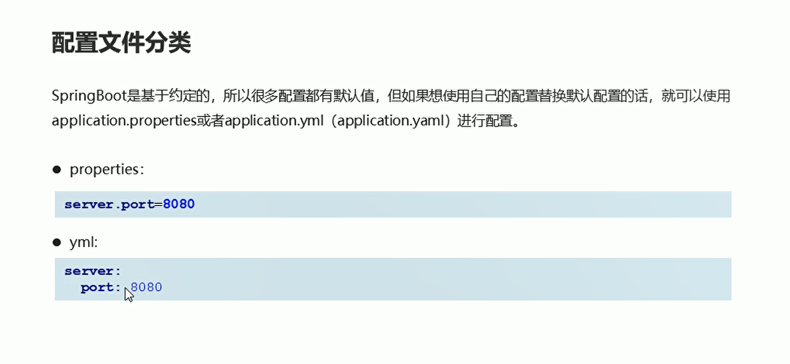
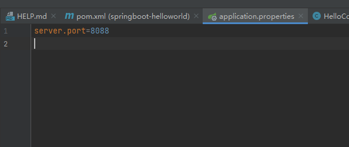
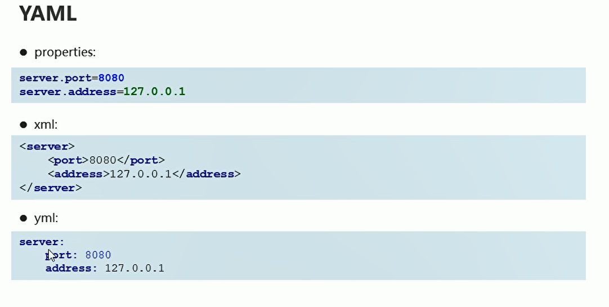
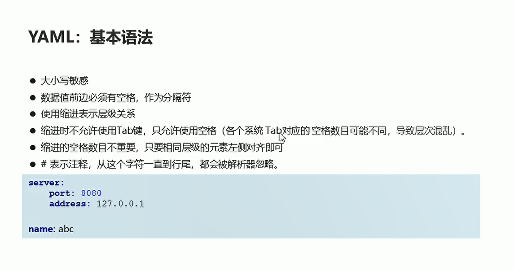
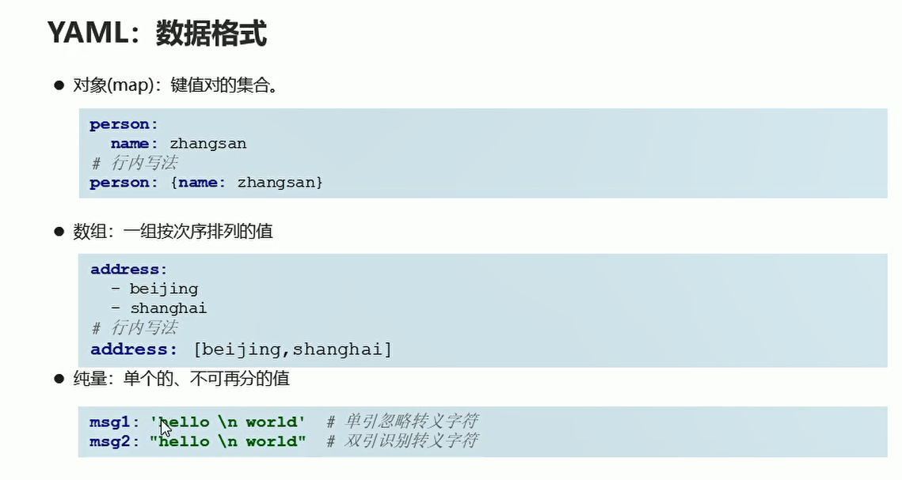
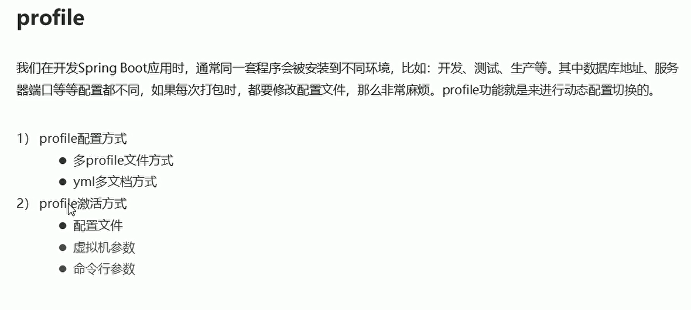
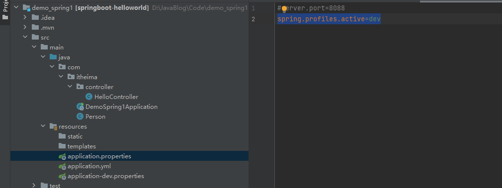
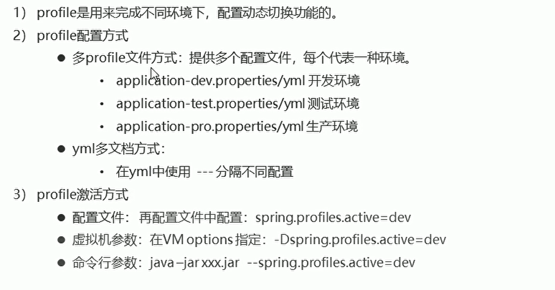
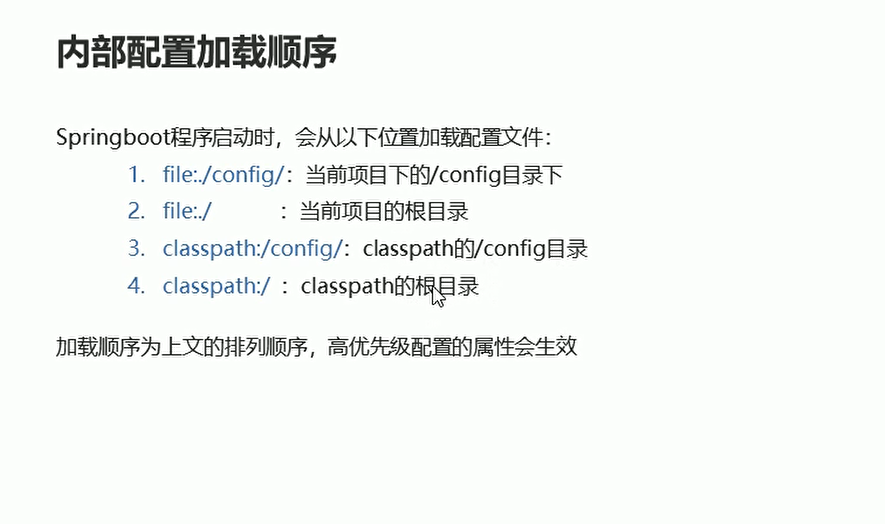

# SpringBoot配置

## 配置文件分类

<!-- 内容分为 自动配置 还有用户自定义的内容 -->

  

  

## YAML基本语法

  

  

数据格式

  

## 读取配置文件的内容


* @Value


**注入properties文件中的单个的值**

```java
package com.itheima.controller;
import org.springframework.beans.factory.annotation.Value;
import org.springframework.web.bind.annotation.RequestMapping;
import org.springframework.web.bind.annotation.RestController;

// 定义controller层
@RestController
public class HelloController {

    // 注入数组资源
    @Value("${address[0]")
    private String address1;// 注入数组资源


//     注入对象的属性
    @Value("${person.name")
    private String name2;

    @RequestMapping("/hello3")
//    @RequestMapping("/hello2")
    public String hello3(){
        System.out.println(name2);// 打印name
        System.out.println(address1);
        return "hello Spring boot1112222222222";
    }

    // 使用注解 将properties文件将资源导入
    @Value("${name}")
    private String name;

    @RequestMapping("/hello2")
    public String hello2(){
        System.out.println(name);// 打印name
        return "hello Spring boot111";
    }

    // 定义 资源访问路径
    @RequestMapping("/hello")
    public String hello(){
        return "hello Spring boot";
    }
}
```


* Environment

```java
package com.itheima.controller;
import org.springframework.beans.factory.annotation.Autowired;
import org.springframework.beans.factory.annotation.Value;
import org.springframework.core.env.Environment;
import org.springframework.web.bind.annotation.RequestMapping;
import org.springframework.web.bind.annotation.RestController;

// 定义controller层
@RestController
public class HelloController {


    @Autowired
    private Environment env;// 注入环境资源

    // 注入数组资源
    @Value("${address[0]")
    private String address1;// 注入数组资源


//     注入对象的属性
    @Value("${person.name")
    private String name2;

    @RequestMapping("/hello3")
//    @RequestMapping("/hello2")
    public String hello3(){
        System.out.println(name2);// 打印name
        System.out.println(address1);

        System.out.println("------------------------------");

        System.out.println(env.getProperty("person.name"));
        System.out.println(env.getProperty("address[0]"));


        return "hello Spring boot1112222222222";
    }

    // 使用注解 将properties文件将资源导入
    @Value("${name}")
    private String name;

    @RequestMapping("/hello2")
    public String hello2(){
        System.out.println(name);// 打印name
        return "hello Spring boot111";
    }

    // 定义 资源访问路径
    @RequestMapping("/hello")
    public String hello(){
        return "hello Spring boot";
    }
}


```


* @ConfigurationProperties

**使用该注解提供pojo类的资源注入**
Person类

```
package com.itheima;

import org.springframework.boot.context.properties.ConfigurationProperties;
import org.springframework.stereotype.Component;


// 注入name  age属性
// 自定义bean资源组件
@Component
@ConfigurationProperties(prefix = "person")
public class Person {

    private String name;
    private int age;

    public String getName() {
        return name;
    }

    public void setName(String name) {
        this.name = name;
    }

    public int getAge() {
        return age;
    }

    public void setAge(int age) {
        this.age = age;
    }

    @Override
    public String toString() {
        return "Person{" +
                "name='" + name + '\'' +
                ", age=" + age +
                '}';
    }
}


```


Controller


```java
package com.itheima.controller;
import com.itheima.Person;
import org.springframework.beans.factory.annotation.Autowired;
import org.springframework.beans.factory.annotation.Value;
import org.springframework.core.env.Environment;
import org.springframework.web.bind.annotation.RequestMapping;
import org.springframework.web.bind.annotation.RestController;

// 定义controller层
@RestController
public class HelloController {
    @Autowired
    private Person person;// 注入Person资源  使用properties资源  创建person对象

    @Autowired
    private Environment env;// 注入环境资源

    // 注入数组资源
    @Value("${address[0]")
    private String address1;// 注入数组资源


//     注入对象的属性
    @Value("${person.name")
    private String name2;

    @RequestMapping("/hello3")
//    @RequestMapping("/hello2")
    public String hello3(){
        System.out.println(name2);// 打印name
        System.out.println(address1);

        System.out.println("------------------------------");

        System.out.println(env.getProperty("person.name"));
        System.out.println(env.getProperty("address[0]"));


        System.out.println("---------------------------------");
        System.out.println(person);


        return "hello Spring boot1112222222222";
    }

    // 使用注解 将properties文件将资源导入
    @Value("${name}")
    private String name;

    @RequestMapping("/hello2")
    public String hello2(){
        System.out.println(name);// 打印name
        return "hello Spring boot111";
    }

    // 定义 资源访问路径
    @RequestMapping("/hello")
    public String hello(){
        return "hello Spring boot";
    }
}


```

## Profile文件配置

  

**创建另一个properties文件，里面填写端口号**

  

**在application.properties文件中引入该properties文件**

  


## 内部配置的加载顺序

  


