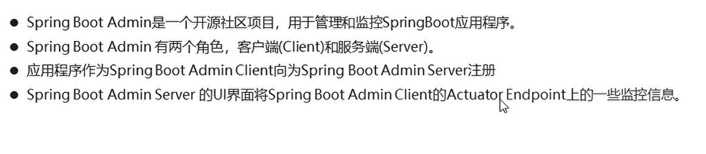
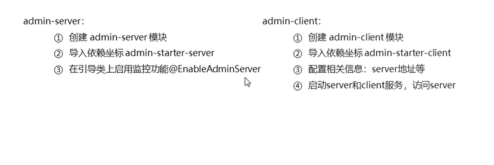
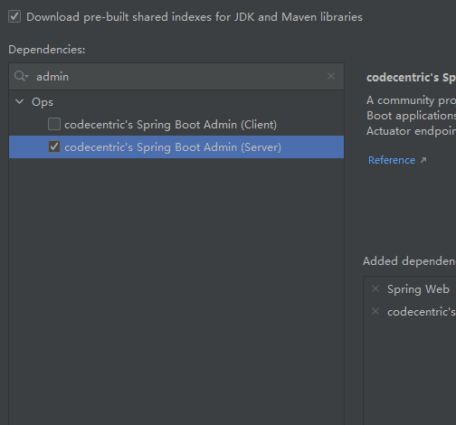
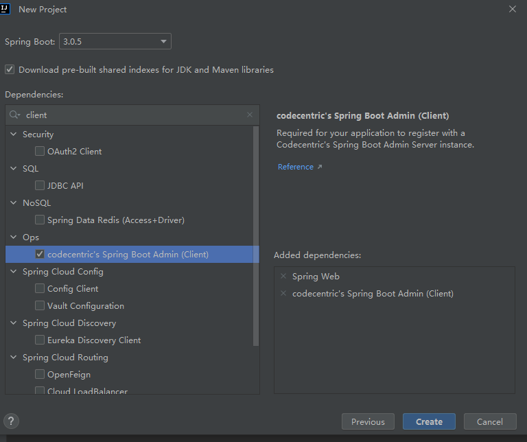
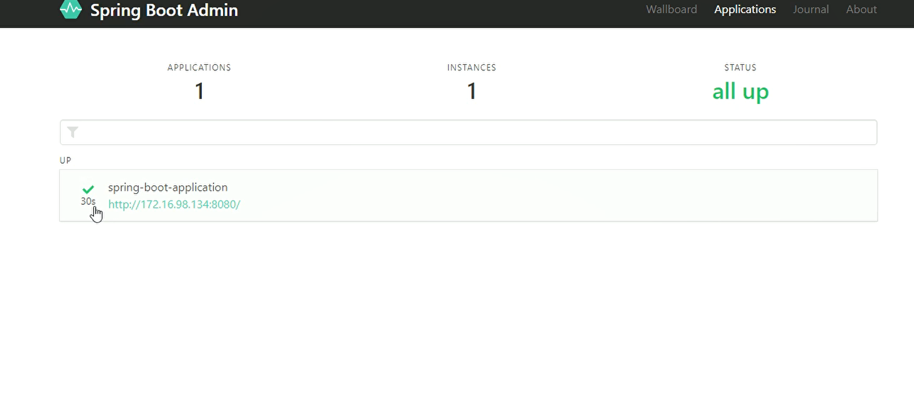

# SpringBoot  Admin 图形化界面


## 简单介绍

  


  


## 创建spring-admin-server模块

**勾选spring web和admin server两个依赖**

  

**服务端添加注解EnableAdminServer**

```java
package com.itheima.springadminserver;

import de.codecentric.boot.admin.server.config.EnableAdminServer;
import org.springframework.boot.SpringApplication;
import org.springframework.boot.autoconfigure.SpringBootApplication;


@EnableAdminServer
@SpringBootApplication
public class SpringAdminServerApplication {

    public static void main(String[] args) {
        SpringApplication.run(SpringAdminServerApplication.class, args);
    }

}

```


## 创建spring-admin-client模块

  

在application.properties文件中指定服务器地址


```xml

# 指定admin.server地址
spring.boot.admin.client.url=http://localhost:9000

# 健康信息检查
management.endpoint.health.show-details=always

# 开启所有的配置
management.endpoints.web.exposure.include=*
```


## 启动


**启动server 之后启动client,地址栏输入localhost:端口号**

  

