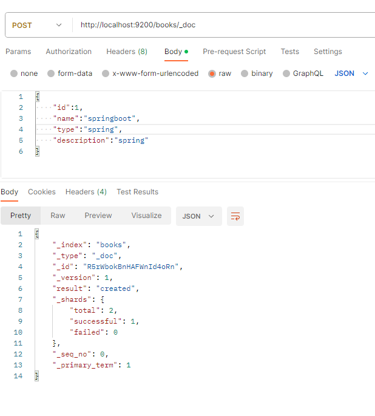

# ES简单快速入门

## 概述


* Elasticsearch是一个分布式全文搜索引擎


## 下载与安装

```
https://www.elastic.co/cn/downloads/elasticsearch

```

下载之后 解压文件夹，进入bin目录，双击elasticsearch.bat文件

一开始初始化时间比较久，之后初始化之后，浏览器输入localhost:9200看看有没有启动成功

  


## 索引与操作

启动ES服务之后，我们使用Postman发送一个put请求，添加一个索引,创建books索引

  

使用get操作 查询索引

  


## 下载IK分词器


下载地址：https://github.com/medcl/elasticsearch-analysis-ik/releases


下载之后，解压到plugins文件夹下面

  


然后重新启动ES


重新写入数据，通过json数据的形式重新发送数据，最后写入mappings中

mappings写入装在数据的格式

下面定义了之后要写入的数据格式信息
```
{
    "mappings":{
        "properties":{
            "id":{
                "type":"keyword"
            },
            "name":{
                "type":"text",
                "analyzer":"ik_max_word",
                "copy_to":"all"
            },
            "type":{
                "type":"keyword"
            },
            "description":{
                "type":"text",
                "analyzer":"ik_max_word",
                "copy_to":"all"
            },
            "all":{
                "type":"text",
                "analyzer":"ik_max_word"
            }
        }
    }
}

```


使用get请求获取数据


  


## ES文档操作

添加文档信息，上面创建books索引并且定义了它的相关属性，下面进行添加数据

```
{
    "id":1,
    "name":"springboot",
    "type":"spring",
    "description":"spring"
}

```

  

添加指定id的数据

  

然后查询指定id的数据
  


使用search查询所有的id

  


使用分词查询，查询name中包含good的数据

  


删除数据

  

## springboot整合ES

* 导入ES坐标

```java
        <dependency>
            <groupId>org.elasticsearch.client</groupId>
            <artifactId>elasticsearch-rest-high-level-client</artifactId>
        </dependency>
```


* 添加配置，主要是配置服务器

```
spring.elasticsearch.uris= http://localhost:9200

```

* 创建客户端对象  发送索引

```java
package com.ustc;

import com.baomidou.mybatisplus.core.metadata.IPage;
import com.baomidou.mybatisplus.extension.plugins.pagination.Page;
import org.apache.http.HttpHost;
import org.elasticsearch.client.RestClient;
import org.elasticsearch.client.RestClientBuilder;
import org.elasticsearch.client.RestHighLevelClient;
import org.elasticsearch.client.indices.CreateIndexRequest;
import org.junit.jupiter.api.Test;
import org.springframework.boot.test.context.SpringBootTest;

import java.io.IOException;

@SpringBootTest
class Quick1ApplicationTests {
    @Test
    void contextLoads() {
    }

    private RestHighLevelClient client;// 创建客户端对象

    @Test
    void testCreateClient() throws IOException {
        // 创建客户端
        HttpHost host = HttpHost.create("http://localhost:9200");
        RestClientBuilder builder = RestClient.builder(host);
        client = new RestHighLevelClient(builder);
        // 创建请求  使用客户端发送请求  创建一个索引请求
        CreateIndexRequest request = new CreateIndexRequest("book");
        client.close();
    }
}


```


* 在请求中添加参数  创建带参数的索引

```java
 @Test
    void test2() throws IOException {

//        创建请求
        CreateIndexRequest request = new CreateIndexRequest("hhh");

        String json = "{\n" +
                "    \"mappings\":{\n" +
                "        \"properties\":{\n" +
                "            \"id\":{\n" +
                "                \"type\":\"keyword\"\n" +
                "            },\n" +
                "            \"name\":{\n" +
                "                \"type\":\"text\",\n" +
                "                \"analyzer\":\"ik_max_word\",\n" +
                "                \"copy_to\":\"all\"\n" +
                "            },\n" +
                "            \"type\":{\n" +
                "                \"type\":\"keyword\"\n" +
                "            },\n" +
                "            \"description\":{\n" +
                "                \"type\":\"text\",\n" +
                "                \"analyzer\":\"ik_max_word\",\n" +
                "                \"copy_to\":\"all\"\n" +
                "            },\n" +
                "            \"all\":{\n" +
                "                \"type\":\"text\",\n" +
                "                \"analyzer\":\"ik_max_word\"\n" +
                "            }\n" +
                "        }\n" +
                "    }\n" +
                "}";

        // 设置请求中的参数
        request.source(json, XContentType.JSON);
        client.indices().create(request, RequestOptions.DEFAULT);
    }

```


## 文档查询操作

* 根据id进行查询

```java
    void test4() throws IOException {
        // 按照id进行查询
        GetRequest request = new GetRequest("books","1");
        GetResponse response = client.get(request,RequestOptions.DEFAULT);

        String json = response.getSourceAsString();
        System.out.println(json);

    }

```

* 按照条件查询
```java
  @Test
    void test5() throws IOException {
        // 创建查询请求
        SearchRequest request = new SearchRequest("BOOKS");

        // 创建查询条件
        SearchSourceBuilder builder = new SearchSourceBuilder();
        builder.query(QueryBuilders.termQuery("name","java"));
        request.source(builder);

        SearchResponse response = client.search(request,RequestOptions.DEFAULT);
        SearchHits hits = response.getHits();

        for(SearchHit hit: hits){
            String source = hit.getSourceAsString();
            System.out.println(source);
        }

    }

```
