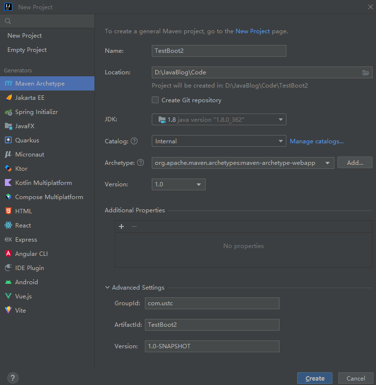
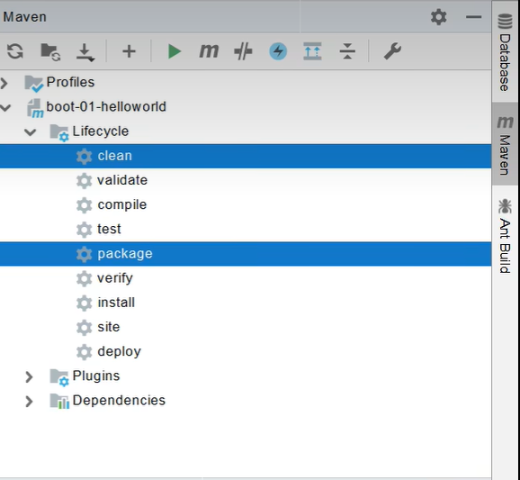
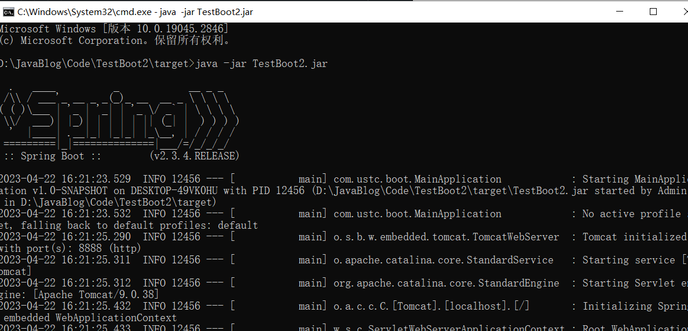

# HelloWorld入门

## 创建MAVEN工程

  

### 导入parent依赖

```xml
  <parent>
    <groupId>org.springframework.boot</groupId>
    <artifactId>spring-boot-starter-parent</artifactId>
    <version>2.3.4.RELEASE</version>
  </parent>


```

### WEB开发 导入依赖

```xml
    <dependency>
      <groupId>org.springframework.boot</groupId>
      <artifactId>spring-boot-starter-web</artifactId>
    </dependency>

```

### 添加主程序

```java
package com.ustc.boot;


import org.springframework.boot.SpringApplication;
import org.springframework.boot.autoconfigure.SpringBootApplication;

// 加上注解  表示这是一个springboot应用  主程序类 入口类
@SpringBootApplication
public class MainApplication {
    public static void main(String[] args) {
        SpringApplication.run(MainApplication.class,args);
    }
}


```

### 添加Controller

```java
package com.ustc.boot.controller;
import org.springframework.stereotype.Controller;
import org.springframework.web.bind.annotation.RequestMapping;
import org.springframework.web.bind.annotation.ResponseBody;

@ResponseBody
@Controller
public class HelloController {
//     注解  映射请求
//     responseBody 注解表示 return 返回的语句直接写入浏览器 而不是跳转到某一个页面
//    将返回数据作为响应体  方法的返回值直接写入HTTP相应的Body部分 作为翔殷大哥内容返回给客户端
//    将Java对象转换为HTTP相应的内容 并通过HTTP协议返回给客户端
    @RequestMapping("/hello")
    public String handle01(){
        return "Hello Spring Boot 2!";
    }
}


```

### 创建可执行的jar包

**将工程文件打包成jar包，包括代码和运行环境**

**添加插件**

```java
  <build>
    <finalName>TestBoot2</finalName>
    <plugins>
      <plugin>
        <groupId>org.springframework.boot</groupId>
        <artifactId>spring-boot-maven-plugin</artifactId>
      </plugin>
    </plugins>
  </build>

```

**点击package 进行打包**

  

**然后在cmd命令行内部进行运行**

  

