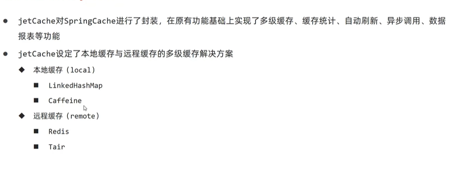

# jetCache

## 简单介绍

  


* 导入pom依赖

```xml
        <dependency>
            <groupId>com.alicp.jetcache</groupId>
            <artifactId>jetcache-starter-redis</artifactId>
            <version>2.6.2</version>
        </dependency>

```

* 配置本地远程连接方案

```java
jetcache:
    remote:
        default:
            type:redis
            host:localhost
            port:6379
            poolConfig: 
                maxTotal: 50

```

* jetCache启用缓存的主开关

```java
package com.ustc;

import com.alicp.jetcache.anno.config.EnableCreateCacheAnnotation;
import org.springframework.boot.SpringApplication;
import org.springframework.boot.autoconfigure.SpringBootApplication;
import org.springframework.cache.annotation.EnableCaching;

@SpringBootApplication
@EnableCaching
@EnableCreateCacheAnnotation
public class Quick1Application {

    public static void main(String[] args) {
        SpringApplication.run(Quick1Application.class, args);
    }

}
```


```java
package com.ustc.service.impl;

import com.alicp.jetcache.anno.CreateCache;
import com.ustc.controller.utils.CodeUtils;
import com.ustc.domain.SMSCode;
import com.ustc.service.SMSCodeService;
import org.springframework.beans.factory.annotation.Autowired;
import org.springframework.cache.Cache;
import org.springframework.cache.annotation.CachePut;
import org.springframework.cache.annotation.Cacheable;
import org.springframework.stereotype.Service;

import java.util.concurrent.TimeUnit;


@Service
public class SMSCodeServiceImpl implements SMSCodeService {
    @Autowired
    private CodeUtils codeUtils;


    // 创建缓存对象
    @CreateCache(name="jetCache",expire = 3600,timeUnit = TimeUnit.SECONDS)
    private Cache<String,String> jetCache;

    @Override
    @CachePut(value = "smsCode",key = "#tele")
    public String sendCodeToSMS(String tele) {
        // 当前方法的返回值 进入当前key所对应的缓存中
        String code = codeUtils.generator(tele);
        jetCache.put("tele",code);// 存入key value
        return code;
    }

    @Override
    public boolean checkCode(SMSCode smsCode) {
        // 取出内存中的验证码 和传递过来的验证码进行比对 如果相同 返回true


        String code = jetCache.get(smsCode.getTele());
        return cacheCode.equals(code);
    }
}


```
