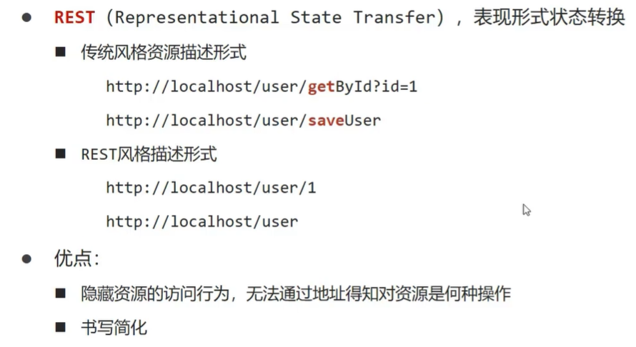
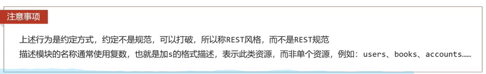

# Rest风格复习

## 简介

  

**通过一段路径和访问方式来确定访问资源的行为方式**

  

  


**使用POST方式**

```java
    // value定义 路径  method定义访问的方式
    @RequestMapping(value = "/users",method = RequestMethod.POST)
    @ResponseBody
    public String save(){
        System.out.println("user save...");
        return "{'module':'user save'}";
    }
```

  

**使用DELETE方式**

```java
    @RequestMapping(value = "/users/{id}",method = RequestMethod.DELETE)
    @ResponseBody
    public String delete(@PathVariable Integer id){
        System.out.println("user delete ..." + id);
        return "{'module':'user delete'}";
    }

```

  

  

## 三种注解的风格

* @RequestParam用于接受url地址传参或者表单传参
* @RequestBody用于接受json数据
* @PathVariable用于接受路径参数，使用{参数名称}描述路径参数
* 如果发送请求参数超过一个,以json格式为主 
* 如果发送非json个数数据 使用@RequestParam接受请求参数
* 采用RESTful进行开发，当参数数量比较少，使用@PathVariable接受请求路径变量，通常用来传递id值

## 快速开发

* RestController
* 类注解
* 作用：设置当前控制类为restful风格，等同于@Controller与@ResponseBody两个注解的功能


* GetMapping PostMapping PutMapping DeleteMapping
* 方法注解
* 基于springMVC的restful开发控制器方法
* 设置当前控制器方法请求访问路径与请求动作

  


