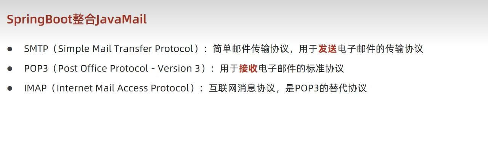

# SpringBoot整合JavaMail


## 简单使用-发送简单邮件

* 介绍协议

  

* 导入坐标

```java
        <dependency>
            <groupId>org.springframework.boot</groupId>
            <artifactId>spring-boot-starter-mail</artifactId>
        </dependency>

```

* 添加配置

```java
spring:
  mail:
    host: smtp.qq.com
    username: 
    password: mrqzoenvhtwledfb

```

* 开启定时任务功能

```java
    @Override
    public void sendMail() {
        SimpleMailMessage message = new SimpleMailMessage();

        // 设置发送右键的内容
        message.setFrom(from);
        message.setTo(to);
        message.setSubject(subject);
        message.setText(context);
        javaMailSender.send(message);

    }

```

```java
package com.ustc;

import com.ustc.service.SendService;
import org.junit.jupiter.api.Test;
import org.springframework.beans.factory.annotation.Autowired;
import org.springframework.boot.test.context.SpringBootTest;

@SpringBootTest
class Quick3ApplicationTests {

    @Autowired
    private SendService sendservice;// 注入接口

    @Test
    void contextLoads() {

        sendservice.sendMail();// 接口调用方法
    }

}


```

## JavaMail发送多部件邮件

```java
    @Override
    public void sendMail() throws MessagingException {
//        SimpleMailMessage message = new SimpleMailMessage();

        MimeMessage m =  javaMailSender.createMimeMessage();
        MimeMessageHelper message = new MimeMessageHelper(m);

        // 设置发送右键的内容
        message.setFrom(from);
        message.setTo(to);
        message.setSubject(subject);
        message.setText(context);

        // 添加附件
        File f1 = new File("D:\\1.txt");
        message.addAttachment(f1.getName(),f1);

        javaMailSender.send(message);

    }

```


