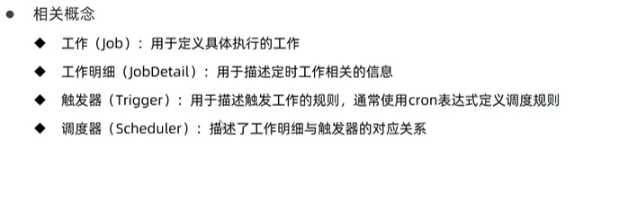

# SpringBoot整合Quartz

## 简单介绍


  


## 简单操作

* 导入相关pom依赖

```java
        <dependency>
            <groupId>org.springframework.boot</groupId>
            <artifactId>spring-boot-starter-quartz</artifactId>

        </dependency>

```


* 创建继承类MyQuartz

```java

package com.ustc.quartz;
import org.quartz.JobExecutionException;
import org.springframework.scheduling.quartz.QuartzJobBean;
public class MyQuartz extends QuartzJobBean{
    @Override
    protected void executeInternal(org.quartz.JobExecutionContext context) throws JobExecutionException {
        System.out.println("quartz task run...");
    }
}


```

* 添加配置类

触发器绑定工作明细，工作明细指定工作

```java
package com.ustc.config;


import com.ustc.quartz.MyQuartz;
import org.quartz.*;
import org.springframework.context.annotation.Bean;
import org.springframework.context.annotation.Configuration;

// java配置类
@Configuration
public class QuartzConfig {

    // 工作明细绑定具体的工作
    @Bean
    public JobDetail printJobDetail(){
        // 创建具体工作明细  将具体的类作为参数传入
        return JobBuilder.newJob(MyQuartz.class).storeDurably().build();
    }

    // 绑定对应的工作明细
    @Bean
    Trigger printJobTrigger(){
        ScheduleBuilder scheduleBuilder = CronScheduleBuilder.cronSchedule("0/5 * * * * ?");

        // 绑定对应的工作明细
        return TriggerBuilder.newTrigger().forJob(printJobDetail()).withSchedule(scheduleBuilder).build();
    }
}
```


