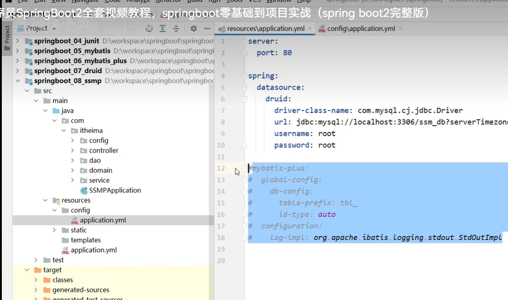

# SpringBoot运维使用篇

## 打包

**将程序打包成jar包，然后使用 java -jar 程序包名  运行程序**

**打包的jar包一般放在服务器上运行**


  

**打包之前先进行clean操作，然后执行Install操作**


* mvn package
* java -jar springboot.jar

## windows端口被占用

  


## 运行Jar包指定配置属性

**指定端口临时属性：java -jar xxx.jar --server.port=8080**

**命令行的配置属性覆盖文件中的配置属性**

  


## 可以在主程序入口添加属性

  

```java
package com.itheima;

import org.springframework.boot.SpringApplication;
import org.springframework.boot.autoconfigure.SpringBootApplication;

import java.util.Arrays;

@SpringBootApplication
public class SSMPApplication {

    public static void main(String[] args) {
        // args是运行自行配置的参数
        String[] arg = new String[1];
        arg[0] = "--server.port=8080";
//        System.out.println(Arrays.toString(args));

        SpringApplication.run(SSMPApplication.class, arg);
    }

}
```


## 配置文件优先级

**在resources下面添加config文件夹，下面添加yml配置文件，改yml配置文件的优先级高于原先的配置文件**

**config下面的yml文件是用来项目上线进行使用的，当打包成jar包之后，运行的端口是改配置文件下面的端口**

  


