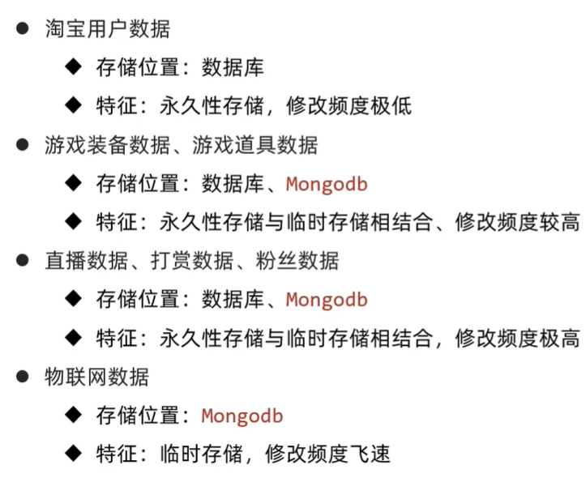
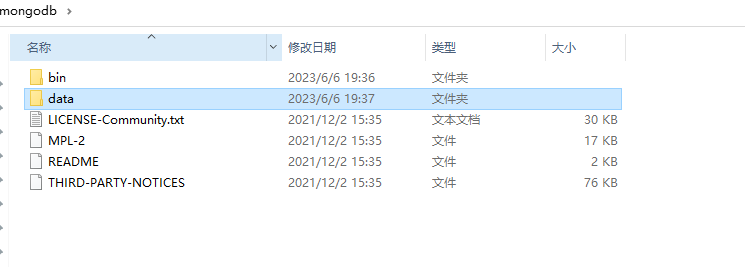
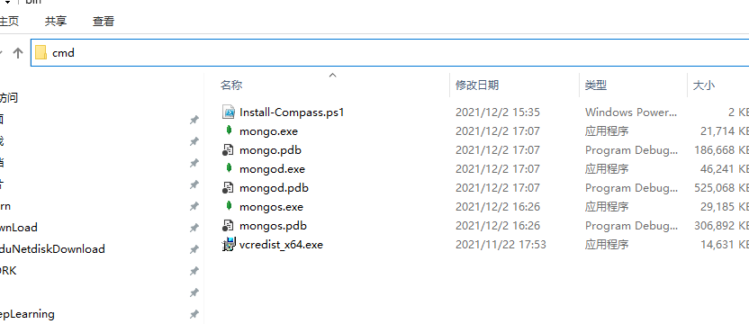
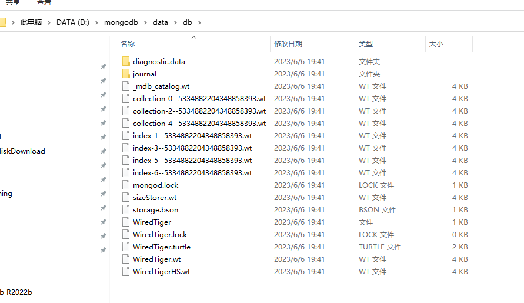
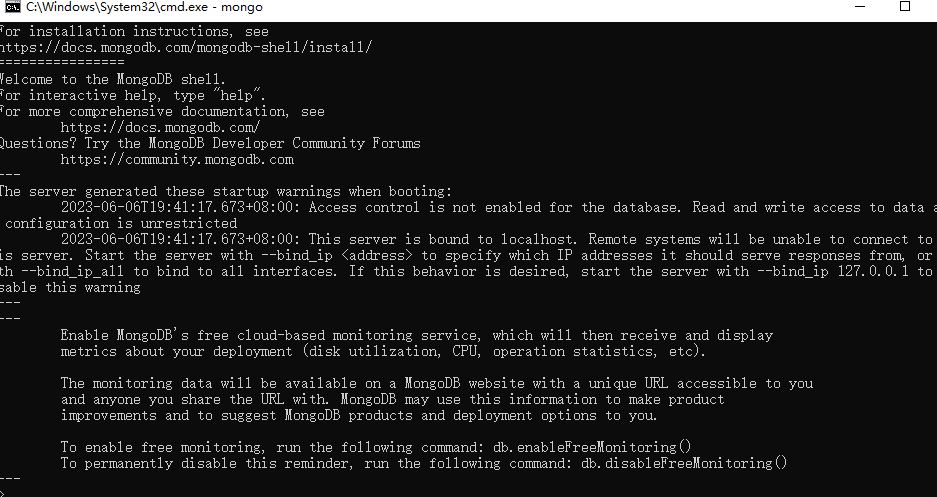
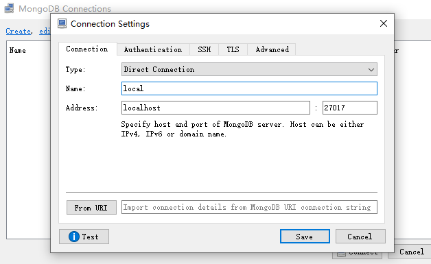
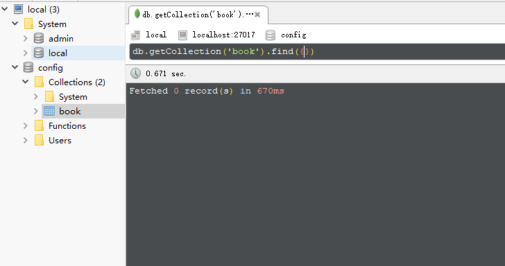
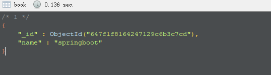
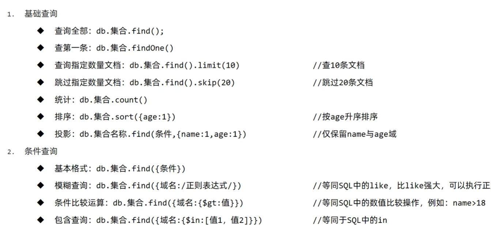
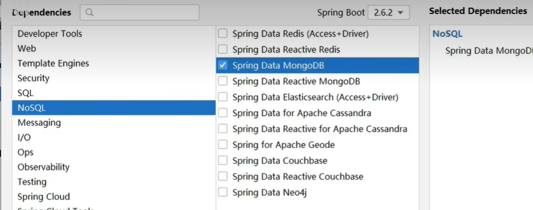

# MongoDB简单快速入门


## 简单介绍

&emsp;MongoDB是一个开源、高性能、无模式的文档型数据库。NoSQL数据库产品中的一种，是最想关系型数据库的非关系型数据库

## 应用场景

  


## 安装与启动

&emsp;直接将安装的压缩包进行解压，然后在创建一个data文件夹，在data文件夹下面创建一个子文件夹db

  


**启动服务端 创建数据库**
**mongod --dbpath=..\data\db**

进入bin目录下面 cmd回车
  

  


**启动客户端，直接使用mongo 默认服务器地址和端口号**

  


**但是命令行操作不够直观，也不是很方便，直接使用客户端软件操作robot3d**

**创建一个新的连接**

  


## 基础操作

* 创建一个表book
    


* 新增一个数据

```

db.book.save({"name":"springboot"})

```

* 查询表中的所有数据

```
db.getCollection('book').find({})

```

  


* 待条件的查询

```java
db.book.find({name:"springboot"})

```

* 更新操作

```
db.book.update({name:"springboot"},{$set:{name:"springboot2222"}})

```

  


## SpringBoot整合MongoDB


* 创建工程，记得勾选依赖

  

* 添加相关配置内容 连接创建的数据库

```
spring:
  data:
    mongodb:
      uri: mongodb://localhost/itheima

```

* 在测试类中进行测试

```java
package com.example;

import com.example.domain.Book;
import org.junit.jupiter.api.Test;
import org.springframework.beans.factory.annotation.Autowired;
import org.springframework.boot.test.context.SpringBootTest;
import org.springframework.data.mongodb.core.MongoTemplate;

import java.util.List;

@SpringBootTest
class Mongo1ApplicationTests {

    @Autowired
    private MongoTemplate mongoTemplate;

    @Test
    void contextLoads() {
        Book book = new Book();
        book.setId(2);
        book.setName("dcnjuasdbc");
        book.setType("dcnjuasdbc");
        book.setDescription("dcnjuasdbc");

//         使用mongoDB的API 存储数据
        mongoTemplate.save(book);
    }
    
    @Test
    void find(){
        List<Book> all = mongoTemplate.findAll(Book.class);
        System.out.println(all);

    }
}
```


