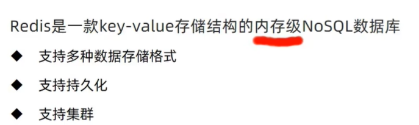
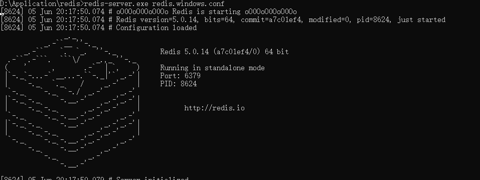
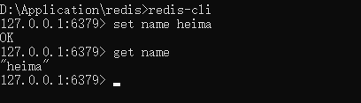
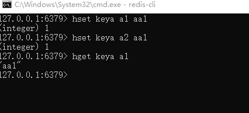
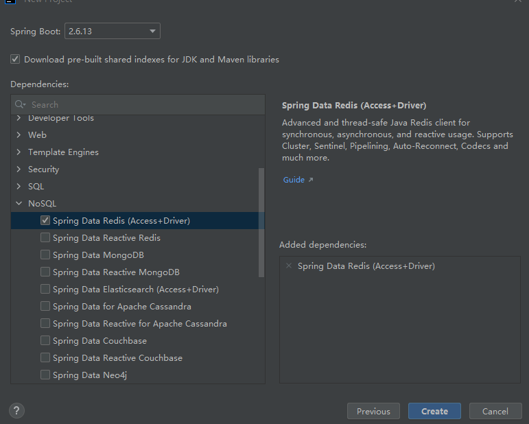

# 一文快速入门redis

## 简单介绍

  


## 启动redis

**使用命令redis-server.exe redis.windows.conf**

  


&emsp;连接redis服务，redis-cli,设置Key值  然后取出key值，

  


**redis清屏是clear**


&emsp;哈希存储结构，一个key对应多个key 然后每一个key对应一个value

  

## SpringBoot整合redis

**勾选依赖配置**
  

**导入yml配置**

```
spring:
  redis:
    host: localhost
    port: 6379

```


**测试代码.记得注入redisTemplate**

```java

package com.ustc;

import org.junit.jupiter.api.Test;
import org.springframework.beans.factory.annotation.Autowired;
import org.springframework.boot.test.context.SpringBootTest;
import org.springframework.data.redis.core.RedisTemplate;
import org.springframework.data.redis.core.ValueOperations;

@SpringBootTest
class Redis1ApplicationTests {

    @Autowired
    // 操纵redis
    private RedisTemplate redisTemplate;

    @Test
    void contextLoads() {
        System.out.println("fvcnsdjufhviuds");
    }
    
    @Test
    void set(){
//        存储一个值
        ValueOperations ops = redisTemplate.opsForValue();
        ops.set("age",11);
    }

    @Test
    void get(){
//        取出这个值
        ValueOperations ops = redisTemplate.opsForValue();
        Object age = ops.get("age");
        System.out.println(age);

    }

    

}

```

**测试hashSet**

```java
   @Test
    void hset(){
        HashOperations ops = redisTemplate.opsForHash();
        ops.put("info","b","bb");
    }
    

    @Test
    void hget(){
        HashOperations ops = redisTemplate.opsForHash();
        Object val = ops.get("info", "b");
        System.out.println(val);
    }


```

## 使用它StringReidsTemplate

**RedisTemplate 以对象作为key和value 内部对数据进行序列化**

```java
package com.ustc;

import org.junit.jupiter.api.Test;
import org.springframework.beans.factory.annotation.Autowired;
import org.springframework.boot.test.context.SpringBootTest;
import org.springframework.data.redis.core.StringRedisTemplate;
import org.springframework.data.redis.core.ValueOperations;

@SpringBootTest
public class Test1 {
    @Autowired
    private StringRedisTemplate stringRedisTemplate;

    @Test
    void get(){
        ValueOperations<String, String> ops = stringRedisTemplate.opsForValue();
        String name = ops.get("name");
        System.out.println(name);


    }
}


```


