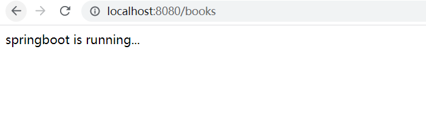
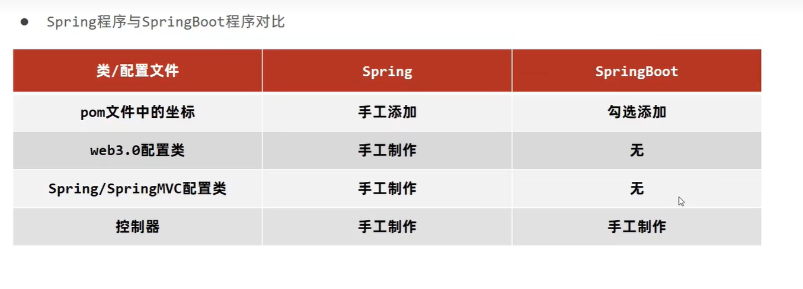
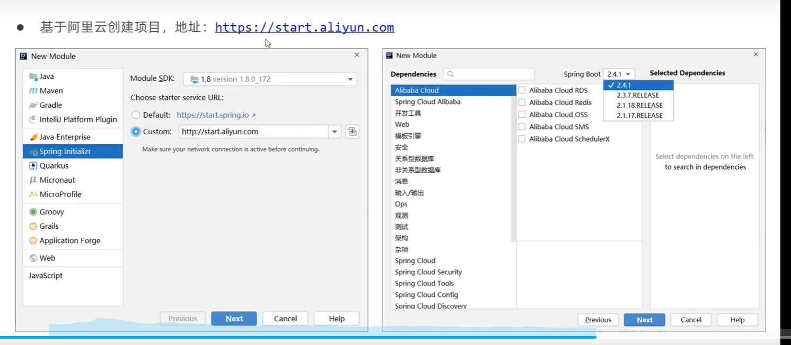
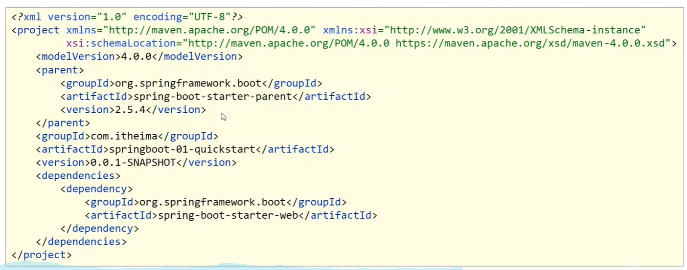
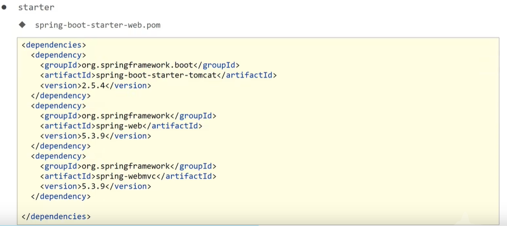
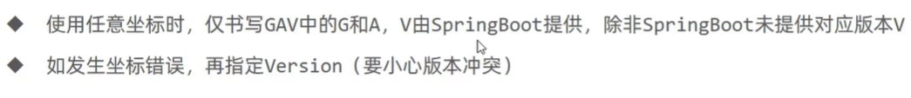
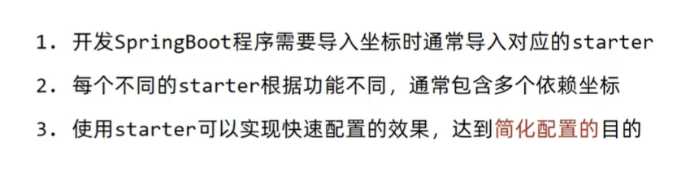
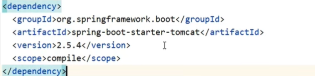
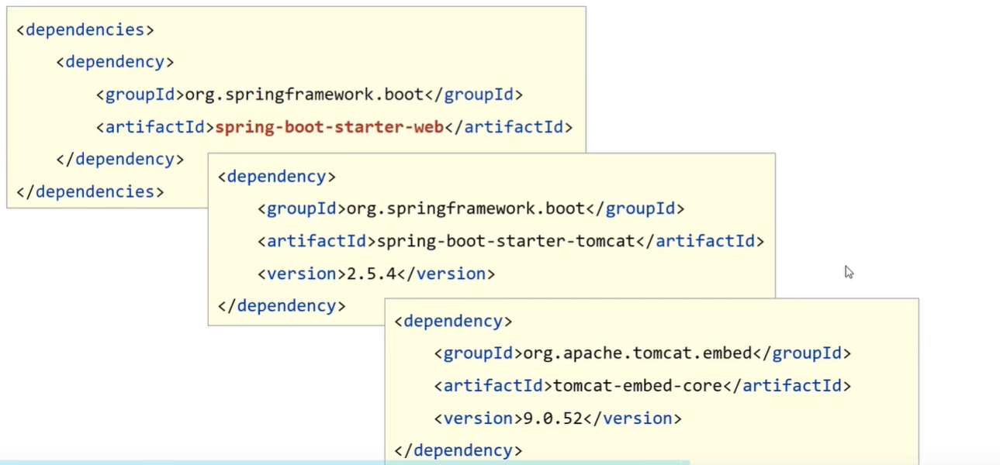

# SpringBoot入门学习笔记-快速认识

## 快速案例

* 在controller定义一个类
  ```java
    package com.ustc.sp5.controller;

    import org.springframework.web.bind.annotation.GetMapping;
    import org.springframework.web.bind.annotation.RequestMapping;
    import org.springframework.web.bind.annotation.RestController;

    // 第一个注解 满足restful风格的开发模式
    // 第二个注解  定义访问请求路径
    @RestController
    @RequestMapping("/books")
    public class BookController {

    //     该注解定义Get请求  访问方式
        @GetMapping
        public String getById(){
            System.out.println("spingboot is running");
            return "springboot is running...";
        }
    }


  ```

* 入口类启动

  


* spring 与 springboot 区别

  

* 连接aliyun创建springboot工程

  


## 入门案例解析

### parent


**parent继承dependencies,这里包含若干版本的坐标信息。这个dependencies中包含了很多properties 属性名，然后定义了若干坐标信息，引用这些属性名**

  

* 开发springBoot程序需要继承spring-boot-starter-parent
* spring-boot-starter-parent中定义了若干个依赖管理
* 继承parent的形式也可以采用引入依赖的形式实现效果
* 继承parent模块可以避免多个依赖使用相同技术时出现依赖版本冲突


### starter

**这里的依赖，不需要填写版本号，parent中标注好了各种依赖的版本号，start依赖会从parent中读取依赖的版本号**

  

**starter的依赖会有依赖传递**

* starter定义了当前项目使用的所有依赖坐标，以达到减少依赖配置的目的
* parent是所有SpringBoot项目要继承的项目，定义了若干个坐标版本号（依赖管理，并非依赖），以达到减少依赖冲突的目的
* spring-boot-starter-aprent各版本之间存在着诸多坐标版本不同

  

  


**；parent和starter都是为了解决配置问题**


### 引导类

**无论是spring还是springMVC 所有资源 所有对象都是交给IOC容器进行管理**

**引导类返回的就是一个IOC容器，可以获取bean资源对象,主要作用是加载资源，获得一个spring容器**

```java

package com.ustc.sp7;

import com.ustc.sp7.controller.BookController;
import org.springframework.boot.SpringApplication;
import org.springframework.boot.autoconfigure.SpringBootApplication;
import org.springframework.context.ConfigurableApplicationContext;

@SpringBootApplication
public class Sp7Application {

    public static void main(String[] args) {
        ConfigurableApplicationContext ctx = SpringApplication.run(Sp7Application.class, args);// 返回spring容器

//         获取Controller资源对象
        BookController bean = ctx.getBean(BookController.class);// 按照类型进行获取
        System.out.println("bean------>" + bean);
    }

}

```

* SpringBoot的引导类是Boot工程的执行入口，运行main方法就可以启动项目
* SpringBoot工程运行之后初始化spring容器，扫描引导类所在的包加载bean资源


### 内嵌tomcat

**在starter-web中包含tomcat依赖**

  

  

* 内嵌的Tomcat服务器是SpringBoot辅助功能
* 内嵌的Tomcat工作原理是将Tomcat服务器作为对象运行，并将改对象交给spring 容器管理

