# 基于SpringBoot的SSMP的整合案例

## 简单介绍

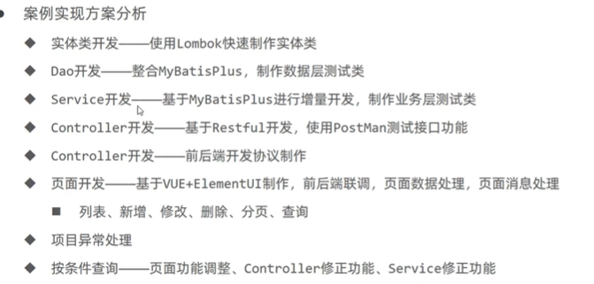  


## 模块创建

**添加spring WEB 和MYSQL driver的依赖**


**然后手动添加Mybatis-plus和druid的依赖**

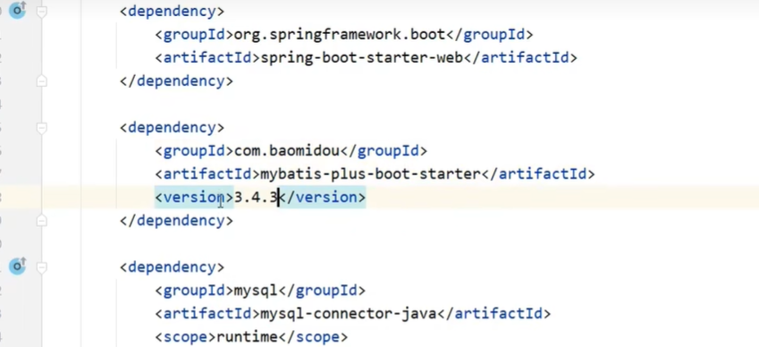  


**改写配置文件端口**
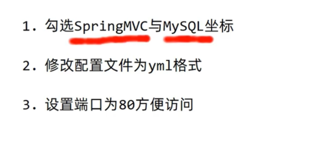  


## 创建实体类


**在domain包下面创建Book类，使用lombook技术自动配置相关get set操作**

**Lombok,一个Java类库，提供了一组注解，简化POJO实体类开发**

**添加lombok依赖，不需要添加坐标，因为parent已经包含坐标**

```java
        <dependency>
            <groupId>org.projectlombok</groupId>
            <artifactId>lombok</artifactId>
        </dependency>

```

**使用@Data注解简化开发**


```java
package com.ustc.domain;


import lombok.Data;

@Data
public class Book {

    private Integer id;
    private String type;
    private String name;
    private String description;
}


```


## 导入Mybatis-plus和druid的配置文件

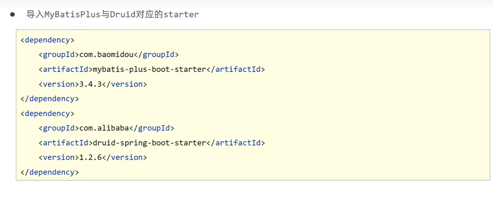  

```
server:
  port: 80
spring:
  datasource:
    druid:

      driver-class-name: com.mysql.cj.jdbc.Driver
      url: jdbc:mysql://localhost:3306/da?serverTimezone=UTC
      username: root
      password: 123456

mybatis-plus:
  global-config:
    db-config:
      table-prefix: tbl_

# 配置druid

```


## 使用junit测试查询方法

```java
package com.ustc;

import com.ustc.Dao.BookDao;
import org.junit.jupiter.api.Test;
import org.springframework.beans.factory.annotation.Autowired;
import org.springframework.boot.test.context.SpringBootTest;
import com.ustc.domain.Book;
@SpringBootTest
class Sp11ApplicationTests {

    @Autowired
    private BookDao bookDao;

    @Test
    void contextLoads() {
        System.out.println(bookDao.selectById(1));
    }


//    插入操作
    @Test
    void testSave(){
        Book book = new Book();
        book.setId(10);
        book.setType("心理");
        book.setName("111111111111111111");
        book.setDescription("dshf");
        bookDao.insert(book);
    }

    //    更新操作
    @Test
    void testSave1(){
        Book book = new Book();
        book.setId(10);
        book.setType("心理");
        book.setName("如何成为富婆");
        book.setDescription("dshf");
        bookDao.updateById(book);
    }

    // 删除操作
    @Test
    void testdelete(){
        bookDao.deleteById(1);
    }

    // 查询全部操作
    @Test
    void testGetAll(){
        System.out.println(bookDao.selectList(null));
    }


}


```

## MP分页查询

* 创建分页对象Page
* 创建分页拦截器

```java
//    分页查询操作  需要在配置类中添加拦截器
    @Test
    void testGetPage(){
        IPage page = new Page(1,2);//page是IPage的实现类

        // 输出数据
        System.out.println(bookDao.selectPage(page,null).getRecords());
    }


```

```java
package com.ustc.config;


import com.baomidou.mybatisplus.extension.plugins.MybatisPlusInterceptor;
import com.baomidou.mybatisplus.extension.plugins.inner.PaginationInnerInterceptor;
import org.springframework.context.annotation.Bean;
import org.springframework.context.annotation.Configuration;

@Configuration
public class MPConfig {

    // 定义拦截器
    //    注入拦截器资源
    @Bean
    public MybatisPlusInterceptor mybatisPlusInterceptor(){
//        创建mP拦截器
        MybatisPlusInterceptor interceptor = new MybatisPlusInterceptor();
        interceptor.addInnerInterceptor(new PaginationInnerInterceptor());// 添加分页拦截器
        return interceptor;

    }
}


```

## 按照条件进行查询

**使用QueryWrapper对象封装查询条件，推荐使用LambdaQueryWrapper对象，所有查询操作封装成方法调用**

```java
    @Test
    void testGetBy(){
        QueryWrapper<Book> qw = new QueryWrapper<>();

//        设置查询条件
        qw.like("name","Spring");

        bookDao.selectList(qw);// 传入查询条件
    }

    @Test
    void testGetBy1(){
        LambdaQueryWrapper<Book> qw = new LambdaQueryWrapper<>();

//        设置查询条件
        qw.like(Book::getName,"Spring");

        bookDao.selectList(qw);// 传入查询条件
    }

```

## 业务层Service开发

**Service层接口定义与数据层接口定义具有较大的区别，不要混用**

* selectByUserNameAndPassword(String username,String password)  数据层
* login(String username,String password)  业务层


* 定义 service接口
```java

package com.ustc.service;


import com.baomidou.mybatisplus.core.metadata.IPage;
import com.ustc.domain.Book;
import org.springframework.stereotype.Service;

import java.util.List;


public interface BookService {
//    业务层先定义 业务的接口
    Boolean save(Book book);
    Boolean update(Book book);
    Boolean delete(Integer id);

    Book getById(Integer id);

    List<Book> getAll();

//    分页查询接口
    IPage<Book> getPage(int currentPage, int pageSize);
}

```

* 定义service接口的实现类
```java
package com.ustc.service.Impl;

import com.baomidou.mybatisplus.core.metadata.IPage;
import com.baomidou.mybatisplus.extension.plugins.pagination.Page;
import com.ustc.Dao.BookDao;
import com.ustc.domain.Book;
import com.ustc.service.BookService;
import org.springframework.beans.factory.annotation.Autowired;
import org.springframework.stereotype.Service;

import java.util.List;


// 将该实现类定义成业务层的一个bean资源
@Service
public class BookServiceImpl implements BookService {
//     注入数据层的接口
    @Autowired
    private BookDao bookDao;


    @Override
    public Boolean save(Book book) {
        return bookDao.insert(book) > 0;
    }

    @Override
    public Boolean update(Book book) {
        return bookDao.updateById(book) > 0;
    }

    @Override
    public Boolean delete(Integer id) {
        return bookDao.deleteById(id) > 0;
    }

    @Override
    public Book getById(Integer id) {
        return bookDao.selectById(id);
    }

    @Override
    public List<Book> getAll() {
        return bookDao.selectList(null);
    }

    @Override
    public IPage<Book> getPage(int currentPage, int pageSize) {
//         首先创建分页查询对象
        IPage page = new Page(currentPage,pageSize);

        return bookDao.selectPage(page,null);
    }
}

```

* 注入bookService接口资源 进行查询测试

```java
//    分页查询
    @Test
    void testGetPage1(){
        IPage<Book> page = bookService.getPage(1,5);
        System.out.println(page.getRecords());

    }

//    使用业务层进行查询
    @Test
    void test1(){
        System.out.println(bookService.getById(4));
    }
```

## 业务层Service快速开发


* 首先定义一个IBookService

```java
package com.ustc.service;

import com.baomidou.mybatisplus.extension.service.IService;
import com.ustc.domain.Book;

public interface IBookService extends IService<Book> {
}


```

* 实现IBookService接口

```java
package com.ustc.service;

import com.baomidou.mybatisplus.extension.service.IService;
import com.ustc.domain.Book;
import org.springframework.stereotype.Service;


// 记得将实现类 注入为bean资源

@Service
public interface IBookService extends IService<Book> {
}
```

* 使用通用接口(IService<T>) 快速开发Service
* 使用通用实现类(ServiceImpl<M,T>) 快速开发ServiceImpl
* 可以在通用接口的基础上做功能重载或者功能追加
* 注意重载时不要覆盖原始的操作，避免原始提供的功能丢失


## 表现层开发

```java
package com.ustc.Controller;


import com.ustc.domain.Book;
import com.ustc.service.IBookService;
import org.apache.ibatis.annotations.Delete;
import org.springframework.beans.factory.annotation.Autowired;
import org.springframework.web.bind.annotation.*;

import java.util.List;

@RestController
@RequestMapping("/books")
public class BookController {

    @Autowired
    private IBookService bookService;

//    查询全部信息

    @GetMapping("/search")
    public List<Book> getAll(){
        return bookService.list();
    }

//    插入数据   这里的参数 通过请求体传输json数据  添加RequestBody注解
    @PostMapping("/insert")
    public Boolean save(@RequestBody Book book){
        return bookService.save(book);
    }

    // 修改数据
    @PutMapping("/update")
    public Boolean update(@RequestBody Book book){
        return bookService.modify(book);
    }

//    删除数据
    @DeleteMapping("/delete/{id}")
    public Boolean delete(@PathVariable Integer id){
        return bookService.delete(id);
    }

//     根据id进行查询   使用pathVariable注解 使得url参数 赋值到形参
    @GetMapping("{id}")
    public Book getById(@PathVariable Integer id){
        return bookService.getById(id);
    }

}

```

**使用postman做测试**

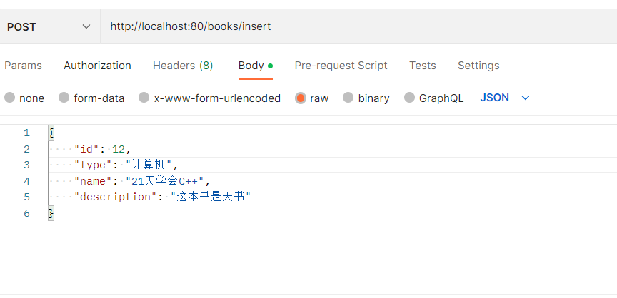  

## 表现层 实现分页查询

* Controller
```java
    @GetMapping("/page/{currentPage}/{pageSize}")
    public IPage<Book> getPage(@PathVariable int currentPage,@PathVariable int pageSize){
        return bookService.getPage(currentPage,pageSize);

    }

```

* Service

```java
    @Override
    public IPage<Book> getPage(int currentPage, int pageSize) {
        IPage page = new Page(currentPage,pageSize);
        bookDao.selectPage(page,null);
        return page;
    }

```


## 表现层消息一致性的处理

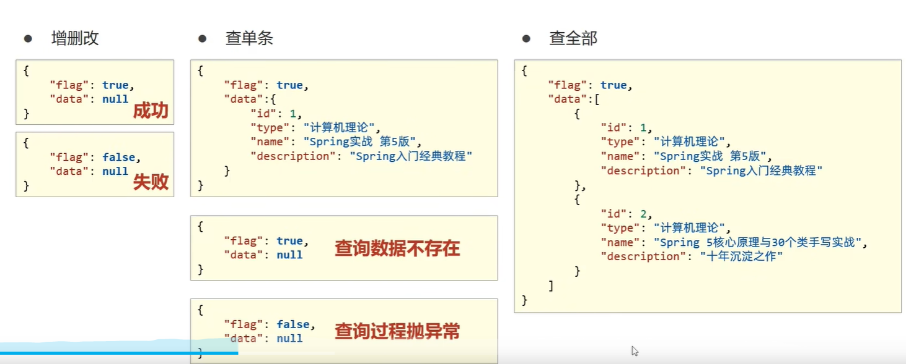  

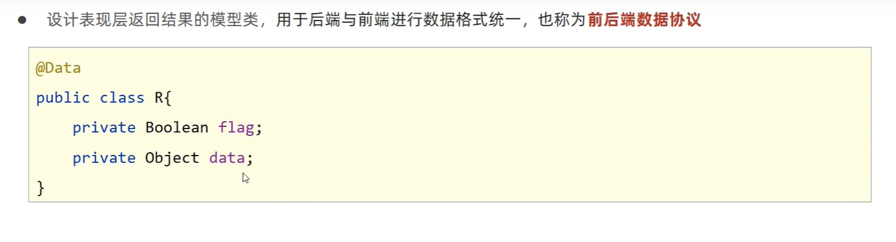  


**设计表现层返回结果的模型类，用于后端与前端进行数据格式统一，也成为前后端数据协议**

**首先定义一个R类，这里的flag表示后端的操作有没有成功，data表示后端传输的数据**

```java
package com.ustc.Controller.utils;

import com.sun.org.apache.xpath.internal.operations.Bool;
import com.ustc.domain.Book;
import lombok.Data;


@Data
public class R {
    private Boolean flag;
    private Object data;

    public R(){}


    public R(Boolean flag){
        this.flag = flag;
    }

// 构造函数重载
    public R(Boolean flag,Object data){
        this.flag = flag;
        this.data = data;
    }

}


```


**之后改写Controller的接口方法,插入，修改，删除操作只需要传入Boolean参数即可，对于需要返回数据的接口，使用另一种构造方法**

```java
package com.ustc.Controller;


import com.baomidou.mybatisplus.core.metadata.IPage;
import com.ustc.Controller.utils.R;
import com.ustc.domain.Book;
import com.ustc.service.IBookService;
import org.apache.ibatis.annotations.Delete;
import org.springframework.beans.factory.annotation.Autowired;
import org.springframework.web.bind.annotation.*;

import java.util.List;

@RestController
@RequestMapping("/books")
public class BookController {

    @Autowired
    private IBookService bookService;

//    查询全部信息

    @GetMapping("/search")
    public R getAll(){
        return new R(true,bookService.list());
    }

//    插入数据   这里的参数 通过请求体传输json数据  添加RequestBody注解
    @PostMapping("/insert")
    public R save(@RequestBody Book book){
        return new R(bookService.save(book));
    }

    // 修改数据
    @PutMapping("/update")
    public R update(@RequestBody Book book){
//        return bookService.modify(book);
        return new R(bookService.modify(book));
    }

//    删除数据
    @DeleteMapping("/delete/{id}")
    public R delete(@PathVariable Integer id){
        return new R(bookService.delete(id));
    }

//     根据id进行查询   使用pathVariable注解 使得url参数 赋值到形参
    @GetMapping("{id}")
    public R getById(@PathVariable Integer id){

        // 第一个参数是flag 第二个参数是 object对象  data
        R r = new R(true,bookService.getById(id));
        return r;
    }

    // 分页查询操作
    @GetMapping("/page/{currentPage}/{pageSize}")
    public R getPage(@PathVariable int currentPage,@PathVariable int pageSize){
        return new R(true,bookService.getPage(currentPage,pageSize));
    }

}

```

意义：

* 设计统一的返回值结果类型便于前端开发读取数据
* 返回值结果类型可以根据需求自行设定，没有固定的格式
* 返回值结果类型用于后端和前端进行数据格式统一，也称之为前后端数据协议

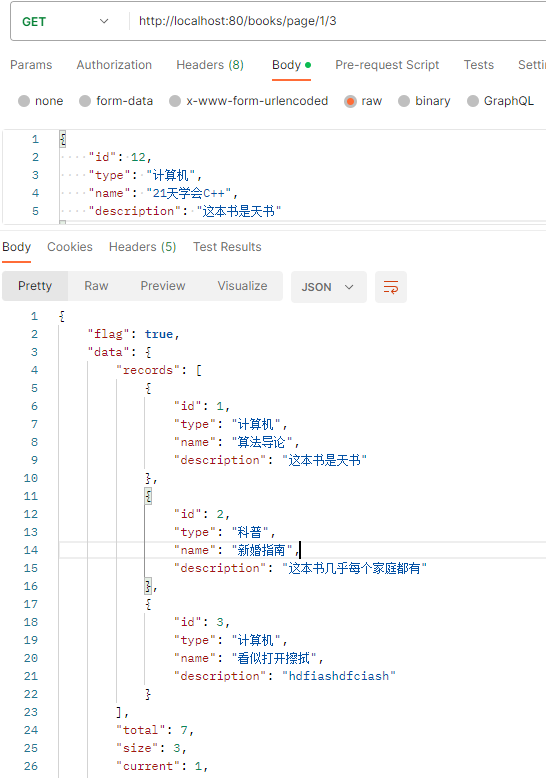  


## 查询所有书本信息

**发送异步请求，将请求后端查询的数据传给前端，前端数据双向绑定进行数据展示**

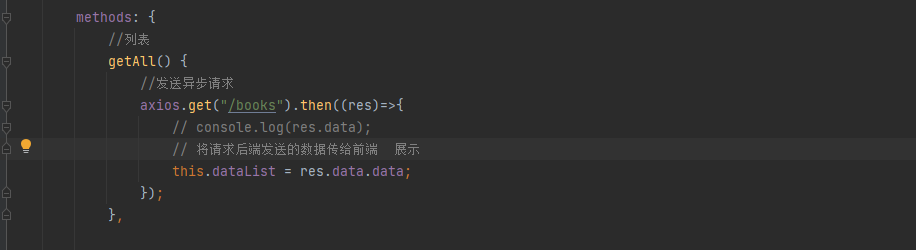  

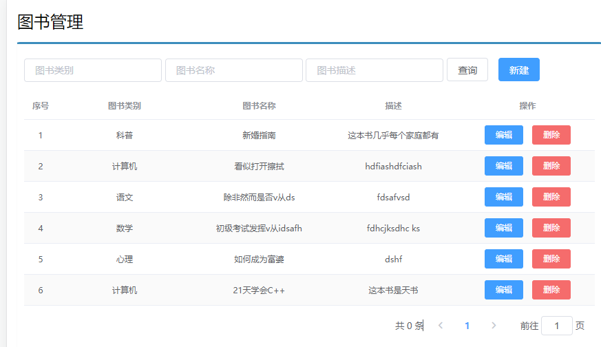  

## 添加书本

**使用axios请求将前端的请求包括数据发送给后端**

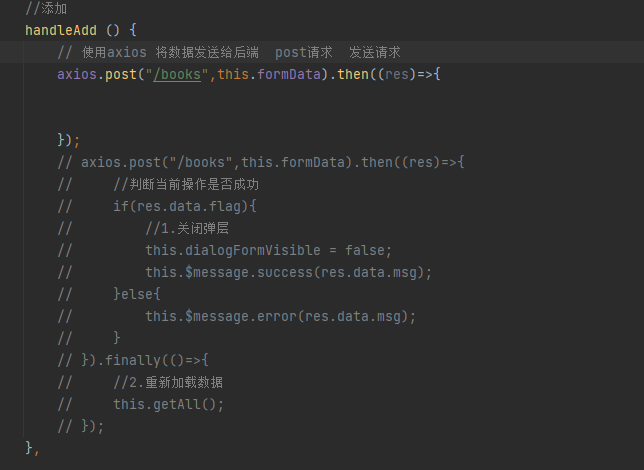  

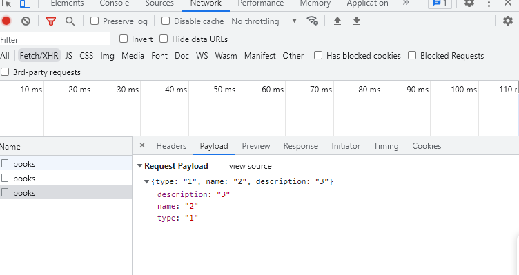  

* 请求方式使用POST调用后台对应操作
* 添加操作结束之后动态刷新页面加载数据
* 根据操作结果不同，显示对应的提示信息
* 弹出添加div时清除表单数据

```js
            handleAdd () {
                // 使用axios 将数据发送给后端  post请求  发送请求  返回res 检查flag操作是否成功
                axios.post("/books",this.formData).then((res)=>{

                    // 判断当前操作是否成功
                    if(res.data.flag){
                        // 关闭弹层
                        // 点击确定 发送数据之后 关闭弹窗
                        this.dialogFormVisible = false;
                        this.$message.success("添加成功");
                    }else{
                        this.$message.error("添加失败");
                    }

                }).finally(()=>{
                    // 重新加载数据
                    this.getAll();
                });

            },

```

## 删除操作

* 请求方式使用Delete调用后台对应操作
* 删除操作需要传递当前行数据对应的id值到后台
* 删除操作结束之后动态刷新页面加载数据
* 根据操作结果的不同，显示对应的提示信息
* 删除操作前弹出提示框避免误操作

```js
          // 删除
            handleDelete(row) {
               // axios发送异步请求  使用deleteMapping 参数是id  删除操作

                this.$confirm("此操作永久删除当前信息，是否继续？","提示",{type:"info"}).then(()=>{
                    axios.delete("/books/"+row.id).then((res)=>{
                        if(res.data.flag){
                            this.$message.success("删除成功");
                        }else{
                            this.$message.error("删除失败");
                        }
                    }).finally(()=>{
                        // 不管删除成功 还是失败 都会刷新页面
                        this.getAll();
                    });
                }).catch(()=>{
                    this.$message.info("取消操作");
                });

            },

```

## 修改功能

* 加载要修改数据通过传递当前行数据对应的id值到后台查询数据
* 利用前端数据双向绑定将查询到的数据进行回显
* 首先点击编辑按钮 根据id加载后端的数据
* 然后编辑数据，传给后端


```js
//弹出编辑窗口  点击编辑按钮  根据id加载后台的数据
            handleUpdate(row) {
                // 发送异步请求
                axios.get("/books/"+row.id).then((res)=>{

                    if(res.data.flag && res.data.data != null){
                        // 内容赋值  弹出编辑窗口 然后将数据填充上去
                        this.dialogFormVisible4Edit = true;
                        this.formData = res.data.data;
                    }else{
                        this.$message.error("数据同步失败 ，自动刷新");
                    }
                }).finally(()=>{
                    // 重新加载数据  也就是刷新页面
                    this.getAll();
                });
            },

            //编辑按钮：这个按钮的作用就是根据id查询数据信息 然后填充到页面即可  put操作将表单修改的数据进行回显
            handleEdit() {
               axios.put("/books",this.formData).then((res)=>{
                   //  判断当前操作是否成功
                   if(res.data.flag){
                       // 关闭弹窗
                       this.dialogFormVisible4Edit = false;
                       this.$message.success("添加成功");
                   }else{
                       this.$message.error("添加失败");
                   }
               });
            },

```

## 异常处理功能

**自定义异常**

```java
package com.itheima.controller.utils;

import org.springframework.web.bind.annotation.ExceptionHandler;
import org.springframework.web.bind.annotation.RestControllerAdvice;

//作为springmvc的异常处理器
//@ControllerAdvice
@RestControllerAdvice
public class ProjectExceptionAdvice {
    //拦截所有的异常信息
    @ExceptionHandler(Exception.class)
    public R doException(Exception ex){
        //记录日志
        //通知运维
        //通知开发
        ex.printStackTrace();
        return new R("服务器故障，请稍后再试！");
    }
}


```

* 使用注解@RestControllerAdvice定义SpringMVC异常处理器来处理异常
* 异常处理器必须被扫描加载，否则无法生效
* 表现层返回结果的模型类中添加消息属性用来传递消息到页面

## 添加分页查询

**发起请求调用，将当前页码之和每页的展示数据量 传到后端进行查询**


```js
            getAll() {
                //发送异步请求
                axios.get("/books/" + this.pagination.currentPage + "/" + this.pagination.pageSize).then((res)=>{
                    // console.log(res.data);

                    this.pagination.pageSize = res.data.data.size;
                    this.pagination.currentPage = res.data.data.current;
                    this.pagination.total = res.data.data.total;

                    // 将请求后端发送的数据传给前端  展示
                    this.dataList = res.data.data.records;
                });
            },

```

* 使用el分页组件
* 定义分页组件绑定的数据模型
* 异步调用获取分页数据
* 分页数据页面回显


