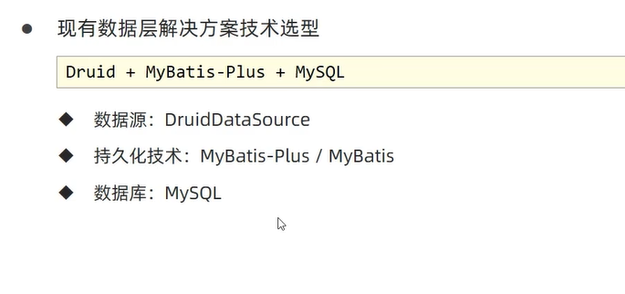
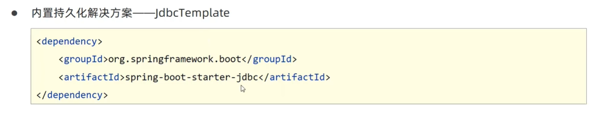
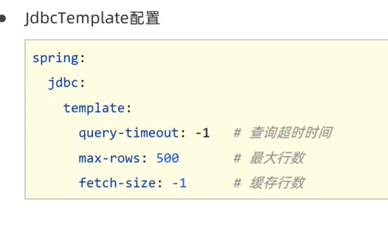
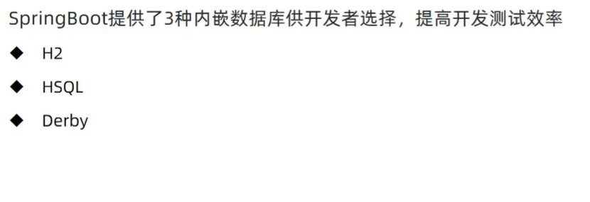

# 数据层解决方案

## 现有的数据库解决方案


  

## 数据源配置

* SpringBoot提供了三种内嵌的数据源对象供开发者选择
  * HiKariCP:默认内置数据源对象
  * Tomcat提供DataSource：HikariCP不可用的情况下，且在WEB环境中，将使用tomcat服务器配置的数据源对象
  * Commons DBCP：HiKari不可用，tomcat数据源也不可用，将使用dbcp数据源


* HiKariCP数据源配置
```
datasource:

    url: jdbc:mysql://localhost:3306/da?serverTimezone=UTC

    hikari:
      driver-class-name: com.mysql.cj.jdbc.Driver
      username: root
      password: 123456

```


## 持久化技术-Jdbc-Template


**添加jdbc-starter的配置**

```

<dependency>
    <groupId>org.springframework.boot</groupId>
    <artifactId>spring-boot-starter-jdbc</artifactId>
</dependency>


```

**使用jdbcTemplate查询数据库然后将数据库内容封装成Book对象的List**

**标准查询操作**
```java
    void testJdbcTemplate(@Autowired JdbcTemplate jdbcTemplate){
        String sql = "select * from tbl_book";// sql语句
//         将查询处理啊的结果封装到RoWMapper中  泛型指定Book

//        RowMapper的作用就是组织数据模型
        RowMapper<Book> rm = new RowMapper<Book>() {
            @Override
            public Book mapRow(ResultSet rs, int i) throws SQLException {
                Book temp = new Book();// 创建一个Book对象
//               jdbc查询出来的结果都是封装在resultSet  然后将查询结果写入temp中
                temp.setId(rs.getInt("id"));
                temp.setName(rs.getString("name"));
                temp.setType(rs.getString("type"));
                temp.setDescription(rs.getString("description"));
                return temp;
            }
        };
        List<Book> query = jdbcTemplate.query(sql, rm);// 查询结果就是Book对象
        System.out.println(query);
    }

```


**插入操作**

```java

    void testJdbcTemplateSave(@Autowired JdbcTemplate jdbcTemplate){
//         书写sql语句
        String sql = "insert into tbl_book values(null,'springboot1','springboot2','springboot3')";
        jdbcTemplate.update(sql);
    }
```

**要使用jdbcTemplate 需导入相关依赖**

  

**查询的相关设置**

  


## 内置数据库

  

### H2数据库


