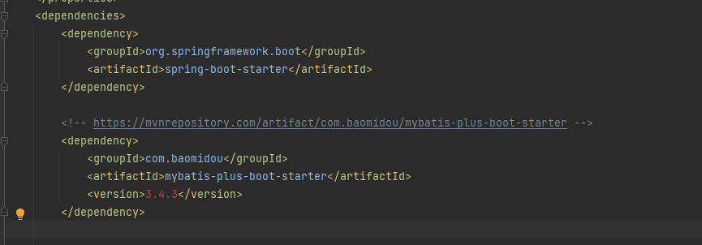

# 整合第三方技术

## 整合junit

**自己定义一个功能，测试功能接口**

* 测试步骤
* 注入你要测试的对象  提前声明为bean资源
* 执行你要测试的方法

```java
package com.ustc.sp7;

import com.ustc.sp7.dao.BookDao;
import org.junit.jupiter.api.Test;
import org.springframework.beans.factory.annotation.Autowired;
import org.springframework.boot.test.context.SpringBootTest;

@SpringBootTest
class Sp7ApplicationTests {

    // 注入你要测试的对象
    @Autowired
    private BookDao bookDao;

    @Test
    void contextLoads() {
//        在此进行测试方法
        bookDao.save();
    }
}
```

  

**如果测试类在SpringBoot启动类的包或者子包中，可以省略启动类的设置们也就是省略classes的设定**

## 整合MyBatis

**新建一个模块 勾选MybatisFrameWork 和MySQL driver**

**记得一定要配置数据库连接信息**

```
spring:
  datasource:
    driver-class-name: com.mysql.cj.jdbc.Driver
    url: jdbc:mysql://localhost:3306/db11
    username: root
    password: 123456

```


**然后定义数据层查询接口与映射配置**

```java
package com.ustc.dao;

import com.ustc.domain.Book;
import org.apache.ibatis.annotations.Mapper;
import org.apache.ibatis.annotations.Select;


// 使用Mapper注解进行配置映射 将查询操作 映射到Book
@Mapper
public interface BookDao {

    @Select("select * from tbl_book where id = #{id}")
    public Book getById(Integer id);
}

```

## 整合Mybatis-plus

**和Mybatis的区别：导入坐标不同，数据层实现简化**

### 使用阿里云创建工程 

将创建工程下载包的地址写成：https://start.aliyun.com

**创建工程之后只导入MySQL的驱动**

  


**打开MAVEN仓库的地址 找到Mybatis-plus的坐标 复制，然后粘贴到pom.xml文件中**

  

  


**相比较MyBatis的好处是，针对dao的数据查询层，只需要做出如下修改即可**

**修改前：**

```java
package com.ustc.dao;

import com.ustc.domain.Book;
import org.apache.ibatis.annotations.Mapper;
import org.apache.ibatis.annotations.Select;


// 使用Mapper注解进行配置映射 将查询操作 映射到Book
@Mapper
public interface BookDao {

    @Select("select * from tbl_book where id = #{id}")
    public Book getById(Integer id);
}


```


**修改过后**

```java
package com.ustc.dao;

import com.baomidou.mybatisplus.core.mapper.BaseMapper;
import com.ustc.domain.Book;
import org.apache.ibatis.annotations.Mapper;
import org.apache.ibatis.annotations.Select;


// 使用Mapper注解进行配置映射 将查询操作 映射到Book

//使用MyBatis-plus 可以直接继承 BaseMapper 使用Book的泛型  就可以使用所有的查询操作
@Mapper
public interface BookDao extends BaseMapper<Book> {

}


```


**修改配置**

```java
# 设置数据库 datasource 配置
spring:
  datasource:
    driver-class-name: com.mysql.cj.jdbc.Driver
    url: jdbc:mysql://localhost:3306/db11
    username: root
    password: 123456

# 设置Mp相关的配置
mybatis-plus:
  global-config:
    db-config:
      table-prefix: tbl_

```

  

## SpringBoot整合druid

**核： 导入坐标  改写配置**

**导入druid的依赖**

```
<!-- https://mvnrepository.com/artifact/com.alibaba/druid-spring-boot-starter -->
<dependency>
    <groupId>com.alibaba</groupId>
    <artifactId>druid-spring-boot-starter</artifactId>
    <version>1.2.13</version>
</dependency>


```

**改写配置文件**

```
# 设置数据库 datasource 配置
spring:
  datasource:
    druid:
      driver-class-name: com.mysql.cj.jdbc.Driver
      url: jdbc:mysql://localhost:3306/db11
      username: root
      password: 123456

# 设置Mp相关的配置
mybatis-plus:
  global-config:
    db-config:
      table-prefix: tbl_
```

**整合第三方技术的通用方式：先导入对应的starter,然后根据提供的配置格式，配置非默认值对应的配置项**


