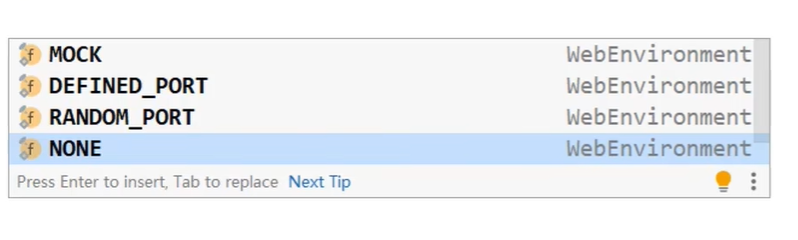

# 测试类中启动WEB项目

## 简单测试

```java
package com.itheima;
import org.junit.jupiter.api.Test;
import org.springframework.boot.test.context.SpringBootTest;

// 在测试类中加载web项目  需要在springbootTest注解中添加配置参数  这里使用默认的端口号
@SpringBootTest(webEnvironment = SpringBootTest.WebEnvironment.DEFINED_PORT)
public class WebTest {
    @Test
    void test(){
        System.out.println("测试WEB项目");
    }
}


```

这里是可选的参数：

  

## 发送虚拟请求

```java
package com.itheima;


import org.junit.jupiter.api.Test;
import org.springframework.beans.factory.annotation.Autowired;
import org.springframework.boot.test.autoconfigure.web.servlet.AutoConfigureMockMvc;
import org.springframework.boot.test.context.SpringBootTest;
import org.springframework.test.web.servlet.MockMvc;
import org.springframework.test.web.servlet.request.MockHttpServletRequestBuilder;
import org.springframework.test.web.servlet.request.MockMvcRequestBuilders;

// 在测试类中加载web项目  需要在springbootTest注解中添加配置参数  这里使用默认的端口号
@SpringBootTest(webEnvironment = SpringBootTest.WebEnvironment.DEFINED_PORT)

// 开启虚拟MUC 调用
@AutoConfigureMockMvc
public class WebTest {
    @Test
    void test(){
        System.out.println("测试WEB项目");
    }

    @Test
    void testWeb(@Autowired MockMvc mvc) throws Exception {
        // 注入虚拟调用的对象  这里测试BookController中的getMapping请求 请求参数 填写url路径
        MockHttpServletRequestBuilder builder = MockMvcRequestBuilders.get("/books");

//         测试虚拟调用方法
        mvc.perform(builder);
    }
}
```


## 虚拟请求匹配预期的结果

* 匹配执行的结果
* 定义执行结果匹配器
* 定义预期执行结果
* 使用本次真实执行结果与预期结果进行比对

```java
    @Test
    void testWeb(@Autowired MockMvc mvc) throws Exception {
        // 注入虚拟调用的对象  这里测试BookController中的getMapping请求 请求参数 填写url路径
        MockHttpServletRequestBuilder builder = MockMvcRequestBuilders.get("/books1");

//         测试虚拟调用方法
        ResultActions action = mvc.perform(builder);

//         定义本次调用的预期值  使用虚拟调用的状态status进行比较
        StatusResultMatchers status = MockMvcResultMatchers.status();

//         预计本次调用成功 ：200
        ResultMatcher ok = status.isOk();
        // 添加预计值到本次调用过程中进行匹配
        action.andExpect(ok);
    }

```


## 匹配响应体


```java
 void testBody(@Autowired MockMvc mvc) throws Exception {
        MockHttpServletRequestBuilder builder = MockMvcRequestBuilders.get("/books/2");
        // 调用虚拟执行方法
        ResultActions action = mvc.perform(builder);

//         设定预期值
        ContentResultMatchers content = MockMvcResultMatchers.content();
//        直接比较请求体的内容  返回一个json格式的数据
        ResultMatcher result = content.json("{\"flag\":true,\"data\":{\"id\":2,\"type\":\"科普\",\"name\":\"新婚指南\",\"description\":\"这本书几乎每个家庭都有\"},\"msg\":null}");

        // 添加预计值到本次调用过程中进行匹配
        action.andExpect(result);
    }

```


## 匹配虚拟请求头信息

```java
    void testBody(@Autowired MockMvc mvc) throws Exception {
        MockHttpServletRequestBuilder builder = MockMvcRequestBuilders.get("/books/2");
        // 调用虚拟执行方法
        ResultActions action = mvc.perform(builder);

////         设定预期值
//        ContentResultMatchers content = MockMvcResultMatchers.content();
////        直接比较请求体的内容  返回一个json格式的数据
//        ResultMatcher result = content.json("{\"flag\":true,\"data\":{\"id\":2,\"type\":\"科普\",\"name\":\"新婚指南\",\"description\":\"这本书几乎每个家庭都有\"},\"msg\":null}");
//
//        // 添加预计值到本次调用过程中进行匹配
//        action.andExpect(result);

//        匹配请求头信息
        HeaderResultMatchers header = MockMvcResultMatchers.header();
        ResultMatcher contentType = header.string("Content-Type", "application/json");
        action.andExpect(contentType);// 添加预计值到本次调用过程中进行匹配
    }

```


## 小结

* 设置测试端口
* 模拟测试启动
* 模拟测试匹配（各组成部分信息都可以匹配）


