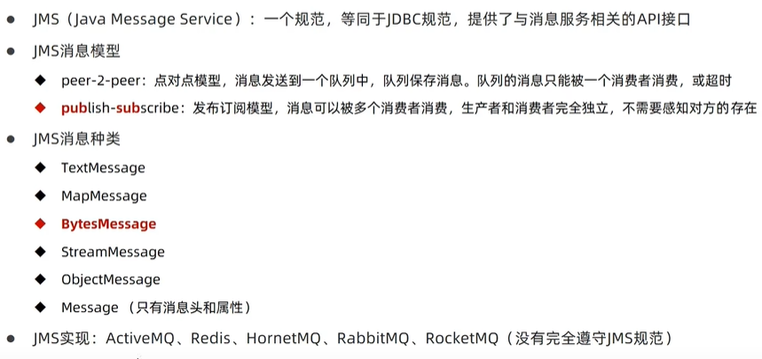
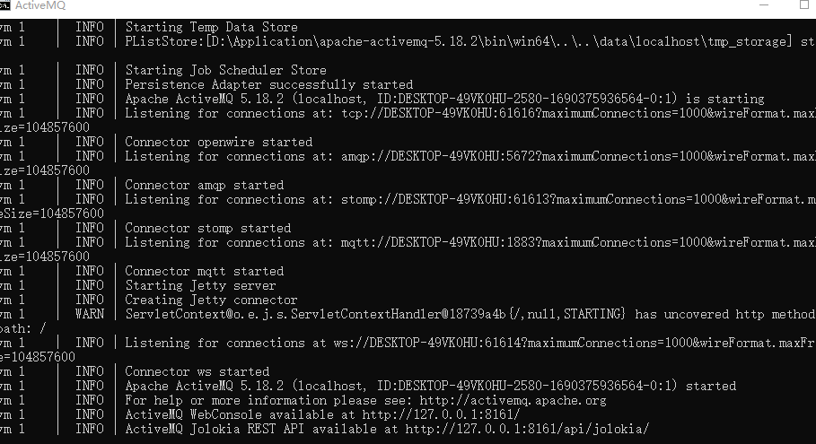
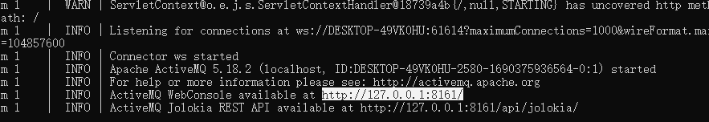
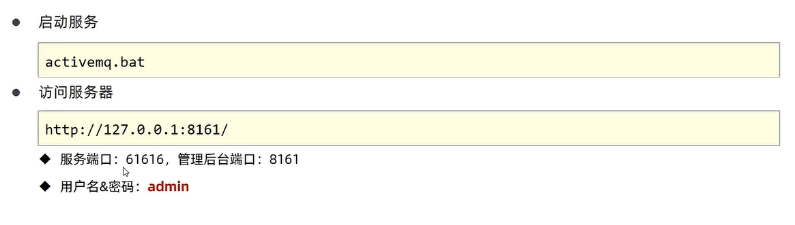

# 消息简介

## JMS

  


## ActiveMQ

### 下载安装

```
https://activemq.apache.org/components/classic/download/

```

解压缩文件。进入win64目录，双击运行activemq.bat文件，运行服务

  

将下面的网址输入到浏览器，用户名和密码都是admin
  

  


## SpringBoot整合ActiveMQ

* 导入坐标
```java

        <dependency>
            <groupId>org.springframework.boot</groupId>
            <artifactId>spring-boot-starter-activemq</artifactId>
        </dependency>
```
* 添加配置

```java


server:
  port: 8080


spring:
  activemq:
    broker-url: tcp://localhost:61616

  jms:
    template:
      default-destination: itheima
```

* 实现业务类


```java
package com.ustc.service.activemq;

import com.ustc.service.MessageService;
import org.springframework.beans.factory.annotation.Autowired;
import org.springframework.jms.core.JmsMessagingTemplate;
import org.springframework.stereotype.Service;

@Service
public class MessageServiceActivemqImpl implements MessageService {
    @Autowired
    private JmsMessagingTemplate messagingTemplate;

    @Override
    public void sendMessage(String id) {
        System.out.println("待发送短信的订单已经纳入处理对队列id" + id);
        messagingTemplate.convertAndSend(id);
    }

    @Override
    public String doMessge() {
        String id = messagingTemplate.receiveAndConvert(String.class);
        System.out.println("已经完成短信发送服务:id" + id);
        return id;
    }
}


```


