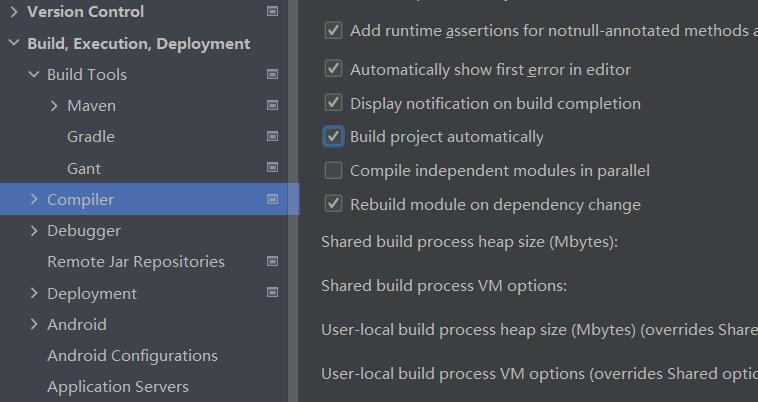

# 热部署

## 概述

**当程序运行之后，后端修改，可以立马生效，不需要重新运行**

**思想：服务器发生程序变化，自动进行重启**


**首先添加坐标**

```java
        <dependency>
            <groupId>org.springframework.boot</groupId>
            <artifactId>spring-boot-devtools</artifactId>
        </dependency>

```


**然后激活热部署：build project,快捷键是Ctrl + F9**

## 自动启动热部署

  


