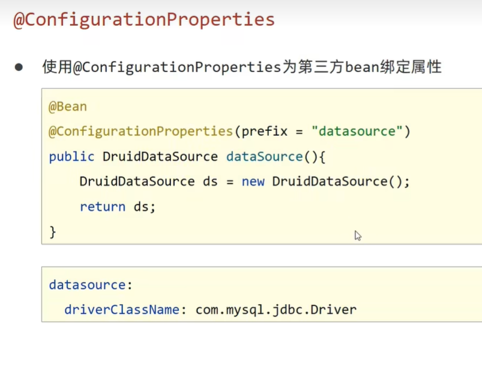
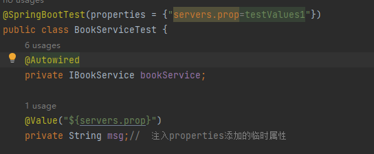
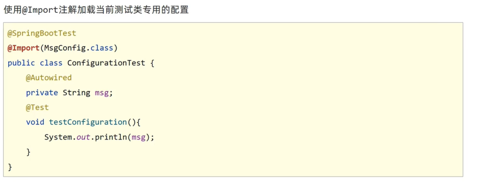

# 第三方bean属性资源绑定

## 方法

  

### 首先是用户自定义的bean资源绑定

**新建一个config包，然后在config包下面新建一个serverConfig.class**

```java
package com.itheima.config;
import lombok.Data;
import org.springframework.boot.context.properties.ConfigurationProperties;
import org.springframework.stereotype.Component;

// prefix 指定配置文件的哪一个属性进行配置
// ConfigurationProperties注解用于获取配置文件中的属性定义 并且绑定到Java Bean资源中 也就是初始化的时候自动加载yml文件的资源
// Component注解 将该类作为bean资源注入IOC容器中
@Component
@Data
@ConfigurationProperties(prefix = "servers")
public class ServerConfig {
    private String ipAddress;// ip地址
    private int port;// 端口号
    private long timeout;
}


```

**在yml文件中写入如下配置**

```java
servers:
  ipAddress: 192.168.0.1
  port: 2345
  timeout: -1

```

**上面的prefix指明了需要加载的属性配置**

### 外部的bean资源绑定

```java
    @Bean
    @ConfigurationProperties(prefix = "datasource")
    public DruidDataSource dataSource(){
        DruidDataSource ds = new DruidDataSource();
        return ds;
    }

```


```java
datasource:
    driver-class-name: com.mysql.cj.jdbc.Driver
    url: jdbc:mysql://localhost:3306/da?serverTimezone=UTC
    username: root
    password: 123456

```


**注意当用户自定义的类使用@Component作为bean资源注入IOC容器的时候，入口类不可以使用@EnableConfigurationProperties注解将其作为资源注入，这会发生冲突**

**@ConfigurationProperties绑定属性支持属性名宽松绑定**

## JDK8提供的时间 计量单位

```java

package com.itheima.config;
import lombok.Data;
import org.springframework.boot.context.properties.ConfigurationProperties;
import org.springframework.boot.convert.DurationUnit;
import org.springframework.stereotype.Component;

import java.time.Duration;
import java.time.temporal.ChronoUnit;

// prefix 指定配置文件的哪一个属性进行配置
// ConfigurationProperties注解用于获取配置文件中的属性定义 并且绑定到Java Bean资源中 也就是初始化的时候自动加载yml文件的资源
// Component注解 将该类作为bean资源注入IOC容器中

@Data
@ConfigurationProperties(prefix = "servers")
public class ServerConfig {
    private String ipAddress;// ip地址
    private int port;// 端口号
    private long timeout;

//     定义为小时
    @DurationUnit(ChronoUnit.HOURS)
    private Duration serverTimeout;// 定义timeout的单位  默认 ms单位
}

```

**使用@DurationUnit(ChronoUnit.HOURS)注解指定读取的yml配置属性的单位**


## 加载测试专用属性

**使用properties属性可以为当前测试用例添加临时的属性配置**

  

**加载测试临时属性应用于小范围的测试环境**

## 加载测试专用的bean资源

**使用@Import注解加载当前测试类专用的配置**

**现在测试下面添加一个配置类，将里面的方法作为bean资源进行注入**

```java
package com.itheima.config;


import org.springframework.context.annotation.Bean;
import org.springframework.context.annotation.Configuration;

// 在测试 自定义bean资源
@Configuration
public class MsgConfiguration {

    // 将方法注入
    @Bean
    public String msg(){
        return "bean msg";
    }

}


```

**然后再测试类中使用AutoWired注解将资源进行注入，一定先将该类进行Import**

  


