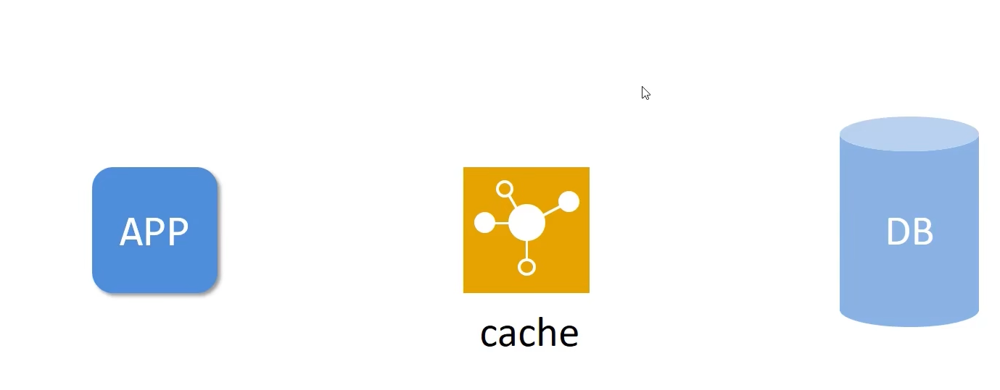

# 缓存


## 简单介绍

* 缓存是一种介于数据永久存储介质和数据应用之间的数据临时存储介质
* 缓存有效提高读取速度，加速查询效率


  

## spring使用缓存方式

* 添加依赖

```java
        <dependency>
            <groupId>org.springframework.boot</groupId>
            <artifactId>spring-boot-starter-cache</artifactId>
        </dependency>
```


* 添加使用缓存的注解

```java
package com.ustc;

import org.springframework.boot.SpringApplication;
import org.springframework.boot.autoconfigure.SpringBootApplication;
import org.springframework.cache.annotation.EnableCaching;

@SpringBootApplication
@EnableCaching
public class Quick1Application {

    public static void main(String[] args) {
        SpringApplication.run(Quick1Application.class, args);
    }

}


```

* 使用缓存，将当前操作结果写入缓存

这里的cacheSpace 表示缓存控件，然后可以从形参中读取id查询所需要的值

```java
    @Override
    @Cacheable(value = "cacheSpace",key="#id")
    public tbl_book getById(Integer id) {
        return bookMapper.selectById(id);// 调用Mapper查询
    }


```


## 手机验证码生成案例


* 使用CachePut注解 每次生成新的缓存

```java

    @Override
    @CachePut(value = "smsCode",key = "#tele")
    public String sendCodeToSMS(String tele) {
        // 当前方法的返回值 进入当前key所对应的缓存中
        String code = codeUtils.generator(tele);
        return code;
    }
```


* 校验验证码

```java

    @Override
    public boolean checkCode(SMSCode smsCode) {
        // 取出内存中的验证码 和传递过来的验证码进行比对 如果相同 返回true
        String code = smsCode.getCode();// 内存加载验证码

        String cacheCode = codeUtils.get(smsCode.getTele());// 传递过来的验证码
        return cacheCode.equals(code);
    }

```
* 加密验证码
```java
package com.ustc.controller.utils;

import org.springframework.cache.annotation.Cacheable;
import org.springframework.stereotype.Component;

@Component
public class CodeUtils {

    private String[] patch = {"00000","0000","000","00","0",""};
    public String generator(String tele){
        int hash = tele.hashCode();// 生成哈希值
        int encryption = 20206666;
        // 第一次加密
        long result = hash ^ encryption;
        long nowTime = System.currentTimeMillis();
        result = result ^ nowTime;
        long code = result % 1000000;
        code = code < 0 ?-code :code;
        String codeStr = code + "";
        int len = codeStr.length();// 计算长度
        return patch[len - 1] + codeStr;
    }

    // 获取传递过来的验证码  从缓存中查询
    @Cacheable(value = "smsCode",key = "#tele")
    public String get(String tele){
        return null;
    }

    public static void main(String[] args) {
        System.out.println(new CodeUtils().generator("15005650262"));
    }
}


```
