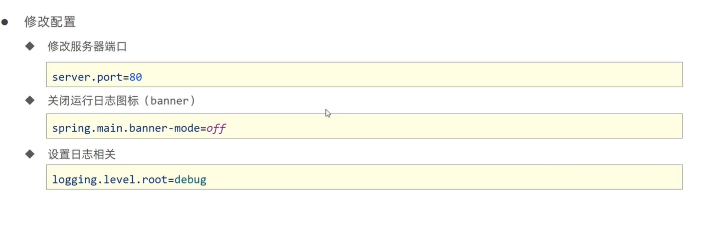
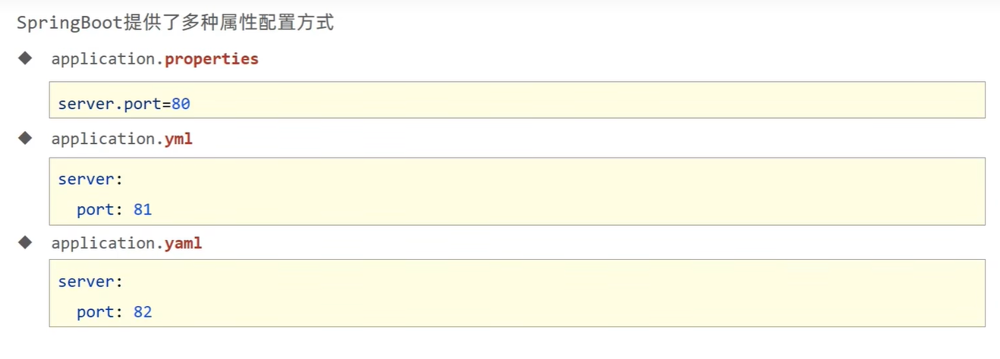
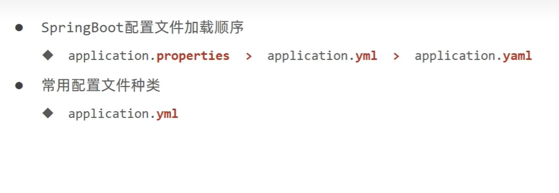
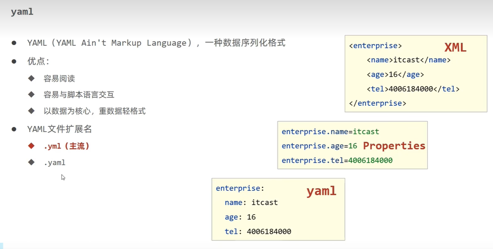

# 配置文件Application.properties

## 属性配置

**在application.properties中添加server.port=端口号即可**

  

```
# 服务器端口配置
server.port=80

# 修改banner  关闭banner
spring.main.banner-mode=off

# 输出日志
logging.level.root=info

```


## 配置文件的多种格式

  

**主流格式：yml**

**加载优先级**

  


## yaml的数据格式

  

**数据前面要有空格进行隔开**

```
server:
  port: 80

users:
  name: itheima
  age: 16

users1:
  - name: ss
    age: 11

  - name: ew
    age: 21

```


## 读取yaml文件中的属性值

**在controller使用value注解为变量注入值**

```java
    @Value("${country}")
    private String country1;

//     该注解定义Get请求  访问方式

//    GetMapping整合请求路径与请求方式
    @GetMapping
    public String getById(){
        System.out.println("spingboot is running");
        System.out.println(country1);
        return "springboot is running...";
    }


```
**yaml文件引用别的值**

```
country: China
city: ${country}hefei

```


## 读取yaml文件中的全部属性

**使用自动装配将所有的配置添加到一个Environment对象中**

```java
package com.ustc.sp7.controller;
import org.springframework.beans.factory.annotation.Autowired;
import org.springframework.beans.factory.annotation.Value;
import org.springframework.core.env.Environment;
import org.springframework.web.bind.annotation.*;

import javax.xml.stream.events.EndElement;

// 第一个注解 满足restful风格的开发模式
// 第二个注解  定义访问请求路径
@RestController
@RequestMapping("/books")
public class BookController {

    @Autowired
    private Environment env;// 自动加载所有的属性

//     读取yaml文件中属性值
    @Value("${country}")
    private String country1;

    @Value("${city}")
    private String city1;

//     该注解定义Get请求  访问方式

//    GetMapping整合请求路径与请求方式
    @GetMapping
    public String getById(){
        System.out.println("spingboot is running");
//        System.out.println(country1);
//        System.out.println(city1);
//        System.out.println(city1);
//
        System.out.println(env.getProperty("country"));
        return "springboot is running...";
    }

    // value定义 路径  method定义访问的方式
    @RequestMapping(value = "/users",method = RequestMethod.POST)
    @ResponseBody
    public String save(){
        System.out.println("user save...");
        return "{'module':'user save'}";
    }

    @RequestMapping(value = "/users/{id}",method = RequestMethod.DELETE)
    @ResponseBody
    public String delete(@PathVariable Integer id){
        System.out.println("user delete ..." + id);
        return "{'module':'user delete'}";
    }
}
```


## yaml文件  数据库的属性

* 定义数据模型封装yaml文件中对应的数据
* 定义为spring管控的Bean  Component注解
* 指定加载的数据 


**首先，在yaml文件中将数据提前定义好，然后定义一个类-》数据模型封装这些数据**

  

