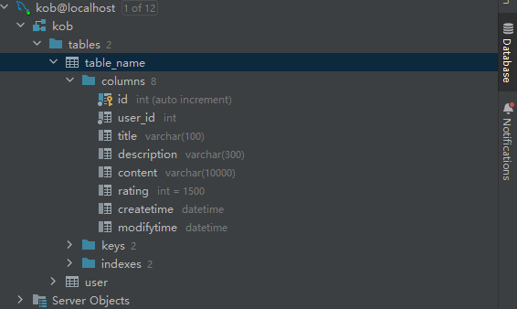
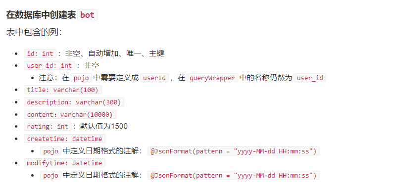
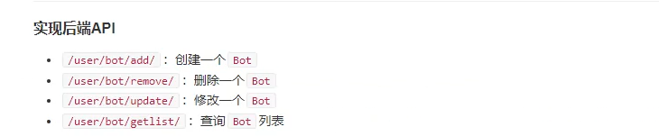

# 创建个人中心页面（上）


## 创建一个user表

  

  


## 创建pojo.bot

```java
package com.kob.backedn2.pojo;

import com.baomidou.mybatisplus.annotation.IdType;
import com.baomidou.mybatisplus.annotation.TableId;
import com.fasterxml.jackson.annotation.JsonFormat;
import lombok.AllArgsConstructor;
import lombok.Data;
import lombok.NoArgsConstructor;
import java.util.Date;

// 变量一定是驼峰命名
@Data
@AllArgsConstructor
@NoArgsConstructor
public class Bot {
    // 主键自增  添加注解
    @TableId(type = IdType.AUTO)
    private Integer id;
    private Integer userId;
    private String title;
    private String description;
    private  String content;
    private Integer rating;

    // 注解添加日期格式
    @JsonFormat(pattern = "yyyy-MM-dd HH:mm:ss")
    private Date createtime;
    @JsonFormat(pattern = "yyyy-MM-dd HH:mm:ss")
    private Date modifytime;
}


```

## 实现后端API

  


### AddService接口

```java
package com.kob.backedn2.service.user.bot;

import java.util.Map;

// 添加bot接口
public interface AddService {
    public Map<String,String> add(Map<String,String> data);
}


```


### AddService接口实现

```java
package com.kob.backedn2.service.impl.user.bot;

import com.kob.backedn2.mapper.BotMapper;
import com.kob.backedn2.pojo.Bot;
import com.kob.backedn2.pojo.User;
import com.kob.backedn2.service.impl.utils.UserDetailsImpl;
import com.kob.backedn2.service.user.bot.AddService;
import org.springframework.beans.factory.annotation.Autowired;
import org.springframework.security.authentication.UsernamePasswordAuthenticationToken;
import org.springframework.security.core.context.SecurityContextHolder;
import org.springframework.stereotype.Service;

import java.util.Date;
import java.util.HashMap;
import java.util.Map;

@Service
public class AddServiceImpl implements AddService {
    // 将接口注入进来
    @Autowired
    private BotMapper botMapper;// 使用Mapper操作数据库

    @Override
    public Map<String, String> add(Map<String, String> data) {

        // 从token中获取用户
        UsernamePasswordAuthenticationToken authenticationToken = (UsernamePasswordAuthenticationToken) SecurityContextHolder.getContext().getAuthentication();
        UserDetailsImpl loginUser = (UserDetailsImpl) authenticationToken.getPrincipal();
        User user = loginUser.getUser();

        // 根据key获取map中的数据
        String title = data.get("title");
        String description = data.get("description");
        String content = data.get("content");

        Map<String,String> map = new HashMap<>();

        if(title == null || title.length() == 0){
            map.put("error_message","标题不能为空");
            return map;
        }

        if(title.length() > 100){
            map.put("error_message","标题长度不能大于100");
            return map;
        }

        if(description == null || description.length() == 0){
            description = "这个用户很懒，什么也没留下";
        }

        if(description != null && description.length() > 300){
            map.put("error_message","Bot描述的长度不能大于300");
            return map;
        }

        if(content == null || content.length() == 0){
            map.put("error_message","代码不能为空");
            return map;
        }

        if(content.length() > 10000){
            map.put("error_message","代码长度不能超过10000");
            return map;
        }

        // 创建一个bot对象
        Date now = new Date();
        Bot bot = new Bot(null,user.getId(),title,description,content,1500,now,now);

        // 将Bot对象添加到数据库中
        botMapper.insert(bot);
        map.put("error_message","success");

        return map;
    }
}


```

### AddController


```java
package com.kob.backedn2.controller.user.bot;

import com.kob.backedn2.service.user.bot.AddService;
import org.springframework.beans.factory.annotation.Autowired;
import org.springframework.web.bind.annotation.PostMapping;
import org.springframework.web.bind.annotation.RequestParam;
import org.springframework.web.bind.annotation.RestController;

import java.util.Map;

@RestController
public class AddController {

    // 将实现的service接口进行注入
    @Autowired
    private AddService addService;

    // 用户访问该url路径 获取资源
    @PostMapping("/user/bot/add/")
    public Map<String,String> add(@RequestParam Map<String,String> data){
        // 调用service 插入数据
        return addService.add(data);
    }
}

```

### 添加bot记录的前端页面


**点击我的bot页面 自动创建一个bot**

```js
<template>
    <ContentField>
        我的Bot
    </ContentField>
</template>

<script>
import ContentField from '../../../components/ContentField.vue'
import $ from 'jquery'
import { useStore} from 'vuex';

export default {
    components: {
        ContentField
    },
    setup(){
        const store = useStore();// 获取全局资源
        $.ajax({
            url:"http://127.0.0.1:3000/user/bot/add/",
            type:"POST",
            data:{
                title:"Bot的标题",
                description:"Bot的描述",
                content:"Bot的代码",
            },
            headers:
            {
                // 验证
                Authorization:"Bearer " + store.state.user.token,
            },
            success(resp){
                //  打印是否成功的消息
                console.log(resp);
            },
            error(resp){
                console.log(resp);
            }
        })

    }
}
</script>

<style scoped>
</style>

```


### RemoveServiceImpl

```java
package com.kob.backedn2.service.impl.user.bot;

import com.kob.backedn2.mapper.BotMapper;
import com.kob.backedn2.pojo.Bot;
import com.kob.backedn2.pojo.User;
import com.kob.backedn2.service.impl.utils.UserDetailsImpl;
import com.kob.backedn2.service.user.bot.RemoveService;
import org.springframework.beans.factory.annotation.Autowired;
import org.springframework.security.authentication.UsernamePasswordAuthenticationToken;
import org.springframework.security.core.context.SecurityContextHolder;
import org.springframework.stereotype.Service;

import java.util.HashMap;
import java.util.Map;

@Service
public class RemoveServiceImpl implements RemoveService {
    @Autowired
    private BotMapper botMapper;

    @Override
    public Map<String, String> remove(Map<String, String> data) {
        UsernamePasswordAuthenticationToken authenticationToken = (UsernamePasswordAuthenticationToken) SecurityContextHolder.getContext().getAuthentication();
        UserDetailsImpl loginUser = (UserDetailsImpl) authenticationToken.getPrincipal();

        User user = loginUser.getUser();// 获取用户

        int bot_id = Integer.parseInt(data.get("bot_id"));// 获取bot的id

        // 获取bot
        Bot bot = botMapper.selectById(bot_id);

        Map<String,String> map = new HashMap<>();

        if(bot == null){
            map.put("error_message","Bot不存在或者已经被删除");
            return map;
        }

        if(!bot.getUserId().equals(user.getId())){
            map.put("error_message","没有权限删除bot");
            return map;
        }

        // 删除
        botMapper.deleteById(bot_id);

        map.put("error_message","success");


        return null;
    }
}


```

### RemoveController

```java
package com.kob.backedn2.controller.user.bot;


import com.kob.backedn2.service.user.bot.RemoveService;
import org.springframework.beans.factory.annotation.Autowired;
import org.springframework.web.bind.annotation.PostMapping;
import org.springframework.web.bind.annotation.RequestParam;
import org.springframework.web.bind.annotation.RestController;

import java.util.Map;

@RestController
public class RemoveController {
    @Autowired
    private RemoveService removeService;

    @PostMapping("/user/bot/remove")
    public Map<String,String> remove(@RequestParam Map<String,String> data){
        return removeService.remove(data);//调用service接口的方法
    }

}
```
### 前端删除Bot记录测试

```js
<template>
    <ContentField>
        我的Bot
    </ContentField>
</template>

<script>
import ContentField from '../../../components/ContentField.vue'
import $ from 'jquery'
import { useStore} from 'vuex';

export default {
    components: {
        ContentField
    },
    setup(){
        const store = useStore();// 获取全局资源
        // $.ajax({
        //     url:"http://127.0.0.1:3000/user/bot/add/",
        //     type:"POST",
        //     data:{
        //         title:"Bot的标题",
        //         description:"Bot的描述",
        //         content:"Bot的代码",
        //     },
        //     headers:
        //     {
        //         // 验证
        //         Authorization:"Bearer " + store.state.user.token,
        //     },
        //     success(resp){
        //         //  打印是否成功的消息
        //         console.log(resp);
        //     },
        //     error(resp){
        //         console.log(resp);
        //     }
        // })

        $.ajax({
            url:"http://127.0.0.1:3000/user/bot/remove/",
            type:"POST",
            data:{
                // 删除bot_id 为2 的数据库Bot记录
                bot_id:2,
            },
            headers:
            {
                // 验证
                Authorization:"Bearer " + store.state.user.token,
            },
            success(resp){
                //  打印是否成功的消息
                console.log(resp);
            },
            error(resp){
                console.log(resp);
            }
        })

    }
}
</script>

<style scoped>
</style>

```


### UpdateServiceImpl

```java
package com.kob.backedn2.service.impl.user.bot;

import com.kob.backedn2.mapper.BotMapper;
import com.kob.backedn2.pojo.Bot;
import com.kob.backedn2.pojo.User;
import com.kob.backedn2.service.impl.utils.UserDetailsImpl;
import com.kob.backedn2.service.user.bot.UpdateService;
import org.springframework.beans.factory.annotation.Autowired;
import org.springframework.security.authentication.UsernamePasswordAuthenticationToken;
import org.springframework.security.core.context.SecurityContextHolder;
import org.springframework.stereotype.Service;

import javax.jws.soap.SOAPBinding;
import java.util.Date;
import java.util.HashMap;
import java.util.Map;

@Service
public class UpdateServiceImpl implements UpdateService {

    @Autowired
    private BotMapper botMapper;

    @Override
    public Map<String, String> update(Map<String, String> data) {
        // 现根据token知道自己是谁 获取user
        UsernamePasswordAuthenticationToken usernamePasswordAuthenticationToken = (UsernamePasswordAuthenticationToken) SecurityContextHolder.getContext().getAuthentication();
        UserDetailsImpl loginUser = (UserDetailsImpl) usernamePasswordAuthenticationToken.getPrincipal();
        User user = loginUser.getUser();

        // 然后获取前端返回的数据  首先根据data中的bot_id 获取id
        int bot_id = Integer.parseInt(data.get("bot_id"));// 获取的是字符串  然后解析成int数据

        // 从data数据中获取title description  content三个信息  填充到新的Bot记录 然后使用Mapper接口 插入到数据库
        String title = data.get("title");
        String description = data.get("description");
        String content = data.get("content");

        Map<String,String> map = new HashMap<>();

        // 根据前端解析出来的bot_id  使用botMapper接口 查询数据库 返回一个bot记录
        Bot bot = botMapper.selectById(bot_id);

        if(title == null || title.length() == 0){
            map.put("error_message","标题不能为空");
            return map;
        }

        if(title.length() > 100){
            map.put("error_message","标题长度不能大于100");
            return map;
        }

        if(description == null || description.length() == 0){
            description = "这个用户很懒，什么也没留下";
        }

        if(description != null && description.length() > 300){
            map.put("error_message","Bot描述的长度不能大于300");
            return map;
        }

        if(content == null || content.length() == 0){
            map.put("error_message","代码不能为空");
            return map;
        }

        if(content.length() > 10000){
            map.put("error_message","代码长度不能超过10000");
            return map;
        }

        if(bot == null){
            map.put("error_message","Bot不存在或者已经删除");
            return map;
        }

        if(!bot.getUserId().equals(user.getId())){
            map.put("error_message","没有权限修改Bot");
            return  map;
        }

        Bot new_bot = new Bot(bot.getId(),user.getId(),title,description,content,bot.getRating(),bot.getCreatetime(),new Date());

        // 调用接口 更新Bot
        botMapper.updateById(new_bot);
        map.put("error_message","success");
        return map;
    }
}


```


### UpdateController

```java
package com.kob.backedn2.controller.user.bot;

import com.kob.backedn2.service.user.bot.UpdateService;
import org.springframework.beans.factory.annotation.Autowired;
import org.springframework.web.bind.annotation.PostMapping;
import org.springframework.web.bind.annotation.RequestParam;
import org.springframework.web.bind.annotation.RestController;

import java.util.Map;

@RestController
public class UpdateController {

    // 注入实现的接口 然后调用实现的接口板中的方法
    @Autowired
    private UpdateService updateService;

    // 将请求获取的data容器 作为参数 传入service接口中
    @PostMapping("/user/bot/update/")
    public Map<String,String> update(@RequestParam Map<String,String> data){
        return updateService.update(data);
    }
}
```

### Update前端测试

```js
<template>
    <ContentField>
        我的Bot
    </ContentField>
</template>

<script>
import ContentField from '../../../components/ContentField.vue'
import $ from 'jquery'
import { useStore} from 'vuex';

export default {
    components: {
        ContentField
    },
    setup(){
        const store = useStore();// 获取全局资源
        // $.ajax({
        //     url:"http://127.0.0.1:3000/user/bot/add/",
        //     type:"POST",
        //     data:{
        //         title:"Bot的标题",
        //         description:"Bot的描述",
        //         content:"Bot的代码",
        //     },
        //     headers:
        //     {
        //         // 验证
        //         Authorization:"Bearer " + store.state.user.token,
        //     },
        //     success(resp){
        //         //  打印是否成功的消息
        //         console.log(resp);
        //     },
        //     error(resp){
        //         console.log(resp);
        //     }
        // })

        // $.ajax({
        //     url:"http://127.0.0.1:3000/user/bot/remove/",
        //     type:"POST",
        //     data:{
        //         // 删除bot_id 为1 的数据库Bot记录
        //         bot_id:1,
        //     },
        //     headers:
        //     {
        //         // 验证
        //         Authorization:"Bearer " + store.state.user.token,
        //     },
        //     success(resp){
        //         //  打印是否成功的消息
        //         console.log(resp);
        //     },
        //     error(resp){
        //         console.log(resp);
        //     }
        // })
        $.ajax({
            url:"http://127.0.0.1:3000/user/bot/update/",
            type:"POST",
            data:{
                // 删除bot_id 为1 的数据库Bot记录
                bot_id:3,
                title:"更新的标题",
                description:"更新的描述",
                content:"更新的代码",
            },
            headers:
            {
                // 验证
                Authorization:"Bearer " + store.state.user.token,
            },
            success(resp){
                //  打印是否成功的消息
                console.log(resp);
            },
            error(resp){
                console.log(resp);
            }
        })

    }
}
</script>

<style scoped>
</style>

```

### GetListImpl

```java
package com.kob.backedn2.service.impl.user.bot;

import com.baomidou.mybatisplus.core.conditions.query.QueryWrapper;
import com.baomidou.mybatisplus.core.mapper.BaseMapper;
import com.kob.backedn2.mapper.BotMapper;
import com.kob.backedn2.pojo.Bot;
import com.kob.backedn2.pojo.User;
import com.kob.backedn2.service.impl.utils.UserDetailsImpl;
import com.kob.backedn2.service.user.bot.GetListService;
import org.springframework.beans.factory.annotation.Autowired;
import org.springframework.security.authentication.UsernamePasswordAuthenticationToken;
import org.springframework.security.core.context.SecurityContextHolder;
import org.springframework.stereotype.Service;

import java.util.List;

@Service
public class GetListServiceImpl implements GetListService {
    @Autowired
    private BotMapper botMapper;// 注入数据库查询接口
    @Override
    public List<Bot> getList() {
        UsernamePasswordAuthenticationToken authenticationToken = (UsernamePasswordAuthenticationToken) SecurityContextHolder.getContext().getAuthentication();
        UserDetailsImpl loginUser = (UserDetailsImpl) authenticationToken.getPrincipal();
        User user = loginUser.getUser();

        QueryWrapper<Bot> queryWrapper = new QueryWrapper<>();
        queryWrapper.eq("user_id",user.getId());


        return botMapper.selectList(queryWrapper);
    }
}


```


### GetListController

```java
package com.kob.backedn2.controller.user.bot;

import com.kob.backedn2.pojo.Bot;
import com.kob.backedn2.service.user.bot.GetListService;
import org.springframework.beans.factory.annotation.Autowired;
import org.springframework.web.bind.annotation.GetMapping;
import org.springframework.web.bind.annotation.RestController;
import java.util.List;

@RestController
public class GetListController {
    @Autowired
    private GetListService getListService;
    @GetMapping("/user/bot/getlist/")
    public List<Bot> getList(){
        return getListService.getList();
    }

}

```


### 前端页面测试

```java
<template>
    <ContentField>
        我的Bot
    </ContentField>
</template>

<script>
import ContentField from '../../../components/ContentField.vue'
import $ from 'jquery'
import { useStore} from 'vuex';

export default {
    components: {
        ContentField
    },
    setup(){
        const store = useStore();// 获取全局资源
        // $.ajax({
        //     url:"http://127.0.0.1:3000/user/bot/add/",
        //     type:"POST",
        //     data:{
        //         title:"Bot的标题",
        //         description:"Bot的描述",
        //         content:"Bot的代码",
        //     },
        //     headers:
        //     {
        //         // 验证
        //         Authorization:"Bearer " + store.state.user.token,
        //     },
        //     success(resp){
        //         //  打印是否成功的消息
        //         console.log(resp);
        //     },
        //     error(resp){
        //         console.log(resp);
        //     }
        // })

        // $.ajax({
        //     url:"http://127.0.0.1:3000/user/bot/remove/",
        //     type:"POST",
        //     data:{
        //         // 删除bot_id 为1 的数据库Bot记录
        //         bot_id:1,
        //     },
        //     headers:
        //     {
        //         // 验证
        //         Authorization:"Bearer " + store.state.user.token,
        //     },
        //     success(resp){
        //         //  打印是否成功的消息
        //         console.log(resp);
        //     },
        //     error(resp){
        //         console.log(resp);
        //     }
        // })
        // $.ajax({
        //     url:"http://127.0.0.1:3000/user/bot/update/",
        //     type:"POST",
        //     data:{
        //         // 删除bot_id 为1 的数据库Bot记录
        //         bot_id:3,
        //         title:"更新的标题",
        //         description:"更新的描述",
        //         content:"更新的代码",
        //     },
        //     headers:
        //     {
        //         // 验证
        //         Authorization:"Bearer " + store.state.user.token,
        //     },
        //     success(resp){
        //         //  打印是否成功的消息
        //         console.log(resp);
        //     },
        //     error(resp){
        //         console.log(resp);
        //     }
        // })

        $.ajax({
            url:"http://127.0.0.1:3000/user/bot/getlist/",
            type:"get",
            headers:
            {
                // 验证
                Authorization:"Bearer " + store.state.user.token,
            },
            success(resp){
                //  打印是否成功的消息
                console.log(resp);
            },
            error(resp){
                console.log(resp);
            }
        })

    }
}
</script>

<style scoped>
</style>
```

