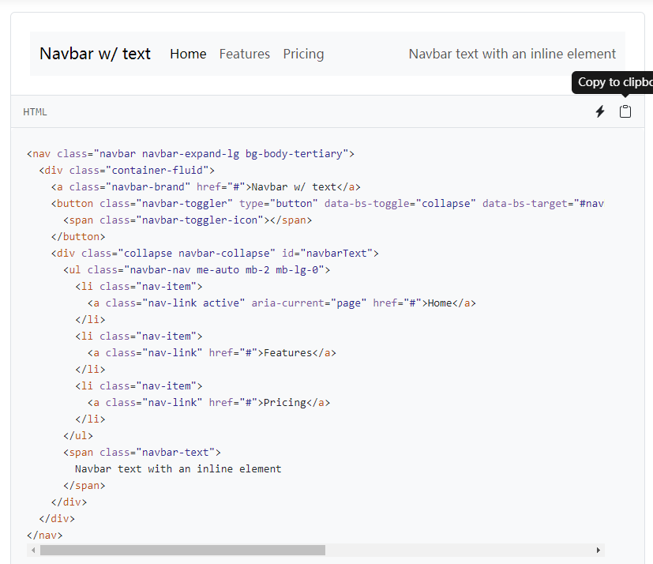
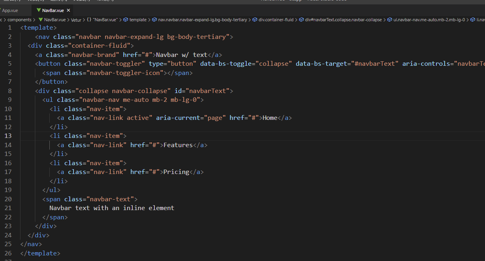
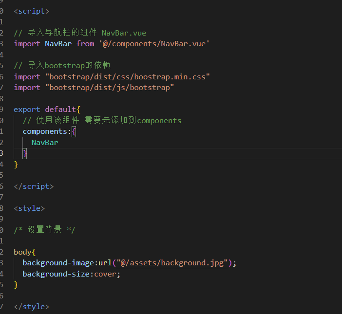
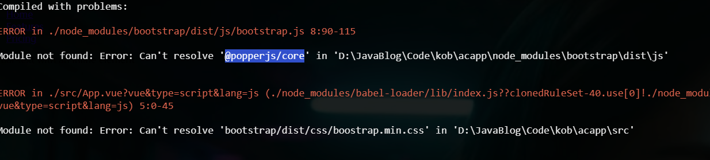
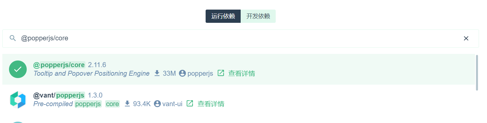
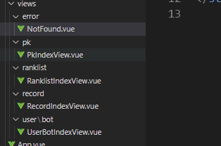
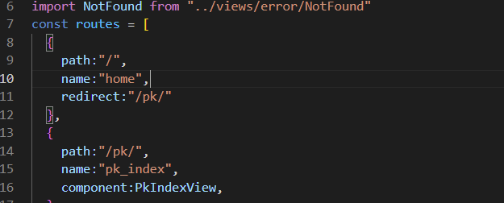
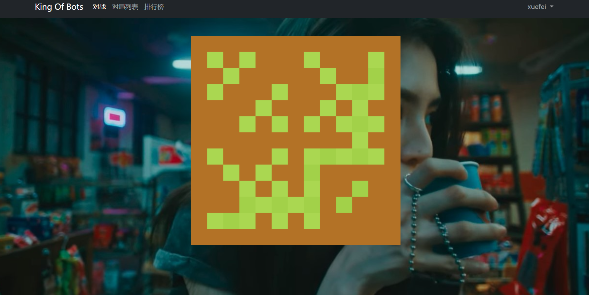

# 创建菜单与游戏页面

## 导航栏页面

* 首先创建导航栏的样式

在bootStrap复制一个导航栏样式，复制到组件的template中

  

  


* 在主页面引入导航栏页面NavBar.vue

  


* 报错，缺少依赖 安装

  


  

* 一个页面一个组件

该项目主要有以下几个页面：PK页面，Record页面，排行榜页面，我的Bot页面,404页面
那么相应的有几个vue组件

**这里定义的四个页面  主要是点击导航栏的连接 跳转的主页面**

  

* 在rounter/index.js中添加路由信息

```js
import { createRouter, createWebHistory } from 'vue-router'
import PkIndexView from "../views/pk/PkIndexView"
import RecordIndexView from "../views/record/RecordIndexView"
import RanklistIndexView from "../views/ranklist/RanklistIndexView"
import UserBotIndexView from "../views/user/bot/UserBotIndexView"
import NotFound from "../views/error/NotFound"
const routes = [
  {
    path:"/",
    name:"home",
    redirect:"/pk/"
  },
  {
    path:"/pk/",
    name:"pk_index",
    component:PkIndexView,
  },
  {
    path:"/record/",
    name:"record_index",
    component:RecordIndexView,
  },
  {
    path:"/ranklist/",
    name:"ranklist_index",
    component:RanklistIndexView,
  },
  {
    path:"/user/bot/",
    name:"user_bot_index",
    component:UserBotIndexView,
  },
  {
    path:"/404/",
    name:"404",
    component:NotFound,
  },
  {
    path:"/:catchAll(.*)",
    redirect:"/404/"
  }
]

const router = createRouter({
  history: createWebHistory(),
  routes
})

export default router

```


* 在浏览器中直接输入localhost:8080  希望浏览器直接重定向到对战页面
  

* 在浏览器中输入错误的网址  直接重定向到404页面

```JS
  {
    path:"/:catchAll(.*)",
    redirect:"/404/"
  }

```


## 点击导航栏按钮实现自动跳转

**在NavBar更改Link,这样点击按钮的时候会自动跳转到指定的页面**

```js
<template>
    <nav class="navbar navbar-expand-lg navbar-dark bg-dark bg-body-tertiary">
  <div class="container">
    <a class="navbar-brand" href="/">King Of Bots</a>
 
    <div class="collapse navbar-collapse" id="navbarText">
      <ul class="navbar-nav me-auto mb-2 mb-lg-0">
        <li class="nav-item">
          <a class="nav-link active" aria-current="page" href="/pk/">对战</a>
        </li>
        <li class="nav-item">
          <a class="nav-link" href="/record/">对局列表</a>
        </li>
        <li class="nav-item">
          <a class="nav-link" href="/ranklist/">排行榜</a>
        </li>
      </ul>

      <ul class="navbar-nav">
        <!-- 在bootstrap官网查找 dropdown 代码 进行替换 -->
        <li class="nav-item dropdown">
          <a class="nav-link dropdown-toggle" href="#" role="button" data-bs-toggle="dropdown" aria-expanded="false">
            xuefei
          </a>
          <ul class="dropdown-menu">
            <li><a class="dropdown-item" href="/user/bot/">我的Bot</a></li>
            <li><hr class="dropdown-divider"></li>
            <li><a class="dropdown-item" href="#">退出登录</a></li>
          </ul>
        </li>
        
      </ul>

    </div>
  </div>
</nav>
</template>

<script>

</script>

<style scoped>

</style>


```


* 但是点击这些按钮都会自动刷新页面 我们想实现一个点击按钮自动跳转 但是不刷新页面的功能   修改NavBar.vue

```js
<template>
    <nav class="navbar navbar-expand-lg navbar-dark bg-dark bg-body-tertiary">
  <div class="container">
    <router-link class="navbar-brand" :to="{name:'home'}">King Of Bots</router-link>
    <div class="collapse navbar-collapse" id="navbarText">
      <ul class="navbar-nav me-auto mb-2 mb-lg-0">
        <li class="nav-item">
          <router-link class="nav-link" :to="{name:'pk_index'}">对战</router-link>
        </li>
        <li class="nav-item">
          <!-- <a class="nav-link" href="/record/">对局列表</a> -->
          <router-link class="nav-link" :to="{name:'record_index'}">对局列表</router-link>
        </li>
        <li class="nav-item">
          <!-- <a class="nav-link" href="/ranklist/">排行榜</a> -->
          <router-link class = "nav-link" :to="{name:'ranklist_index'}">排行榜</router-link>
        </li>
      </ul>

      <ul class="navbar-nav">
        <!-- 在bootstrap官网查找 dropdown 代码 进行替换 -->
        <li class="nav-item dropdown">
          <a class="nav-link dropdown-toggle" href="#" role="button" data-bs-toggle="dropdown" aria-expanded="false">
            xuefei
          </a>
          <ul class="dropdown-menu">
            <!-- <li><a class="dropdown-item" href="/user/bot/">我的Bot</a></li> -->
            <router-link class="dropdown-item" :to="{name:'user_bot_index'}">我的Bot</router-link>
            <li><hr class="dropdown-divider"></li>
            <li><a class="dropdown-item" href="#">退出登录</a></li>
          </ul>
        </li>
        
      </ul>

    </div>
  </div>
</nav>
</template>

<script>

</script>

<style scoped>

</style>


```


* 在每一个页面 添加card页面 也就是空白页面
首先在Components添加一个组件ContentField

```js
<template>
        <div class="container">
        <div class="card">
            <div class="card-body">
                <slot></slot>
            </div>
        </div>
    </div>
</template>

<script>

</script>

<style scoped>

</style>


```


在PK页面将该组件引入进去

```js
<template>

<content-field>
 对战
</content-field>

</template>

<script>

// 将空白的公共组件 添加进去

import ContentField from '../../components/ContentField.vue'

export default{
    components:{
        ContentField
    }
}

</script>


<style scoped>

</style>


```

  


* 聚焦功能

**当我们打开对战页面  导航栏种对战两个字高亮，更改router-link**

```js
<template>
    <nav class="navbar navbar-expand-lg navbar-dark bg-dark bg-body-tertiary">
  <div class="container">
    <router-link class="navbar-brand" :to="{name:'home'}">King Of Bots</router-link>
    <div class="collapse navbar-collapse" id="navbarText">
      <ul class="navbar-nav me-auto mb-2 mb-lg-0">
        <li class="nav-item">
          <router-link :class="route_name == 'pk_index' ? 'nav-link active':'nav-link'" :to="{name:'pk_index'}">对战</router-link>
        </li>
        <li class="nav-item">
          <!-- <a class="nav-link" href="/record/">对局列表</a> -->
          <router-link :class="route_name == 'record_index' ? 'nav-link active':'nav-link'" :to="{name:'record_index'}">对局列表</router-link>
        </li>
        <li class="nav-item">
          <!-- <a class="nav-link" href="/ranklist/">排行榜</a> -->
          <router-link :class = "route_name == 'ranklist_index' ? 'nav-link active':'nav-link'" :to="{name:'ranklist_index'}">排行榜</router-link>
        </li>
      </ul>

      <ul class="navbar-nav">
        <!-- 在bootstrap官网查找 dropdown 代码 进行替换 -->
        <li class="nav-item dropdown">
          <a class="nav-link dropdown-toggle" href="#" role="button" data-bs-toggle="dropdown" aria-expanded="false">
            xuefei
          </a>
          <ul class="dropdown-menu">
            <!-- <li><a class="dropdown-item" href="/user/bot/">我的Bot</a></li> -->
            <router-link class="dropdown-item" :to="{name:'user_bot_index'}">我的Bot</router-link>
            <li><hr class="dropdown-divider"></li>
            <li><a class="dropdown-item" href="#">退出登录</a></li>
          </ul>
        </li>
        
      </ul>

    </div>
  </div>
</nav>
</template>

<script>

import {useRoute} from 'vue-router'
import {computed} from 'vue'

export default{
  setup(){
    const route = useRoute();
    let route_name = computed(()=>route.name)
    return{
      route_name
    }
  }
}


</script>

<style scoped>

</style>


```


  


## 对战页面的地图功能

**实现一个13x13的地图**

### 创建一个游戏基类对象

```js
const AC_GAME_OBJECTS = [];// 数组对象

export class AcGameObject{
    constructor(){
        AC_GAME_OBJECTS.push(this);
        this.timedelta = 0;// 这一帧指向的时间间隔 距离上一帧指向的时间间隔
        this.has_called_start = false;
    }

    start(){
        // 只执行一次
    }

    update(){
        // 每一帧执行一次  除第一帧之外
    }

    on_destroy(){
        // 删除之前执行
    }

    destroy(){
        // 销毁对象
        for(let i in AC_GAME_OBJECTS){
            const obj = AC_GAME_OBJECTS[i];
            if(obj === this){
                AC_GAME_OBJECTS
            }
        }
    }
}
let last_timestamp;// 上一次执行的时刻

// timestamp参数表示当前时刻
const step = timestamp =>{

    // 遍历所有对象
    for(let obj of AC_GAME_OBJECTS){

        // 如果该对象还没有开始
        if(!obj.has_called_start){
            obj.has_called_start = true;// 替换开始标志
            obj.start();// 启动该对象
        }else{
            obj.timedelta = timestamp - last_timestamp;// 该对象已经执行过  计算时间间隔

            // 执行更新函数
            obj.update();
        }
    }
    // 将当前时间戳设置为上一个时间戳
    last_timestamp = timestamp;

    requestAnimationFrame(step)
}

requestAnimationFrame(step)

```


## 创建画布对象和游戏地图对象


* 创建画布对象

```js
<template>
    <div class = "playground">
        <!-- 导入地图组件 -->
        <GameMap/>
    </div>
</template>

<script>
import GameMap from './GameMap.vue'

export default{

    // 将游戏地图组件导入进去
    components:{
        GameMap,
    }
}

</script>

<style scoped>

div.playground{
    width:60vw;
    height:70vh;
    /* background:lightblue; */

    /* 距离上下左右的边距  auto代表居中 */
    margin:40px auto;
}


</style>


```

* 创建游戏地图对象  将游戏地图对象作为组件 引入到PlayGround

```js
<template>
    <div ref = "parent" class = "gamemap">
        <!-- 引入画布 -->
        <canvas ref = "canvas"></canvas>
    </div>
</template>

<script>
import {GameMap}  from "@/assets/scripts/GameMap";

import {ref,onMounted}  from 'vue';

export default{
    setup(){
        let parent = ref(null);
        let canvas =  ref(null);

        onMounted(()=>{
            new GameMap(canvas.value.getContext('2d'),parent.value)
        });

        return{
            parent,
            canvas
        }
    }
}

</script>

<style scoped>

    div.gamemap{
        width:100%;
        height:100%;
        display: flex;
        /* 水平居中 */
        justify-content: center;

        /* 竖直居中 */
        align-items: center;
    }

</style>
```

* 创建障碍物

```js

import { AcGameObject } from "./AcGameObjects";

export class Wall extends AcGameObject{
    constructor(r,c,gamemap){
        super();
        this.r = r;
        this.c = c;
        this.gamemap = gamemap;

        this.color = '#B37226';// 墙的颜色
    }

    update(){
        this.render();
    }

    render(){

        // 墙体 障碍物的渲染
        const L = this.gamemap.L;
        const ctx = this.gamemap.ctx;
        ctx.fillStyle = this.color;
        ctx.fillRect(this.c * L,this.r * L,L,L);
    }
}

```

* 创建游戏地图 在GameMap.vue引入GameMap.js文件，先创建四周障碍物，在创建中间的障碍物，最后判断地图的连通性

  


```js
import { AcGameObject } from "./AcGameObjects";
import {Wall} from './Wall';
export class GameMap extends AcGameObject{

    // 构造函数
    constructor(ctx,parent){
        super();
        this.ctx = ctx;
        this.parent = parent;
        this.L = 0;// 一个格子的距离
        this.rows = 13;
        this.cols = 13;
        this.inner_walls_counts = 80;// 默认20 障碍物数量
        this.walls = [];
    }


    // 检查连通性  传入参数 地图  起点坐标 终点坐标
    check_connectivity(g,sx,sy,tx,ty){
        if(sx == tx && sy == ty){
            return true;// 起点等于终点
        }

        // 标记当前已经走过
        g[sx][sy] = true;

        let dx = [-1,0,1,0],dy = [0,1,0,-1];

        for(let i = 0; i < 4; i++){
            let x = sx + dx[i],y = sy + dy[i];
            if(!g[x][y] && this.check_connectivity(g,x,y,tx,ty))
            {
                return true;
            }
        }


        return false;

    }

    // 创建墙障碍物  返回值true表示 联通
    create_walls(){
        const g = [];

        // 先将所有的格子标记为false
        for(let r = 0; r < this.rows;r ++){
            g[r] = [];
            for(let c = 0; c < this.cols;c++){
                g[r][c] = false;
            }
        }

        // 给四周加上障碍物  将障碍物标记为true
        // 左右两边加上墙
        for(let r = 0; r < this.rows;r++){
            // 将所有行的第一列加上墙  标记为true
            g[r][0] = g[r][this.cols - 1] = true;
        }
        // 上下两边加上墙
        for(let c = 0; c < this.cols; c++){
            g[0][c] = g[this.rows - 1][c] = true;
        }
        // 创建随机障碍物  中间创建随机障碍物
        for(let i = 0; i < this.inner_walls_counts / 2; i++){
            for(let j = 0; j < 1000; j++){

                // 使用随机值 乘以 行数 列数  计算出一个随机的中间坐标
                let r = parseInt(Math.random() * this.rows);
                let c = parseInt(Math.random() * this.cols);


                // 如果对称的两个点都是被标记过
                if(g[r][c] || g[c][r]){
                    continue;
                }

                // 左下角 右上角 都没有障碍物 直接跳过
                if(r == this.rows - 2 && c == 1 || r == 1 && c == this.cols - 2){
                    continue;
                }

                g[r][c] = g[c][r] = true;// 设置对称的障碍物

                break;
            }
        }


        const copy_g = JSON.parse(JSON.stringify(g));

        // 检查连通性
        if(!this.check_connectivity(copy_g,this.rows - 2,1,1,this.cols - 2)){
            return false;// 检查 连通性
        }
        
        for(let r = 0; r < this.rows; r++){
            for(let c= 0; c < this.cols; c++){
                if(g[r][c]){
                    this.walls.push(new Wall(r,c,this));
                }
            }
        }
        // new Wall(0,0,this);
        return true;
    }

    // 地图对象开启  r如果不连通 尝试一千次创建 直到联通
    start(){

        // 循环1000
        for(let i = 0; i < 1000; i++){
            if(this.create_walls()){
                break;
            }
        }


        // this.create_walls();
    }

    update_size(){
        // 当浏览器缩放  更新画布尺寸
        this.L = parseInt(Math.min(this.parent.clientWidth / this.cols,this.parent.clientHeight / this.rows))
        this.ctx.canvas.width = this.L * this.cols;
        this.ctx.canvas.height = this.L * this.rows;
    }

    // 地图对象更新
    update(){
        this.update_size();
        this.render();

    }

    render(){
        const color_even = '#AAD751'//偶数颜色
        const color_odd = '#A2D149'//奇数颜色
        for(let r = 0 ; r < this.rows; r++){
            for(let c = 0; c < this.cols; c++){
                if(( r + c ) % 2 == 0){
                    this.ctx.fillStyle = color_even;
                }else{
                    this.ctx.fillStyle = color_odd;
                }
                this.ctx.fillRect(c* this.L, r* this.L, this.L, this.L);
            }
        }
    }
}

```


