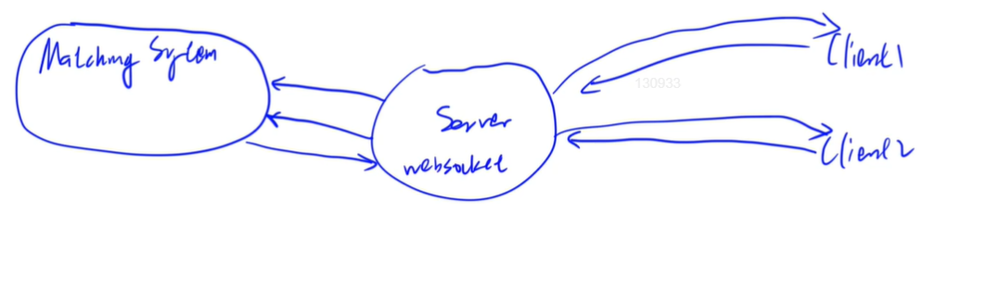
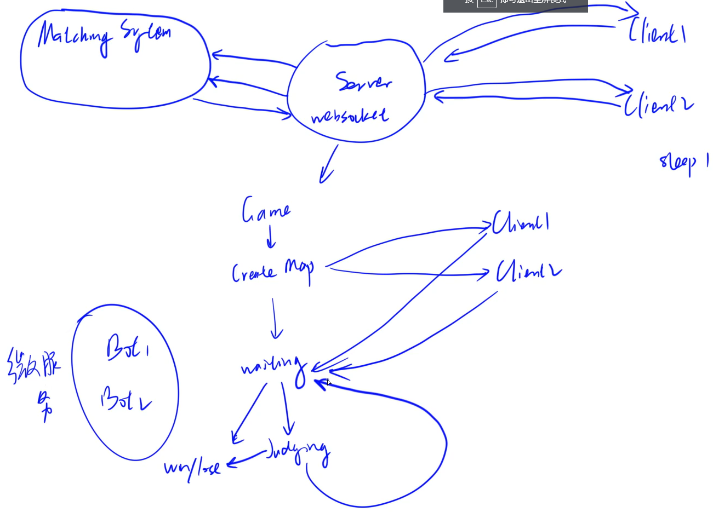

# 实现微服务：匹配系统（上）

## 匹配系统

  


客户端向服务器发送请求，服务器将请求发送给匹配系统，匹配完成之后将结果发给服务器，再发给玩家。

  


**每一个客户端和服务器的连接 都有一个websocket连接的实例，该对象包含两个客户端连接的实例**

```java
package com.kob.backedn2.consumer;

import org.springframework.stereotype.Component;

import javax.websocket.*;
import javax.websocket.server.PathParam;
import javax.websocket.server.ServerEndpoint;

@Component
@ServerEndpoint("/websocket/{token}")  // 注意不要以'/'结尾
public class WebSocketServer {
    @OnOpen
    public void onOpen(Session session, @PathParam("token") String token) {
        // 建立连接
        WebSocketServer client1 = new WebSocketServer();
        WebSocketServer client2 = new WebSocketServer();
    }

    @OnClose
    public void onClose() {
        // 关闭链接
    }

    @OnMessage
    public void onMessage(String message, Session session) {
        // 从Client接收消息
    }

    @OnError
    public void onError(Session session, Throwable error) {
        error.printStackTrace();
    }
}

```

**游戏地图的生成以及执行代码的判断动作都是在服务器执行的**


## 添加依赖

* spring-boot-starter-websocket
```xml
<!-- https://mvnrepository.com/artifact/org.springframework.boot/spring-boot-starter-websocket -->
<dependency>
    <groupId>org.springframework.boot</groupId>
    <artifactId>spring-boot-starter-websocket</artifactId>
    <version>2.7.10</version>
</dependency>


```

* fastjson

```xml
<!-- https://mvnrepository.com/artifact/com.alibaba/fastjson -->
<dependency>
    <groupId>com.alibaba</groupId>
    <artifactId>fastjson</artifactId>
    <version>2.0.11</version>
</dependency>


```

* 添加WebSocketConfig

```java
import org.springframework.context.annotation.Bean;
import org.springframework.context.annotation.Configuration;
import org.springframework.web.socket.server.standard.ServerEndpointExporter;

@Configuration
public class WebSocketConfig {

    @Bean
    public ServerEndpointExporter serverEndpointExporter() {

        return new ServerEndpointExporter();
    }
}

```


## 实现WebSocketServer

```java
package com.kob.backedn2.consumer;

import com.kob.backedn2.mapper.UserMapper;
import com.kob.backedn2.pojo.User;
import org.springframework.beans.factory.annotation.Autowired;
import org.springframework.stereotype.Component;

import javax.websocket.*;
import javax.websocket.server.PathParam;
import javax.websocket.server.ServerEndpoint;
import java.io.IOException;
import java.util.concurrent.ConcurrentHashMap;

@Component
@ServerEndpoint("/websocket/{token}")  // 注意不要以'/'结尾
public class WebSocketServer {
    // 定义一个哈希map 维护所有的客户端与服务器的连接 static 表示静态变量 表示对所有的socket连接对象都可见
    private static ConcurrentHashMap<Integer,WebSocketServer> users = new ConcurrentHashMap<>();

    // 注入数据库接口
    private static UserMapper userMapper;
    private User user;
    private Session session = null;


    // 注入mapper接口
    @Autowired
    public void setUserMapper(UserMapper userMapper){
        WebSocketServer.userMapper = userMapper;// 静态变量访问需要类名进行访问
    }

    // 当建立连接的时候 需要从token读取当前用户id是谁
    @OnOpen
    public void onOpen(Session session, @PathParam("token") String token) {
        // 建立连接
//        WebSocketServer client1 = new WebSocketServer();
//        WebSocketServer client2 = new WebSocketServer();
        this.session = session;

        // 连接建立成功
        System.out.println("connected");

        // 读取用户的Id
        int userId = Integer.parseInt(token);

        // 根据用户id查找该用户
        this.user = userMapper.selectById(userId);
        // 将用户存入map
        users.put(userId,this);
    }

    
    @OnClose
    public void onClose() {
        // 关闭链接
        System.out.println("disconnected");
        if(this.user != null){
            users.remove(this.user.getId());// 通过id删除用户
        }
    }

    @OnMessage
    public void onMessage(String message, Session session) {
        // 从Client接收消息
        System.out.println("received");
    }

    @OnError
    public void onError(Session session, Throwable error) {
        error.printStackTrace();
    }

    // 客户端向服务器发送消息
    public void sendMessage(String message){
        synchronized (this.session){
            try {
                this.session.getBasicRemote().sendText(message);
            }catch(IOException e){
                e.printStackTrace();
            }
        }
    }
}

```


## 匹配页面前端


