# 配置Mysql与注册登录模块

## 应用服务模型

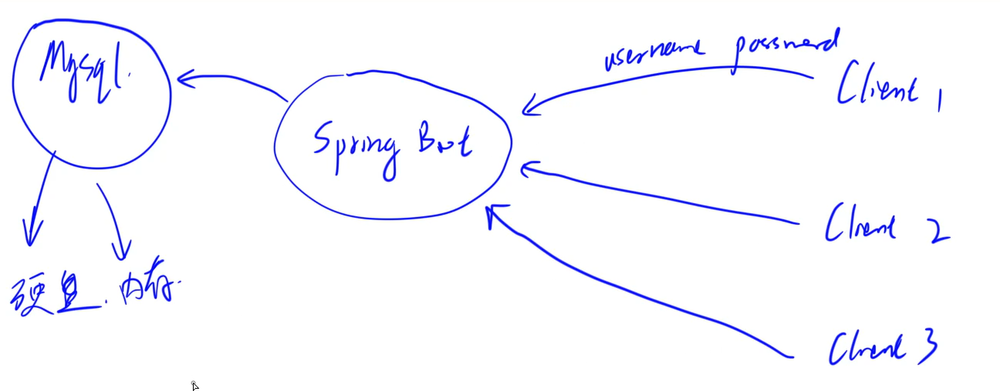  


SpringBoot是一个运行在后端的程序，若干客户端会不断请求springboot 然后springboot会根据请求和数据库进行交互。


## IDEA 连接数据库

### 点击IDEA右侧的database 选择mysql数据库

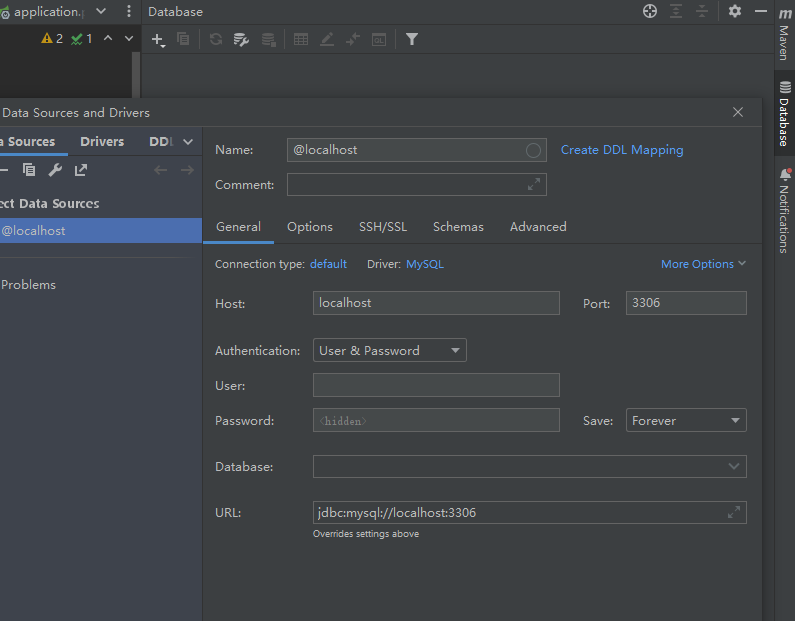  

* 这里我填写了用户名和密码 以及数据库名称  记得勾选默认架构
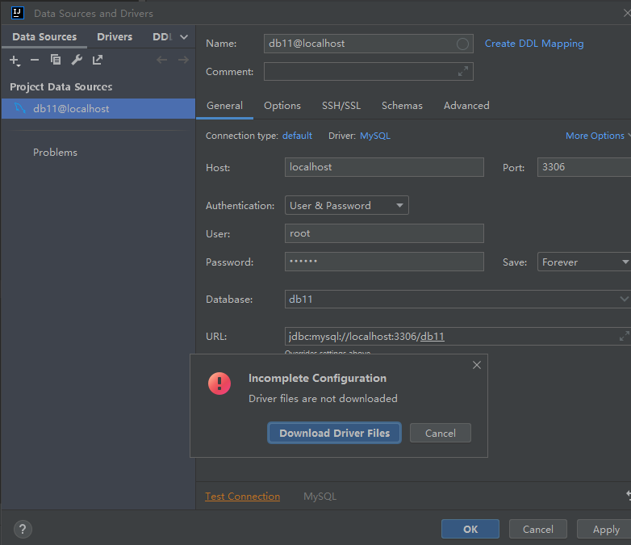  

* 点击连接测试 需要下载驱动 点击下载

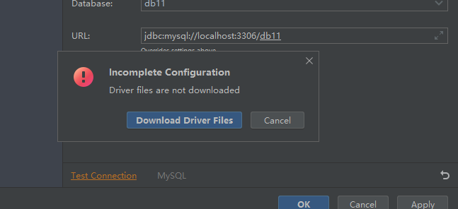  

* 点击连接测试 连接成功

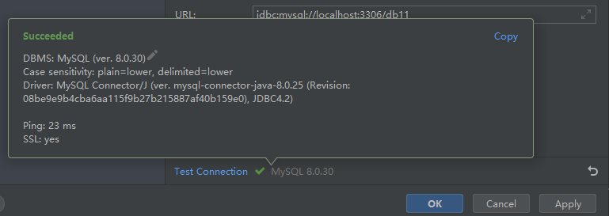  


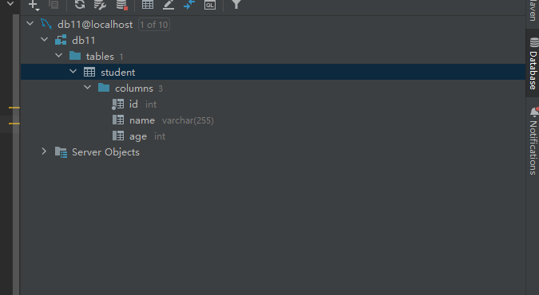  

### 更新数据

点击表格数据 更改数据 回车  点击上面绿色箭头 上传数据至数据库
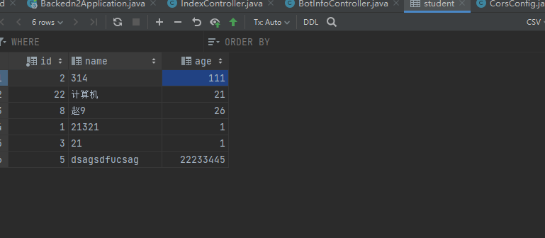  


可以看到后台数据库已经更新

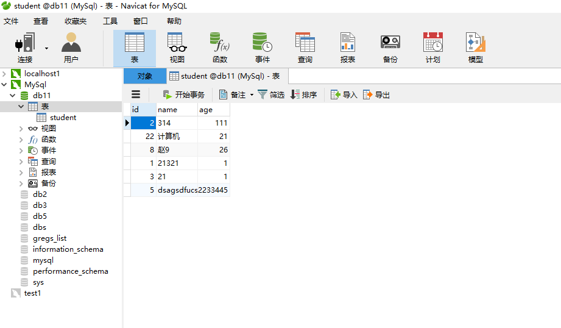  

## SpringBoot配置数据库依赖

### Maven

仓库地址```https://mvnrepository.com/```

### 安装JDBC依赖

```js
Spring Boot Starter JDBC
```

复制以下内容,将依赖粘贴到pom.xml中

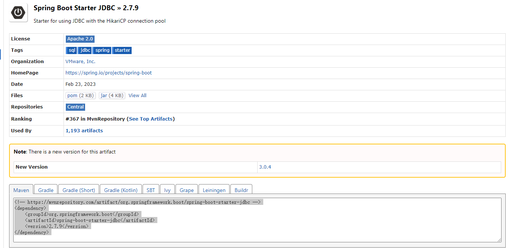  


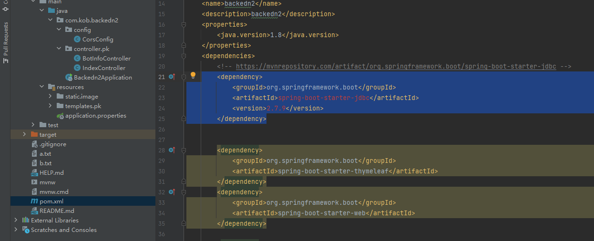  

### lombok

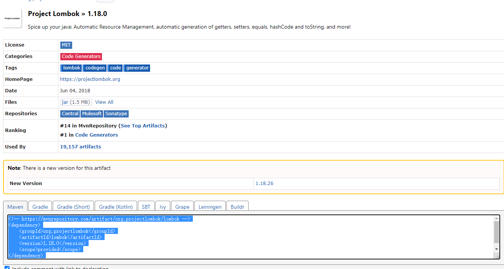  


### MySQL Connector/J


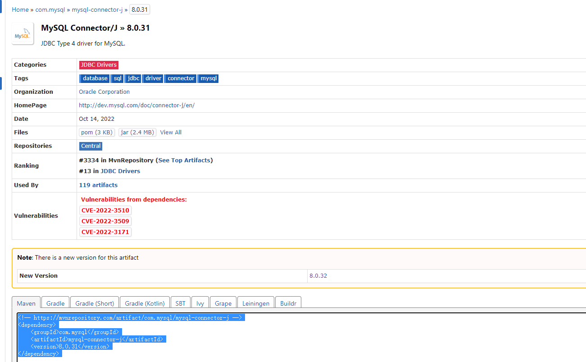  


### MyBatis Plus 

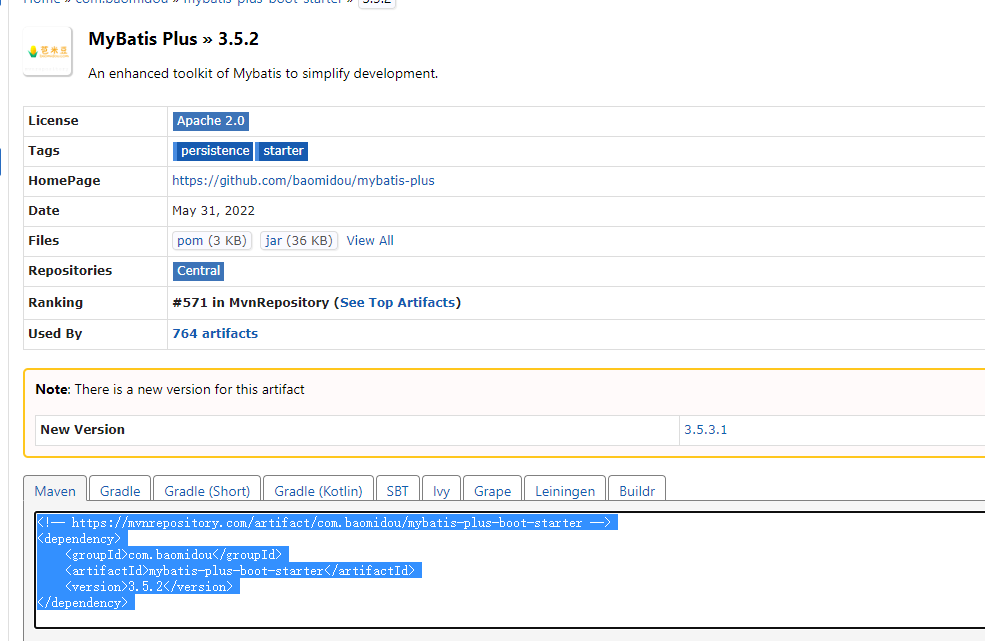  


### mybatis-plus-generator

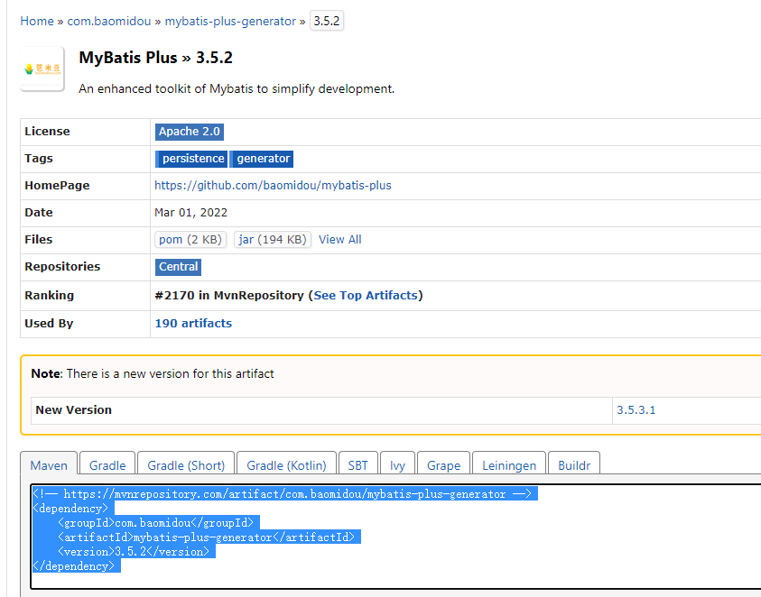  

### 解决依赖爆红问题


点击右侧Maven重新加载 

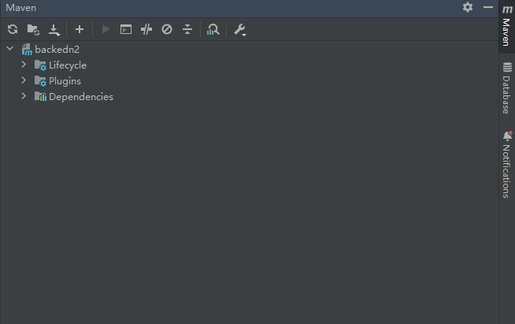  

### 添加数据库配置

这里的kob是数据库名称

```js
spring.datasource.username=root
spring.datasource.password=123456
spring.datasource.url=jdbc:mysql://localhost:3306/kob?serverTimezone=Asia/Shanghai&useUnicode=true&characterEncoding=utf-8
spring.datasource.driver-class-name=com.mysql.cj.jdbc.Driver
```


### SpringBoot中的常用模块

* pojo层：将数据库中的表格对影成java中的class
* mapper层 将pojo层的class操作映射成sql语句
* service层：写具体的业务  组合使用mapper中的操作
* controller层：负责请求转发  接受页面传过来的参数，传给Service处理，接到返回值，再传给页面


### pojo层的user表格

```java
package com.kob.backedn2.pojo;

// 数据库一张表对应一个类  @data 将常用的get set方法 添加进去
//@NoArgsConstructor  无参构造函数
//@AllArgsConstructor  有参构造函数
import lombok.AllArgsConstructor;
import lombok.NoArgsConstructor;

import lombok.AllArgsConstructor;
import lombok.Data;
import lombok.NoArgsConstructor;

@Data
@NoArgsConstructor
@AllArgsConstructor
public class User {
    private Integer id;
    private String username;
    private String password;
}

```


### UserMapper映射层

```java
package com.kob.backedn2.mapper;


import com.baomidou.mybatisplus.core.mapper.BaseMapper;
import com.kob.backedn2.pojo.User;
import org.apache.ibatis.annotations.Mapper;

// 将增删改查的操作映射成sql语句
@Mapper
public interface UserMapper extends BaseMapper<User> {


}

```

### UserController层

```java
package com.kob.backedn2.controller.user;
import com.kob.backedn2.mapper.UserMapper;
import com.kob.backedn2.pojo.User;
import org.springframework.beans.factory.annotation.Autowired;
import org.springframework.web.bind.annotation.GetMapping;
import org.springframework.web.bind.annotation.RestController;

import java.util.List;

@RestController
public class UserController {

    @Autowired
    UserMapper userMapper;

//     注解开发  获取所有的用户
    @GetMapping("/user/all/")
    public List<User> getAll(){
        return userMapper.selectList(null);
    }


}
```

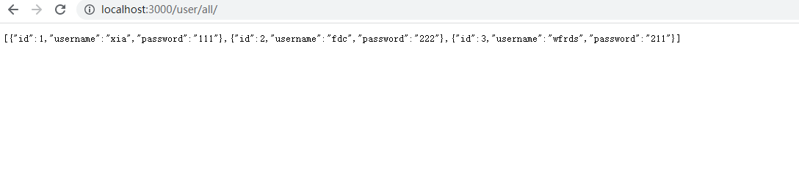  


查询指定用户的信息

```java
package com.kob.backedn2.controller.user;


import com.kob.backedn2.mapper.UserMapper;
import com.kob.backedn2.pojo.User;
import org.springframework.beans.factory.annotation.Autowired;
import org.springframework.web.bind.annotation.GetMapping;
import org.springframework.web.bind.annotation.PathVariable;
import org.springframework.web.bind.annotation.RestController;

import java.util.List;

@RestController
public class UserController {
    @Autowired
    UserMapper userMapper;
//     注解开发  获取所有的用户
    @GetMapping("/user/all/")
    public List<User> getAll(){
        return userMapper.selectList(null);
    }

//    查询指定id的信息  userid 使用{} 进行包围
    @GetMapping("/user/{userId}")
    public User getuser(@PathVariable int userId){
        return userMapper.selectById(userId);
    }
}

```


* 返回指定编号范围的所有用户

```java
package com.kob.backedn2.controller.user;
import com.baomidou.mybatisplus.core.conditions.query.QueryWrapper;
import com.kob.backedn2.mapper.UserMapper;
import com.kob.backedn2.pojo.User;
import org.springframework.beans.factory.annotation.Autowired;
import org.springframework.web.bind.annotation.GetMapping;
import org.springframework.web.bind.annotation.PathVariable;
import org.springframework.web.bind.annotation.RestController;
import java.util.List;

@RestController
public class UserController {
    @Autowired
    UserMapper userMapper;
//     注解开发  获取所有的用户
    @GetMapping("/user/all/")
    public List<User> getAll(){
        return userMapper.selectList(null);
    }
//    查询指定id的信息  userid 使用{} 进行包围
    @GetMapping("/user/{userId}/")
    public List<User> getuser(@PathVariable int userId){
        QueryWrapper<User> queryWrapper = new QueryWrapper<>();
        queryWrapper.ge("id",2).le("id",3);
        return userMapper.selectList(queryWrapper);
    }
}


```

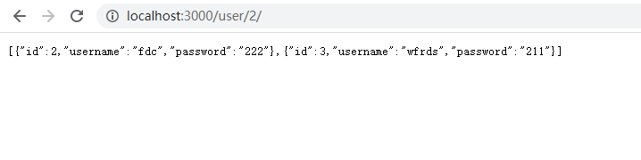  

### 添加新用户

后端controller层代码 解析浏览器地址栏输入的信息  然后userMapper将数据写入数据库


