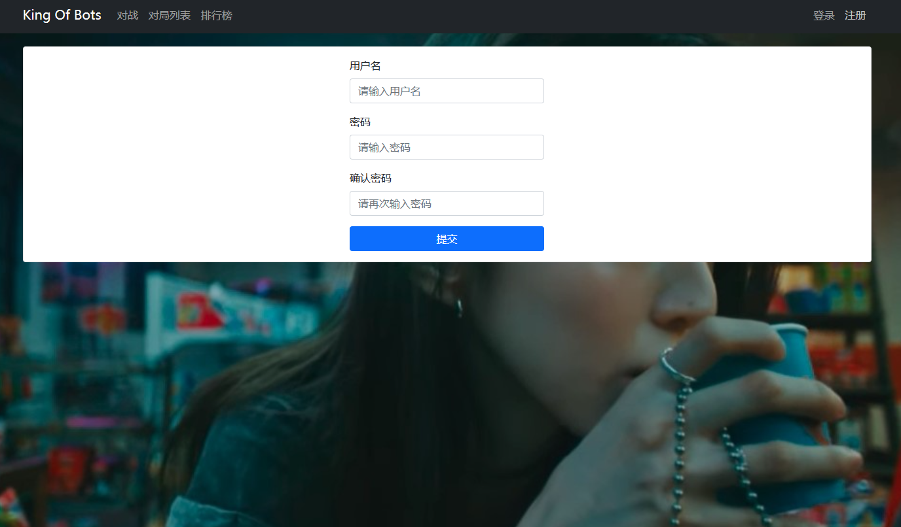

# 配置Mysql与注册登录模块（下）


## 前端页面的授权

**没有登陆之前，点击主页 点击对战 排行榜页面都是会跳转到主页面**

```js
import { createRouter, createWebHistory } from 'vue-router'
import PkIndexView from '../views/pk/PkIndexView'
import RecordIndexView from '../views/record/RecordIndexView'
import RanklistIndexView from '../views/ranklist/RanklistIndexView'
import UserBotIndexView from '../views/user/bot/UserBotIndexView'
import NotFound from '../views/error/NotFound'
import UserAccountLoginView from '../views/user/account/UserAccountLoginView'
import UserAccountRegisterView from '../views/user/account/UserAccountRegisterView'
// import { from } from 'core-js/core/array'
import store from '../store/index'

const routes = [
  {
    path: "/",
    name: "home",
    redirect: "/pk/",
    // 没有登陆之前 都会重定向到登录页面
    meta:{
      requestAuth:true,
    }
  },
  {
    path: "/pk/",
    name: "pk_index",
    component: PkIndexView,
    meta:{
      requestAuth:true,
    }
  },
  {
    path: "/record/",
    name: "record_index",
    component: RecordIndexView,
    meta:{
      requestAuth:true,
    }
  },
  {
    path: "/ranklist/",
    name: "ranklist_index",
    component: RanklistIndexView,
    meta:{
      requestAuth:true,
    }
  },
  {
    path: "/user/bot/",
    name: "user_bot_index",
    component: UserBotIndexView,
    meta:{
      requestAuth:true,
    }
  },
  {
    path: "/user/account/login/",
    name: "user_account_login",
    component: UserAccountLoginView,
    meta:{
      requestAuth:false,
    }
  },
  {
    path: "/user/account/register/",
    name: "user_account_register",
    component: UserAccountRegisterView,
    meta:{
      requestAuth:false,
    }
  },
  {
    path: "/404/",
    name: "404",
    component: NotFound,
    meta:{
      requestAuth:false,
    }
  },
  {
    path: "/:catchAll(.*)",
    redirect: "/404/"
  }
]

const router = createRouter({
  history: createWebHistory(),
  routes
})

router.beforeEach((to,from,next)=>{
  if(to.meta.requestAuth && !store.state.user.is_login){
    next({name:"user_account_login"});// 需要授权   跳转到登录页面
  }else{
    next();// 不需要授权  跳转到默认的页面
  }
}) 

export default router
```

## 注册页面

  


```js
<template>
    <ContentField>
        <div class="row justify-content-md-center">
            <div class="col-3">
                <form @submit.prevent="register">
                    <div class="mb-3">
                        <label for="username" class="form-label">用户名</label>
                        <input v-model="username" type="text" class="form-control" id="username" placeholder="请输入用户名">
                    </div>
                    <div class="mb-3">
                        <label for="password" class="form-label">密码</label>
                        <input v-model="password" type="password" class="form-control" id="password" placeholder="请输入密码">
                    </div>
                    <div class="mb-3">
                        <label for="confirmedPassword" class="form-label">确认密码</label>
                        <input v-model="confirmedPassword" type="password" class="form-control" id="confirmedPassword" placeholder="请再次输入密码">
                    </div>
                    <div class="error-message">{{ error_message }}</div>
                    <button type="submit" class="btn btn-primary">提交</button>
                </form>
            </div>
        </div>
    </ContentField>
</template>

<script>
import ContentField from '../../../components/ContentField.vue'
import { ref } from 'vue'
import router from '../../../router/index'
import $ from 'jquery'

export default {
    components: {
        ContentField
    },
    setup() {
        let username = ref('');
        let password = ref('');
        let confirmedPassword = ref('');
        let error_message = ref('');

        const register = () => {
            $.ajax({
                url: "http://127.0.0.1:3000/user/account/register/",
                type: "post",
                data: {
                    username: username.value,
                    password: password.value,
                    confirmedPassword: confirmedPassword.value,
                },
                success(resp) {
                    if (resp.error_message === "success") {
                        router.push({name: "user_account_login"});
                    } else {
                        error_message.value = resp.error_message;
                    }
                },
            });
        }

        return {
            username,
            password,
            confirmedPassword,
            error_message,
            register,
        }
    }
}
</script>

<style scoped>
button {
    width: 100%;
}

div.error-message {
    color: red;
}
</style>


```


## 登录状态持久化

**当刷新页面的时候，登陆状态会消失，原因在于token存储在内存中**

```js
import $ from 'jquery'

export default {
    state: {
        id: "",
        username: "",
        photo: "",
        token: "",
        is_login: false,
        pulling_info: true,  // 是否正在从云端拉取信息
    },
    getters: {
    },
    mutations: {
        updateUser(state, user) {
            state.id = user.id;
            state.username = user.username;
            state.photo = user.photo;
            state.is_login = user.is_login;
        },
        updateToken(state, token) {
            state.token = token;
        },
        logout(state) {
            state.id = "";
            state.username = "";
            state.photo = "";
            state.token = "";
            state.is_login = false;
        },
        updatePullingInfo(state, pulling_info) {
            state.pulling_info = pulling_info;
        }
    },
    actions: {
        login(context, data) {
            $.ajax({
                url: "http://127.0.0.1:3000/user/account/token/",
                type: "post",
                data: {
                    username: data.username,
                    password: data.password,
                },
                success(resp) {
                    if (resp.error_message === "success") {
                        localStorage.setItem("jwt_token", resp.token);
                        context.commit("updateToken", resp.token);
                        data.success(resp);
                    } else {
                        data.error(resp);
                    }
                },
                error(resp) {
                    data.error(resp);
                }
            });
        },
        getinfo(context, data) {
            $.ajax({
                url: "http://127.0.0.1:3000/user/account/info/",
                type: "get",
                headers: {
                    Authorization: "Bearer " + context.state.token,
                },
                success(resp) {
                    if (resp.error_message === "success") {
                        context.commit("updateUser", {
                            ...resp,
                            is_login: true,
                        });
                        data.success(resp);
                    } else {
                        data.error(resp);
                    }
                },
                error(resp) {
                    data.error(resp);
                }
            })
        },
        logout(context) {
            localStorage.removeItem("jwt_token");
            context.commit("logout");
        }
    },
    modules: {
    }
}

```

